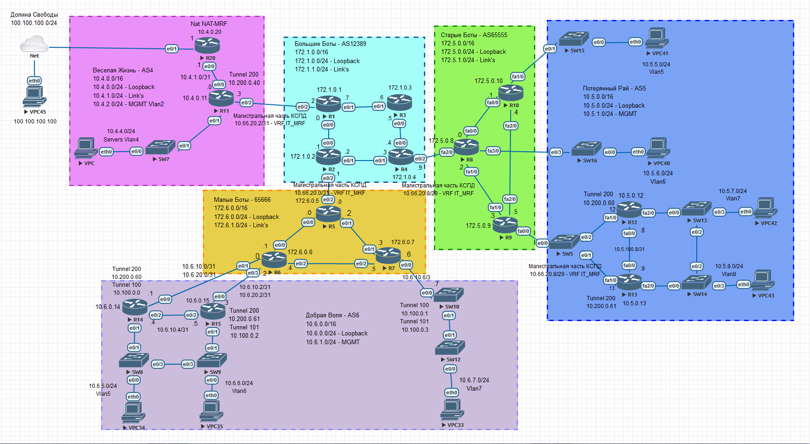

##  **Создание корпоративной сети передачи данных с организацией безопасных распределенных L2- и L3-связей, единой точкой выхода и централизованным управлением, на базе мультисервисных сетей провайдеров.**

### Цель:
1. Объединение корпоративных сетей региональных филиалов.
2. Организация IP-связности между филиалами и их офисами, расположенными в разных районах.
3. Организация шифрованного канала для подключения к серверному сегменту.
4. Организация единой точки выхода в Интернет.

### Что планировалось:

В данном проекте ставилась задача подготовить сетевую инфраструктуру для объединения ЛВС филиалов, расположенных в разных регионах. Параллельно решалась проблема изолирования корпоративных пользователей от других сетей передачи данных.

Так как старая инфраструктура работает, нам ничего не мешает (кроме отсутствия финансов) построить параллельную инфраструктуру КСПД (рис.1). Это позволит безболезненно переключить корпоративных пользователей в новую сеть.

Рисунок 1.

### Используемые технологии:

В данном проекте я использовала:

1. Технологию построения IP MPLS сетей.
2. Сервис виртуальной частной сети L3-VPN.
3. Технологию построения псевдопроводов (pseudo-wire).
4. Протоколы динамической маршрутизации IS-IS, OSPF и BGP.
5. Протоколы DHCP и NTP.
6. Технологию построения GRE и DmVPN тоннелей.
7. Технологию шифрования IPSEC.

### Что получилось:

-- Настроены три сегмента IP/MPLS сетей, которые соответствуют магистральной (Большие Боты – AS12389) и двум региональным сетям передачи данных (Малые Боты – AS65666 и Старые Боты – AS65555).

-- Настроены три сегмента локальных сетей: Весёлая жизнь – AS4 (Центр), Потерянный Рай – AS5 (филиал) и Добрая Воля – AS6 (филиал). 

-- В каждом филиале настроена связь между офисами, находящимися в разных районах, и центральным филиалом с использованием L2- и L3-VPN.

-- Организованы тоннели GRE и DMVPN поверх IPSEC для шифрования каналов связи с серверным сегментом.

-- Организована единая точка выхода в Интернет, где настроен динамический NAT(РАТ) «NAT-MRF».

-- Для получения IP-адресов персональными компьютерами в регионах, настроен централизованный DHCP-сервер. 

### Ход выполнения:
1. [Документирование адресного пространства для лабораторного стенда.](README.md#I-&#1076;&#1086;&#1082;&#1091;&#1084;&#1077;&#1085;&#1090;&#1080;&#1088;&#1086;&#1074;&#1072;&#1085;&#1080;&#1077;&#45;&#1072;&#1076;&#1088;&#1077;&#1089;&#1085;&#1086;&#1075;&#1086;&#45;&#1087;&#1088;&#1086;&#1089;&#1090;&#1088;&#1072;&#1085;&#1089;&#1090;&#1074;&#1072;&#45;&#1076;&#1083;&#1103;&#45;&#1083;&#1072;&#1073;&#1086;&#1088;&#1072;&#1090;&#1086;&#1088;&#1085;&#1086;&#1075;&#1086;&#45;&#1089;&#1090;&#1077;&#1085;&#1076;&#1072;)

    a. [Таблица выделенных подсетей.](README.md#a-&#1090;&#1072;&#1073;&#1083;&#1080;&#1094;&#1072;&#45;&#1074;&#1099;&#1076;&#1077;&#1083;&#1077;&#1085;&#1085;&#1099;&#1093;&#45;&#1087;&#1086;&#1076;&#1089;&#1077;&#1090;&#1077;&#1081;)
    
    b. [Таблица IP адресов.](README.md#b-&#1090;&#1072;&#1073;&#1083;&#1080;&#1094;&#1072;&#45;&#105;&#112;&#45;&#1072;&#1076;&#1088;&#1077;&#1089;&#1086;&#1074;)
    
       
2. [Настройка сетевого оборудования.](README.md#II-&#1085;&#1072;&#1089;&#1090;&#1088;&#1086;&#1081;&#1082;&#1072;&#45;&#1089;&#1077;&#1090;&#1077;&#1074;&#1086;&#1075;&#1086;&#45;&#1086;&#1073;&#1086;&#1088;&#1091;&#1076;&#1086;&#1074;&#1072;&#1085;&#1080;&#1103;)

    a. [Распределение автономных систем.](README.md#a-&#1088;&#1072;&#1089;&#1087;&#1088;&#1077;&#1076;&#1077;&#1083;&#1077;&#1085;&#1080;&#1077;&#45;&#1072;&#1074;&#1090;&#1086;&#1085;&#1086;&#1084;&#1085;&#1099;&#1093;&#45;&#1089;&#1080;&#1089;&#1090;&#1077;&#1084;)

    b. [Настройка GRE поверх IPSec между офисами Москва и Санкт Петербург.](README.md#b-&#1085;&#1072;&#1089;&#1090;&#1088;&#1086;&#1081;&#1082;&#1072;&#45;&#103;&#114;&#101;&#45;&#1087;&#1086;&#1074;&#1077;&#1088;&#1093;&#45;&#105;&#112;&#115;&#101;&#99;&#45;&#1084;&#1077;&#1078;&#1076;&#1091;&#45;&#1086;&#1092;&#1080;&#1089;&#1072;&#1084;&#1080;&#45;&#1084;&#1086;&#1089;&#1082;&#1074;&#1072;&#45;&#1080;&#45;&#1089;&#1072;&#1085;&#1082;&#1090;&#45;&#1087;&#1077;&#1090;&#1077;&#1088;&#1073;&#1091;&#1088;&#1075;)
    
    c. [Настройка DMVPN поверх IPSec между офисом Москва и Чокурдах, Лабытнанги.](README.md#c-&#1085;&#1072;&#1089;&#1090;&#1088;&#1086;&#1081;&#1082;&#1072;&#45;&#100;&#109;&#118;&#112;&#110;&#45;&#1087;&#1086;&#1074;&#1077;&#1088;&#1093;&#45;&#105;&#112;&#115;&#101;&#99;&#45;&#1084;&#1077;&#1078;&#1076;&#1091;&#45;&#1086;&#1092;&#1080;&#1089;&#1086;&#1084;&#45;&#1084;&#1086;&#1089;&#1082;&#1074;&#1072;&#45;&#1080;&#45;&#1095;&#1086;&#1082;&#1091;&#1088;&#1076;&#1072;&#1093;&#45;&#1083;&#1072;&#1073;&#1099;&#1090;&#1085;&#1072;&#1085;&#1075;&#1080;)
    
 
3. [Итоговая схема.](README.md#III-&#1080;&#1090;&#1086;&#1075;&#1086;&#1074;&#1072;&#1103;&#45;&#1089;&#1093;&#1077;&#1084;&#1072;)

### Ход выполнения:
    Для выполнения лабораторной работы использовался эмулятор EVE-NG, терминальный клиент PuTTY..

#### **_I. Документирование адресного пространства для лабораторного стенда._**

   *_Используемые сети:_*

10.0.0.0/8 - используется для линков Point-to-Point.

192.168.0.0/16 - используется для Loopback's.

172.16.0.0/16 - управление коммутаторами.

100.0.0.0/8 - пользовательские сети.

2001:AAAA::/48 - сеть выделенная провайдером. На площадке используются сети с префиксом /64. Для адреса в последнем хекстете будет использоваться, если это возможно, цифра из названия устройства.

FE80::/10 - сеть для адресов link-local. Для адреса в последнем хекстете будет использоваться, если это возможно, цифра из названия устройства и номер порта.
    
#### a. Таблица выделенных подсетей.

    Таблица 1.
    |----------------|-------|-------------------|-----------------|---------------------------|------------------------|--------------------------|
    |  Расположение  |  AS   |      IPv4 сеть    |Родительская сеть|        IPv6 сеть          |  Родительская сеть     |      Описание            |
    |----------------|-------|-------------------|-----------------|---------------------------|------------------------|--------------------------|
    | Ламас          | 302   | 10.6.0.0/31       |  10.6.0.0/23    | 2001:AAAA:BB06:100::/64   | 2001:AAAA:BB06::/48    | R21e0/0 - R15e0/2        |
    |                | 302   | 10.6.0.2/31       |  10.6.0.0/23    | 2001:AAAA:BB06:102::/64   | 2001:AAAA:BB06::/48    | R21e0/2 - R24e0/0        |
    |                | 302   | 192.168.6.0/24    |                 | 2001:AAAA:BB06:192::/64   | 2001:AAAA:BB06::/48    | Loopback's               |
    |----------------|-------|-------------------|-----------------|---------------------------|------------------------|--------------------------|
    | Триада         | 520   | 10.5.0.0/31       |  10.5.0.0/23    | 2001:AAAA:BB05:100::/64   | 2001:AAAA:BB05::/48    | R23e0/2 - R24e0/2        |
    |                | 520   | 10.5.0.2/31       |  10.5.0.0/23    | 2001:AAAA:BB05:102::/64   | 2001:AAAA:BB05::/48    | R23e0/1 - R25e0/0        |
    |                | 520   | 10.5.0.4/31       |  10.5.0.0/23    | 2001:AAAA:BB05:104::/64   | 2001:AAAA:BB05::/48    | R24e0/1 - R26e0/0        |
    |                | 520   | 10.5.0.6/31       |  10.5.0.0/23    | 2001:AAAA:BB05:106::/64   | 2001:AAAA:BB05::/48    | R24e0/3 - R18e0/2        |
    |                | 520   | 10.5.0.8/31       |  10.5.0.0/23    | 2001:AAAA:BB05:108::/64   | 2001:AAAA:BB05::/48    | R25e0/2 - R26e0/2        |
    |                | 520   | 10.5.0.10/31      |  10.5.0.0/23    | 2001:AAAA:BB05:110::/64   | 2001:AAAA:BB05::/48    | R25e0/3 - R28e0/1        |
    |                | 520   | 10.5.0.12/31      |  10.5.0.0/23    | 2001:AAAA:BB05:112::/64   | 2001:AAAA:BB05::/48    | R25e0/1 - R27e0/0        |
    |                | 520   | 10.5.0.14/31      |  10.5.0.0/23    | 2001:AAAA:BB05:114::/64   | 2001:AAAA:BB05::/48    | R26e0/3 - R18e0/3        |
    |                | 520   | 10.5.0.16/31      |  10.5.0.0/23    | 2001:AAAA:BB05:116::/64   | 2001:AAAA:BB05::/48    | R26e0/1 - R28e0/0        |
    |                | 520   | 192.168.5.0/24    |                 | 2001:AAAA:BB05:192::/64   | 2001:AAAA:BB05::/48    | Loopback's               |
    |----------------|-------|-------------------|-----------------|---------------------------|------------------------|--------------------------|
    | Москва         | 1001  | 10.1.0.0/31       |  10.1.0.0/23    | 2001:AAAA:BB01:100::/64   | 2001:AAAA:BB01::/48    | R14e0/3 - R19e0/0        |
    |                | 1001  | 10.1.0.2/31       |  10.1.0.0/23    | 2001:AAAA:BB01:102::/64   | 2001:AAAA:BB01::/48    | R14e0/0 - R12e0/2        |
    |                | 1001  | 10.1.0.4/31       |  10.1.0.0/23    | 2001:AAAA:BB01:104::/64   | 2001:AAAA:BB01::/48    | R14e0/1 - R13e0/3        |
    |                | 1001  | 10.1.0.6/31       |  10.1.0.0/23    | 2001:AAAA:BB01:106::/64   | 2001:AAAA:BB01::/48    | R15e0/1 - R12e0/3        |
    |                | 1001  | 10.1.0.8/31       |  10.1.0.0/23    | 2001:AAAA:BB01:108::/64   | 2001:AAAA:BB01::/48    | R15e0/0 - R13e0/2        |
    |                | 1001  | 10.1.0.10/31      |  10.1.0.0/23    | 2001:AAAA:BB01:110::/64   | 2001:AAAA:BB01::/48    | R15e0/3 - R20e0/0        |
    |                | 1001  | 10.1.0.12/31      |  10.1.0.0/23    | 2001:AAAA:BB01:112::/64   | 2001:AAAA:BB01::/48    | R12e0/1 - R13e0/1        |
    |                | 1001  | 192.168.1.0/24    |                 | 2001:AAAA:BB01:192::/64   | 2001:AAAA:BB01::/48    | Loopback's               |
    |                | 1001  | 172.16.1.0/24     |                 | 2001:AAAA:BB01:172::/64   | 2001:AAAA:BB01::/48    | Коммтаторы Vlan10        |
    |                | 1001  | 100.1.0.0/24      |  100.1.0.0/21   | 2001:AAAA:BB01:1001::/64  | 2001:AAAA:BB01::/48    | Пользователи Vlan11      |
    |                | 1001  | 100.1.1.0/24      |  100.1.0.0/21   | 2001:AAAA:BB01:1002::/64  | 2001:AAAA:BB01::/48    | Пользователи Vlan12      |
    |                | 1001  | 10.1.14.0/30      |  10.1.14.0/24   |                           |                        | R14e0/2                  |
    |                | 1001  | 10.1.15.0/30      |  10.1.15.0/24   |                           |                        | R15e0/2                  |
    |                | 1001  | 10.1.115.0/30     |  10.1.115.0/24  |                           |                        | R15e0/2                  |
    |----------------|-------|-------------------|-----------------|---------------------------|------------------------|--------------------------|
    | С.-Петербург   | 2042  | 10.2.0.0/31       |  10.2.0.0/23    | 2001:AAAA:BB02:100::/64   | 2001:AAAA:BB02::/48    | R18e0/1 - R17e0/1        |
    |                | 2042  | 10.2.0.2/31       |  10.2.0.0/23    | 2001:AAAA:BB02:102::/64   | 2001:AAAA:BB02::/48    | R18e0/0 - R16e0/1        |
    |                | 2042  | 10.2.0.4/31       |  10.2.0.0/23    | 2001:AAAA:BB02:104::/64   | 2001:AAAA:BB02::/48    | R17e0/0 - SW9e0/3        |
    |                | 2042  | 10.2.0.6/31       |  10.2.0.0/23    | 2001:AAAA:BB02:106::/64   | 2001:AAAA:BB02::/48    | R17e0/2 - SW10e1/0       |
    |                | 2042  | 10.2.0.8/31       |  10.2.0.0/23    | 2001:AAAA:BB02:108::/64   | 2001:AAAA:BB02::/48    | R16e0/2 - SW9e1/0        |
    |                | 2042  | 10.2.0.10/31      |  10.2.0.0/23    | 2001:AAAA:BB02:110::/64   | 2001:AAAA:BB02::/48    | R16e0/0 - SW10e0/3       |
    |                | 2042  | 10.2.0.12/31      |  10.2.0.0/23    | 2001:AAAA:BB02:112::/64   | 2001:AAAA:BB02::/48    | R16e0/3 - R32e0/0        |
    |                | 2042  | 10.2.0.14/31      |  10.2.0.0/23    | 2001:AAAA:BB02:114::/64   | 2001:AAAA:BB02::/48    | SW9Po1 - SW9Po1 (e0/0-1) |
    |                | 2042  | 192.168.2.0/24    |                 | 2001:AAAA:BB02:192::/64   | 2001:AAAA:BB02::/48    | Loopback's               |
    |                | 2042  | 172.16.2.0/24     |                 | 2001:AAAA:BB02:172::/64   | 2001:AAAA:BB02::/48    | Коммтаторы Vlan10        |
    |                | 2042  | 100.2.0.0/24      |  100.2.0.0/21   | 2001:AAAA:BB02:1011::/64  | 2001:AAAA:BB02::/48    | Пользователи Vlan11      |
    |                | 2042  | 100.2.1.0/24      |  100.2.0.0/21   | 2001:AAAA:BB02:1012::/64  | 2001:AAAA:BB02::/48    | Пользователи Vlan12      |
    |                | 2042  | 10.2.18.0/29      |  100.2.0.0/21   |                           |                        | NAT                      |
    |----------------|-------|-------------------|-----------------|---------------------------|------------------------|--------------------------|
    | Чокурдах       |       | 192.168.3.0/24    |                 | 2001:AAAA:BB03:192::/64   | 2001:AAAA:BB03::/48    | Loopback's               |
    |                |       | 172.16.3.0/24     |                 | 2001:AAAA:BB03:172::/64   | 2001:AAAA:BB03::/48    | Коммтаторы Vlan10        |
    |                |       | 100.3.0.0/24      |  100.3.0.0/21   | 2001:AAAA:BB03:1021::/64  | 2001:AAAA:BB03::/48    | Пользователи Vlan11      |
    |                |       | 100.3.1.0/24      |  100.3.0.0/21   | 2001:AAAA:BB03:1022::/64  | 2001:AAAA:BB03::/48    | Пользователи Vlan12      |
    |                |       | 10.3.28.0/29      |  100.3.0.0/21   |                           |                        | NAT                      |
    |----------------|-------|-------------------|-----------------|---------------------------|------------------------|--------------------------|
    | Лабытнанги     |       | 192.168.4.0/24    |                 | 2001:AAAA:BB04:192::/64   | 2001:AAAA:BB04::/48    | Loopback's               |
    |----------------|-------|-------------------|-----------------|---------------------------|------------------------|--------------------------|
    | Киторн         | 101   | 10.0.0.0/31       |  10.0.0.0/23    | 2001:AAAA:BB00:100::/64   | 2001:AAAA:BB00::/48    | R22e0/0 - R14e0/2        |
    |                | 101   | 10.0.0.2/31       |  10.0.0.0/23    | 2001:AAAA:BB00:102::/64   | 2001:AAAA:BB00::/48    | R22e0/1 - R21e0/1        |
    |                | 101   | 10.0.0.4/31       |  10.0.0.0/23    | 2001:AAAA:BB00:104::/64   | 2001:AAAA:BB00::/48    | R22e0/2 - R23e0/0        |
    |                | 101   | 192.168.0.0/24    |                 | 2001:AAAA:BB00:192::/64   | 2001:AAAA:BB00::/48    | Loopback's               |
    |----------------|-------|-------------------|-----------------|---------------------------|------------------------|--------------------------|
    

#### b. Таблица IP адресов.

    Таблица 2.
    |--------------|------------|------------|----------------|-----------------|-------------------------------|---------------------------|----------------------|
    | Расположение | Устройство |  Порт      |   IPv4 адрес   | Родит. сеть     |          IPv6 адрес           |  Родительская сеть        |      Описание        |
    |--------------|------------|------------|----------------|-----------------|-------------------------------|---------------------------|----------------------|
    | Киторн       | R22        | Lo0        | 192.168.0.22   | 192.168.0.0/32  | 2001:AAAA:BB00:192::22/128    | 2001:AAAA:BB00:192::/64   | Loopback R22         |
    |              |            | e0/0       | 10.0.0.0       | 10.0.0.0/31     | 2001:AAAA:BB00:100::E0/64     | 2001:AAAA:BB00:100::/64   |                      |
    |              |            |            |                |                 | FE80::22:E0                   | FE80::/10                 |                      |
    |              |            | e0/1       | 10.0.0.2       | 10.0.0.2/31     | 2001:AAAA:BB00:102::2:E1/64   | 2001:AAAA:BB00:102::/64   |                      |
    |              |            |            |                |                 | FE80::22:E1                   | FE80::/10                 |                      |
    |              |            | e0/2       | 10.0.0.4       | 10.0.0.4/31     | 2001:AAAA:BB00:104::4:E2/64   | 2001:AAAA:BB00:104::/64   |                      |
    |              |            |            |                |                 | FE80::22:E2                   | FE80::/10                 |                      |
    |--------------|------------|------------|----------------|-----------------|-------------------------------|---------------------------|----------------------|
    | Москва       | R14        | Lo0        | 192.168.1.14   | 192.168.1.0/32  | 2001:AAAA:BB01:192::14/128    | 2001:AAAA:BB01:192::/64   | Loopback R14         |
    |              |            | e0/2       | 10.0.0.1       | 10.0.0.0/31     | 2001:AAAA:BB00:100::1:E2/64   | 2001:AAAA:BB00:100::/64   |                      |
    |              |            |            |                |                 | FE80::14:E2                   | FE80::/10                 |                      |
    |              |            | e0/2       | 10.1.14.1      | 10.1.14.0/30    |                               |                           | NAT                  |
    |              |            | e0/3       | 10.1.0.0       | 10.1.0.0/31     | 2001:AAAA:BB01:100::E3/64     | 2001:AAAA:BB01:100::/64   |                      |
    |              |            |            |                |                 | FE80::14:E3                   | FE80::/10                 |                      |
    |              |            | e0/0       | 10.1.0.2       | 10.1.0.2/31     | 2001:AAAA:BB01:102::2:E0/64   | 2001:AAAA:BB01:102::/64   |                      |
    |              |            |            |                |                 | FE80::14:E0                   | FE80::/10                 |                      |
    |              |            | e0/1       | 10.1.0.4       | 10.1.0.4/31     | 2001:AAAA:BB01:104::4:E1/64   | 2001:AAAA:BB01:104::/64   |                      |
    |              |            |            |                |                 | FE80::14:E1                   | FE80::/10                 |                      |
    |              |------------|------------|----------------|-----------------|-------------------------------|---------------------------|----------------------|
    |              | R15        | Lo0        | 192.168.1.15   | 192.168.1.0/32  | 2001:AAAA:BB01:192::15/128    | 2001:AAAA:BB01:192::/64   | Loopback R15         |
    |              |            | e0/2       | 10.6.0.1       | 10.6.0.0/31     | 2001:AAAA:BB06:100::1:E2/64   | 2001:AAAA:BB06:100::/64   |                      |
    |              |            |            |                |                 | FE80::15:E2                   | FE80::/10                 |                      |
    |              |            | e0/2       | 10.1.15.1      | 10.1.15.0/30    |                               |                           | NAT                  |
    |              |            | e0/2       | 10.1.115.1     | 10.1.115.0/30   |                               |                           | static NAT для R20   |   
    |              |            | e0/1       | 10.1.0.6       | 10.1.0.6/31     | 2001:AAAA:BB01:106::6:E1/64   | 2001:AAAA:BB01:106::/64   |                      |
    |              |            |            |                |                 | FE80::15:E1                   | FE80::/10                 |                      |
    |              |            | e0/0       | 10.1.0.8       | 10.1.0.8/31     | 2001:AAAA:BB01:108::8:E0/64   | 2001:AAAA:BB01:108::/64   |                      |
    |              |            |            |                |                 | FE80::15:E0                   | FE80::/10                 |                      |
    |              |            | e0/3       | 10.1.0.10      | 10.1.0.10/31    | 2001:AAAA:BB01:110::10:E3/64  | 2001:AAAA:BB01:110::/64   |                      |
    |              |            |            |                |                 | FE80::15:E3                   | FE80::/10                 |                      |
    |              |------------|------------|----------------|-----------------|-------------------------------|---------------------------|----------------------|
    |              | R19        | Lo0        | 192.168.1.19   | 192.168.1.0/32  | 2001:AAAA:BB01:192::19/128    | 2001:AAAA:BB01:192::/64   | Loopback R19         |
    |              |            | e0/0       | 10.1.0.1       | 10.1.0.0/31     | 2001:AAAA:BB01:100::1:E0/64   | 2001:AAAA:BB01:100::/64   |                      |
    |              |            |            |                |                 | FE80::19:E0                   | FE80::/10                 |                      |
    |              |------------|------------|----------------|-----------------|-------------------------------|---------------------------|----------------------|
    |              | R12        | Lo0        | 192.168.1.12   | 192.168.1.0/32  | 2001:AAAA:BB01:192::12/128    | 2001:AAAA:BB01:192::/64   | Loopback R12         |
    |              |            | e0/2       | 10.1.0.3       | 10.1.0.2/31     | 2001:AAAA:BB01:102::3:E2/64   | 2001:AAAA:BB01:102::/64   |                      |
    |              |            |            |                |                 | FE80::12:E2                   | FE80::/10                 |                      |
    |              |            | e0/3       | 10.1.0.7       | 10.1.0.6/31     | 2001:AAAA:BB01:106::7:E3/64   | 2001:AAAA:BB01:106::/64   |                      |
    |              |            |            |                |                 | FE80::12:E3                   | FE80::/10                 |                      |
    |              |            | e0/1       | 10.1.0.12      | 10.1.0.12/31    | 2001:AAAA:BB01:112::12:E1/64  | 2001:AAAA:BB01:112::/64   |                      |
    |              |            |            |                |                 | FE80::12:E1                   | FE80::/10                 |                      |
    |              |            | e0/0       | N/A            | N/A             | N/A                           |                           |                      |
    |              |            | e0/0.10    | 172.16.1.2     | 172.16.1.0/24   | 2001:AAAA:BB01:172::2/64      | 2001:AAAA:BB01:172::/64   | Коммутаторы Vlan10   |
    |              |            |            | 172.16.1.1     | 172.16.1.0/24   | 2001:AAAA:BB01:172::1/64      | 2001:AAAA:BB01:172::/64   | Виртуальный IP       |
    |              |            | e0/0.11    | 100.1.0.2      | 100.1.0.0/24    | 2001:AAAA:BB01:1011::2/64     | 2001:AAAA:BB01:1011::/64  | Пользователи Vlan11  |
    |              |            |            | 100.1.0.1      | 100.1.0.0/24    | 2001:AAAA:BB01:1011::1/64     | 2001:AAAA:BB01:1011::/64  | Виртуальный IP       |
    |              |            | e0/0.12    | 100.1.1.2      | 100.1.1.0/24    | 2001:AAAA:BB01:1012::2/64     | 2001:AAAA:BB01:1012::/64  | Пользователи Vlan12  |
    |              |            |            | 100.1.1.1      | 100.1.1.0/24    | 2001:AAAA:BB01:1012::1/64     | 2001:AAAA:BB01:1012::/64  | Виртуальный IP       |
    |              |------------|------------|----------------|-----------------|-------------------------------|---------------------------|----------------------|
    |              | R13        | Lo0        | 192.168.1.13   | 192.168.1.0/32  | 2001:AAAA:BB01:192::13/128    | 2001:AAAA:BB01:192::/64   | Loopback R13         |
    |              |            | e0/1       | 10.1.0.13      | 10.1.0.12/31    | 2001:AAAA:BB01:112::13:E1/64  | 2001:AAAA:BB01:112::/64   |                      |
    |              |            |            |                |                 | FE80::13:E1                   | FE80::/10                 |                      |
    |              |            | e0/3       | 10.1.0.5       | 10.1.0.4/31     | 2001:AAAA:BB01:104::5:E3/64   | 2001:AAAA:BB01:104::/64   |                      |
    |              |            |            |                |                 | FE80::13:E3                   | FE80::/10                 |                      |
    |              |            | e0/2       | 10.1.0.9       | 10.1.0.8/31     | 2001:AAAA:BB01:108::9:E2/64   | 2001:AAAA:BB01:108::/64   |                      |
    |              |            |            |                |                 | FE80::13:E2                   | FE80::/10                 |                      |
    |              |            | e0/0       | N/A            | N/A             | N/A                           |                           |                      |
    |              |            | e0/0.10    | 172.16.1.3     | 172.16.1.0/24   | 2001:AAAA:BB01:172::3/64      | 2001:AAAA:BB01:172::/64   | Коммутаторы Vlan10   |
    |              |            |            | 172.16.1.1     | 172.16.1.0/24   | 2001:AAAA:BB01:172::1/64      | 2001:AAAA:BB01:172::/64   | Виртуальный IP       |
    |              |            | e0/0.11    | 100.1.0.3      | 100.1.0.0/24    | 2001:AAAA:BB01:1011::3/64     | 2001:AAAA:BB01:1011::/64  | Пользователи Vlan11  |
    |              |            |            | 100.1.0.1      | 100.1.0.0/24    | 2001:AAAA:BB01:1011::1/64     | 2001:AAAA:BB01:1011::/64  | Виртуальный IP       |
    |              |            | e0/0.12    | 100.1.1.3      | 100.1.1.0/24    | 2001:AAAA:BB01:1012::3/64     | 2001:AAAA:BB01:1012::/64  | Пользователи Vlan12  |
    |              |            |            | 100.1.1.1      | 100.1.1.0/24    | 2001:AAAA:BB01:1012::1/64     | 2001:AAAA:BB01:1012::/64  | Виртуальный IP       |
    |              |------------|------------|----------------|-----------------|-------------------------------|---------------------------|----------------------|
    |              | R20        | Lo0        | 192.168.1.20   | 192.168.1.0/32  | 2001:AAAA:BB01:192::20/128    | 2001:AAAA:BB01:192::/64   | Loopback R19         |
    |              |            | e0/0       | 10.1.0.11      | 10.1.0.10/31    | 2001:AAAA:BB01:110::11:E0/64  | 2001:AAAA:BB01:110::/64   |                      |
    |              |            |            |                |                 | FE80::20:E0                   | FE80::/10                 |                      |
    |              |------------|------------|----------------|-----------------|-------------------------------|---------------------------|----------------------|
    |              | SW4        | Int Vlan10 | 172.16.1.14    | 172.16.1.0/24   | 2001:AAAA:BB01:172::4c/64     | 2001:AAAA:BB01:172::/64   |                      |
    |              |            |            |                |                 | FE80::c4:10                   | FE80::/10                 |                      |
    |              |------------|------------|----------------|-----------------|-------------------------------|---------------------------|----------------------|    
    |              | SW5        | Int Vlan10 | 172.16.1.15    | 172.16.1.0/24   | 2001:AAAA:BB01:172::5c/64     | 2001:AAAA:BB01:172::/64   |                      |
    |              |            |            |                |                 | FE80::c5:10                   | FE80::/10                 |                      |
    |              |------------|------------|----------------|-----------------|-------------------------------|---------------------------|----------------------| 
    |              | SW3        | Int Vlan10 | 172.16.1.13    | 172.16.1.0/24   | 2001:AAAA:BB01:172::3c/64     | 2001:AAAA:BB01:172::/64   |                      |
    |              |            |            |                |                 | FE80::c3:10                   | FE80::/10                 |                      |
    |              |------------|------------|----------------|-----------------|-------------------------------|---------------------------|----------------------| 
    |              | SW2        | Int Vlan10 | 172.16.1.12    | 172.16.1.0/24   | 2001:AAAA:BB01:172::2c/64     | 2001:AAAA:BB01:172::/64   |                      |
    |              |            |            |                |                 | FE80::c2:10                   | FE80::/10                 |                      |
    |              |------------|------------|----------------|-----------------|-------------------------------|---------------------------|----------------------| 
    |              | VPC1       |            | DHCP           | 100.1.0.0/24    | autoconfig                    | 2001:AAAA:BB01:1011::/64  |                      |
    |              | VPC7       |            | DHCP           | 100.1.1.0/24    | autoconfig                    | 2001:AAAA:BB01:1012::/64  |                      |
    |--------------|------------|------------|----------------|-----------------|-------------------------------|---------------------------|----------------------|
    | С.-Петербург | R18        | Lo0        | 192.168.2.18   | 192.168.2.0/32  | 2001:AAAA:BB02:192::18/128    | 2001:AAAA:BB02:192::/64   | Loopback R18         |
    |              |            | e0/2       | 10.5.0.7       | 10.5.0.6/31     | 2001:AAAA:BB05:106::7:E2/64   | 2001:AAAA:BB05:106::/64   |                      |
    |              |            |            |                |                 | FE80::18:E2                   | FE80::/10                 |                      |
    |              |            | e0/3       | 10.5.0.15      | 10.5.0.14/31    | 2001:AAAA:BB05:114::15:E3/64  | 2001:AAAA:BB05:114::/64   |                      |
    |              |            |            |                |                 | FE80::18:E3                   | FE80::/10                 |                      |
    |              |            | e0/1       | 10.2.0.0       | 10.2.0.0/31     | 2001:AAAA:BB02:100::E1/64     | 2001:AAAA:BB02:100::/64   |                      |
    |              |            |            |                |                 | FE80::18:E1                   | FE80::/10                 |                      |
    |              |            | e0/0       | 10.2.0.2       | 10.2.0.2/31     | 2001:AAAA:BB02:102::2:E0/64   | 2001:AAAA:BB02:102::/64   |                      |
    |              |            |            |                |                 | FE80::18:E0                   | FE80::/10                 |                      |
    |              |            |            | 10.2.18.1 -    |                 |                               |                           |                      |
    |              |            |            |      10.2.18.5 |                 |                               |                           | NAT                  |
    |              |------------|------------|----------------|-----------------|-------------------------------|---------------------------|----------------------|
    |              | R17        | Lo0        | 192.168.2.17   | 192.168.2.0/32  | 2001:AAAA:BB02:192::17/128    | 2001:AAAA:BB02:192::/64   | Loopback R17         |
    |              |            | e0/1       | 10.2.0.1       | 10.2.0.0/31     | 2001:AAAA:BB02:100::1:E1/64   | 2001:AAAA:BB02:100::/64   |                      |
    |              |            |            |                |                 | FE80::17:E1                   | FE80::/10                 |                      |
    |              |            | e0/0       | 10.2.0.4       | 10.2.0.4/31     | 2001:AAAA:BB02:104::4:E0/64   | 2001:AAAA:BB02:104::/64   |                      |
    |              |            |            |                |                 | FE80::17:E0                   | FE80::/10                 |                      |
    |              |            | e0/2       | 10.2.0.6       | 10.2.0.6/31     | 2001:AAAA:BB02:106::6:E3/64   | 2001:AAAA:BB02:106::/64   |                      |
    |              |            |            |                |                 | FE80::17:E2                   | FE80::/10                 |                      |
    |              |------------|------------|----------------|-----------------|-------------------------------|---------------------------|----------------------|
    |              | R16        | Lo0        | 192.168.2.16   | 192.168.2.0/32  | 2001:AAAA:BB02:192::16/128    | 2001:AAAA:BB02:192::/64   | Loopback R16         |
    |              |            | e0/1       | 10.2.0.3       | 10.2.0.2/31     | 2001:AAAA:BB02:102::3:E0/64   | 2001:AAAA:BB02:102::/64   |                      |
    |              |            |            |                |                 | FE80::16:E1                   | FE80::/10                 |                      |
    |              |            | e0/2       | 10.2.0.8       | 10.2.0.8/31     | 2001:AAAA:BB02:108::8:E2/64   | 2001:AAAA:BB02:108::/64   |                      |
    |              |            |            |                |                 | FE80::16:E2                   | FE80::/10                 |                      |
    |              |            | e0/0       | 10.2.0.10      | 10.2.0.10/31    | 2001:AAAA:BB02:110::10:E0/64  | 2001:AAAA:BB02:110::/64   |                      |
    |              |            |            |                |                 | FE80::17:E0                   | FE80::/10                 |                      |
    |              |            | e0/3       | 10.2.0.12      | 10.2.0.12/31    | 2001:AAAA:BB02:112::12:E3/64  | 2001:AAAA:BB02:112::/64   |                      |
    |              |            |            |                |                 | FE80::16:E3                   | FE80::/10                 |                      |
    |              |------------|------------|----------------|-----------------|-------------------------------|---------------------------|----------------------|
    |              | R32        | Lo0        | 192.168.2.32   | 192.168.2.0/32  | 2001:AAAA:BB02:192::32/128    | 2001:AAAA:BB02:192::/64   | Loopback R32         |
    |              |            | e0/0       | 10.2.0.13      | 10.2.0.12/31    | 2001:AAAA:BB02:112::13:E0/64  | 2001:AAAA:BB02:112::/64   |                      |
    |              |            |            |                |                 | FE80::32:E0                   | FE80::/10                 |                      |
    |              |------------|------------|----------------|-----------------|-------------------------------|---------------------------|----------------------|
    |              | SW9        | Lo0        | 192.168.2.9    | 192.168.2.0/32  | 2001:AAAA:BB02:192::9c/64     | 2001:AAAA:BB02:192::/64   | Loopback SW9         |
    |              |            | e0/3       | 10.2.0.5       | 10.2.0.4/31     | 2001:AAAA:BB02:104::5:E3/64   | 2001:AAAA:BB02:104::/64   |                      |
    |              |            |            |                |                 | FE80::9c:E3                   | FE80::/10                 |                      |
    |              |            | e1/0       | 10.2.0.9       | 10.2.0.8/31     | 2001:AAAA:BB02:108::9:E10/64  | 2001:AAAA:BB02:108::/64   |                      |
    |              |            |            |                |                 | FE80::9c:E10                  | FE80::/10                 |                      |
    |              |            | Po1(e0/0-1)| 10.2.0.14      | 10.2.0.14/31    | 2001:AAAA:BB02:114::14:c1/64  | 2001:AAAA:BB02:114::/64   |                      |
    |              |            |            |                |                 | FE80::9c:c1                   | FE80::/10                 |                      |
    |              |            | Int Vlan11 | 100.2.0.1      | 100.2.0.0/24    | 2001:AAAA:BB02:1011::1/64     | 2001:AAAA:BB02:1011::/64  |                      |
    |              |            | e0/2       | N/A            | N/A             | N/A                           | N/A                       |                      |
    |              |------------|------------|----------------|-----------------|-------------------------------|---------------------------|----------------------|
    |              | SW10       | Lo0        | 192.168.2.10   | 192.168.2.0/32  | 2001:AAAA:BB02:192::10c/64    | 2001:AAAA:BB02:172::/64   | Loopback SW10        |
    |              |            | Po1(e0/0-1)| 10.2.0.15      | 10.2.0.14/31    | 2001:AAAA:BB02:114::15:c1/64  | 2001:AAAA:BB02:114::/64   |                      |
    |              |            |            |                |                 | FE80::10c:c1                  | FE80::/10                 |                      |
    |              |            | e1/0       | 10.2.0.7       | 10.2.0.6/31     | 2001:AAAA:BB02:106::7:E10/64  | 2001:AAAA:BB02:106::/64   |                      |
    |              |            |            |                |                 | FE80::10c:E10                 | FE80::/10                 |                      |
    |              |            | e0/3       | 10.2.0.11      | 10.2.0.10/31    | 2001:AAAA:BB02:110::11:E3/64  | 2001:AAAA:BB02:110::/64   |                      |
    |              |            |            |                |                 | FE80::10c:E3                  | FE80::/10                 |                      |
    |              |            | Int Vlan12 | 100.2.1.1      | 100.2.1.0/24    | 2001:AAAA:BB01:1012::1/64     | 2001:AAAA:BB01:1012::/64  |                      |
    |              |            | e0/2       | N/A            | N/A             | N/A                           | N/A                       |                      |
    |              |------------|------------|----------------|-----------------|-------------------------------|---------------------------|----------------------|
    |              | VPC8       |            | 100.2.0.8      | 100.2.0.0/24    | autoconfig                    | 2001:AAAA:BB02:1011::/64  |                      |
    |              | VPC        |            | 100.2.1.5      | 100.2.1.0/24    | autoconfig                    | 2001:AAAA:BB02:1012::/64  |                      |
    |--------------|------------|------------|----------------|-----------------|-------------------------------|---------------------------|----------------------|
    | Чокурдах     | R28        | Lo0        | 192.168.3.28   | 192.168.3.0/32  | 2001:AAAA:BB03:192::28/128    | 2001:AAAA:BB03:192::/64   | Loopback R28         |
    |              |            | e0/0       | 10.5.0.17      | 10.5.0.16/31    | 2001:AAAA:BB05:116::17:E0/64  | 2001:AAAA:BB05:116::/64   |                      |
    |              |            |            |                |                 | FE80::28:E0                   | FE80::/10                 |                      |
    |              |            | e0/1       | 10.5.0.11      | 10.5.0.10/31    | 2001:AAAA:BB05:110::11:E1/64  | 2001:AAAA:BB05:110::/64   |                      |
    |              |            |            |                |                 | FE80::28:E1                   | FE80::/10                 |                      |
    |              |            | e0/2       | N/A            | N/A             | N/A                           |                           |                      |
    |              |            | e0/2.10    | 172.16.3.1     | 172.16.3.0/24   | 2001:AAAA:BB03:172::1/64      | 2001:AAAA:BB03:172::/64   | Коммутаторы Vlan10   |
    |              |            |            |                |                 | FE80::28:E210                 | FE80::/10                 |                      |
    |              |            | e0/2.11    | 100.3.0.1      | 100.3.0.0/24    | 2001:AAAA:BB03:1011::1/64     | 2001:AAAA:BB03:1011::/64  | Пользователи Vlan11  |
    |              |            |            |                |                 | FE80::28:E211                 | FE80::/10                 |                      |
    |              |            | e0/2.12    | 100.3.1.1      | 100.3.1.0/24    | 2001:AAAA:BB03:1012::1/64     | 2001:AAAA:BB03:1012::/64  | Пользователи Vlan12  |
    |              |            |            |                |                 | FE80::28:E212                 | FE80::/10                 |                      |
    |              |            |            | 10.3.28.1      | 10.3.28.0/29    |                               |                           | static NAT для R28   |
    |              |            |            | 10.3.28.2      | 10.3.28.0/29    |                               |                           | static NAT для R28   |
    |              |------------|------------|----------------|-----------------|-------------------------------|---------------------------|----------------------|
    |              | SW29       | Int Vlan10 | 172.16.3.29    | 172.16.3.0/24   | 2001:AAAA:BB03:172::29с/64    | 2001:AAAA:BB03:172::/64   |                      |
    |              |            |            |                |                 | FE80::с29:10                  | FE80::/10                 |                      |
    |              |------------|------------|----------------|-----------------|-------------------------------|---------------------------|----------------------|
    |              | VPC30      |            | DHCP           | 100.3.0.0/24    | autoconfig                    | 2001:AAAA:BB03:1011::/64  |                      |
    |              | VPC31      |            | DHCP           | 100.3.1.0/24    | autoconfig                    | 2001:AAAA:BB03:1012::/64  |                      |
    |--------------|------------|------------|----------------|-----------------|-------------------------------|---------------------------|----------------------|
    | Лабытнанги   | R27        | Lo0        | 192.168.4.27   | 192.168.4.0/32  | 2001:AAAA:BB04:192::27/128    | 2001:AAAA:BB04:192::/64   | Loopback R27         |
    |              |            | e0/0       | 10.5.0.13      | 10.5.0.12/31    | 2001:AAAA:BB05:112::13:E0/64  | 2001:AAAA:BB05:112::/64   |                      |
    |              |            |            |                |                 | FE80::27:E0                   | FE80::/10                 |                      |
    |--------------|------------|------------|----------------|-----------------|-------------------------------|---------------------------|----------------------|
    | Триада       | R23        | Lo0        | 192.168.5.23   | 192.168.5.0/32  | 2001:AAAA:BB05:192::23/128    | 2001:AAAA:BB05:192::/64   | Loopback R23         |
    |              |            | e0/0       | 10.0.0.5       | 10.0.0.4/31     | 2001:AAAA:BB00:104::5:E0/64   | 2001:AAAA:BB00:104::/64   |                      |
    |              |            |            |                |                 | FE80::23:E0                   | FE80::/10                 |                      |
    |              |            | e0/2       | 10.5.0.0       | 10.5.0.0/31     | 2001:AAAA:BB05:100::E2/64     | 2001:AAAA:BB05:100::/64   |                      |
    |              |            |            |                |                 | FE80::23:E2                   | FE80::/10                 |                      |
    |              |            | e0/1       | 10.5.0.2       | 10.5.0.2/31     | 2001:AAAA:BB05:102::2:E1/64   | 2001:AAAA:BB05:102::/64   |                      |
    |              |            |            |                |                 | FE80::23:E1                   | FE80::/10                 |                      |
    |              |------------|------------|----------------|-----------------|-------------------------------|---------------------------|----------------------|
    |              | R24        | Lo0        | 192.168.5.24   | 192.168.5.0/32  | 2001:AAAA:BB05:192::24/128    | 2001:AAAA:BB05:192::/64   | Loopback R24         |
    |              |            | e0/0       | 10.6.0.3       | 10.6.0.2/31     | 2001:AAAA:BB06:102::3:E0/64   | 2001:AAAA:BB06:102::/64   |                      |
    |              |            |            |                |                 | FE80::24:E0                   | FE80::/10                 |                      |
    |              |            | e0/2       | 10.5.0.1       | 10.5.0.0/31     | 2001:AAAA:BB05:100::1:E2/64   | 2001:AAAA:BB05:100::/64   |                      |
    |              |            |            |                |                 | FE80::24:E2                   | FE80::/10                 |                      |
    |              |            | e0/1       | 10.5.0.4       | 10.5.0.4/31     | 2001:AAAA:BB05:104::4:E1/64   | 2001:AAAA:BB05:104::/64   |                      |
    |              |            |            |                |                 | FE80::24:E1                   | FE80::/10                 |                      |
    |              |            | e0/3       | 10.5.0.6       | 10.5.0.6/31     | 2001:AAAA:BB05:106::6:E3/64   | 2001:AAAA:BB05:106::/64   |                      |
    |              |            |            |                |                 | FE80::24:E3                   | FE80::/10                 |                      |
    |              |------------|------------|----------------|-----------------|-------------------------------|---------------------------|----------------------|
    |              | R26        | Lo0        | 192.168.5.26   | 192.168.5.0/32  | 2001:AAAA:BB05:192::26/128    | 2001:AAAA:BB05:192::/64   | Loopback R26         |
    |              |            | e0/0       | 10.5.0.5       | 10.5.0.4/31     | 2001:AAAA:BB05:104::5:E0/64   | 2001:AAAA:BB05:104::/64   |                      |
    |              |            |            |                |                 | FE80::26:E0                   | FE80::/10                 |                      |
    |              |            | e0/3       | 10.5.0.14      | 10.5.0.14/31    | 2001:AAAA:BB05:114::14:E3/64  | 2001:AAAA:BB05:114::/64   |                      |
    |              |            |            |                |                 | FE80::26:E3                   | FE80::/10                 |                      |
    |              |            | e0/1       | 10.5.0.16      | 10.5.0.16/31    | 2001:AAAA:BB05:116::16:E1/64  | 2001:AAAA:BB05:116::/64   |                      |
    |              |            |            |                |                 | FE80::26:E1                   | FE80::/10                 |                      |
    |              |            | e0/2       | 10.5.0.9       | 10.5.0.8/31     | 2001:AAAA:BB05:108::9:E2/64   | 2001:AAAA:BB05:108::/64   |                      |
    |              |            |            |                |                 | FE80::26:E2                   | FE80::/10                 |                      |
    |              |------------|------------|----------------|-----------------|-------------------------------|---------------------------|----------------------|
    |              | R25        | Lo0        | 192.168.5.25   | 192.168.5.0/32  | 2001:AAAA:BB05:192::25/128    | 2001:AAAA:BB05:192::/64   | Loopback R25         |
    |              |            | e0/0       | 10.5.0.3       | 10.5.0.2/31     | 2001:AAAA:BB05:102::3:E0/64   | 2001:AAAA:BB05:102::/64   |                      |
    |              |            |            |                |                 | FE80::25:E0                   | FE80::/10                 |                      |
    |              |            | e0/2       | 10.5.0.8       | 10.5.0.8/31     | 2001:AAAA:BB05:108::8:E2/64   | 2001:AAAA:BB05:108::/64   |                      |
    |              |            |            |                |                 | FE80::25:E2                   | FE80::/10                 |                      |
    |              |            | e0/3       | 10.5.0.10      | 10.5.0.10/31    | 2001:AAAA:BB05:110::10:E3/64  | 2001:AAAA:BB05:110::/64   |                      |
    |              |            |            |                |                 | FE80::25:E3                   | FE80::/10                 |                      |
    |              |            | e0/1       | 10.5.0.12      | 10.5.0.12/31    | 2001:AAAA:BB05:112::12:E1/64  | 2001:AAAA:BB05:112::/64   |                      |
    |              |            |            |                |                 | FE80::25:E1                   | FE80::/10                 |                      |
    |--------------|------------|------------|----------------|-----------------|-------------------------------|---------------------------|----------------------|
    | Ламас        | R21        | Lo0        | 192.168.6.21   | 192.168.6.0/32  | 2001:AAAA:BB06:192::21/128    | 2001:AAAA:BB06:192::/64   | Loopback R21         |
    |              |            | e0/1       | 10.0.0.3       | 10.0.0.2/31     | 2001:AAAA:BB00:102::3:E1/64   | 2001:AAAA:BB00:102::/64   |                      |
    |              |            |            |                |                 | FE80::21:E1                   | FE80::/10                 |                      |
    |              |            | e0/0       | 10.6.0.0       | 10.6.0.0/31     | 2001:AAAA:BB06:100::E0/64     | 2001:AAAA:BB06:100::/64   |                      |
    |              |            |            |                |                 | FE80::21:E0                   | FE80::/10                 |                      |
    |              |            | e0/2       | 10.6.0.2       | 10.6.0.2/31     | 2001:AAAA:BB06:102::2:E2/64   | 2001:AAAA:BB06:102::/64   |                      |
    |              |            |            |                |                 | FE80::21:E2                   | FE80::/10                 |                      |
    |--------------|------------|------------|----------------|-----------------|-------------------------------|---------------------------|----------------------|

#### **_II. Настройка сетевого оборудования._**

*_VPN (англ. Virtual Private Network «виртуальная частная сеть»)_* — обобщённое название технологий, позволяющих обеспечить одно или несколько сетевых соединений (логическую сеть) поверх другой сети.

*_GRE (Generic Routing Encapsulation)_* – протокол инкапсуляции для создания тоннелей. Сам по себе GRE не обеспечивает никакой безопасности передаваемых данных – это site-to-site VPN тоннель в чистом виде. Используется обычно такой тоннель, когда есть специфичные задачи, связанные с маршрутизацией и нет требований к безопасности. Не стоит забывать, что чистый GRE тоннель – не нагружает оборудование, а нагрузка при шифровании большого объёма данных весьма существенна.

*_DMVPN (англ. Dynamic Multipoint Virtual Private Network — динамическая многоточечная виртуальная частная сеть)_* — технология для создания виртуальных частных сетей. DMVPN это сочетание NHRP, протокола динамической маршрутизации (EIGRP, OSPF, IS-IS — в этом вас не ограничивают) и многоточечного GRE тоннеля. DMVPN позволяет свести настройку дополнительных точек к минимуму, клиенты могут иметь динамические адреса (серверу нужен постоянный, это точка входа), тоннели между клиентами будут подниматься автоматически, по требованию.

*_IPsec (сокращение от IP Security)_* — набор протоколов для обеспечения защиты данных, передаваемых по межсетевому протоколу IP. Позволяет осуществлять подтверждение подлинности (аутентификацию), проверку целостности и/или шифрование IP-пакетов. IPsec также включает в себя протоколы для защищённого обмена ключами в сети Интернет. В основном, применяется для организации VPN-соединений.

Файлы с полной конфигурацией маршрутизаторов находятся в папке [configs](configs/) в файлах **_RRR-int.txt_**. Первые символы в названии файлов соответствуют именам сетевых устройств.

#### **_a. Распределение автономных систем._**

- Киторн - AS101;
- Ламас - AS301;
- Триада - AS520;
- Москва - AS1001;
- Санкт Петербург - AS2042.

Для наглядности приведу упрощенную схему сети, с указанием IP-адресации для построения тоннелей (рис.1).

Рисунок 1.

#### **_b. Настройка GRE поверх IPSec между офисами Москва и Санкт Петербург._**

Протокол GRE не поддерживает шифрование и в случае, если необходимо поднять защищенный канал, то можно построить туннель GRE поверх IPSec. Организация защищенного канала IPsec состоит из двух фаз. В первой фазе определяется политика безопасности (ISAKMP IKE) для создания служебного туннеля, а во второй - параметры туннеля (IPSec) для передачи данных. 

В этом разделе я настроила GRE поверх IPSec из офиса Москва в офис Санкт Петербург. 

Как видно на рисунке 2, на маршрутизаторе R18 подняты два тоннеля Tunnel100 иTunnel101.

Рисунок 2.

Буду их защищать.

Ниже приведены настройки GRE поверх IPSec для маршрутизаторов R15 и R18 (Tunnel100) с комментариями. Настройки для защиты Tunnel101 идентичны.

**Маршрутизатор R15:**

---------------------------------------------------------------

    conf t
    !
    # Настроила политику безопасности ISAKMP.
    crypto isakmp policy 100
     # Указала метод аутентификации.
     authentication pre-share
     # Указала метод шифрования.
     encryption aes
     # Указала метод обмена секретными ключами (метод Диффи-Хеллмана) 
     group 2
     # Время жизни сессии в секундах
     lifetime 3600
     exit
    !
    # Определила общий ключ pre-share для аутентификациии и IP-адрес конечной точки тоннеля.
    crypto isakmp key LAB_IPSEC address 10.5.0.7
    # Настроим параметры туннеля IPSec.
    crypto ipsec transform-set GRE-IPSEC esp-3des esp-sha-hmac
     # Указала режим работы.
     mode transport
     exit
    !
    # Cоздала профиль подключения и дала ему имя. В нем указала параметры тоннеля.
    crypto ipsec profile PROTECT-GRE
     set security-association lifetime seconds 3600
     set transform-set GRE-IPSEC
     exit
    !
    # Заключительный этап - привязала профиль к тоннельному интерфейсу.
    interface Tunnel 100
     tunnel protection ipsec profile PROTECT-GRE
     exit
    exit

--------------------------------------------------------------

На стороне офиса Санкт Петербург (маршрутизатор R18) настройки точно такие же, за исключением IP-адреса конечной точки тоннеля (указала IP-адрес интерфейса R15). Для настройки можно использовать Loopback интерфейс в качестве начала и конца туннеля, причем он должен иметь маршрутизируемый адрес. То есть, адрес должен быть доступен по сети.

С помощью команд **_sh crypto isakmp sa_** и **_sh crypto isakmp peers_** проверила работу первого тоннеля - ISAKMP (рис.3).

Рисунок 3.

Вижу, что тоннель в статусе ACTIVE, и то, что у R15 есть peer - 10.5.0.7.

Теперь проверю работу IPSEC - команда **_sh crypto ipseс sa_** (рис.4).

Рисунок 4.

Статус - ACTIVE, peer - 10.5.0.7, вижу работу с пакетами.

Все вроде бы хорошо, но вот проблема, как только применила настройки IPSEC, сразу упал Tunnel100 (рис.5).

Рисунок 5.

После длительных изысканий, выяснила, что у меня включена отправка keepalive. Маршрутизатор отправляет keepalive пакеты по незащищенному каналу и, по-этому, IPSec тоннель не устанавливается. Если отключить keepalive, то тоннель сразу установится и начнет работать. Проверю.

**Маршрутизатор R15:**

---------------------------------------------------------------

    conf t
    !
    interface Tunnel 100
     no keepalive 3 3
     exit
    exit

--------------------------------------------------------------

Действительно, как только убрала keepalive - тоннель поднялся (рис.6).

Рисунок 5.

Осталась еще одна проверка. Запустила **_ping_** с компьютера VPC (100.2.1.5) офиса Санкт Петербург на VPC1 (100.1.0.6) офиса Москва рис.6.

Рисунок 6.

Далее на рисунке 7 видно, что IPSEC обработал 5 пакетов.

Рисунок 7.

Аналогично настраивается и шифрование тоннеля Tunnel 101. Файлы с полной конфигурацией маршрутизаторов находятся в папке [configs](configs/) в файлах **_RRR-int.txt_**. Первые символы в названии файлов соответствуют именам сетевых устройств.

#### **_c. Настройка DMVPN поверх IPSec между офисом Москва и Чокурдах, Лабытнанги._**

В этой части лабораторной работы необходимо настроить DMVPN поверх IPSec между офисами Москва, Лабытнанги и Чёртикудах. Так как офис Москва подключен к двум провайдерам и подняты два тоннеля - tunnel 200 на маршрутизаторе R15 и tunnel 201 на маршрутизаторе R14 шифровать буду все. Если сеть большая, то в случае с DMVPN заранее не известны адреса соседей. В связи с этим рекомендуется использование сертификатов.

Но для упрощения задачи, я так же применила настройку с pre-shared ключом.

Настройки на всех маршрутизаторах будут идентичны. Не составило большого труда поднять зашифрованные тоннели на маршрутизаторах R14 и R15. На них поднимается по одному тоннелю Tunnel201 и Tunnel200 соответственно. На маршрутизаторе R28, в Чертикудахе, каждый тоннель лег на отдельный интерфейс и это не вызвало никаких проблем. Проблемы, в частности у меня, начались в Лабытнангах с настройкой IPsec на двух тоннелях, которые имеют одну и ту же точку выхода. В связи с этим, как пример, приведу настройку DMVPN поверх IPSec на маршрутизаторе R27.

**Маршрутизатор R27:**

---------------------------------------------------------------

    conf t
    !
    crypto isakmp policy 200
     encr aes
     authentication pre-share
     group 2
     lifetime 3600
     exit
    !
    # Здесь в отличии от GRE тоннелей использовала шаблонный адрес.
    # Опасность здесь в том, что установить IPSec-сессию с хабом, зная ключ, может любое устройство. Но я точно его никому не скажу.
    crypto isakmp key DMVPN_IPSEC address 0.0.0.0 0.0.0.0
    crypto ipsec transform-set TC-IPSEC esp-aes esp-sha-hmac
     mode transport
     exit
    !
    crypto ipsec profile PROTECT-DMVPN
     set transform-set TC-IPSEC
     exit
    exit
    !
       
--------------------------------------------------------------

Теперь созданный профиль применила на тоннельные интерфейсы.

---------------------------------------------------------------

    conf t
    !
    interface Tunnel200
     tunnel protection ipsec profile PROTECT-DMVPN
     exit
    interface Tunnel201
     tunnel protection ipsec profile PROTECT-DMVPN
     exit

---------------------------------------------------------------

Вроде бы все правильно и тоннели подняты (рис.8)

Рисунок 8.

И криптосессии в статусе "UP-ACTIVE". Вывод команды **_sh crypto session_** на рисунке 9.

Рисунок 9.

Ан нет, связь между Лабытнангами и Чокурдахом не устанавливается (рис.10).

Рисунок 10.

И кто бы мог подумать, что одно волшебное слово решает все проблемы. Ключевое слово **_shared_** позволяет разделять сеансы IPsec между несколькими тоннельными интерфейсами, настроенными с одним и тем же источником тоннеля. Сделала исправления в настройках:

---------------------------------------------------------------

    conf t
    !
    interface Tunnel200
     tunnel protection ipsec profile PROTECT-DMVPN shared
     exit
    interface Tunnel201
     tunnel protection ipsec profile PROTECT-DMVPN shared
     exit

---------------------------------------------------------------

О чудо, сессии активные (рис.11)

Рисунок 11.

Пинги бегают по обоим тоннелям (рис.12)

Рисунок 12.

Осталось проверить доступность конечных пользователей между офисами (рис.13 и рис.14)

**Чокурдах - Москва**

Рисунок 13.

**Чокурдах - Лабытнанги**

Рисунок 14.

На рисунке 14 видно, что первые запросы ушли на HAB, а далее установился прямой тоннель Чокурдах - Лабытнанги.

С помощью команды **_sh crypto ipsec sa_** можно посмотреть шифруется ли трафик в тоннеле (рис.15).

Рисунок 15.

DMVPN поверх IPSec между офисом Москва и Чокурдах, Лабытнанги построен.

#### **_III. Итоговая схема._**

На рис.10 размещены используемые сети, IPv4 и IPv6 адреса маршрутизаторов.

Рисунок 16.

