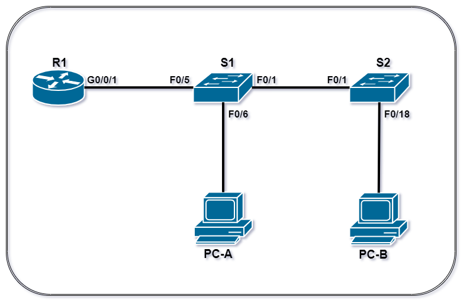
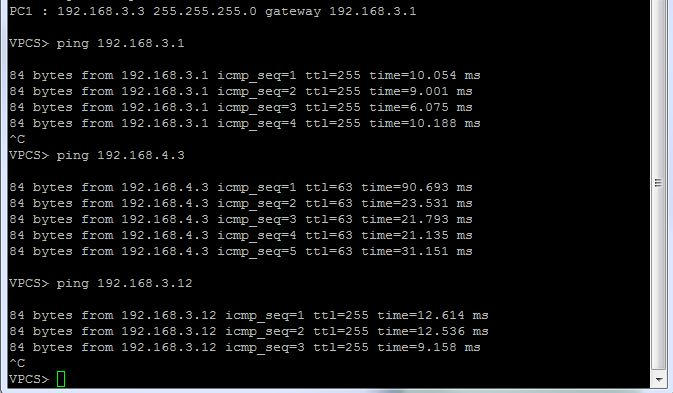
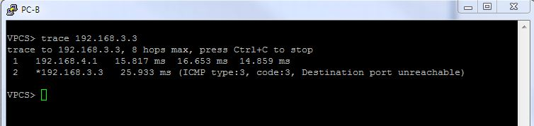

#  Lab - Configure Router-on-a-Stick Inter-VLAN Routing

  ###  Схема подключения:
#### (выполнена в редакторе DRAW.IO)

Рис.1

  ### Таблица адресации:
Табица 1
|  Device  |  Interface  |   IP Address   |   Subnet Mask   |  Default Gateway  |
|----------|-------------|----------------|-----------------|-------------------|
| R1       | G0/0/1.3    | 192.168.3.1    | 255.255.255.0   | N/A               |
|          | G0/0/1.4    | 192.168.4.1    | 255.255.255.0   | N/A               |
|          | G0/0/1.8    | N/A            | N/A             | N/A               |
| S1       | VLAN 3      | 192.168.3.11   | 255.255.255.0   | 192.168.3.1       |
| S2       | VLAN 3      | 192.168.3.12   | 255.255.255.0   | 192.168.3.1       |
| PC-A     | NIC         | 192.168.3.3    | 255.255.255.0   | 192.168.3.1       |
| PC-B     | NIC         | 192.168.4.3    | 255.255.255.0   | 192.168.4.1       |

  ### Таблица VLAN:
Табица 2
|   VLAN   |    Name    |   Interface Assigned           |
|----------|------------|--------------------------------|
| 3        | Management | S1: VLAN 3                     |
|          |            | S2: VLAN 3                     |
|          |            | S1: F0/6                       |
| 4        | Operations | S2: F0/18                      |
| 7        | ParkingLot | S1: F0/2-4, F0/7-24, G0/1-2    |
|          |            | S2: F0/2-17, F0/19-24, G0/1-2  |
| 8        | Native     | N/A                            |

  ### Задание:
  Необходимо настроить оборудование и организовать сетевую связанность согласно условию лабораторной работы.
  1. Создать сеть и настроить основные параметры устройства.
  2. Создать VLAN и назначить порты коммутаторов.
  3. Настроить транки 802.1Q между коммутаторами.
  4. Настроить маршрутизацию между VLAN на роутере.
  5. Проверить работоспособность сети.
  
  ### Ход выполнения:
  Для выполнения лабораторной работы использовался эмулятор EVE-NG, терминальный клиент PuTTY.
  #### Сбор схемы:
  1. Подключила устройства, как показано на рисунке 1.
  #### Настройка основных параметров роутера:
  1. Подключилась консолью к роутеру, зашла в превилигированный режим, вошла в режим конфигурации.
  2. Выполнила ряд команд. Описание которых, находится в файле OP_R1.txt в папке [configs](configs/).
  3. При установке времени на роутере, использовала вопросительный знак (?), чтобы указать правильную последовательность параметров, необходимых для выполнения этой команды.
   #### Настройка основных параметров для каждого коммутатора:
  1. Подключилась консолью к коммутатору, зашла в превилигированный режим, вошла в режим конфигурации.
  2. Выполнила ряд команд. Описание которых, находится в файле OP_S1.txt в папке [configs](configs/).
  3. Сохранила текущую конфигурацию в файл стартовой конфигурации.
  4. Теже действия проделала на втором коммутаторе. Описание команд находится в файле OP_S2.txt в папке [configs](configs/).
  #### Настройка хостов компьютеров:
  1. Прописала IP-адрес, маску подсети и шлюз по умолчанию, согласно вышеприведенной таблице 1 (Таблица адресации).
  
  #### Создание VLAN и назначение портов коммутаторов:
  1. На каждом коммутаторе создала VLAN и присвоила им имена согласно таблице 2 (Таблица VLAN).
  2. Настроила интерфейс управления и шлюз по умолчанию на каждом коммутаторе, используя информацию об IP-адресе в таблице адресации.
  3. Назначила все неиспользуемые порты на обоих коммутаторах в ParkingLot VLAN, настроила их для статического режима доступа (static access mode) и отправила в shutdown.
  4. При конфигурации нескольких интерфейсов с одинаковыми параметрами использовала команду interface range.
  5. Назначила используемым портам соответствующей VLAN (указанные в таблице VLAN выше) и настроила их для статического режима доступа (static access mode). 
  6. Выполнила команду show vlan brief для того, чтобы проверить правильность назначения VLAN на порты.
  #### Настройка магистрали (trunk) 802.1Q между коммутаторами:
  7. Перевела на обеих коммутаторах порты на интерфейсах F0/1 в режим trank (switchport mode trunk).
  8. На этих де портах прописали nativ VLAN 8.
  9. Настроила, чтобы через транковые порты ходили VLAN 3,4,8/
  10. Для проверки правильности настройки транковых портов использовала команду show interfaces trunk.
  11. На коммутаторе S1 настроила порт F0/5 так же как и F0/1.
  12. Сохранила текущую конфигурацию на обеих коммутаторах.
  13. Выполнила команду show interfaces trunk для проверки транкинга.
  14. Файлы с конфигурацией интерфейсов коммутаторов (S1.txt и S2.txt) находятся в папке [configs](configs/).
 #### Вопрос:
 Почему F0/5 не отображается в списке транков?
 #### Ответ:
 Потому, что не поднят порт со стороны роутера.
 
 #### Настройка маршрутизации между VLAN на роутере:
 1. Активировала интерфейс G0/0/1 на маршрутизаторе.
 2. Настроила субинтерфейс для каждой VLAN, как указано в таблице IP-адресации. Все субинтерфейсы используют инкапсуляцию 802.1Q.
 3. Включила описание субинтерфейсов.
 4. Для nativ VLAV IP-адрес не назначала.
 5. Чтобы проверить работоспособность субинтерфейсов использовала команду show ip interface brief.
 6. Файл с конфигурацией интерфейсов роутера (R1.txt) находится в папке [configs](configs/).
 
 
 #### Проверка работоспособности системы:
 1. С компьютера PC-A запустила команду ping на шлюз по умолчанию для этого компьютера.
 2. С компьютера PC-A запустила команду ping на компьютер PC-B.
 3. С компьютера PC-A запустила команду ping на коммутатор S2.

Результат тестов с компьютера PC-A:
 
 
 
  4. С компьютера PC-B запустила команду tracert на адрес PC-A.
 
 Результат теста с компьютера PC-B:
  
  
  
 #### Вопрос:
 Какие промежуточные IP-адреса отображаются в результатах?
 #### Ответ:
 В результате отображается только один промежуточный IP-адрес. IP-адрес субинтерфейса роутера, который является для PC-B шлюзом по умолчанию.
  
  
