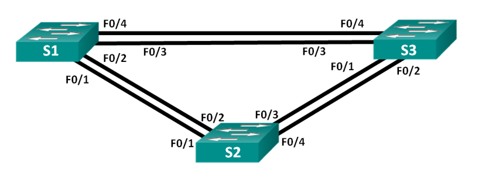
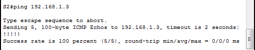

##  Развертывание коммутируемой сети с резервными каналами

  ###  Схема подключения:

Рис.1

  ### Таблица адресации:
Табица 1
|  Device  |  Interface  |   IP Address   |   Subnet Mask   |
|----------|-------------|----------------|-----------------|
| S1       | VLAN 1      | 192.168.1.1    | 255.255.255.0   |
| S2       | VLAN 1      | 192.168.1.2    | 255.255.255.0   |
| S3       | VLAN 1      | 192.168.1.2    | 255.255.255.0   |

### Задание:
  Необходимо настроить оборудование и организовать сетевую связанность согласно условию лабораторной работы.
  1. Создать сеть и настроить основные параметры устройства.
  2. Необходимо выбрать корневой мост.
  3. Пронаблюдать за процессом выбора протоколом STP порта, исходя из стоимости портов.
  4. Пронаблюдать за процессом выбора протоколом STP порта, исходя из приоритета портов.

 ### Ход выполнения:
  Для выполнения лабораторной работы использовался эмулятор Сisco Packet Tracer.
  
 #### Сбор схемы:
  1. Подключила устройства, как показано на рисунке 1.

#### Инициализация коммутаторов:
1. Подключилась консолью к коммутатору, вошла в привилигированный режим.
2. С помощью команды **_show flash_** проверила есть ли на коммутаторе ранее созданные сати VLAN. Файла **vlan.dat** не оказалось. В противном случае, если этот файл был бы обнаружен во флеш-памяти, его нужно было бы удалить с помощью команды **_delete vlan.dat_**.
3. Следующим этапом необходимо удалить файл загрузочной конфигурации из NVRAM. Команда: **_erase startup-config_**.
4. Перезагрузила коммутатор - команда **_reload_**.
5. Данную процедуру провела на всех используемых коммутаторах.

#### Настройка базовых параметров коммутатора:
Базовые настройки коммутаторов находятся в в папке [configs](configs/) в файлах **OP_S1.txt**, **OP_S2.txt**, **OP_S3.txt** соответственно.

#### Проверка связности между коммутаторами:
1. Выполнила команду ping с коммутатора S1 на коммутатор S2. Результат положительный.
2. Выполнила команду ping с коммутатора S1 на коммутатор S3. Результат положительный.

3. Выполнила команду ping с коммутатора S2 на коммутатор S3. Результат положительный.

#### Определение корневого моста:
1. Отключила все порты на коммутаторе.

conf t

!

interface range f0/1-24, g0/1-2

shutdown

exit

exit

!

