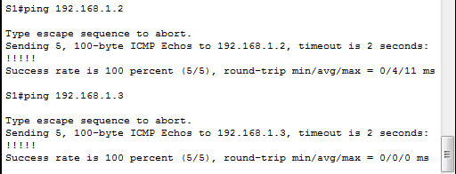

##  Развертывание коммутируемой сети с резервными каналами

  ###  Схема подключения:

Рис.1

  ### Таблица адресации:
Табица 1
|  Device  |  Interface  |   IP Address   |   Subnet Mask   |
|----------|-------------|----------------|-----------------|
| S1       | VLAN 1      | 192.168.1.1    | 255.255.255.0   |
| S2       | VLAN 1      | 192.168.1.2    | 255.255.255.0   |
| S3       | VLAN 1      | 192.168.1.2    | 255.255.255.0   |

### Задание:
  Необходимо настроить оборудование и организовать сетевую связанность согласно условию лабораторной работы.
  1. Создать сеть и настроить основные параметры устройства.
  2. Необходимо выбрать корневой мост.
  3. Пронаблюдать за процессом выбора протоколом STP порта, исходя из стоимости портов.
  4. Пронаблюдать за процессом выбора протоколом STP порта, исходя из приоритета портов.

 ### Ход выполнения:
  Для выполнения лабораторной работы использовался эмулятор Сisco Packet Tracer.
 
 #### I. Создание сети и настройка основных параметров устройства.
 
 #### Сбор схемы:
  1. Подключила устройства, как показано на рисунке 1.

#### Инициализация коммутаторов:
1. Подключилась консолью к коммутатору, вошла в привилигированный режим.
2. С помощью команды **_show flash_** проверила есть ли на коммутаторе ранее созданные сати VLAN. Файла **vlan.dat** не оказалось. В противном случае, если этот файл был бы обнаружен во флеш-памяти, его нужно было бы удалить с помощью команды **_delete vlan.dat_**.
3. Следующим этапом необходимо удалить файл загрузочной конфигурации из NVRAM. Команда: **_erase startup-config_**.
4. Перезагрузила коммутатор - команда **_reload_**.
5. Данную процедуру провела на всех используемых коммутаторах.

#### Настройка базовых параметров коммутатора:
Базовые настройки коммутаторов находятся в в папке [configs](configs/) в файлах **OP_S1.txt**, **OP_S2.txt**, **OP_S3.txt** соответственно.

#### Проверка связности между коммутаторами:
1. Выполнила команду ping с коммутатора S1 на коммутатор S2. Результат положительный.
2. Выполнила команду ping с коммутатора S1 на коммутатор S3. Результат положительный.

Рис.2

3. Выполнила команду ping с коммутатора S2 на коммутатор S3. Результат положительный.

Рис.3

    Данное кол-во тестов достаточно, так как команда ping проверяет доступност в обоих направлениях.

#### II. Определение корневого моста.

1. Отключила все порты на коммутаторе S1.

       conf t
       !
       interface range f0/1-24, g0/1-2
        shutdown
        exit
       exit
       !
Данные действия проделала и на коммутаторах S2 и S3.

2. Настроила подключенные порты (см.Рис.1) как транковые.
3. Включила порты F0/2 и F0/4 на всех коммутаторах.

       conf t
       !
       interface range f0/2, F0/4
        switchport mode trunk
        no shutdown
        exit
       exit
       !

4. Ввела команду **_show spanning-tree_** на всех трех коммутаторах.

Рис.4

Рис.5

Рис.6

    Проанализировав выходные данные с коммутаторов получила следующую картину:

Рис.7

 

     А так же получила ответы на ряд вопросов:

*Вопрос_1:*
Какой коммутатор является корневым мостом?

*Ответ:*
Коммутатор S3.

*Вопрос_2:*
Почему этот коммутатор был выбран протоколом spanning-tree в качестве корневого моста?

*Ответ:*
Так как выбор корневого моста складывается из значений приоритета (по умолчанию 32768), расширенного идентификатора системы - VLAN (в моем случае – это vlan 1 на всех коммутаторах) и MAC-адреса коммутатора (уникальные для каждого коммутатора), а коммутатор с самым низким значением MAC-адреса, при равных остальных условиях, становится корневым мостом, то следовательно, в моем случае – это коммутатор S3 (см. Рис.7)

*Вопрос_3:*
Какие порты на коммутаторе являются корневыми портами?

*Ответ:*
Порт коммутатора, который имеет кратчайший путь к корневому коммутатору называется корневым портом. У любого не корневого коммутатора может быть только один корневой порт. В моем случае – это порт F0/4 на коммутаторе S1 и порт F0/4 на коммутаторе S2.

*Вопрос_4:*
Какие порты на коммутаторе являются назначенными портами?

*Ответ:*
Коммутатор в сегменте сети, имеющий наименьшее расстояние до корневого коммутатора называется назначенным коммутатором (мостом). Порт этого коммутатора, который подключен к рассматриваемому сегменту сети, называется назначенным портом. В моем случае – это порт F0/2 на коммутаторе S2.

*Вопрос_5:*
Какой порт отображается в качестве альтернативного и в настоящее время заблокирован?

*Ответ:*
В моем случае – это порт F0/2 на коммутаторе S1 (см.Рис.8).

Рис.8

*Вопрос_6:*
Почему протокол spanning-tree выбрал этот порт в качестве невыделенного (заблокированного) порта?

*Ответ:*
Порт коммутатора, имеющего самое наибольшее расстояние до корневого коммутатора,  и, к тому же, который подключен к назначенному коммутатору называется альтернативным и блокируется до тех пор, пока основной путь не будет разорван.

В результате работы протокола spanning-tree получается древовидная структура (математический граф) с вершиной в виде корневого коммутатора.

Рис.9

#### III. Наблюдение за процессом выбора протоколом STP порта, исходя из стоимости портов.
Итак, на этом этапе лабораторной работы необходимо проследить как протокол spanning-tree поведет себя при изменении приоритетов портов.

1. По ходу лабораторной работы, с помощью команды **_show spanning-tree_**, определила коммутатор на котором оказался заблокированный протоколом порт - это коммутатор S1 (рис.4) порт F0/2. Хоть порт F0/4 и имеет более высокий идентификатор, но он смотрит в сторону корневого моста, по этому протокол заблокировал порт F0/2.

2. Изменила стоимость, оставшегося не заблокированным, порта на коммутаторе S1, понизив его на единицу.

       conf t
        interface f0/4
        spanning-tree vlan 1 cost 18
        exit
       exit
       !
3. В течении 30 секунд увидела изменение картины:

Рис.10

3. Повторно запустила команду show **_spanning-tree_** на коммутаторах S1 и S2.

Рис.11

Рис.12

*Вопрос:* Почему протокол spanning-tree заменяет ранее заблокированный порт на назначенный порт и блокирует порт, который был назначенным портом на другом коммутаторе?

*Ответ:* Алгоритм протокола spanning-tree (STA) использует корневой мост как точку привязки, после чего определяет, какие порты будут заблокированы, исходя из стоимости пути. Порт с более низкой стоимостью пути является предпочтительным, По-этому протокол заблокировал порт со стоимостью 19 на коммутаторе S2.

