##  **Настройка DHCPv4**

  ###  Схема подключения:

Рис.1

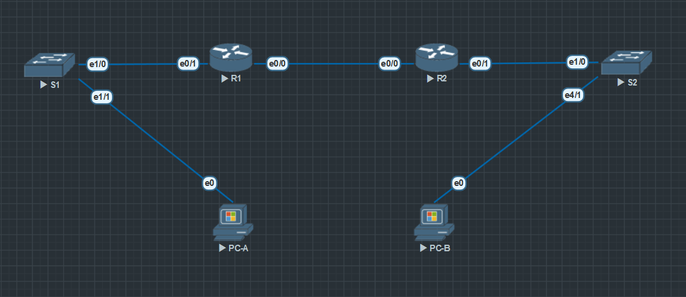

  ### Таблица адресации:
Табица 1
|  Device  |  Interface  |   IP Address   |   Subnet Mask   |                 |
|----------|-------------|----------------|-----------------|-----------------|
| R1       | E0/0        | 192.168.1.1    | 255.255.255.252 | N/A             |
|          | E0/1        | N/A            | N/A             |                 |
|          | E0/1.100    | 192.168.1.1    | 255.255.255.192 |                 |
|          | E0/1.200    | 192.168.1.65   | 255.255.255.224 |                 |
|          | E0/1.1000   | N/A            | N/A             |                 |
| R2       | E0/0        | 10.0.0.2       | 255.255.255.252 | N/A             |
|          | E0/1        | 192.168.1.97   | 255.255.255.240 |                 |
| S1       | VLAN 200    | 192.168.1.2    | 255.255.255.192 | 192.168.1.1     |
| S2       | VLAN 1      | 192.168.1.98   | 255.255.255.240 | 192.168.1.97    |
| PC-A     | NIC         | DHCP           | DHCP            | DHCP            |
| PC-B     | NIC         | DHCP           | DHCP            | DHCP            |

  ### Таблица VLAV:
Табица 2
|   VLAN   |    Name     |   Interface Assigned                               |
|----------|-------------|----------------------------------------------------|
| 1        | N/A         | S2: E4/1                                           |
| 100      | Clients     | S1: E1/0                                           |
| 200      | Management  | S1: VLAN 200                                       |
| 999      | Parking_Lot | S1: E0/0-3, E1/2-3, E2/0-3, E3/0-3, E4/0-3, E5/0-3 |
| 1000     | Native      | N/A                                                |

### Задание:
Необходимо настроить оборудование и организовать раздачу ip-адресов клиентам.
1. Собрать сеть и настроить основные параметры устройства.
2. Настроить и проверить два DHCPv4 сервера на роутере R1.
3. Настроить и проверить DHCP-трансляцию на роутере R2.

### Ход выполнения:
Для выполнения лабораторной работы использовался эмулятор EVE-NG, терминальный клиент PuTTY. 

#### **_I. Создание сети и настройка основных параметров устройства._**

#### Сбор схемы:
  1. Подключила устройства, как показано на рисунке 1.
  
#### Создание схемы адресации:
По условию лабораторной работы мне выделена сеть 192.168.1.0 с маской 255.255.255.0 для организации адресных пространств. Из этого диапазона я выделила три подсети: подсеть "А" - 192.168.1.0/26, подсеть "В" - 192.168.1.64/27, подсеть "С" - 192.168.1.96/28.

- Записала первый IP-адрес подсети "А" (192.168.1.1) в таблицу адресации (Таблица 1) для R1 E0/1.100. Из этой же подсети записала второй IP-адрес (192.168.1.2) в таблицу адресов для S1 VLAN 200 и указала соответствующий шлюз по умолчанию.

- Следующим этапом записала первый IP-адрес подсети "В" в таблицу адресации для R1 E0/1.200. Второй IP-адрес в таблице адресов - для S1 VLAN 1 и указала соответствующий шлюз по умолчанию.

- Далее занесла в таблицу для R2 E0/1 первый IP-адрес из подсети "С".

 
#### Настройка базовых параметров коммутатора  и маршрутизаторов:
Базовые настройки коммутаторов и маршрутизаторов находятся в папке [configs](configs/) в файлах **OP_S1.txt**, **OP_S2.txt**, **OP_R1.txt**, **OP_R2.txt** соответственно.
Для правильного ввода последовательности параметров команд на устройствах использую вопросительный знак (?).

#### Настройка маршрутизации между VLAN на маршрутизаторе R1.
Активирровала интерфейс E0/1 на маршрутизаторе. Настроила субинтерфейсы для каждой VLAN в соответствии с таблицей 1. Настроила на субинтерфейсах инкапсуляцию 802.1Q и назначила следующий (после шлюза по-умолчпнию) IP-адрес. Для E0/1.1000 native VLAN IP-адрес не назначала. Повесила на субинтерфейсы описание. Проверила, что они в состоянии "UP". Все команды описаны в конфигурационном файле **R1.txt** в папке [configs](configs/).

#### Настройка E0/1 на R2. Настройка интерфейсов E0/0 и статической маршрутизации для обоих маршрутизаторов.
Настроила E0/1 на R2 с первым IP-адресом из подсети "С". Настроила интерфейс E0/0 для каждого маршрутизатора на основе приведенной выше таблицы IP-адресации. Настроила маршрут по умолчанию на каждом маршрутизаторе, указывающий на IP-адрес E0/0 на другом маршрутизаторе. Все команды описаны в конфигурационных файлах **R1.txt** и **R2.txt** в папке [configs](configs/).
Провела тест подтверждающий работу статической маршрутизации:

    R1# ping 192.168.1.97
    Ответ: .!!!

#### Создание VLAN на S1.

- Создала необходимые сети VLAN на коммутаторе 1 из таблицы VLAN (Таблица 2). Настроила интерфейс управления на S1 (VLAN 200), использовала IP-адрес 192.168.1.2 и установила шлюз по умолчанию на S1 - 192.168.1.1. Активировала интерфейс.

- Настроила и активировала интерфейс управления на S2 (VLAN 1), используя IP-адрес 192.168.1.98. Установила шлюз по умолчанию 192.168.1.97.

- По условию лабораторной работы отправила все неиспользованные порты на S1 в VLAN Parking_Lot, настроила их для статического режима доступа и деактивировала.

- На коммутаторе S2 деактивировала все не используемые порты.

Для групповой настройки портов использовала команду interface range.
Все настройки описаны в конфигурационных файлах **R1.txt** и **R2.txt** в папке [configs](configs/).

#### Назначение VLAN на интерфейсы.
Назначила порты, которые выделены для связи c компьютерами (на S1 - E1/1,  на S2 - E4/1), соответствующей VLAN и статический режим (static access mode).

*Вопрос:*
Почему интерфейс E1/0 указан в VLAN 1?

*Ответ:*
Так как интерфейс E1/0 не был сконфигурирован – он по-умолчанию остается в VLAN 1.

#### Настройка интерфейса E1/0 на S1 как транковый 802.1Q.
Настроила интерфейс E1/0 как транковый. Установила native VLAN в значение 1000. И разрешила прохождение через этот порт VLAN-ам 100, 200 и 1000.
Все команды описаны в конфигурационном файле **S1.txt** в папке [configs](configs/).
Для проверки правильности настройки использовала команду **_show interface trunk_**.

Рис.2

*Вопрос:*
Какой IP-адрес был бы у ПК, если бы он был подключен к сети с помощью DHCP?

*Ответ:*
Если не настроены исключения, то первый используемый адрес сети.

#### **_II. Настройка и проверка двух серверов DHCPv4 на маршрутизаторе R1._**

#### Настройка R1 с пулами DHCPv4 для двух поддерживаемых подсетей.
Для того, что бы сервер DHCP выдавал IP-адреса предсказуемо, необходимо настроить исключения. Из каждого пула исключила первые пять адресов. После этого можно создавать пулы с испольованием уникальных имен. Так же настроила доменное имя **_ccna-lab.com_**, настроила шлюзы по умолчанию для каждого пула. Выставила срок аренды на 2 дня 12 часов 30 минут. Для второго пула ВРСЗм4 использовала имя **_R2_Client_LAN_** и использовала доменное имя **_ccna-lab.com_** и срок аренды, такие же как и в первом пуле.
Все команды описаны в конфигурационном файле **R1.txt** в папке [configs](configs/).

#### Проверка конфигурации DHCPv4-сервера.

- Выполнив команду **_show ip dhcp pool_** мы видим, что у нас намтроено два пула, видим адреса пулов; видим их адресацию; видим, сколько адресов в пуле. Вывод команды приводится на рисунке 3.

Рис.3

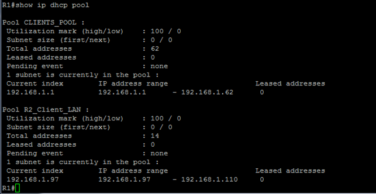

- Выполнив следующую команду - **_show ip dhcp binding_** видим, что пока нет выданных адресов (рисунок 4):

Рис.4

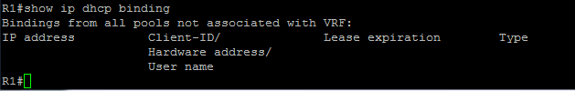

- Для проверки других сообщение DHCP выполнила команду **_show ip dhcp server statistics_**. Результат вывода на рисунке 5.

Рис.5

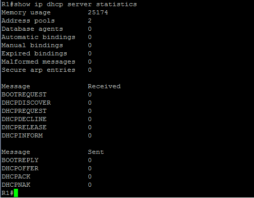

#### Получение IP-адреса от DHCP на PC-A.
* В настройках сети компьютера установила параметр "Получать данные автоматически". Затем открыла **_cmd_** и ввела команду **_ipconfig /renew_** для получения новой информации (рис.6).

Рис.6

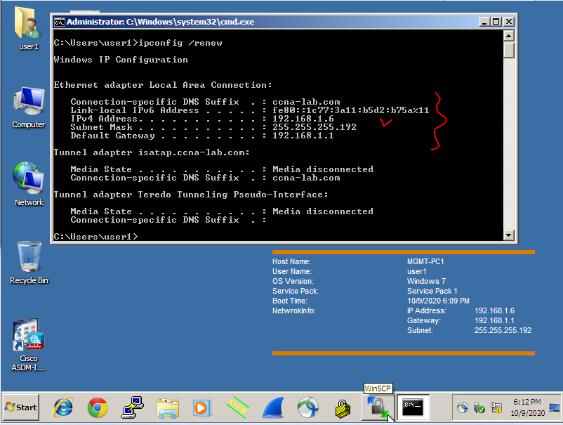

* Проверила возможность подключения, отправив эхо-запрос на IP-адрес интерфейса E0/1 маршрутизатора R1 (Рис.7)

Рис.7

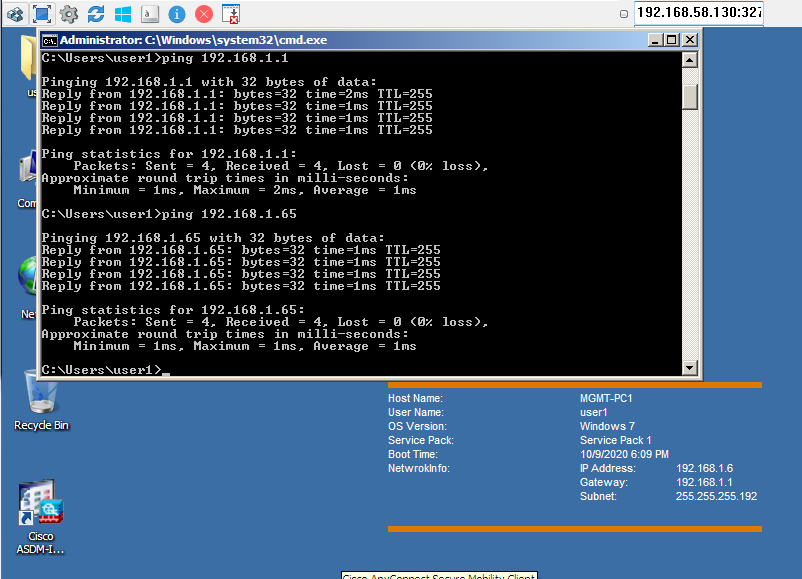

#### **_III. Настройка и проверка DHCP-ретрансляции на R2._**
Необходимо настроить R2 для ретрансляции запросов DHCP из локальной сети по интерфейсу E0/1 на сервер DHCP (R1).

#### Настройка R2 в качестве агента ретрансляции DHCP для локальной сети на E0/1.
На интерфейсе E0/1 настроила второй адрес командой **_ip helper-address_**, указав IP-адрес E0/0 маршрутизатора R1.
Команда описана в конфигурационном файле **R2.txt** в папке [configs](configs/).

#### Получение IP-адреса от DHCP на PC-B.
* В настройках сети компьютера установила параметр "Получать данные автоматически". Затем открыла **_cmd_** и ввела команду **_ipconfig /renew_** для получения новой информации (рис.8).

Рис.8

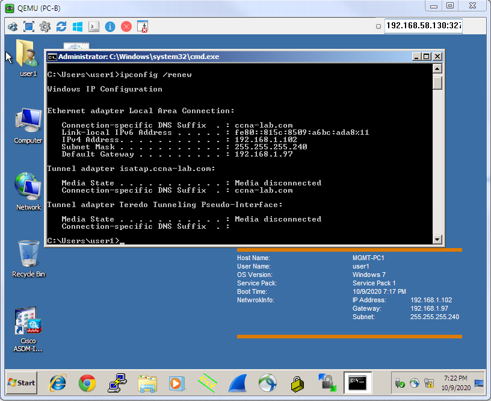

* Проверила возможность подключения, отправив эхо-запрос на IP-адрес интерфейса E0/1 маршрутизатора R1 (Рис.9).

Рис.9

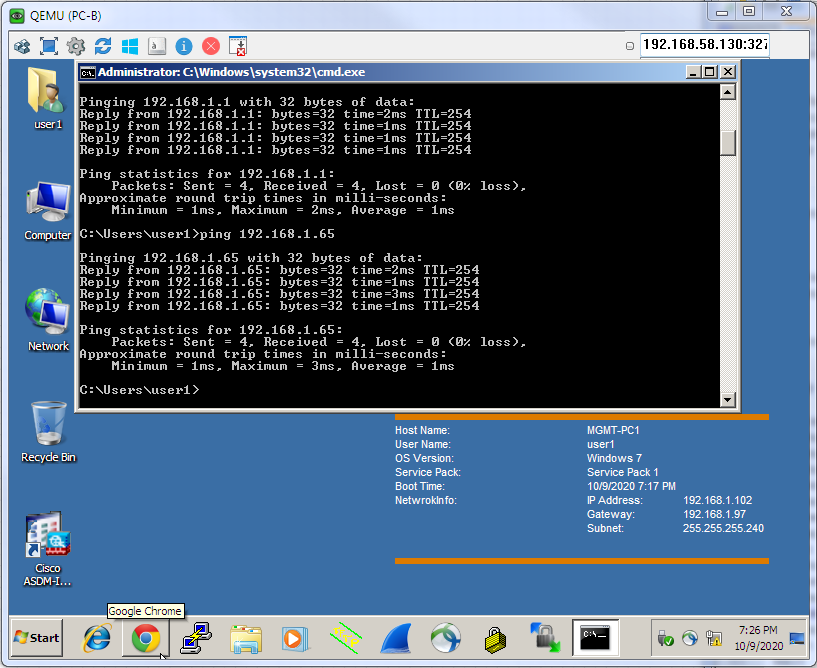

* После того, как я увидела, что компьютер получил адрес и связность в сети есть, повторно запустила на маршрутизаторе R1 команду **_show ip dhcp binding_**. Картина изменилась, в таблице появились IP-адреса выданные компьютерам (Рис.10).

Рис.10

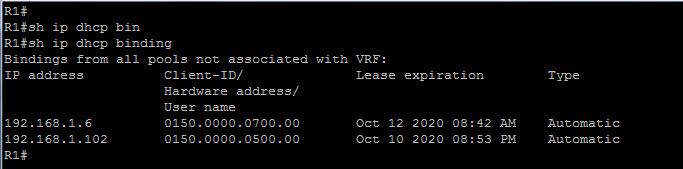
 
* С помощью команды **_show ip dhcp server statistics_** проверяем статистику на R1 (Рис.11) и R2 (Рис.12).

Рис.11

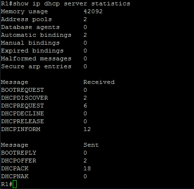

Рис.12

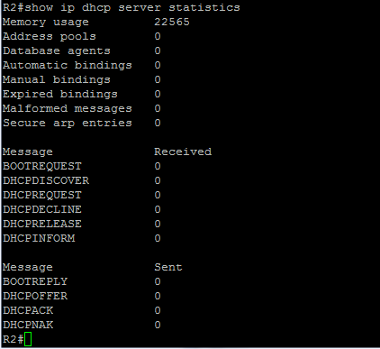

Как видно из выводов, на втором роутере таблица статистики пуста, так как он является всего лишь ретранслятором запросов.

