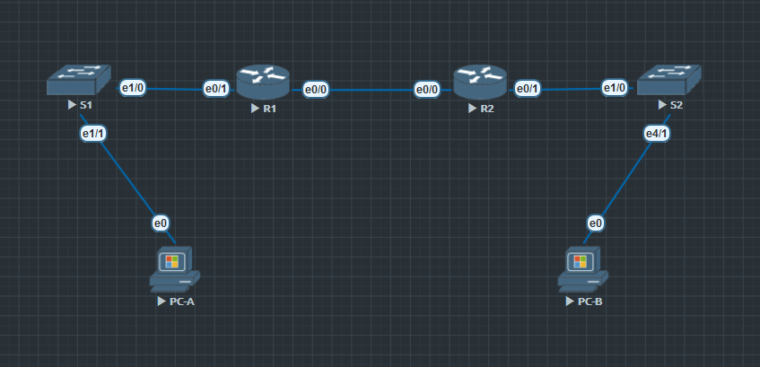
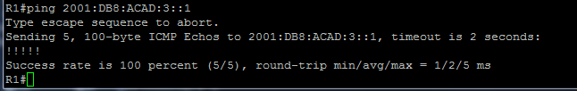
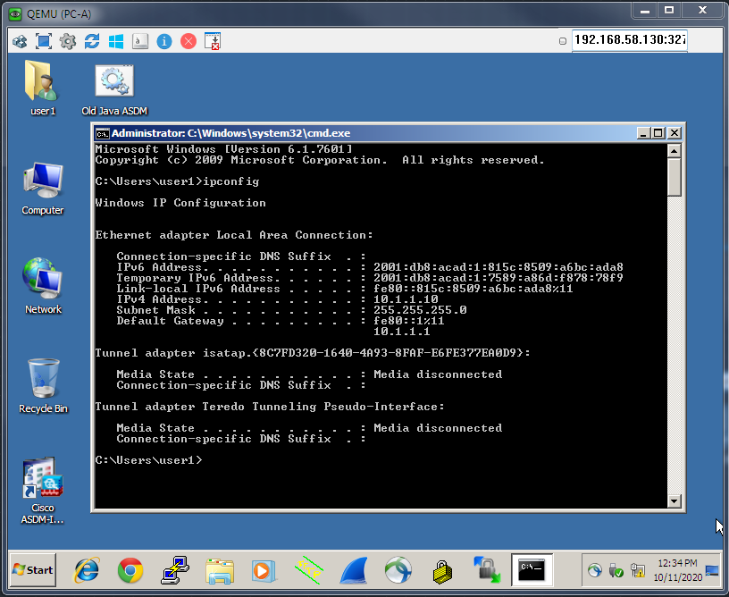
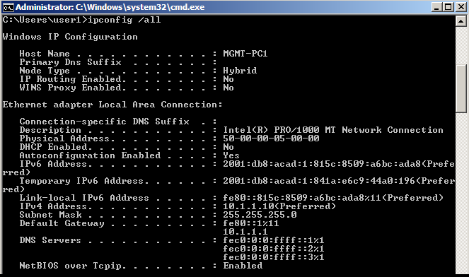
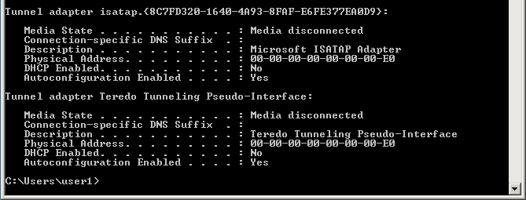

##  **Настройка DHCPv6**

  ###  Схема подключения:

Рис.1

  ### Таблица адресации:
Табица 1
|  Device  |  Interface  |     IPv6 Address      |
|----------|-------------|-----------------------|
| R1       | E0/0        | 2001:db8:acad:2::1/64 |
|          |             | fe80::1               |
|          | E0/1        | 2001:db8:acad:1::1/64 |
|          |             | fe80::1               |
| R2       | E0/0        | 2001:db8:acad:2::2/64 |
|          |             | fe80::2               |
|          | E0/1        | 2001:db8:acad:3::1/64 |
|          |             | fe80::1               |
| PC-A     | NIC         | DHCP                  |
| PC-B     | NIC         | DHCP                  |

### Задание:
1. Построить сеть и настроить основные параметры устройств.
2. Проверить назначение адреса SLAAC от R1.
3. Настроить и проверить DHCPv6-сервер без сохранения состояния на маршрутизаторе R1.
4. Настроить и проверить сервер DHCPv6 с отслеживанием состояния на маршрутизаторе R1.
5. Настроить и проверить DHCPv6 Relay на R2.

### Ход выполнения:
Для выполнения лабораторной работы использовался эмулятор EVE-NG, терминальный клиент PuTTY. 

#### **_I. Создание сети и настройка основных параметров устройств._**

#### Сбор схемы:
  1. Подключила устройства, как показано на рисунке 1.
  
#### Настройка базовых параметров коммутаторов и маршрутизаторов:
Базовые настройки коммутаторов и маршрутизаторов находятся в папке [configs](configs/) в файлах **OP_S1.txt**, **OP_S2.txt**, **OP_R1.txt**, **OP_R2.txt** соответственно.
Для правильного ввода последовательности параметров команд на устройствах использую вопросительный знак (?).
На коммутаторах выключила все неиспользованные порты (**S1.txt** и **S2.txt** в папке [configs](configs/)). А на маршрутизаторах включила маршрутизацию IPv6 (**R1.txt** и **R2.txt** в папке [configs](configs/)).

#### Настройка интерфейсов и маршрутизации для обоих маршрутизаторов:
Сначала настроила интерфейсы E0/0 и E0/1 на маршрутизаторах R1 и R2 с адресами IPv6, указанными в таблице выше. Далее настроила маршрут по умолчанию на каждом маршрутизаторе, указывающий на IP-адрес E0/0 на другом маршрутизаторе.

Настройки описаны в конфигурационных файлах **R1.txt** и **R2.txt** в папке [configs](configs/).

Для проверки работы маршрутизации выполнила команду ping с маршрутизатора R1 на адрес E0/1 R2 (результат на рис.2).

Рис.2

#### **_II. Проверка назначения адреса методом SLAAC от маршрутизатора R1._**
Для проверки автоматической раздачи IPv6-адресов запустила компьютер. Сетевая карта настроена на автоматическое получение адресов. В командной строке ввела команду **_ipconfig_**. Вывод команды на рисунке 3.

Рис.3

*Вопрос:*
Откуда взялась часть адреса, содержащая идентификатор хоста?

*Ответ:*
Если не используется DHCP сервер, то это часть адреса генерируется автоматически (генератор случайных чисел).

#### **_III. Настройка и проверка сервера DHCPv6 на маршрутизаторе R1._**
В этой части лабораторной работы настроила DHCP-сервер без отслеживания состояния на маршрутизаторе R1. Нужно сделать так, чтобы PC-A получил информацию о DNS-сервере и домене.

Для получения более расширенной информации о настройках PC выполнила команду **_ipconfig /all_**. Вывод на рис.4.

Рис.3

Рис.3а

