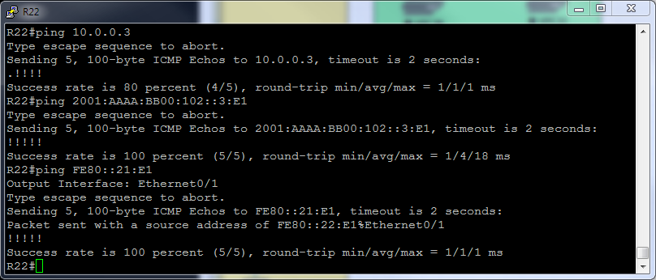
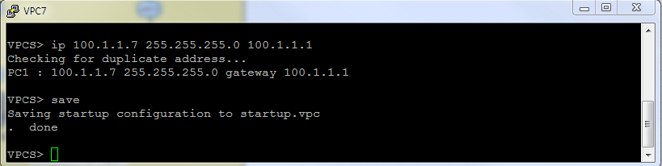
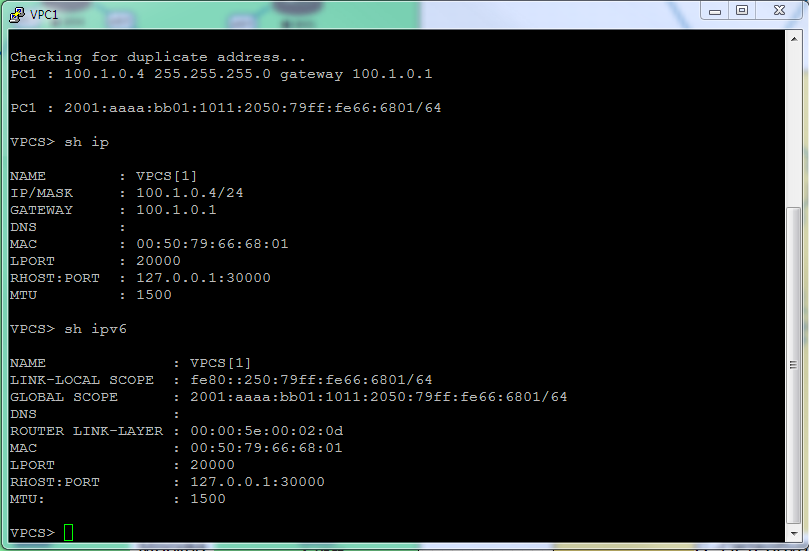
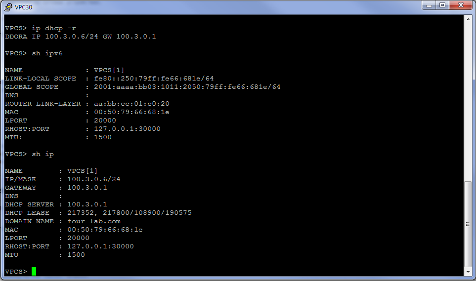

##  **Архитектура сети IPv4/6**

### Цель:
В данной самостоятельной работе необходимо распланировать адресное пространство.
Настроить IP на всех активных портах. Задокументировать адресное пространство. Необходимо использовать ipv4 и ipv6.
Необходимо настроить сети офисов так, чтобы не возникало broadcast штормов, а использование линков было максимально оптимизировано.

### Шаги выполнения:
1. [Разработка и документирование адресного пространства для лабораторного стенда.](README.md#I-&#1088;&#1072;&#1079;&#1088;&#1072;&#1073;&#1086;&#1090;&#1082;&#1072;&#45;&#1080;&#45;&#1076;&#1086;&#1082;&#1091;&#1084;&#1077;&#1085;&#1090;&#1080;&#1088;&#1086;&#1074;&#1072;&#1085;&#1080;&#1077;&#45;&#1072;&#1076;&#1088;&#1077;&#1089;&#1085;&#1086;&#1075;&#1086;&#45;&#1087;&#1088;&#1086;&#1089;&#1090;&#1088;&#1072;&#1085;&#1089;&#1090;&#1074;&#1072;&#45;&#1076;&#1083;&#1103;&#45;&#1083;&#1072;&#1073;&#1086;&#1088;&#1072;&#1090;&#1086;&#1088;&#1085;&#1086;&#1075;&#1086;&#45;&#1089;&#1090;&#1077;&#1085;&#1076;&#1072;)

    a. [Таблица выделенных подсетей.](README.md#a-&#1090;&#1072;&#1073;&#1083;&#1080;&#1094;&#1072;&#45;&#1074;&#1099;&#1076;&#1077;&#1083;&#1077;&#1085;&#1085;&#1099;&#1093;&#45;&#1087;&#1086;&#1076;&#1089;&#1077;&#1090;&#1077;&#1081;)
    
    b. [Таблица IP адресов.](README.md#b-&#1090;&#1072;&#1073;&#1083;&#1080;&#1094;&#1072;&#45;&#105;&#112;&#45;&#1072;&#1076;&#1088;&#1077;&#1089;&#1086;&#1074;)
    
2. [Настройка сетевого оборудования.](README.md#II-&#1085;&#1072;&#1089;&#1090;&#1088;&#1086;&#1081;&#1082;&#1072;&#45;&#1089;&#1077;&#1090;&#1077;&#1074;&#1086;&#1075;&#1086;&#45;&#1086;&#1073;&#1086;&#1088;&#1091;&#1076;&#1086;&#1074;&#1072;&#1085;&#1080;&#1103;)

    a. [Общая настройка сетевого оборудования.](README.md#a-&#1086;&#1073;&#1097;&#1072;&#1103;&#45;&#1085;&#1072;&#1089;&#1090;&#1088;&#1086;&#1081;&#1082;&#1072;&#45;&#1089;&#1077;&#1090;&#1077;&#1074;&#1086;&#1075;&#1086;&#45;&#1086;&#1073;&#1086;&#1088;&#1091;&#1076;&#1086;&#1074;&#1072;&#1085;&#1080;&#1103;)
    
    b. [Настройка ip адреса на каждом активном порту.](README.md#b-&#1085;&#1072;&#1089;&#1090;&#1088;&#1086;&#1081;&#1082;&#1072;&#45;&#105;&#112;&#45;&#1072;&#1076;&#1088;&#1077;&#1089;&#1072;&#45;&#1085;&#1072;&#45;&#1082;&#1072;&#1078;&#1076;&#1086;&#1084;&#45;&#1072;&#1082;&#1090;&#1080;&#1074;&#1085;&#1086;&#1084;&#45;&#1087;&#1086;&#1088;&#1090;&#1091;)
    
    c. [Настройка протокола VRRP.](README.md#c-&#1085;&#1072;&#1089;&#1090;&#1088;&#1086;&#1081;&#1082;&#1072;&#45;&#1087;&#1088;&#1086;&#1090;&#1086;&#1082;&#1086;&#1083;&#1072;&#45;&#118;&#114;&#114;&#112;)
    
    d. [Настройка VLAN управления на сетевых устройствах.](README.md#c-&#1085;&#1072;&#1089;&#1090;&#1088;&#1086;&#1081;&#1082;&#1072;&#45;&#86;&#76;&#65;&#78;&#45;&#1091;&#1087;&#1088;&#1072;&#1074;&#1083;&#1077;&#1085;&#1080;&#1103;&#45;&#1085;&#1072;&#45;&#1089;&#1077;&#1090;&#1077;&#1074;&#1099;&#1093;&#45;&#1091;&#1089;&#1090;&#1088;&#1086;&#1081;&#1089;&#1090;&#1074;&#1072;&#1093;)
    
3. [Настройка персональных компьютеров VPC в каждом офисе в своем VLAN.](README.md#III-&#1085;&#1072;&#1089;&#1090;&#1088;&#1086;&#1081;&#1082;&#1072;&#45;&#1087;&#1077;&#1088;&#1089;&#1086;&#1085;&#1072;&#1083;&#1100;&#1085;&#1099;&#1093;&#45;&#1082;&#1086;&#1084;&#1087;&#1100;&#1102;&#1090;&#1077;&#1088;&#1086;&#1074;&#45;&#86;&#80;&#67;&#45;&#1074;&#45;&#1082;&#1072;&#1078;&#1076;&#1086;&#1084;&#45;&#1086;&#1092;&#1080;&#1089;&#1077;&#45;&#1074;&#45;&#1089;&#1074;&#1086;&#1077;&#1084;&#45;&#86;&#76;&#65;&#78;)

4. [Итоговая схема.](README.md#IV-&#1080;&#1090;&#1086;&#1075;&#1086;&#1074;&#1072;&#1103;&#45;&#1089;&#1093;&#1077;&#1084;&#1072;)

### Ход выполнения:
    Для выполнения лабораторной работы использовался эмулятор EVE-NG, терминальный клиент PuTTY..

#### **_I. Разработка и документирование адресного пространства для лабораторного стенда._**

   *_Используемые сети:_*

10.0.0.0/8 - используется для линков Point-to-Point.

192.168.0.0/16 - используется для Loopback's.

172.16.0.0/16 - управление коммутаторами.

100.0.0.0/8 - пользовательские сети.

2001:AAAA::/48 - сеть выделенная провайдером. На площадке используются сети с префиксом /64. Для адреса в последнем хекстете будет использоваться, если это возможно, цифра из названия устройства.

FE80::/10 - сеть для адресов link-local. Для адреса в последнем хекстете будет использоваться, если это возможно, цифра из названия устройства и номер порта.
    
#### a. Таблица выделенных подсетей.
    Таблица 1.
    |----------------|-------|-------------------|-----------------|---------------------------|------------------------|--------------------------|
    |  Расположение  |  AS   |      IPv4 сеть    |Родительская сеть|        IPv6 сеть          |  Родительская сеть     |      Описание            |
    |----------------|-------|-------------------|-----------------|---------------------------|------------------------|--------------------------|
    | Киторн         | 101   | 10.0.0.0/31       |  10.0.0.0/23    | 2001:AAAA:BB00:100::/64   | 2001:AAAA:BB00::/48    | R22e0/0 - R14e0/2        |
    |                | 101   | 10.0.0.2/31       |  10.0.0.0/23    | 2001:AAAA:BB00:102::/64   | 2001:AAAA:BB00::/48    | R22e0/1 - R21e0/1        |
    |                | 101   | 10.0.0.4/31       |  10.0.0.0/23    | 2001:AAAA:BB00:104::/64   | 2001:AAAA:BB00::/48    | R22e0/2 - R23e0/0        |
    |                | 101   | 192.168.0.0/24    |                 | 2001:AAAA:BB00:192::/64   | 2001:AAAA:BB00::/48    | Loopback's               |
    | Москва         | 1001  | 10.1.0.0/31       |  10.1.0.0/23    | 2001:AAAA:BB01:100::/64   | 2001:AAAA:BB01::/48    | R14e0/3 - R19e0/0        |
    |                | 1001  | 10.1.0.2/31       |  10.1.0.0/23    | 2001:AAAA:BB01:102::/64   | 2001:AAAA:BB01::/48    | R14e0/0 - R12e0/2        |
    |                | 1001  | 10.1.0.4/31       |  10.1.0.0/23    | 2001:AAAA:BB01:104::/64   | 2001:AAAA:BB01::/48    | R14e0/1 - R13e0/3        |
    |                | 1001  | 10.1.0.6/31       |  10.1.0.0/23    | 2001:AAAA:BB01:106::/64   | 2001:AAAA:BB01::/48    | R15e0/1 - R12e0/3        |
    |                | 1001  | 10.1.0.8/31       |  10.1.0.0/23    | 2001:AAAA:BB01:108::/64   | 2001:AAAA:BB01::/48    | R15e0/0 - R13e0/2        |
    |                | 1001  | 10.1.0.10/31      |  10.1.0.0/23    | 2001:AAAA:BB01:110::/64   | 2001:AAAA:BB01::/48    | R15e0/3 - R20e0/0        |
    |                | 1001  | 10.1.0.12/31      |  10.1.0.0/23    | 2001:AAAA:BB01:112::/64   | 2001:AAAA:BB01::/48    | R12e0/1 - R13e0/1        |
    |                | 1001  | 192.168.1.0/24    |                 | 2001:AAAA:BB01:192::/64   | 2001:AAAA:BB01::/48    | Loopback's               |
    |                | 1001  | 172.16.1.0/24     |                 | 2001:AAAA:BB01:172::/64   | 2001:AAAA:BB01::/48    | Коммтаторы Vlan10        |
    |                | 1001  | 100.1.0.0/24      |  100.1.0.0/21   | 2001:AAAA:BB01:1001::/64  | 2001:AAAA:BB01::/48    | Пользователи Vlan11      |
    |                | 1001  | 100.1.1.0/24      |  100.1.0.0/21   | 2001:AAAA:BB01:1002::/64  | 2001:AAAA:BB01::/48    | Пользователи Vlan12      |
    | С.-Петербург   | 2042  | 10.2.0.0/31       |  10.2.0.0/23    | 2001:AAAA:BB02:100::/64   | 2001:AAAA:BB02::/48    | R18e0/1 - R17e0/1        |
    |                | 2042  | 10.2.0.2/31       |  10.2.0.0/23    | 2001:AAAA:BB02:102::/64   | 2001:AAAA:BB02::/48    | R18e0/0 - R16e0/1        |
    |                | 2042  | 10.2.0.4/31       |  10.2.0.0/23    | 2001:AAAA:BB02:104::/64   | 2001:AAAA:BB02::/48    | R17e0/0 - SW9e0/3        |
    |                | 2042  | 10.2.0.6/31       |  10.2.0.0/23    | 2001:AAAA:BB02:106::/64   | 2001:AAAA:BB02::/48    | R17e0/2 - SW10e1/0       |
    |                | 2042  | 10.2.0.8/31       |  10.2.0.0/23    | 2001:AAAA:BB02:108::/64   | 2001:AAAA:BB02::/48    | R16e0/2 - SW9e1/0        |
    |                | 2042  | 10.2.0.10/31      |  10.2.0.0/23    | 2001:AAAA:BB02:110::/64   | 2001:AAAA:BB02::/48    | R16e0/0 - SW10e0/3       |
    |                | 2042  | 10.2.0.12/31      |  10.2.0.0/23    | 2001:AAAA:BB02:112::/64   | 2001:AAAA:BB02::/48    | R16e0/3 - R32e0/0        |
    |                | 2042  | 10.2.0.14/31      |  10.2.0.0/23    | 2001:AAAA:BB02:114::/64   | 2001:AAAA:BB02::/48    | SW9Po1 - SW9Po1 (e0/0-1) |
    |                | 2042  | 192.168.2.0/24    |                 | 2001:AAAA:BB02:192::/64   | 2001:AAAA:BB02::/48    | Loopback's               |
    |                | 2042  | 172.16.2.0/24     |                 | 2001:AAAA:BB02:172::/64   | 2001:AAAA:BB02::/48    | Коммтаторы Vlan10        |
    |                | 2042  | 100.2.0.0/24      |  100.2.0.0/21   | 2001:AAAA:BB02:1011::/64  | 2001:AAAA:BB02::/48    | Пользователи Vlan11      |
    |                | 2042  | 100.2.1.0/24      |  100.2.0.0/21   | 2001:AAAA:BB02:1012::/64  | 2001:AAAA:BB02::/48    | Пользователи Vlan12      |
    | Чокурдах       |       | 192.168.3.0/24    |                 | 2001:AAAA:BB03:192::/64   | 2001:AAAA:BB03::/48    | Loopback's               |
    |                |       | 172.16.3.0/24     |                 | 2001:AAAA:BB03:172::/64   | 2001:AAAA:BB03::/48    | Коммтаторы Vlan10        |
    |                |       | 100.3.0.0/24      |  100.3.0.0/21   | 2001:AAAA:BB03:1021::/64  | 2001:AAAA:BB03::/48    | Пользователи Vlan11      |
    |                |       | 100.3.1.0/24      |  100.3.0.0/21   | 2001:AAAA:BB03:1022::/64  | 2001:AAAA:BB03::/48    | Пользователи Vlan12      |
    | Лабытнанги     |       | 192.168.4.0/24    |                 | 2001:AAAA:BB04:192::/64   | 2001:AAAA:BB04::/48    | Loopback's               |
    | Триада         | 520   | 10.5.0.0/31       |  10.5.0.0/23    | 2001:AAAA:BB05:100::/64   | 2001:AAAA:BB05::/48    | R23e0/2 - R24e0/2        |
    |                | 520   | 10.5.0.2/31       |  10.5.0.0/23    | 2001:AAAA:BB05:102::/64   | 2001:AAAA:BB05::/48    | R23e0/1 - R25e0/0        |
    |                | 520   | 10.5.0.4/31       |  10.5.0.0/23    | 2001:AAAA:BB05:104::/64   | 2001:AAAA:BB05::/48    | R24e0/1 - R26e0/0        |
    |                | 520   | 10.5.0.6/31       |  10.5.0.0/23    | 2001:AAAA:BB05:106::/64   | 2001:AAAA:BB05::/48    | R24e0/3 - R18e0/2        |
    |                | 520   | 10.5.0.8/31       |  10.5.0.0/23    | 2001:AAAA:BB05:108::/64   | 2001:AAAA:BB05::/48    | R25e0/2 - R26e0/2        |
    |                | 520   | 10.5.0.10/31      |  10.5.0.0/23    | 2001:AAAA:BB05:110::/64   | 2001:AAAA:BB05::/48    | R25e0/3 - R28e0/1        |
    |                | 520   | 10.5.0.12/31      |  10.5.0.0/23    | 2001:AAAA:BB05:112::/64   | 2001:AAAA:BB05::/48    | R25e0/1 - R27e0/0        |
    |                | 520   | 10.5.0.14/31      |  10.5.0.0/23    | 2001:AAAA:BB05:114::/64   | 2001:AAAA:BB05::/48    | R26e0/3 - R18e0/3        |
    |                | 520   | 10.5.0.16/31      |  10.5.0.0/23    | 2001:AAAA:BB05:116::/64   | 2001:AAAA:BB05::/48    | R26e0/1 - R28e0/0        |
    |                | 520   | 192.168.5.0/24    |                 | 2001:AAAA:BB05:192::/64   | 2001:AAAA:BB05::/48    | Loopback's               |
    | Ламас          | 302   | 10.6.0.0/31       |  10.6.0.0/23    | 2001:AAAA:BB06:100::/64   | 2001:AAAA:BB06::/48    | R21e0/0 - R15e0/2        |
    |                | 302   | 10.6.0.2/31       |  10.6.0.0/23    | 2001:AAAA:BB06:102::/64   | 2001:AAAA:BB06::/48    | R21e0/2 - R24e0/0        |
    |                | 302   | 192.168.6.0/24    |                 | 2001:AAAA:BB06:192::/64   | 2001:AAAA:BB06::/48    | Loopback's               |
    |----------------|-------|-------------------|-----------------|---------------------------|------------------------|--------------------------|

#### b. Таблица IP адресов.
    Таблица 2.
    |--------------|------------|------------|----------------|-----------------|-------------------------------|---------------------------|----------------------|
    | Расположение | Устройство |  Порт      |   IPv4 адрес   | Родит. сеть     |          IPv6 адрес           |  Родительская сеть        |      Описание        |
    |--------------|------------|------------|----------------|-----------------|-------------------------------|---------------------------|----------------------|
    | Киторн       | R22        | Lo0        | 192.168.0.22   | 192.168.0.0/32  | 2001:AAAA:BB00:192::22/128    | 2001:AAAA:BB00:192::/64   | Loopback R22         |
    |              |            | e0/0       | 10.0.0.0       | 10.0.0.0/31     | 2001:AAAA:BB00:100::E0/64     | 2001:AAAA:BB00:100::/64   |                      |
    |              |            |            |                |                 | FE80::22:E0                   | FE80::/10                 |                      |
    |              |            | e0/1       | 10.0.0.2       | 10.0.0.2/31     | 2001:AAAA:BB00:102::2:E1/64   | 2001:AAAA:BB00:102::/64   |                      |
    |              |            |            |                |                 | FE80::22:E1                   | FE80::/10                 |                      |
    |              |            | e0/2       | 10.0.0.4       | 10.0.0.4/31     | 2001:AAAA:BB00:104::4:E2/64   | 2001:AAAA:BB00:104::/64   |                      |
    |              |            |            |                |                 | FE80::22:E2                   | FE80::/10                 |                      |
    |--------------|------------|------------|----------------|-----------------|-------------------------------|---------------------------|----------------------|
    | Москва       | R14        | Lo0        | 192.168.1.14   | 192.168.1.0/32  | 2001:AAAA:BB01:192::14/128    | 2001:AAAA:BB01:192::/64   | Loopback R14         |
    |              |            | e0/2       | 10.0.0.1       | 10.0.0.0/31     | 2001:AAAA:BB00:100::1:E2/64   | 2001:AAAA:BB00:100::/64   |                      |
    |              |            |            |                |                 | FE80::14:E2                   | FE80::/10                 |                      |
    |              |            | e0/3       | 10.1.0.0       | 10.1.0.0/31     | 2001:AAAA:BB01:100::E3/64     | 2001:AAAA:BB01:100::/64   |                      |
    |              |            |            |                |                 | FE80::14:E3                   | FE80::/10                 |                      |
    |              |            | e0/0       | 10.1.0.2       | 10.1.0.2/31     | 2001:AAAA:BB01:102::2:E0/64   | 2001:AAAA:BB01:102::/64   |                      |
    |              |            |            |                |                 | FE80::14:E0                   | FE80::/10                 |                      |
    |              |            | e0/1       | 10.1.0.4       | 10.1.0.4/31     | 2001:AAAA:BB01:104::4:E1/64   | 2001:AAAA:BB01:104::/64   |                      |
    |              |            |            |                |                 | FE80::14:E1                   | FE80::/10                 |                      |
    |              |------------|------------|----------------|-----------------|-------------------------------|---------------------------|----------------------|
    |              | R15        | Lo0        | 192.168.1.15   | 192.168.1.0/32  | 2001:AAAA:BB01:192::15/128    | 2001:AAAA:BB01:192::/64   | Loopback R15         |
    |              |            | e0/2       | 10.6.0.1       | 10.6.0.0/31     | 2001:AAAA:BB06:100::1:E2/64   | 2001:AAAA:BB06:100::/64   |                      |
    |              |            |            |                |                 | FE80::15:E2                   | FE80::/10                 |                      |
    |              |            | e0/1       | 10.1.0.6       | 10.1.0.6/31     | 2001:AAAA:BB01:106::6:E1/64   | 2001:AAAA:BB01:106::/64   |                      |
    |              |            |            |                |                 | FE80::15:E1                   | FE80::/10                 |                      |
    |              |            | e0/0       | 10.1.0.8       | 10.1.0.8/31     | 2001:AAAA:BB01:108::8:E0/64   | 2001:AAAA:BB01:108::/64   |                      |
    |              |            |            |                |                 | FE80::15:E0                   | FE80::/10                 |                      |
    |              |            | e0/3       | 10.1.0.10      | 10.1.0.10/31    | 2001:AAAA:BB01:110::10:E3/64  | 2001:AAAA:BB01:110::/64   |                      |
    |              |            |            |                |                 | FE80::15:E3                   | FE80::/10                 |                      |
    |              |------------|------------|----------------|-----------------|-------------------------------|---------------------------|----------------------|
    |              | R19        | Lo0        | 192.168.1.19   | 192.168.1.0/32  | 2001:AAAA:BB01:192::19/128    | 2001:AAAA:BB01:192::/64   | Loopback R19         |
    |              |            | e0/0       | 10.1.0.1       | 10.1.0.0/31     | 2001:AAAA:BB01:100::1:E0/64   | 2001:AAAA:BB01:100::/64   |                      |
    |              |            |            |                |                 | FE80::19:E0                   | FE80::/10                 |                      |
    |              |------------|------------|----------------|-----------------|-------------------------------|---------------------------|----------------------|
    |              | R12        | Lo0        | 192.168.1.12   | 192.168.1.0/32  | 2001:AAAA:BB01:192::12/128    | 2001:AAAA:BB01:192::/64   | Loopback R12         |
    |              |            | e0/2       | 10.1.0.3       | 10.1.0.2/31     | 2001:AAAA:BB01:102::3:E2/64   | 2001:AAAA:BB01:102::/64   |                      |
    |              |            |            |                |                 | FE80::12:E2                   | FE80::/10                 |                      |
    |              |            | e0/3       | 10.1.0.7       | 10.1.0.6/31     | 2001:AAAA:BB01:106::7:E3/64   | 2001:AAAA:BB01:106::/64   |                      |
    |              |            |            |                |                 | FE80::12:E3                   | FE80::/10                 |                      |
    |              |            | e0/1       | 10.1.0.12      | 10.1.0.12/31    | 2001:AAAA:BB01:112::12:E1/64  | 2001:AAAA:BB01:112::/64   |                      |
    |              |            |            |                |                 | FE80::12:E1                   | FE80::/10                 |                      |
    |              |            | e0/0       | N/A            | N/A             | N/A                           |                           |                      |
    |              |            | e0/0.10    | 172.16.1.2     | 172.16.1.0/24   | 2001:AAAA:BB01:172::2/64      | 2001:AAAA:BB01:172::/64   | Коммутаторы Vlan10   |
    |              |            |            | 172.16.1.1     | 172.16.1.0/24   | 2001:AAAA:BB01:172::1/64      | 2001:AAAA:BB01:172::/64   | Виртуальный IP       |
    |              |            | e0/0.11    | 100.1.0.2      | 100.1.0.0/24    | 2001:AAAA:BB01:1011::2/64     | 2001:AAAA:BB01:1011::/64  | Пользователи Vlan11  |
    |              |            |            | 100.1.0.1      | 100.1.0.0/24    | 2001:AAAA:BB01:1011::1/64     | 2001:AAAA:BB01:1011::/64  | Виртуальный IP       |
    |              |            | e0/0.12    | 100.1.1.2      | 100.1.1.0/24    | 2001:AAAA:BB01:1012::2/64     | 2001:AAAA:BB01:1012::/64  | Пользователи Vlan12  |
    |              |            |            | 100.1.1.1      | 100.1.1.0/24    | 2001:AAAA:BB01:1012::1/64     | 2001:AAAA:BB01:1012::/64  | Виртуальный IP       |
    |              |------------|------------|----------------|-----------------|-------------------------------|---------------------------|----------------------|
    |              | R13        | Lo0        | 192.168.1.13   | 192.168.1.0/32  | 2001:AAAA:BB01:192::13/128    | 2001:AAAA:BB01:192::/64   | Loopback R13         |
    |              |            | e0/1       | 10.1.0.13      | 10.1.0.12/31    | 2001:AAAA:BB01:112::13:E1/64  | 2001:AAAA:BB01:112::/64   |                      |
    |              |            |            |                |                 | FE80::13:E1                   | FE80::/10                 |                      |
    |              |            | e0/3       | 10.1.0.5       | 10.1.0.4/31     | 2001:AAAA:BB01:104::5:E3/64   | 2001:AAAA:BB01:104::/64   |                      |
    |              |            |            |                |                 | FE80::13:E3                   | FE80::/10                 |                      |
    |              |            | e0/2       | 10.1.0.9       | 10.1.0.8/31     | 2001:AAAA:BB01:108::9:E2/64   | 2001:AAAA:BB01:108::/64   |                      |
    |              |            |            |                |                 | FE80::13:E2                   | FE80::/10                 |                      |
    |              |            | e0/0       | N/A            | N/A             | N/A                           |                           |                      |
    |              |            | e0/0.10    | 172.16.1.3     | 172.16.1.0/24   | 2001:AAAA:BB01:172::3/64      | 2001:AAAA:BB01:172::/64   | Коммутаторы Vlan10   |
    |              |            |            | 172.16.1.1     | 172.16.1.0/24   | 2001:AAAA:BB01:172::1/64      | 2001:AAAA:BB01:172::/64   | Виртуальный IP       |
    |              |            | e0/0.11    | 100.1.0.3      | 100.1.0.0/24    | 2001:AAAA:BB01:1011::3/64     | 2001:AAAA:BB01:1011::/64  | Пользователи Vlan11  |
    |              |            |            | 100.1.0.1      | 100.1.0.0/24    | 2001:AAAA:BB01:1011::1/64     | 2001:AAAA:BB01:1011::/64  | Виртуальный IP       |
    |              |            | e0/0.12    | 100.1.1.3      | 100.1.1.0/24    | 2001:AAAA:BB01:1012::3/64     | 2001:AAAA:BB01:1012::/64  | Пользователи Vlan12  |
    |              |            |            | 100.1.1.1      | 100.1.1.0/24    | 2001:AAAA:BB01:1012::1/64     | 2001:AAAA:BB01:1012::/64  | Виртуальный IP       |
    |              |------------|------------|----------------|-----------------|-------------------------------|---------------------------|----------------------|
    |              | R20        | Lo0        | 192.168.1.20   | 192.168.1.0/32  | 2001:AAAA:BB01:192::20/128    | 2001:AAAA:BB01:192::/64   | Loopback R19         |
    |              |            | e0/0       | 10.1.0.11      | 10.1.0.10/31    | 2001:AAAA:BB01:110::11:E0/64  | 2001:AAAA:BB01:110::/64   |                      |
    |              |            |            |                |                 | FE80::20:E0                   | FE80::/10                 |                      |
    |              |------------|------------|----------------|-----------------|-------------------------------|---------------------------|----------------------|
    |              | SW4        | Int Vlan10 | 172.16.1.14    | 172.16.1.0/24   | 2001:AAAA:BB01:172::4c/64     | 2001:AAAA:BB01:172::/64   |                      |
    |              |            |            |                |                 | FE80::c4:10                   | FE80::/10                 |                      |
    |              |------------|------------|----------------|-----------------|-------------------------------|---------------------------|----------------------|    
    |              | SW5        | Int Vlan10 | 172.16.1.15    | 172.16.1.0/24   | 2001:AAAA:BB01:172::5c/64     | 2001:AAAA:BB01:172::/64   |                      |
    |              |            |            |                |                 | FE80::c5:10                   | FE80::/10                 |                      |
    |              |------------|------------|----------------|-----------------|-------------------------------|---------------------------|----------------------| 
    |              | SW3        | Int Vlan10 | 172.16.1.13    | 172.16.1.0/24   | 2001:AAAA:BB01:172::3c/64     | 2001:AAAA:BB01:172::/64   |                      |
    |              |            |            |                |                 | FE80::c3:10                   | FE80::/10                 |                      |
    |              |------------|------------|----------------|-----------------|-------------------------------|---------------------------|----------------------| 
    |              | SW2        | Int Vlan10 | 172.16.1.12    | 172.16.1.0/24   | 2001:AAAA:BB01:172::2c/64     | 2001:AAAA:BB01:172::/64   |                      |
    |              |            |            |                |                 | FE80::c2:10                   | FE80::/10                 |                      |
    |              |------------|------------|----------------|-----------------|-------------------------------|---------------------------|----------------------| 
    |              | VPC1       |            | 100.1.0.4      | 100.1.0.0/24    | autoconfig                    | 2001:AAAA:BB01:1011::/64  |                      |
    |              | VPC7       |            | 100.1.1.7      | 100.1.1.0/24    | autoconfig                    | 2001:AAAA:BB01:1012::/64  |                      |
    |--------------|------------|------------|----------------|-----------------|-------------------------------|---------------------------|----------------------|
    | С.-Петербург | R18        | Lo0        | 192.168.2.18   | 192.168.2.0/32  | 2001:AAAA:BB02:192::18/128    | 2001:AAAA:BB02:192::/64   | Loopback R18         |
    |              |            | e0/2       | 10.5.0.7       | 10.5.0.6/31     | 2001:AAAA:BB05:106::7:E2/64   | 2001:AAAA:BB05:106::/64   |                      |
    |              |            |            |                |                 | FE80::18:E2                   | FE80::/10                 |                      |
    |              |            | e0/3       | 10.5.0.15      | 10.5.0.14/31    | 2001:AAAA:BB05:114::15:E3/64  | 2001:AAAA:BB05:114::/64   |                      |
    |              |            |            |                |                 | FE80::18:E3                   | FE80::/10                 |                      |
    |              |            | e0/1       | 10.2.0.0       | 10.2.0.0/31     | 2001:AAAA:BB02:100::E1/64     | 2001:AAAA:BB02:100::/64   |                      |
    |              |            |            |                |                 | FE80::18:E1                   | FE80::/10                 |                      |
    |              |            | e0/0       | 10.2.0.2       | 10.2.0.2/31     | 2001:AAAA:BB02:102::2:E0/64   | 2001:AAAA:BB02:102::/64   |                      |
    |              |            |            |                |                 | FE80::18:E0                   | FE80::/10                 |                      |
    |              |------------|------------|----------------|-----------------|-------------------------------|---------------------------|----------------------|
    |              | R17        | Lo0        | 192.168.2.17   | 192.168.2.0/32  | 2001:AAAA:BB02:192::17/128    | 2001:AAAA:BB02:192::/64   | Loopback R17         |
    |              |            | e0/1       | 10.2.0.1       | 10.2.0.0/31     | 2001:AAAA:BB02:100::1:E1/64   | 2001:AAAA:BB02:100::/64   |                      |
    |              |            |            |                |                 | FE80::17:E1                   | FE80::/10                 |                      |
    |              |            | e0/0       | 10.2.0.4       | 10.2.0.4/31     | 2001:AAAA:BB02:104::4:E0/64   | 2001:AAAA:BB02:104::/64   |                      |
    |              |            |            |                |                 | FE80::17:E0                   | FE80::/10                 |                      |
    |              |            | e0/2       | 10.2.0.6       | 10.2.0.6/31     | 2001:AAAA:BB02:106::6:E3/64   | 2001:AAAA:BB02:106::/64   |                      |
    |              |            |            |                |                 | FE80::17:E2                   | FE80::/10                 |                      |
    |              |------------|------------|----------------|-----------------|-------------------------------|---------------------------|----------------------|
    |              | R16        | Lo0        | 192.168.2.16   | 192.168.2.0/32  | 2001:AAAA:BB02:192::16/128    | 2001:AAAA:BB02:192::/64   | Loopback R16         |
    |              |            | e0/1       | 10.2.0.3       | 10.2.0.2/31     | 2001:AAAA:BB02:102::3:E0/64   | 2001:AAAA:BB02:102::/64   |                      |
    |              |            |            |                |                 | FE80::16:E1                   | FE80::/10                 |                      |
    |              |            | e0/2       | 10.2.0.8       | 10.2.0.8/31     | 2001:AAAA:BB02:108::8:E2/64   | 2001:AAAA:BB02:108::/64   |                      |
    |              |            |            |                |                 | FE80::16:E2                   | FE80::/10                 |                      |
    |              |            | e0/0       | 10.2.0.10      | 10.2.0.10/31    | 2001:AAAA:BB02:110::10:E0/64  | 2001:AAAA:BB02:110::/64   |                      |
    |              |            |            |                |                 | FE80::17:E0                   | FE80::/10                 |                      |
    |              |            | e0/3       | 10.2.0.12      | 10.2.0.12/31    | 2001:AAAA:BB02:112::12:E3/64  | 2001:AAAA:BB02:112::/64   |                      |
    |              |            |            |                |                 | FE80::16:E3                   | FE80::/10                 |                      |
    |              |------------|------------|----------------|-----------------|-------------------------------|---------------------------|----------------------|
    |              | R32        | Lo0        | 192.168.2.32   | 192.168.2.0/32  | 2001:AAAA:BB02:192::32/128    | 2001:AAAA:BB02:192::/64   | Loopback R32         |
    |              |            | e0/0       | 10.2.0.13      | 10.2.0.12/31    | 2001:AAAA:BB02:112::13:E0/64  | 2001:AAAA:BB02:112::/64   |                      |
    |              |            |            |                |                 | FE80::32:E0                   | FE80::/10                 |                      |
    |              |------------|------------|----------------|-----------------|-------------------------------|---------------------------|----------------------|
    |              | SW9        | Lo0        | 192.168.2.9    | 192.168.2.0/32  | 2001:AAAA:BB02:192::9c/64     | 2001:AAAA:BB02:192::/64   | Loopback SW9         |
    |              |            | e0/3       | 10.2.0.5       | 10.2.0.4/31     | 2001:AAAA:BB02:104::5:E3/64   | 2001:AAAA:BB02:104::/64   |                      |
    |              |            |            |                |                 | FE80::9c:E3                   | FE80::/10                 |                      |
    |              |            | e1/0       | 10.2.0.9       | 10.2.0.8/31     | 2001:AAAA:BB02:108::9:E10/64  | 2001:AAAA:BB02:108::/64   |                      |
    |              |            |            |                |                 | FE80::9c:E10                  | FE80::/10                 |                      |
    |              |            | Po1(e0/0-1)| 10.2.0.14      | 10.2.0.14/31    | 2001:AAAA:BB02:114::14:c1/64  | 2001:AAAA:BB02:114::/64   |                      |
    |              |            |            |                |                 | FE80::9c:c1                   | FE80::/10                 |                      |
    |              |            | Int Vlan11 | 100.2.0.1      | 100.2.0.0/24    | 2001:AAAA:BB02:1011::1/64     | 2001:AAAA:BB02:1011::/64  |                      |
    |              |            | e0/2       | N/A            | N/A             | N/A                           | N/A                       |                      |
    |              |------------|------------|----------------|-----------------|-------------------------------|---------------------------|----------------------|
    |              | SW10       | Lo0        | 192.168.2.10   | 192.168.2.0/32  | 2001:AAAA:BB02:192::10c/64    | 2001:AAAA:BB02:172::/64   | Loopback SW10        |
    |              |            | Po1(e0/0-1)| 10.2.0.15      | 10.2.0.14/31    | 2001:AAAA:BB02:114::15:c1/64  | 2001:AAAA:BB02:114::/64   |                      |
    |              |            |            |                |                 | FE80::10c:c1                  | FE80::/10                 |                      |
    |              |            | e1/0       | 10.2.0.7       | 10.2.0.6/31     | 2001:AAAA:BB02:106::7:E10/64  | 2001:AAAA:BB02:106::/64   |                      |
    |              |            |            |                |                 | FE80::10c:E10                 | FE80::/10                 |                      |
    |              |            | e0/3       | 10.2.0.11      | 10.2.0.10/31    | 2001:AAAA:BB02:110::11:E3/64  | 2001:AAAA:BB02:110::/64   |                      |
    |              |            |            |                |                 | FE80::10c:E3                  | FE80::/10                 |                      |
    |              |            | Int Vlan12 | 100.2.1.1      | 100.2.1.0/24    | 2001:AAAA:BB01:1012::1/64     | 2001:AAAA:BB01:1012::/64  |                      |
    |              |            | e0/2       | N/A            | N/A             | N/A                           | N/A                       |                      |
    |              |------------|------------|----------------|-----------------|-------------------------------|---------------------------|----------------------|
    |              | VPC8       |            | 100.2.0.8      | 100.2.0.0/24    | autoconfig                    | 2001:AAAA:BB02:1011::/64  |                      |
    |              | VPC        |            | 100.2.1.5      | 100.2.1.0/24    | autoconfig                    | 2001:AAAA:BB02:1012::/64  |                      |
    |--------------|------------|------------|----------------|-----------------|-------------------------------|---------------------------|----------------------|
    | Чокурдах     | R28        | Lo0        | 192.168.3.28   | 192.168.3.0/32  | 2001:AAAA:BB03:192::28/128    | 2001:AAAA:BB03:192::/64   | Loopback R28         |
    |              |            | e0/0       | 10.5.0.17      | 10.5.0.16/31    | 2001:AAAA:BB05:116::17:E0/64  | 2001:AAAA:BB05:116::/64   |                      |
    |              |            |            |                |                 | FE80::28:E0                   | FE80::/10                 |                      |
    |              |            | e0/1       | 10.5.0.11      | 10.5.0.10/31    | 2001:AAAA:BB05:110::11:E1/64  | 2001:AAAA:BB05:110::/64   |                      |
    |              |            |            |                |                 | FE80::28:E1                   | FE80::/10                 |                      |
    |              |            | e0/2       | N/A            | N/A             | N/A                           |                           |                      |
    |              |            | e0/2.10    | 172.16.3.1     | 172.16.3.0/24   | 2001:AAAA:BB03:172::1/64      | 2001:AAAA:BB03:172::/64   | Коммутаторы Vlan10   |
    |              |            |            |                |                 | FE80::28:E210                 | FE80::/10                 |                      |
    |              |            | e0/2.11    | 100.3.0.1      | 100.3.0.0/24    | 2001:AAAA:BB03:1011::1/64     | 2001:AAAA:BB03:1011::/64  | Пользователи Vlan11  |
    |              |            |            |                |                 | FE80::28:E211                 | FE80::/10                 |                      |
    |              |            | e0/2.12    | 100.3.1.1      | 100.3.1.0/24    | 2001:AAAA:BB03:1012::1/64     | 2001:AAAA:BB03:1012::/64  | Пользователи Vlan12  |
    |              |            |            |                |                 | FE80::28:E212                 | FE80::/10                 |                      |
    |              |------------|------------|----------------|-----------------|-------------------------------|---------------------------|----------------------|
    |              | SW29       | Int Vlan10 | 172.16.3.29    | 172.16.3.0/24   | 2001:AAAA:BB03:172::29с/64    | 2001:AAAA:BB03:172::/64   |                      |
    |              |            |            |                |                 | FE80::с29:10                  | FE80::/10                 |                      |
    |              |------------|------------|----------------|-----------------|-------------------------------|---------------------------|----------------------|
    |              | VPC30      |            | DHCP           | 100.3.0.0/24    | autoconfig                    | 2001:AAAA:BB03:1011::/64  |                      |
    |              | VPC31      |            | DHCP           | 100.3.1.0/24    | autoconfig                    | 2001:AAAA:BB03:1012::/64  |                      |
    |--------------|------------|------------|----------------|-----------------|-------------------------------|---------------------------|----------------------|
    | Лабытнанги   | R27        | Lo0        | 192.168.4.27   | 192.168.4.0/32  | 2001:AAAA:BB04:192::27/128    | 2001:AAAA:BB04:192::/64   | Loopback R27         |
    |              |            | e0/0       | 10.5.0.13      | 10.5.0.12/31    | 2001:AAAA:BB05:112::13:E0/64  | 2001:AAAA:BB05:112::/64   |                      |
    |              |            |            |                |                 | FE80::27:E0                   | FE80::/10                 |                      |
    |--------------|------------|------------|----------------|-----------------|-------------------------------|---------------------------|----------------------|
    | Триада       | R23        | Lo0        | 192.168.5.23   | 192.168.5.0/32  | 2001:AAAA:BB05:192::23/128    | 2001:AAAA:BB05:192::/64   | Loopback R23         |
    |              |            | e0/0       | 10.0.0.5       | 10.0.0.4/31     | 2001:AAAA:BB00:104::5:E0/64   | 2001:AAAA:BB00:104::/64   |                      |
    |              |            |            |                |                 | FE80::23:E0                   | FE80::/10                 |                      |
    |              |            | e0/2       | 10.5.0.0       | 10.5.0.0/31     | 2001:AAAA:BB05:100::E2/64     | 2001:AAAA:BB05:100::/64   |                      |
    |              |            |            |                |                 | FE80::23:E2                   | FE80::/10                 |                      |
    |              |            | e0/1       | 10.5.0.2       | 10.5.0.2/31     | 2001:AAAA:BB05:102::2:E1/64   | 2001:AAAA:BB05:102::/64   |                      |
    |              |            |            |                |                 | FE80::23:E1                   | FE80::/10                 |                      |
    |              |------------|------------|----------------|-----------------|-------------------------------|---------------------------|----------------------|
    |              | R24        | Lo0        | 192.168.5.24   | 192.168.5.0/32  | 2001:AAAA:BB05:192::24/128    | 2001:AAAA:BB05:192::/64   | Loopback R24         |
    |              |            | e0/0       | 10.6.0.3       | 10.6.0.2/31     | 2001:AAAA:BB06:102::3:E0/64   | 2001:AAAA:BB06:102::/64   |                      |
    |              |            |            |                |                 | FE80::24:E0                   | FE80::/10                 |                      |
    |              |            | e0/2       | 10.5.0.1       | 10.5.0.0/31     | 2001:AAAA:BB05:100::1:E2/64   | 2001:AAAA:BB05:100::/64   |                      |
    |              |            |            |                |                 | FE80::24:E2                   | FE80::/10                 |                      |
    |              |            | e0/1       | 10.5.0.4       | 10.5.0.4/31     | 2001:AAAA:BB05:104::4:E1/64   | 2001:AAAA:BB05:104::/64   |                      |
    |              |            |            |                |                 | FE80::24:E1                   | FE80::/10                 |                      |
    |              |            | e0/3       | 10.5.0.6       | 10.5.0.6/31     | 2001:AAAA:BB05:106::6:E3/64   | 2001:AAAA:BB05:106::/64   |                      |
    |              |            |            |                |                 | FE80::24:E3                   | FE80::/10                 |                      |
    |              |------------|------------|----------------|-----------------|-------------------------------|---------------------------|----------------------|
    |              | R26        | Lo0        | 192.168.5.26   | 192.168.5.0/32  | 2001:AAAA:BB05:192::26/128    | 2001:AAAA:BB05:192::/64   | Loopback R26         |
    |              |            | e0/0       | 10.5.0.5       | 10.5.0.4/31     | 2001:AAAA:BB05:104::5:E0/64   | 2001:AAAA:BB05:104::/64   |                      |
    |              |            |            |                |                 | FE80::26:E0                   | FE80::/10                 |                      |
    |              |            | e0/3       | 10.5.0.14      | 10.5.0.14/31    | 2001:AAAA:BB05:114::14:E3/64  | 2001:AAAA:BB05:114::/64   |                      |
    |              |            |            |                |                 | FE80::26:E3                   | FE80::/10                 |                      |
    |              |            | e0/1       | 10.5.0.16      | 10.5.0.16/31    | 2001:AAAA:BB05:116::16:E1/64  | 2001:AAAA:BB05:116::/64   |                      |
    |              |            |            |                |                 | FE80::26:E1                   | FE80::/10                 |                      |
    |              |            | e0/2       | 10.5.0.9       | 10.5.0.8/31     | 2001:AAAA:BB05:108::9:E2/64   | 2001:AAAA:BB05:108::/64   |                      |
    |              |            |            |                |                 | FE80::26:E2                   | FE80::/10                 |                      |
    |              |------------|------------|----------------|-----------------|-------------------------------|---------------------------|----------------------|
    |              | R25        | Lo0        | 192.168.5.25   | 192.168.5.0/32  | 2001:AAAA:BB05:192::25/128    | 2001:AAAA:BB05:192::/64   | Loopback R25         |
    |              |            | e0/0       | 10.5.0.3       | 10.5.0.2/31     | 2001:AAAA:BB05:102::3:E0/64   | 2001:AAAA:BB05:102::/64   |                      |
    |              |            |            |                |                 | FE80::25:E0                   | FE80::/10                 |                      |
    |              |            | e0/2       | 10.5.0.8       | 10.5.0.8/31     | 2001:AAAA:BB05:108::8:E2/64   | 2001:AAAA:BB05:108::/64   |                      |
    |              |            |            |                |                 | FE80::25:E2                   | FE80::/10                 |                      |
    |              |            | e0/3       | 10.5.0.10      | 10.5.0.10/31    | 2001:AAAA:BB05:110::10:E3/64  | 2001:AAAA:BB05:110::/64   |                      |
    |              |            |            |                |                 | FE80::25:E3                   | FE80::/10                 |                      |
    |              |            | e0/1       | 10.5.0.12      | 10.5.0.12/31    | 2001:AAAA:BB05:112::12:E1/64  | 2001:AAAA:BB05:112::/64   |                      |
    |              |            |            |                |                 | FE80::25:E1                   | FE80::/10                 |                      |
    |--------------|------------|------------|----------------|-----------------|-------------------------------|---------------------------|----------------------|
    | Ламас        | R21        | Lo0        | 192.168.6.21   | 192.168.6.0/32  | 2001:AAAA:BB06:192::21/128    | 2001:AAAA:BB06:192::/64   | Loopback R21         |
    |              |            | e0/1       | 10.0.0.3       | 10.0.0.2/31     | 2001:AAAA:BB00:102::3:E1/64   | 2001:AAAA:BB00:102::/64   |                      |
    |              |            |            |                |                 | FE80::21:E1                   | FE80::/10                 |                      |
    |              |            | e0/0       | 10.6.0.0       | 10.6.0.0/31     | 2001:AAAA:BB06:100::E0/64     | 2001:AAAA:BB06:100::/64   |                      |
    |              |            |            |                |                 | FE80::21:E0                   | FE80::/10                 |                      |
    |              |            | e0/2       | 10.6.0.2       | 10.6.0.2/31     | 2001:AAAA:BB06:102::2:E2/64   | 2001:AAAA:BB06:102::/64   |                      |
    |              |            |            |                |                 | FE80::21:E2                   | FE80::/10                 |                      |
    |--------------|------------|------------|----------------|-----------------|-------------------------------|---------------------------|----------------------|

#### **_II. Настройка сетевого оборудования._**

#### a. Общая настройка сетевого оборудования.
    В данном разделе приведу пример базовой настройки устройства:

---------------------------------------------------------------
    conf terminal
    !
    hostname R22
    no ip domain-lookup
    !
    enable secret level 15 0 class
    !
    line console 0
    password cisco
    login
    exit
    !
    line vty 0 4
    password cisco
    login
    exit
    !
    service password-encryption
    !
    banner motd >
    !--------------------------------------!
    !                                      !
    !                 STOP                 !
    !   Unauthorized entry is prohibited   !
    !                                      !
    !--------------------------------------!
    >
    !
    exit
    !
    copy running-config startup-config
    !
    clock set 20:56:45 22 November 2020
    !
---------------------------------------------------------------

Базовые настройки коммутаторов и маршрутизаторов находятся в папке [configs](configs/) в файлах **OP_--.txt**, где "--" - это название устройства.
Для правильного ввода последовательности параметров команд на устройствах использую вопросительный знак (?).

#### b. Настройка ip адреса на каждом активном порту.
По условию лабораторной работы необходимо настроить ipv4 и ipv6 адреса на всех активных портах сетевых устройств. Перед началом работ необходимо разрешить использование ipv6 (в режиме конфигурации с помощью команды **_ipv6 unicast-routing_**). Воспользуюсь таблицей 2, в которой расписаны ip адреса для всех портов и устройств. Файлы с настройкой интерфейсов на устройствах находятся в папке [configs](configs/) в файлах **--_int.txt**. Первые символы в названии файлов соответствуют именам сетевых устройств.

---------------------------------------------------------------
    conf t
     ipv6 unicast-routing
     exit
    !
    conf t
    int lo 0
     ip address 192.168.6.21 255.255.255.255 
     ipv6 address 2001:AAAA:BB06:192::21/128
     no shutdown
     exit 
    !
    int e0/1
     ip address 10.0.0.3 255.255.255.254
     ipv6 address 2001:AAAA:BB00:102::3:E1/64
     ipv6 address FE80::21:E1 link-local
     no shutdown
     exit
    !
    int e0/0
     ip address 10.6.0.0 255.255.255.254
     ipv6 address 2001:AAAA:BB06:100::E0/64
     ipv6 address FE80::21:E0 link-local
     no shutdown
     exit
    !
    int e0/2
     ip address 10.6.0.2 255.255.255.254
     ipv6 address 2001:AAAA:BB06:102::2:E2/64
     ipv6 address FE80::21:E2 link-local
     no shutdown
     exit
    exit 
    !
    copy running-config startup-config
    !

---------------------------------------------------------------

Проверить связность линков можно пропинговав устройство по ipv4 адресу, ipv6 адресу и по ipv6 link-local адресу (рис 1).

Рисунок 1.

#### c. Настройка протокола VRRP.

Для увеличения доступности маршрутизаторов R12 и R13, которые выполняют роль шлюза по умолчанию, настроила протокол VRRP. Данный протокол позволяет безшовно перенаправлять трафик в случае выхода из строя одного из маршрутизаторов или обрыва линков. Включить протокол VRRP можно в режиме конфигурации с помощью команды **_fhrp version vrrp v3_**. Пример настройки протокола VRRP на интерфейсах см.ниже. Настройки протокола VRRP находятся в папке [configs](configs/) в файлах **R12_int.txt** и **R13_int.txt**.

---------------------------------------------------------------

    !
    interface Ethernet0/0.10
     description MGMT_SWITCH
     encapsulation dot1Q 10
    ip address 172.16.1.2 255.255.255.0
     ipv6 address 2001:AAAA:BB01:172::2/64
     vrrp 10 address-family ipv4
      priority 110
      address 172.16.1.1 primary
      exit-vrrp
     vrrp 11 address-family ipv6
      priority 110
      address FE80::12:1 primary
      address 2001:AAAA:BB01:172::1/64
      exit-vrrp
    end
    !

---------------------------------------------------------------

#### d. Настройка VLAN управления на сетевых устройствах.

На данном этапе лабораторной работы настроила коммутаторы. Настройка заключается в следующем:

    a. Разрешила использование IPм6 командой ipv6 unicast-routing.
    b. Создала VLANs.
    c. На интерфейсе влана управления добавила IPv4 и IPv6 адреса.
    d. Настроила порты uplink в trunk.
    e. Настроила порты в сторону пользователей как access с необходимым VLAN.

Конфигурация коммутаторов находится в файлах **"--_int.txt"_**, которые находятся в папке [configs](configs/). Первые символы в названии файлов соответствуют именам сетевых устройств.

#### **_III. Настройка персональных компьютеров VPC в каждом офисе в своем VLAN._**

На персональных компьютерах адресация IPv4 настроила вручную. Пример настройки на рисунке 2.

Рисунок 2.

Адресация IPv6 устанавливается на ПК способом автоматической настройки адреса без отслеживания состояния SLAAC, который позволяет устройству получить свой префикс, длину префикса и адрес шлюза по умолчанию от маршрутизатора IPv6 без помощи DHCPv6-сервера. Пример полученного с помощью SLAAC IPv6 адреса показан на рис.3.

Рисунок 3.

На персональных компьютерах локации Чокурдах адреса IPv4 раздаются с помощью DHCP сервера развернутого на маршрутизаторе R28. Настройки DHCP сервера можно посмотреть в файле **R28_int.txt**, который находится в папке [configs](configs/). Адресация IPv6 устанавливается на ПК способом SLAAC.
Обновить настройки на персональных компьютерах можно с помощью команды **_ip dhcp -r_** (рис.4). 

Рисунок 4.

#### **_IV. Итоговая схема._**

На рис.5 размещены используемые сети, IPv4 и IPv6 адреса маршлутизаторов, коммутаторов и персональных компьютеров а так же испльзуемые VLAN.

Рисунок 5.

