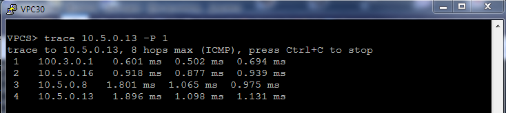
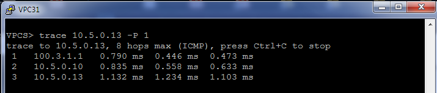
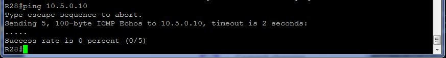
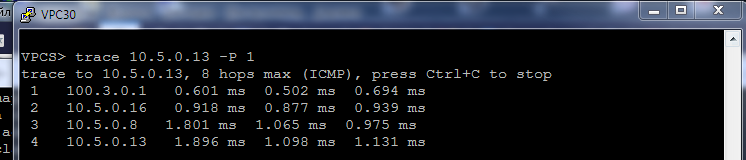
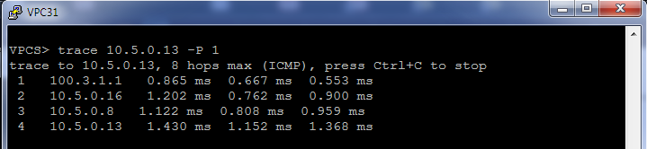
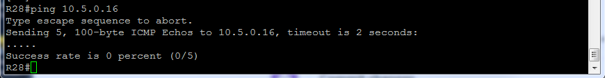
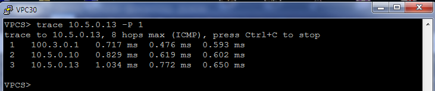
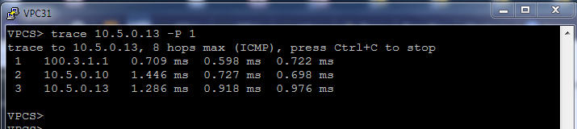
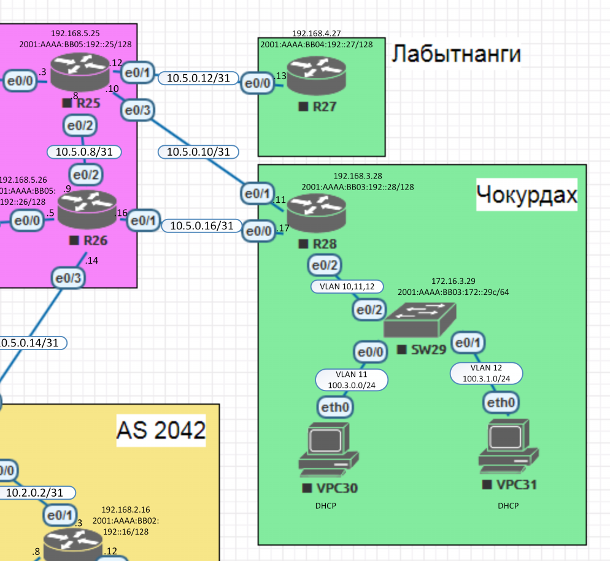

##  **Маршрутизация на основе политик (PBR)**

### Цель:
Цель данной работы: настроить политику маршрутизации в офисе Чокурдах, распределение трафика между 2 линками.
    

### Шаги выполнения:
1. [Документирование адресного пространства для лабораторного стенда.](README.md#I-&#1076;&#1086;&#1082;&#1091;&#1084;&#1077;&#1085;&#1090;&#1080;&#1088;&#1086;&#1074;&#1072;&#1085;&#1080;&#1077;&#45;&#1072;&#1076;&#1088;&#1077;&#1089;&#1085;&#1086;&#1075;&#1086;&#45;&#1087;&#1088;&#1086;&#1089;&#1090;&#1088;&#1072;&#1085;&#1089;&#1090;&#1074;&#1072;&#45;&#1076;&#1083;&#1103;&#45;&#1083;&#1072;&#1073;&#1086;&#1088;&#1072;&#1090;&#1086;&#1088;&#1085;&#1086;&#1075;&#1086;&#45;&#1089;&#1090;&#1077;&#1085;&#1076;&#1072;)

    a. [Таблица выделенных подсетей.](README.md#a-&#1090;&#1072;&#1073;&#1083;&#1080;&#1094;&#1072;&#45;&#1074;&#1099;&#1076;&#1077;&#1083;&#1077;&#1085;&#1085;&#1099;&#1093;&#45;&#1087;&#1086;&#1076;&#1089;&#1077;&#1090;&#1077;&#1081;)
    
    b. [Таблица IP адресов.](README.md#b-&#1090;&#1072;&#1073;&#1083;&#1080;&#1094;&#1072;&#45;&#105;&#112;&#45;&#1072;&#1076;&#1088;&#1077;&#1089;&#1086;&#1074;)
    
2. [Настройка сетевого оборудования.](README.md#II-&#1085;&#1072;&#1089;&#1090;&#1088;&#1086;&#1081;&#1082;&#1072;&#45;&#1089;&#1077;&#1090;&#1077;&#1074;&#1086;&#1075;&#1086;&#45;&#1086;&#1073;&#1086;&#1088;&#1091;&#1076;&#1086;&#1074;&#1072;&#1085;&#1080;&#1103;)

    a. [Настройка маршрута по умолчанию для офиса Лабытнанги.](README.md#a-&#1085;&#1072;&#1089;&#1090;&#1088;&#1086;&#1081;&#1082;&#1072;&#45;&#1084;&#1072;&#1088;&#1096;&#1088;&#1091;&#1090;&#1072;&#45;&#1087;&#1086;&#45;&#1091;&#1084;&#1086;&#1083;&#1095;&#1072;&#1085;&#1080;&#1102;&#45;&#1076;&#1083;&#1103;&#45;&#1086;&#1092;&#1080;&#1089;&#1072;&#45;&#1083;&#1072;&#1073;&#1099;&#1090;&#1085;&#1072;&#1085;&#1075;&#1080;)
    
    b. [Настройка маршрута по умолчанию для сетей офиса Чокурдах на роутерах Триады.](README.md#b-&#1085;&#1072;&#1089;&#1090;&#1088;&#1086;&#1081;&#1082;&#1072;&#45;&#1084;&#1072;&#1088;&#1096;&#1088;&#1091;&#1090;&#1072;&#45;&#1087;&#1086;&#45;&#1091;&#1084;&#1086;&#1083;&#1095;&#1072;&#1085;&#1080;&#1102;&#45;&#1076;&#1083;&#1103;&#45;&#1089;&#1077;&#1090;&#1077;&#1081;&#45;&#1086;&#1092;&#1080;&#1089;&#1072;&#45;&#1095;&#1086;&#1082;&#1091;&#1088;&#1076;&#1072;&#1093;&#45;&#1085;&#1072;&#45;&#1088;&#1086;&#1091;&#1090;&#1077;&#1088;&#1072;&#1093;&#45;&#1090;&#1088;&#1080;&#1072;&#1076;&#1099;)
    
    c. [Распределение трафика между двумя линками с провайдером.](README.md#c-&#1088;&#1072;&#1089;&#1087;&#1088;&#1077;&#1076;&#1077;&#1083;&#1077;&#1085;&#1080;&#1077;&#45;&#1090;&#1088;&#1072;&#1092;&#1080;&#1082;&#1072;&#45;&#1084;&#1077;&#1078;&#1076;&#1091;&#45;&#1076;&#1074;&#1091;&#1084;&#1103;&#45;&#1083;&#1080;&#1085;&#1082;&#1072;&#1084;&#1080;&#45;&#1089;&#45;&#1087;&#1088;&#1086;&#1074;&#1072;&#1081;&#1076;&#1077;&#1088;&#1086;&#1084;)
    
    d. [Настройка отслеживания линка через технологию IP SLA.](README.md#c-&#1085;&#1072;&#1089;&#1090;&#1088;&#1086;&#1081;&#1082;&#1072;&#45;&#1086;&#1090;&#1089;&#1083;&#1077;&#1078;&#1080;&#1074;&#1072;&#1085;&#1080;&#1103;&#45;&#1083;&#1080;&#1085;&#1082;&#1072;&#45;&#1095;&#1077;&#1088;&#1077;&#1079;&#45;&#1090;&#1077;&#1093;&#1085;&#1086;&#1083;&#1086;&#1075;&#1080;&#1102;&#45;&#105;&#112;&#45;&#115;&#108;&#97;)
    
3. [Проверка работоспособности системы.](README.md#III-&#1087;&#1088;&#1086;&#1074;&#1077;&#1088;&#1082;&#1072;&#45;&#1088;&#1072;&#1073;&#1086;&#1090;&#1086;&#1089;&#1087;&#1086;&#1089;&#1086;&#1073;&#1085;&#1086;&#1089;&#1090;&#1080;&#45;&#1089;&#1080;&#1089;&#1090;&#1077;&#1084;&#1099;)

4. [Итоговая схема.](README.md#IV-&#1080;&#1090;&#1086;&#1075;&#1086;&#1074;&#1072;&#1103;&#45;&#1089;&#1093;&#1077;&#1084;&#1072;)

### Ход выполнения:
    Для выполнения лабораторной работы использовался эмулятор EVE-NG, терминальный клиент PuTTY..

#### **_I. Документирование адресного пространства для лабораторного стенда._**

   *_Используемые сети:_*

10.0.0.0/8 - используется для линков Point-to-Point.

192.168.0.0/16 - используется для Loopback's.

172.16.0.0/16 - управление коммутаторами.

100.0.0.0/8 - пользовательские сети.

2001:AAAA::/48 - сеть выделенная провайдером. На площадке используются сети с префиксом /64. Для адреса в последнем хекстете будет использоваться, если это возможно, цифра из названия устройства.

FE80::/10 - сеть для адресов link-local. Для адреса в последнем хекстете будет использоваться, если это возможно, цифра из названия устройства и номер порта.
    
#### a. Таблица выделенных подсетей.
    Таблица 1.
    |----------------|-------|-------------------|-----------------|---------------------------|------------------------|--------------------------|
    |  Расположение  |  AS   |      IPv4 сеть    |Родительская сеть|        IPv6 сеть          |  Родительская сеть     |      Описание            |
    |----------------|-------|-------------------|-----------------|---------------------------|------------------------|--------------------------|
    | Триада         | 520   | 10.5.0.0/31       |  10.5.0.0/23    | 2001:AAAA:BB05:100::/64   | 2001:AAAA:BB05::/48    | R23e0/2 - R24e0/2        |
    |                | 520   | 10.5.0.2/31       |  10.5.0.0/23    | 2001:AAAA:BB05:102::/64   | 2001:AAAA:BB05::/48    | R23e0/1 - R25e0/0        |
    |                | 520   | 10.5.0.4/31       |  10.5.0.0/23    | 2001:AAAA:BB05:104::/64   | 2001:AAAA:BB05::/48    | R24e0/1 - R26e0/0        |
    |                | 520   | 10.5.0.6/31       |  10.5.0.0/23    | 2001:AAAA:BB05:106::/64   | 2001:AAAA:BB05::/48    | R24e0/3 - R18e0/2        |
    |                | 520   | 10.5.0.8/31       |  10.5.0.0/23    | 2001:AAAA:BB05:108::/64   | 2001:AAAA:BB05::/48    | R25e0/2 - R26e0/2        |
    |                | 520   | 10.5.0.10/31      |  10.5.0.0/23    | 2001:AAAA:BB05:110::/64   | 2001:AAAA:BB05::/48    | R25e0/3 - R28e0/1        |
    |                | 520   | 10.5.0.12/31      |  10.5.0.0/23    | 2001:AAAA:BB05:112::/64   | 2001:AAAA:BB05::/48    | R25e0/1 - R27e0/0        |
    |                | 520   | 10.5.0.14/31      |  10.5.0.0/23    | 2001:AAAA:BB05:114::/64   | 2001:AAAA:BB05::/48    | R26e0/3 - R18e0/3        |
    |                | 520   | 10.5.0.16/31      |  10.5.0.0/23    | 2001:AAAA:BB05:116::/64   | 2001:AAAA:BB05::/48    | R26e0/1 - R28e0/0        |
    |                | 520   | 192.168.5.0/24    |                 | 2001:AAAA:BB05:192::/64   | 2001:AAAA:BB05::/48    | Loopback's               |
    | Чокурдах       |       | 192.168.3.0/24    |                 | 2001:AAAA:BB03:192::/64   | 2001:AAAA:BB03::/48    | Loopback's               |
    |                |       | 172.16.3.0/24     |                 | 2001:AAAA:BB03:172::/64   | 2001:AAAA:BB03::/48    | Коммтаторы Vlan10        |
    |                |       | 100.3.0.0/24      |  100.3.0.0/21   | 2001:AAAA:BB03:1021::/64  | 2001:AAAA:BB03::/48    | Пользователи Vlan11      |
    |                |       | 100.3.1.0/24      |  100.3.0.0/21   | 2001:AAAA:BB03:1022::/64  | 2001:AAAA:BB03::/48    | Пользователи Vlan12      |
    | Лабытнанги     |       | 192.168.4.0/24    |                 | 2001:AAAA:BB04:192::/64   | 2001:AAAA:BB04::/48    | Loopback's               |
    |----------------|-------|-------------------|-----------------|---------------------------|------------------------|--------------------------|

#### b. Таблица IP адресов.
    Таблица 2.
    |--------------|------------|------------|----------------|-----------------|-------------------------------|---------------------------|----------------------|
    | Расположение | Устройство |  Порт      |   IPv4 адрес   | Родит. сеть     |          IPv6 адрес           |  Родительская сеть        |      Описание        |
    |--------------|------------|------------|----------------|-----------------|-------------------------------|---------------------------|----------------------|
    | Триада       | R26        | Lo0        | 192.168.5.26   | 192.168.5.0/32  | 2001:AAAA:BB05:192::26/128    | 2001:AAAA:BB05:192::/64   | Loopback R26         |
    |              |            | e0/0       | 10.5.0.5       | 10.5.0.4/31     | 2001:AAAA:BB05:104::5:E0/64   | 2001:AAAA:BB05:104::/64   |                      |
    |              |            |            |                |                 | FE80::26:E0                   | FE80::/10                 |                      |
    |              |            | e0/3       | 10.5.0.14      | 10.5.0.14/31    | 2001:AAAA:BB05:114::14:E3/64  | 2001:AAAA:BB05:114::/64   |                      |
    |              |            |            |                |                 | FE80::26:E3                   | FE80::/10                 |                      |
    |              |            | e0/1       | 10.5.0.16      | 10.5.0.16/31    | 2001:AAAA:BB05:116::16:E1/64  | 2001:AAAA:BB05:116::/64   |                      |
    |              |            |            |                |                 | FE80::26:E1                   | FE80::/10                 |                      |
    |              |            | e0/2       | 10.5.0.9       | 10.5.0.8/31     | 2001:AAAA:BB05:108::9:E2/64   | 2001:AAAA:BB05:108::/64   |                      |
    |              |            |            |                |                 | FE80::26:E2                   | FE80::/10                 |                      |
    |              |------------|------------|----------------|-----------------|-------------------------------|---------------------------|----------------------|
    |              | R25        | Lo0        | 192.168.5.25   | 192.168.5.0/32  | 2001:AAAA:BB05:192::25/128    | 2001:AAAA:BB05:192::/64   | Loopback R25         |
    |              |            | e0/0       | 10.5.0.3       | 10.5.0.2/31     | 2001:AAAA:BB05:102::3:E0/64   | 2001:AAAA:BB05:102::/64   |                      |
    |              |            |            |                |                 | FE80::25:E0                   | FE80::/10                 |                      |
    |              |            | e0/2       | 10.5.0.8       | 10.5.0.8/31     | 2001:AAAA:BB05:108::8:E2/64   | 2001:AAAA:BB05:108::/64   |                      |
    |              |            |            |                |                 | FE80::25:E2                   | FE80::/10                 |                      |
    |              |            | e0/3       | 10.5.0.10      | 10.5.0.10/31    | 2001:AAAA:BB05:110::10:E3/64  | 2001:AAAA:BB05:110::/64   |                      |
    |              |            |            |                |                 | FE80::25:E3                   | FE80::/10                 |                      |
    |              |            | e0/1       | 10.5.0.12      | 10.5.0.12/31    | 2001:AAAA:BB05:112::12:E1/64  | 2001:AAAA:BB05:112::/64   |                      |
    |              |            |            |                |                 | FE80::25:E1                   | FE80::/10                 |                      |
    |--------------|------------|------------|----------------|-----------------|-------------------------------|---------------------------|----------------------|
    | Чокурдах     | R28        | Lo0        | 192.168.3.28   | 192.168.3.0/32  | 2001:AAAA:BB03:192::28/128    | 2001:AAAA:BB03:192::/64   | Loopback R28         |
    |              |            | e0/0       | 10.5.0.17      | 10.5.0.16/31    | 2001:AAAA:BB05:116::17:E0/64  | 2001:AAAA:BB05:116::/64   |                      |
    |              |            |            |                |                 | FE80::28:E0                   | FE80::/10                 |                      |
    |              |            | e0/1       | 10.5.0.11      | 10.5.0.10/31    | 2001:AAAA:BB05:110::11:E1/64  | 2001:AAAA:BB05:110::/64   |                      |
    |              |            |            |                |                 | FE80::28:E1                   | FE80::/10                 |                      |
    |              |            | e0/2       | N/A            | N/A             | N/A                           |                           |                      |
    |              |            | e0/2.10    | 172.16.3.1     | 172.16.3.0/24   | 2001:AAAA:BB03:172::1/64      | 2001:AAAA:BB03:172::/64   | Коммутаторы Vlan10   |
    |              |            |            |                |                 | FE80::28:E210                 | FE80::/10                 |                      |
    |              |            | e0/2.11    | 100.3.0.1      | 100.3.0.0/24    | 2001:AAAA:BB03:1011::1/64     | 2001:AAAA:BB03:1011::/64  | Пользователи Vlan11  |
    |              |            |            |                |                 | FE80::28:E211                 | FE80::/10                 |                      |
    |              |            | e0/2.12    | 100.3.1.1      | 100.3.1.0/24    | 2001:AAAA:BB03:1012::1/64     | 2001:AAAA:BB03:1012::/64  | Пользователи Vlan12  |
    |              |            |            |                |                 | FE80::28:E212                 | FE80::/10                 |                      |
    |              |------------|------------|----------------|-----------------|-------------------------------|---------------------------|----------------------|
    |              | SW29       | Int Vlan10 | 172.16.3.29    | 172.16.3.0/24   | 2001:AAAA:BB03:172::29с/64    | 2001:AAAA:BB03:172::/64   |                      |
    |              |            |            |                |                 | FE80::с29:10                  | FE80::/10                 |                      |
    |              |------------|------------|----------------|-----------------|-------------------------------|---------------------------|----------------------|
    |              | VPC30      |            | DHCP           | 100.3.0.0/24    | autoconfig                    | 2001:AAAA:BB03:1011::/64  |                      |
    |              | VPC31      |            | DHCP           | 100.3.1.0/24    | autoconfig                    | 2001:AAAA:BB03:1012::/64  |                      |
    |--------------|------------|------------|----------------|-----------------|-------------------------------|---------------------------|----------------------|
    | Лабытнанги   | R27        | Lo0        | 192.168.4.27   | 192.168.4.0/32  | 2001:AAAA:BB04:192::27/128    | 2001:AAAA:BB04:192::/64   | Loopback R27         |
    |              |            | e0/0       | 10.5.0.13      | 10.5.0.12/31    | 2001:AAAA:BB05:112::13:E0/64  | 2001:AAAA:BB05:112::/64   |                      |
    |              |            |            |                |                 | FE80::27:E0                   | FE80::/10                 |                      |
    |--------------|------------|------------|----------------|-----------------|-------------------------------|---------------------------|----------------------|

#### **_II. Настройка сетевого оборудования._**

#### a. Настройка маршрута по умолчанию для офиса Лабытнанги.
В данном разделе показано как настроить маршрут по умолчанию. Файл с настройкой маршрута по умолчанию находится в папке [configs](configs/) в файле **R27_int.txt**.

---------------------------------------------------------------
    conf terminal
    !
     ip route 0.0.0.0 0.0.0.0 10.5.0.12 name R25_e_0_1
     ipv6 route ::/0 2001:AAAA:BB05:112::12:E1 name R25_e_0_1
    !
---------------------------------------------------------------

#### b. Настройка маршрута по умолчанию для сетей офиса Чокурдах на роутерах Триады.
Выбрала для проверки направления трасс маршрутов маршрутизатор R27 в Лабытнангах. Для того, чтобы проверить трассировку до данного маршрутизатора необходимо на роутерах R25 b R26 прописать статические маршруты. Файлы с настройками на устройствах находятся в папке [configs](configs/) в файлах **--_int.txt**. Первые символы в названии файлов соответствуют именам сетевых устройств.

---------------------------------------------------------------
    На маршрутизаторе R25
    
    conf terminal
    !
     ip route 100.3.0.0 255.255.254.0 10.5.0.11 name To_Net_Chokurdah
     ip route 100.3.0.0 255.255.254.0 10.5.0.9 150
    !
    
    На маршрутизаторе R26
    
    conf terminal
    !
     ip route 10.5.0.12 255.255.255.254 10.5.0.8 name To_Labytnangi
     ip route 100.3.0.0 255.255.254.0 10.5.0.17 name To_Chokurdah
    !

---------------------------------------------------------------

Проверить связность линков можно пропинговав устройство по ipv4 адресу, ipv6 адресу и по ipv6 link-local адресу (рис 1).

Рисунок 1.

#### c. Распределение трафика между двумя линками с провайдером.

Для увеличения доступности маршрутизаторов R12 и R13, которые выполняют роль шлюза по умолчанию, настроила протокол VRRP. Данный протокол позволяет безшовно перенаправлять трафик в случае выхода из строя одного из маршрутизаторов или обрыва линков. Включить протокол VRRP можно в режиме конфигурации с помощью команды **_fhrp version vrrp v3_**. Пример настройки протокола VRRP на интерфейсах см.ниже. Настройки протокола VRRP находятся в папке [configs](configs/) в файлах **R12_int.txt** и **R13_int.txt**.

---------------------------------------------------------------

    !
   
    !

---------------------------------------------------------------

#### d. Настройка отслеживания линка через технологию IP SLA.

На данном этапе лабораторной работы настроила коммутаторы. Настройка заключается в следующем:

    a. Разрешила использование IPм6 командой ipv6 unicast-routing.
    b. Создала VLANs.
    c. На интерфейсе влана управления добавила IPv4 и IPv6 адреса.
    d. Настроила порты uplink в trunk.
    e. Настроила порты в сторону пользователей как access с необходимым VLAN.

Конфигурация коммутаторов находится в файлах **"--_int.txt"_**, которые находятся в папке [configs](configs/). Первые символы в названии файлов соответствуют именам сетевых устройств.

#### **_III. Проверка работоспособности системы._**

На персональных компьютерах адресация IPv4 раздается DHCP-сервером. DHCP-сервер поднят на роутере R28, Конфигурация находится в файле **_"R28_int.txt"_**, который расположен в папке [configs](configs/).

Для проверки прохождения трафика, как конечный хост, использую ip-адрес роутера R27 - 10.5.0.13. С помощью команды **_trace 10.5.0.13 -P 1_** проверила трассировку до R27 c компьютеров VPC30 (рис.2) и VPC31 (рис.3). 

Рисунок 2.

Рисунок 3.

Как видно из вышеприведенных рисунков, трафик до R27 разделился на два маршрута.

Теперь проверю будет ли доходить трафик, если будет недоступен интерфейс e0/3 на роутере R25 ip адрес которого 10.5.0.10. Для доставерности запустила команду ping 10.5.0.10 на роутере R28. Убедилась, что интерфейс не доступен.

Далее повторила команду **_trace 10.5.0.13 -P 1_** и проверила трассировку до R27 c компьютеров VPC30 (рис.4) и VPC31 (рис.5). 

Рисунок 4.

Рисунок 5.

Вижу, что весь трафик пошел через интерфейс e0/1 маршрутизатора R26. Отслеживание линка через технологию IP SLA работает.

Аналогичные действия провожу с интерфейсом e0/1 на маршрутизаторе R26, убедилась, что интерфейс не доступен.

Запустила трассировку с компьютеров VPC30 (рис.6) и VPC31 (рис.7).

Рисунок 6.

Рисунок 7.

Наблюдаем, что весь трафик пошел через интерфейс e0/3 маршрутизатора R25. 

**Из вышеприведенных примеров вижу, что отслеживание линка через технологию IP SLA работает!**

Адресация IPv6 устанавливается на ПК способом автоматической настройки адреса без отслеживания состояния SLAAC, который позволяет устройству получить свой префикс, длину префикса и адрес шлюза по умолчанию от маршрутизатора IPv6 без помощи DHCPv6-сервера. Пример полученного с помощью SLAAC IPv6 адреса показан на рис.3.

#### **_IV. Итоговая схема._**

На рис.5 размещены используемые сети, IPv4 и IPv6 адреса маршлутизаторов, коммутаторов и персональных компьютеров а так же испльзуемые VLAN.

Рисунок 5.

