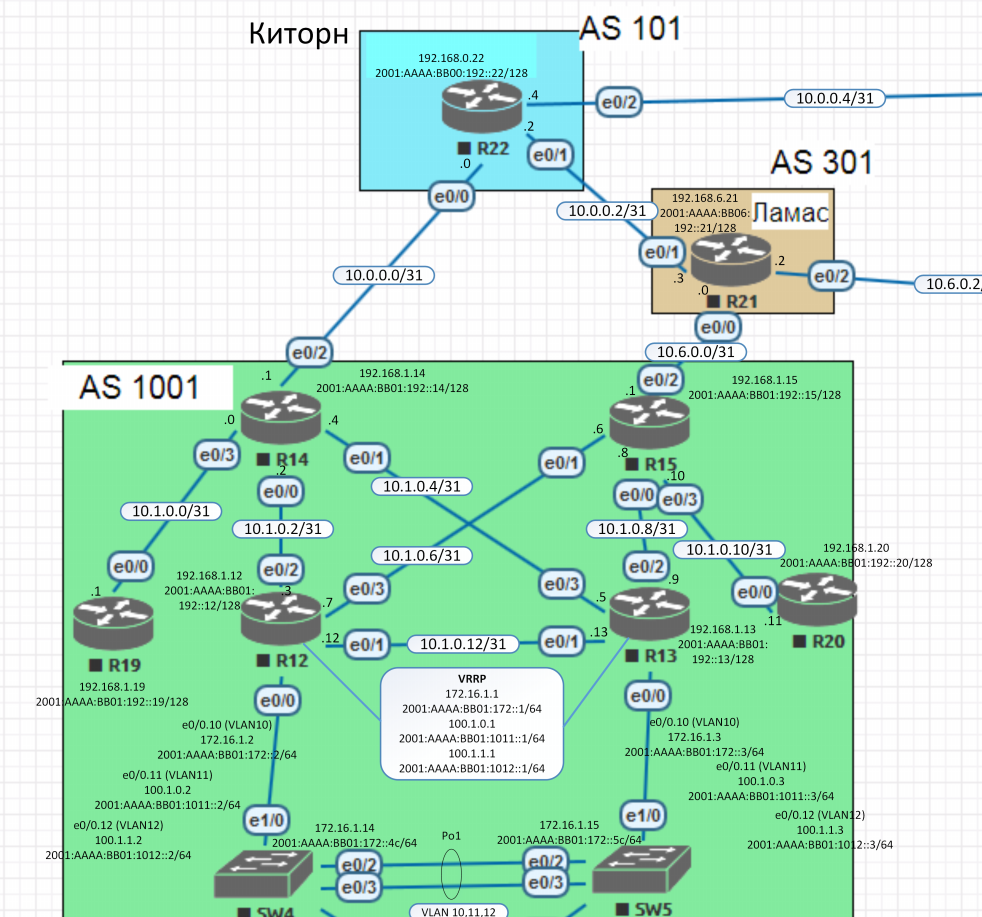

##  **OSPF. Фильтрация.**

### Цель:
Цель данной работы: настроить OSPF офисе Москва, разделить сеть на зоны, настроить фильтрацию между зонами.
    
### Условия:

1. Маршрутизаторы R14-R15 находятся в зоне 0 - backbone
2. Маршрутизаторы R12-R13 находятся в зоне 10. Дополнительно к маршрутам должны получать маршрут по-умолчанию
3. Маршрутизатор R19 находится в зоне 101 и получает только маршрут по умолчанию
4. Маршрутизатор R20 находится в зоне 102 и получает все маршруты, кроме маршрутов до сетей зоны 101
5. Настройка для IPv6 повторяет логику IPv4
6. План работы и изменения зафиксированы в документации

### Шаги выполнения:
1. [Документирование адресного пространства для лабораторного стенда.](README.md#I-&#1076;&#1086;&#1082;&#1091;&#1084;&#1077;&#1085;&#1090;&#1080;&#1088;&#1086;&#1074;&#1072;&#1085;&#1080;&#1077;&#45;&#1072;&#1076;&#1088;&#1077;&#1089;&#1085;&#1086;&#1075;&#1086;&#45;&#1087;&#1088;&#1086;&#1089;&#1090;&#1088;&#1072;&#1085;&#1089;&#1090;&#1074;&#1072;&#45;&#1076;&#1083;&#1103;&#45;&#1083;&#1072;&#1073;&#1086;&#1088;&#1072;&#1090;&#1086;&#1088;&#1085;&#1086;&#1075;&#1086;&#45;&#1089;&#1090;&#1077;&#1085;&#1076;&#1072;)

    a. [Таблица выделенных подсетей.](README.md#a-&#1090;&#1072;&#1073;&#1083;&#1080;&#1094;&#1072;&#45;&#1074;&#1099;&#1076;&#1077;&#1083;&#1077;&#1085;&#1085;&#1099;&#1093;&#45;&#1087;&#1086;&#1076;&#1089;&#1077;&#1090;&#1077;&#1081;)
    
    b. [Таблица IP адресов.](README.md#b-&#1090;&#1072;&#1073;&#1083;&#1080;&#1094;&#1072;&#45;&#105;&#112;&#45;&#1072;&#1076;&#1088;&#1077;&#1089;&#1086;&#1074;)
    
2. [Настройка сетевого оборудования.](README.md#II-&#1085;&#1072;&#1089;&#1090;&#1088;&#1086;&#1081;&#1082;&#1072;&#45;&#1089;&#1077;&#1090;&#1077;&#1074;&#1086;&#1075;&#1086;&#45;&#1086;&#1073;&#1086;&#1088;&#1091;&#1076;&#1086;&#1074;&#1072;&#1085;&#1080;&#1103;)

    a. [Настройка маршрута по умолчанию для офиса Лабытнанги.](README.md#a-&#1085;&#1072;&#1089;&#1090;&#1088;&#1086;&#1081;&#1082;&#1072;&#45;&#1084;&#1072;&#1088;&#1096;&#1088;&#1091;&#1090;&#1072;&#45;&#1087;&#1086;&#45;&#1091;&#1084;&#1086;&#1083;&#1095;&#1072;&#1085;&#1080;&#1102;&#45;&#1076;&#1083;&#1103;&#45;&#1086;&#1092;&#1080;&#1089;&#1072;&#45;&#1083;&#1072;&#1073;&#1099;&#1090;&#1085;&#1072;&#1085;&#1075;&#1080;)
    
    b. [Настройка маршрута по умолчанию для сетей офиса Чокурдах на роутерах Триады.](README.md#b-&#1085;&#1072;&#1089;&#1090;&#1088;&#1086;&#1081;&#1082;&#1072;&#45;&#1084;&#1072;&#1088;&#1096;&#1088;&#1091;&#1090;&#1072;&#45;&#1087;&#1086;&#45;&#1091;&#1084;&#1086;&#1083;&#1095;&#1072;&#1085;&#1080;&#1102;&#45;&#1076;&#1083;&#1103;&#45;&#1089;&#1077;&#1090;&#1077;&#1081;&#45;&#1086;&#1092;&#1080;&#1089;&#1072;&#45;&#1095;&#1086;&#1082;&#1091;&#1088;&#1076;&#1072;&#1093;&#45;&#1085;&#1072;&#45;&#1088;&#1086;&#1091;&#1090;&#1077;&#1088;&#1072;&#1093;&#45;&#1090;&#1088;&#1080;&#1072;&#1076;&#1099;)
    
    c. [Распределение трафика между двумя линками с провайдером.](README.md#c-&#1088;&#1072;&#1089;&#1087;&#1088;&#1077;&#1076;&#1077;&#1083;&#1077;&#1085;&#1080;&#1077;&#45;&#1090;&#1088;&#1072;&#1092;&#1080;&#1082;&#1072;&#45;&#1084;&#1077;&#1078;&#1076;&#1091;&#45;&#1076;&#1074;&#1091;&#1084;&#1103;&#45;&#1083;&#1080;&#1085;&#1082;&#1072;&#1084;&#1080;&#45;&#1089;&#45;&#1087;&#1088;&#1086;&#1074;&#1072;&#1081;&#1076;&#1077;&#1088;&#1086;&#1084;)
    
    d. [Настройка отслеживания линка через технологию IP SLA.](README.md#c-&#1085;&#1072;&#1089;&#1090;&#1088;&#1086;&#1081;&#1082;&#1072;&#45;&#1086;&#1090;&#1089;&#1083;&#1077;&#1078;&#1080;&#1074;&#1072;&#1085;&#1080;&#1103;&#45;&#1083;&#1080;&#1085;&#1082;&#1072;&#45;&#1095;&#1077;&#1088;&#1077;&#1079;&#45;&#1090;&#1077;&#1093;&#1085;&#1086;&#1083;&#1086;&#1075;&#1080;&#1102;&#45;&#105;&#112;&#45;&#115;&#108;&#97;)
    
3. [Проверка работоспособности системы.](README.md#III-&#1087;&#1088;&#1086;&#1074;&#1077;&#1088;&#1082;&#1072;&#45;&#1088;&#1072;&#1073;&#1086;&#1090;&#1086;&#1089;&#1087;&#1086;&#1089;&#1086;&#1073;&#1085;&#1086;&#1089;&#1090;&#1080;&#45;&#1089;&#1080;&#1089;&#1090;&#1077;&#1084;&#1099;)

4. [Итоговая схема.](README.md#IV-&#1080;&#1090;&#1086;&#1075;&#1086;&#1074;&#1072;&#1103;&#45;&#1089;&#1093;&#1077;&#1084;&#1072;)

### Ход выполнения:
    Для выполнения лабораторной работы использовался эмулятор EVE-NG, терминальный клиент PuTTY..

#### **_I. Документирование адресного пространства для лабораторного стенда._**

   *_Используемые сети:_*

10.0.0.0/8 - используется для линков Point-to-Point.

192.168.0.0/16 - используется для Loopback's.

172.16.0.0/16 - управление коммутаторами.

100.0.0.0/8 - пользовательские сети.

2001:AAAA::/48 - сеть выделенная провайдером. На площадке используются сети с префиксом /64. Для адреса в последнем хекстете будет использоваться, если это возможно, цифра из названия устройства.

FE80::/10 - сеть для адресов link-local. Для адреса в последнем хекстете будет использоваться, если это возможно, цифра из названия устройства и номер порта.
    
#### a. Таблица выделенных подсетей.

    Таблица 1.
    |----------------|-------|-------------------|-----------------|---------------------------|------------------------|--------------------------|
    |  Расположение  |  AS   |      IPv4 сеть    |Родительская сеть|        IPv6 сеть          |  Родительская сеть     |      Описание            |
    |----------------|-------|-------------------|-----------------|---------------------------|------------------------|--------------------------|
    | Киторн         | 101   | 10.0.0.0/31       |  10.0.0.0/23    | 2001:AAAA:BB00:100::/64   | 2001:AAAA:BB00::/48    | R22e0/0 - R14e0/2        |
    |                | 101   | 10.0.0.2/31       |  10.0.0.0/23    | 2001:AAAA:BB00:102::/64   | 2001:AAAA:BB00::/48    | R22e0/1 - R21e0/1        |
    |                | 101   | 10.0.0.4/31       |  10.0.0.0/23    | 2001:AAAA:BB00:104::/64   | 2001:AAAA:BB00::/48    | R22e0/2 - R23e0/0        |
    |                | 101   | 192.168.0.0/24    |                 | 2001:AAAA:BB00:192::/64   | 2001:AAAA:BB00::/48    | Loopback's               |
    |----------------|-------|-------------------|-----------------|---------------------------|------------------------|--------------------------|
    | Ламас          | 302   | 10.6.0.0/31       |  10.6.0.0/23    | 2001:AAAA:BB06:100::/64   | 2001:AAAA:BB06::/48    | R21e0/0 - R15e0/2        |
    |                | 302   | 10.6.0.2/31       |  10.6.0.0/23    | 2001:AAAA:BB06:102::/64   | 2001:AAAA:BB06::/48    | R21e0/2 - R24e0/0        |
    |                | 302   | 192.168.6.0/24    |                 | 2001:AAAA:BB06:192::/64   | 2001:AAAA:BB06::/48    | Loopback's               |
    |----------------|-------|-------------------|-----------------|---------------------------|------------------------|--------------------------|
    | Москва         | 1001  | 10.1.0.0/31       |  10.1.0.0/23    | 2001:AAAA:BB01:100::/64   | 2001:AAAA:BB01::/48    | R14e0/3 - R19e0/0        |
    |                | 1001  | 10.1.0.2/31       |  10.1.0.0/23    | 2001:AAAA:BB01:102::/64   | 2001:AAAA:BB01::/48    | R14e0/0 - R12e0/2        |
    |                | 1001  | 10.1.0.4/31       |  10.1.0.0/23    | 2001:AAAA:BB01:104::/64   | 2001:AAAA:BB01::/48    | R14e0/1 - R13e0/3        |
    |                | 1001  | 10.1.0.6/31       |  10.1.0.0/23    | 2001:AAAA:BB01:106::/64   | 2001:AAAA:BB01::/48    | R15e0/1 - R12e0/3        |
    |                | 1001  | 10.1.0.8/31       |  10.1.0.0/23    | 2001:AAAA:BB01:108::/64   | 2001:AAAA:BB01::/48    | R15e0/0 - R13e0/2        |
    |                | 1001  | 10.1.0.10/31      |  10.1.0.0/23    | 2001:AAAA:BB01:110::/64   | 2001:AAAA:BB01::/48    | R15e0/3 - R20e0/0        |
    |                | 1001  | 10.1.0.12/31      |  10.1.0.0/23    | 2001:AAAA:BB01:112::/64   | 2001:AAAA:BB01::/48    | R12e0/1 - R13e0/1        |
    |                | 1001  | 192.168.1.0/24    |                 | 2001:AAAA:BB01:192::/64   | 2001:AAAA:BB01::/48    | Loopback's               |
    |                | 1001  | 172.16.1.0/24     |                 | 2001:AAAA:BB01:172::/64   | 2001:AAAA:BB01::/48    | Коммтаторы Vlan10        |
    |                | 1001  | 100.1.0.0/24      |  100.1.0.0/21   | 2001:AAAA:BB01:1001::/64  | 2001:AAAA:BB01::/48    | Пользователи Vlan11      |
    |                | 1001  | 100.1.1.0/24      |  100.1.0.0/21   | 2001:AAAA:BB01:1002::/64  | 2001:AAAA:BB01::/48    | Пользователи Vlan12      |
    |----------------|-------|-------------------|-----------------|---------------------------|------------------------|--------------------------|
    

#### b. Таблица IP адресов.

    Таблица 2.
    |--------------|------------|------------|----------------|-----------------|-------------------------------|---------------------------|----------------------|
    | Расположение | Устройство |  Порт      |   IPv4 адрес   | Родит. сеть     |          IPv6 адрес           |  Родительская сеть        |      Описание        |
    |--------------|------------|------------|----------------|-----------------|-------------------------------|---------------------------|----------------------|
    | Киторн       | R22        | Lo0        | 192.168.0.22   | 192.168.0.0/32  | 2001:AAAA:BB00:192::22/128    | 2001:AAAA:BB00:192::/64   | Loopback R22         |
    |              |            | e0/0       | 10.0.0.0       | 10.0.0.0/31     | 2001:AAAA:BB00:100::E0/64     | 2001:AAAA:BB00:100::/64   |                      |
    |              |            |            |                |                 | FE80::22:E0                   | FE80::/10                 |                      |
    |              |            | e0/1       | 10.0.0.2       | 10.0.0.2/31     | 2001:AAAA:BB00:102::2:E1/64   | 2001:AAAA:BB00:102::/64   |                      |
    |              |            |            |                |                 | FE80::22:E1                   | FE80::/10                 |                      |
    |              |            | e0/2       | 10.0.0.4       | 10.0.0.4/31     | 2001:AAAA:BB00:104::4:E2/64   | 2001:AAAA:BB00:104::/64   |                      |
    |              |            |            |                |                 | FE80::22:E2                   | FE80::/10                 |                      |
    |--------------|------------|------------|----------------|-----------------|-------------------------------|---------------------------|----------------------|
    | Ламас        | R21        | Lo0        | 192.168.6.21   | 192.168.6.0/32  | 2001:AAAA:BB06:192::21/128    | 2001:AAAA:BB06:192::/64   | Loopback R21         |
    |              |            | e0/1       | 10.0.0.3       | 10.0.0.2/31     | 2001:AAAA:BB00:102::3:E1/64   | 2001:AAAA:BB00:102::/64   |                      |
    |              |            |            |                |                 | FE80::21:E1                   | FE80::/10                 |                      |
    |              |            | e0/0       | 10.6.0.0       | 10.6.0.0/31     | 2001:AAAA:BB06:100::E0/64     | 2001:AAAA:BB06:100::/64   |                      |
    |              |            |            |                |                 | FE80::21:E0                   | FE80::/10                 |                      |
    |              |            | e0/2       | 10.6.0.2       | 10.6.0.2/31     | 2001:AAAA:BB06:102::2:E2/64   | 2001:AAAA:BB06:102::/64   |                      |
    |              |            |            |                |                 | FE80::21:E2                   | FE80::/10                 |                      |
    |--------------|------------|------------|----------------|-----------------|-------------------------------|---------------------------|----------------------|
    | Москва       | R14        | Lo0        | 192.168.1.14   | 192.168.1.0/32  | 2001:AAAA:BB01:192::14/128    | 2001:AAAA:BB01:192::/64   | Loopback R14         |
    |              |            | e0/2       | 10.0.0.1       | 10.0.0.0/31     | 2001:AAAA:BB00:100::1:E2/64   | 2001:AAAA:BB00:100::/64   |                      |
    |              |            |            |                |                 | FE80::14:E2                   | FE80::/10                 |                      |
    |              |            | e0/3       | 10.1.0.0       | 10.1.0.0/31     | 2001:AAAA:BB01:100::E3/64     | 2001:AAAA:BB01:100::/64   |                      |
    |              |            |            |                |                 | FE80::14:E3                   | FE80::/10                 |                      |
    |              |            | e0/0       | 10.1.0.2       | 10.1.0.2/31     | 2001:AAAA:BB01:102::2:E0/64   | 2001:AAAA:BB01:102::/64   |                      |
    |              |            |            |                |                 | FE80::14:E0                   | FE80::/10                 |                      |
    |              |            | e0/1       | 10.1.0.4       | 10.1.0.4/31     | 2001:AAAA:BB01:104::4:E1/64   | 2001:AAAA:BB01:104::/64   |                      |
    |              |            |            |                |                 | FE80::14:E1                   | FE80::/10                 |                      |
    |              |------------|------------|----------------|-----------------|-------------------------------|---------------------------|----------------------|
    |              | R15        | Lo0        | 192.168.1.15   | 192.168.1.0/32  | 2001:AAAA:BB01:192::15/128    | 2001:AAAA:BB01:192::/64   | Loopback R15         |
    |              |            | e0/2       | 10.6.0.1       | 10.6.0.0/31     | 2001:AAAA:BB06:100::1:E2/64   | 2001:AAAA:BB06:100::/64   |                      |
    |              |            |            |                |                 | FE80::15:E2                   | FE80::/10                 |                      |
    |              |            | e0/1       | 10.1.0.6       | 10.1.0.6/31     | 2001:AAAA:BB01:106::6:E1/64   | 2001:AAAA:BB01:106::/64   |                      |
    |              |            |            |                |                 | FE80::15:E1                   | FE80::/10                 |                      |
    |              |            | e0/0       | 10.1.0.8       | 10.1.0.8/31     | 2001:AAAA:BB01:108::8:E0/64   | 2001:AAAA:BB01:108::/64   |                      |
    |              |            |            |                |                 | FE80::15:E0                   | FE80::/10                 |                      |
    |              |            | e0/3       | 10.1.0.10      | 10.1.0.10/31    | 2001:AAAA:BB01:110::10:E3/64  | 2001:AAAA:BB01:110::/64   |                      |
    |              |            |            |                |                 | FE80::15:E3                   | FE80::/10                 |                      |
    |              |------------|------------|----------------|-----------------|-------------------------------|---------------------------|----------------------|
    |              | R19        | Lo0        | 192.168.1.19   | 192.168.1.0/32  | 2001:AAAA:BB01:192::19/128    | 2001:AAAA:BB01:192::/64   | Loopback R19         |
    |              |            | e0/0       | 10.1.0.1       | 10.1.0.0/31     | 2001:AAAA:BB01:100::1:E0/64   | 2001:AAAA:BB01:100::/64   |                      |
    |              |            |            |                |                 | FE80::19:E0                   | FE80::/10                 |                      |
    |              |------------|------------|----------------|-----------------|-------------------------------|---------------------------|----------------------|
    |              | R12        | Lo0        | 192.168.1.12   | 192.168.1.0/32  | 2001:AAAA:BB01:192::12/128    | 2001:AAAA:BB01:192::/64   | Loopback R12         |
    |              |            | e0/2       | 10.1.0.3       | 10.1.0.2/31     | 2001:AAAA:BB01:102::3:E2/64   | 2001:AAAA:BB01:102::/64   |                      |
    |              |            |            |                |                 | FE80::12:E2                   | FE80::/10                 |                      |
    |              |            | e0/3       | 10.1.0.7       | 10.1.0.6/31     | 2001:AAAA:BB01:106::7:E3/64   | 2001:AAAA:BB01:106::/64   |                      |
    |              |            |            |                |                 | FE80::12:E3                   | FE80::/10                 |                      |
    |              |            | e0/1       | 10.1.0.12      | 10.1.0.12/31    | 2001:AAAA:BB01:112::12:E1/64  | 2001:AAAA:BB01:112::/64   |                      |
    |              |            |            |                |                 | FE80::12:E1                   | FE80::/10                 |                      |
    |              |            | e0/0       | N/A            | N/A             | N/A                           |                           |                      |
    |              |            | e0/0.10    | 172.16.1.2     | 172.16.1.0/24   | 2001:AAAA:BB01:172::2/64      | 2001:AAAA:BB01:172::/64   | Коммутаторы Vlan10   |
    |              |            |            | 172.16.1.1     | 172.16.1.0/24   | 2001:AAAA:BB01:172::1/64      | 2001:AAAA:BB01:172::/64   | Виртуальный IP       |
    |              |            | e0/0.11    | 100.1.0.2      | 100.1.0.0/24    | 2001:AAAA:BB01:1011::2/64     | 2001:AAAA:BB01:1011::/64  | Пользователи Vlan11  |
    |              |            |            | 100.1.0.1      | 100.1.0.0/24    | 2001:AAAA:BB01:1011::1/64     | 2001:AAAA:BB01:1011::/64  | Виртуальный IP       |
    |              |            | e0/0.12    | 100.1.1.2      | 100.1.1.0/24    | 2001:AAAA:BB01:1012::2/64     | 2001:AAAA:BB01:1012::/64  | Пользователи Vlan12  |
    |              |            |            | 100.1.1.1      | 100.1.1.0/24    | 2001:AAAA:BB01:1012::1/64     | 2001:AAAA:BB01:1012::/64  | Виртуальный IP       |
    |              |------------|------------|----------------|-----------------|-------------------------------|---------------------------|----------------------|
    |              | R13        | Lo0        | 192.168.1.13   | 192.168.1.0/32  | 2001:AAAA:BB01:192::13/128    | 2001:AAAA:BB01:192::/64   | Loopback R13         |
    |              |            | e0/1       | 10.1.0.13      | 10.1.0.12/31    | 2001:AAAA:BB01:112::13:E1/64  | 2001:AAAA:BB01:112::/64   |                      |
    |              |            |            |                |                 | FE80::13:E1                   | FE80::/10                 |                      |
    |              |            | e0/3       | 10.1.0.5       | 10.1.0.4/31     | 2001:AAAA:BB01:104::5:E3/64   | 2001:AAAA:BB01:104::/64   |                      |
    |              |            |            |                |                 | FE80::13:E3                   | FE80::/10                 |                      |
    |              |            | e0/2       | 10.1.0.9       | 10.1.0.8/31     | 2001:AAAA:BB01:108::9:E2/64   | 2001:AAAA:BB01:108::/64   |                      |
    |              |            |            |                |                 | FE80::13:E2                   | FE80::/10                 |                      |
    |              |            | e0/0       | N/A            | N/A             | N/A                           |                           |                      |
    |              |            | e0/0.10    | 172.16.1.3     | 172.16.1.0/24   | 2001:AAAA:BB01:172::3/64      | 2001:AAAA:BB01:172::/64   | Коммутаторы Vlan10   |
    |              |            |            | 172.16.1.1     | 172.16.1.0/24   | 2001:AAAA:BB01:172::1/64      | 2001:AAAA:BB01:172::/64   | Виртуальный IP       |
    |              |            | e0/0.11    | 100.1.0.3      | 100.1.0.0/24    | 2001:AAAA:BB01:1011::3/64     | 2001:AAAA:BB01:1011::/64  | Пользователи Vlan11  |
    |              |            |            | 100.1.0.1      | 100.1.0.0/24    | 2001:AAAA:BB01:1011::1/64     | 2001:AAAA:BB01:1011::/64  | Виртуальный IP       |
    |              |            | e0/0.12    | 100.1.1.3      | 100.1.1.0/24    | 2001:AAAA:BB01:1012::3/64     | 2001:AAAA:BB01:1012::/64  | Пользователи Vlan12  |
    |              |            |            | 100.1.1.1      | 100.1.1.0/24    | 2001:AAAA:BB01:1012::1/64     | 2001:AAAA:BB01:1012::/64  | Виртуальный IP       |
    |              |------------|------------|----------------|-----------------|-------------------------------|---------------------------|----------------------|
    |              | R20        | Lo0        | 192.168.1.20   | 192.168.1.0/32  | 2001:AAAA:BB01:192::20/128    | 2001:AAAA:BB01:192::/64   | Loopback R19         |
    |              |            | e0/0       | 10.1.0.11      | 10.1.0.10/31    | 2001:AAAA:BB01:110::11:E0/64  | 2001:AAAA:BB01:110::/64   |                      |
    |              |            |            |                |                 | FE80::20:E0                   | FE80::/10                 |                      |
    |--------------|------------|------------|----------------|-----------------|-------------------------------|---------------------------|----------------------|

#### **_II. Настройка сетевого оборудования._**

#### a. Настройка маршрута по умолчанию для офиса Лабытнанги.
В данном разделе показано как настроить маршрут по умолчанию. Файл с настройкой маршрута по умолчанию находится в папке [configs](configs/) в файле **R27_int.txt**.

---------------------------------------------------------------
    conf terminal
    !
     
    !
---------------------------------------------------------------

#### b. Настройка маршрута по умолчанию для сетей офиса Чокурдах на роутерах Триады.
Выбрала для проверки направления трасс маршрутов маршрутизатор R27 в Лабытнангах. Для того, чтобы проверить трассировку до данного маршрутизатора необходимо на роутерах R25 и R26 прописать статические маршруты. Файлы с настройками на устройствах находятся в папке [configs](configs/) в файлах **--_int.txt**. Первые символы в названии файлов соответствуют именам сетевых устройств.

---------------------------------------------------------------
    На маршрутизаторе R25
    
    conf terminal
    !
     
    !
---------------------------------------------------------------

#### c. Распределение трафика между двумя линками с провайдером.

Для того, что бы распределить трафик между двумя линками необходимо создать access-list с разрешениями для подсетей и route-map с правилами. Настройки ACL и PBR находятся в папке [configs](configs/) в файлt **R28_int.txt**.

---------------------------------------------------------------
    Создала ACL:
    
    !
   
    !
---------------------------------------------------------------

#### d. Настройка отслеживания линка через технологию IP SLA.

На данном этапе лабораторной работы наобходимо настроить отслеживание линков с помощью технологии IP SLA. Для этой задачи использовала протокол ICMP. Пинги запускаются каждые 5 секунд с маршрутизатора R28 на ip адреса интерфейсов маршрутизаторов R25 и R26 (настройки ниже).

---------------------------------------------------------------

    conf terminal
    !
   
    !
---------------------------------------------------------------

Для связи ----.

---------------------------------------------------------------

    !
    
    !
---------------------------------------------------------------

Настройки оборудования выполнены. Следующий шаг - проверка выполненных работ.

#### **_III. Проверка работоспособности системы._**

На персональных компьютерах адресация IPv4 раздается DHCP-сервером. DHCP-сервер поднят на роутере R28, Конфигурация находится в файле **_"R28_int.txt"_**, который расположен в папке [configs](configs/).

Для проверки прохождения трафика, как конечный хост, использую ip-адрес роутера R27 - 10.5.0.13. С помощью команды **_trace 10.5.0.13 -P 1_** проверила трассировку до R27 c компьютеров VPC30 (рис.2) и VPC31 (рис.3). 

Рисунок 2.

Рисунок 3.

Как видно из вышеприведенных рисунков, трафик до R27 разделился на два маршрута.

Теперь проверю будет ли доходить трафик, если будет недоступен интерфейс e0/3 на роутере R25 ip адрес которого 10.5.0.10. Для доставерности запустила команду ping 10.5.0.10 на роутере R28. Убедилась, что интерфейс не доступен.

Далее повторила команду **_trace 10.5.0.13 -P 1_** и проверила трассировку до R27 c компьютеров VPC30 (рис.4) и VPC31 (рис.5). 

Рисунок 4.

Рисунок 5.

Вижу, что весь трафик пошел через интерфейс e0/1 маршрутизатора R26. Отслеживание линка через технологию IP SLA работает.

Аналогичные действия провожу с интерфейсом e0/1 на маршрутизаторе R26, убедилась, что интерфейс не доступен.

Запустила трассировку с компьютеров VPC30 (рис.6) и VPC31 (рис.7).

Рисунок 6.

Рисунок 7.

Наблюдаем, что весь трафик пошел через интерфейс e0/3 маршрутизатора R25. 

**Из вышеприведенных примеров вижу, что отслеживание линка через технологию IP SLA работает!**

Адресация IPv6 устанавливается на ПК способом автоматической настройки адреса без отслеживания состояния SLAAC, который позволяет устройству получить свой префикс, длину префикса и адрес шлюза по умолчанию от маршрутизатора IPv6 без помощи DHCPv6-сервера. 

Для проверки прохождения трафика, как конечный хост, так же использую ipv6-адрес роутера R27 - 2001:AAAA:BB05:112::13:E0. С помощью команды **_trace 2001:AAAA:BB05:112::13:E0_** проверила трассировку до R27 c компьютеров VPC30 (рис.8) и VPC31 (рис.9).  

Рисунок 8.

Рисунок 9.

В данном случае распределения трафика нет, так как IOS оборудования в лабораторном стенде не поддерживает данный функционал. Конфигурация распределения трафика находится в файле **_"R28_int.txt"_**, который расположен в папке [configs](configs/).

Теперь проверю будет ли доходить трафик, если будет недоступен интерфейс e0/1 на роутере R26 ipv6 адрес которого 2001:AAAA:BB05:116::16:E1. Так же  С помощью команды **_trace 2001:AAAA:BB05:112::13:E0_** проверила трассировку до R27 c компьютеров VPC30 (рис.10) и VPC31 (рис.11).  

Рисунок 10.

Рисунок 11.

Трафик изменил свое направление.

**Из вышеприведенных примеров вижу, что отслеживание линка через технологию IP SLA для IPV6 так же работает!**

#### **_IV. Итоговая схема._**

На рис.5 размещены используемые сети, IPv4 и IPv6 адреса маршрутизаторов, коммутаторов и персональных компьютеров а так же испльзуемые VLAN.

Рисунок 5.

