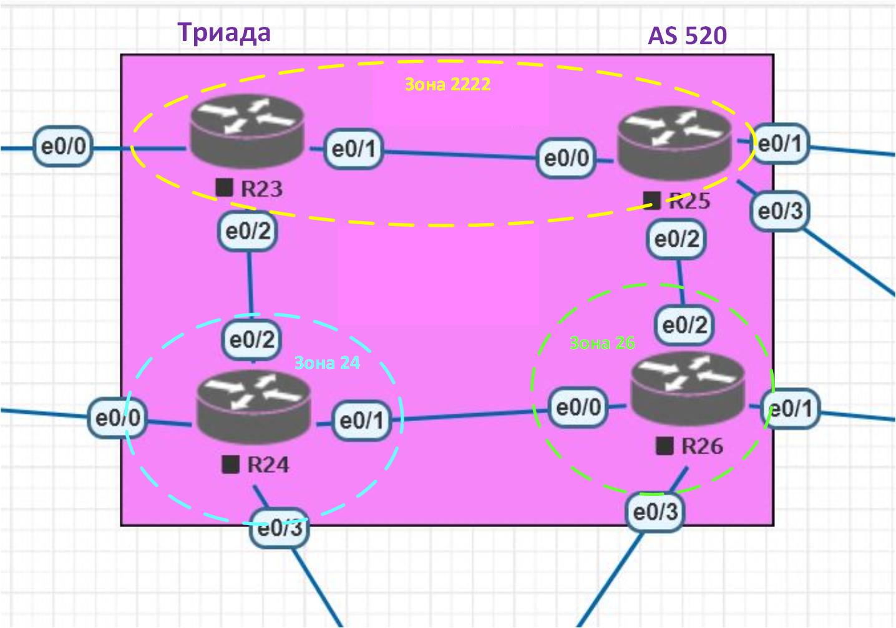

##  **IS-IS.**

### Цель:
Цель данной работы: Настроить IS-IS офисе Триада.
    
### Условия:

1. Необходимо настроить IS-IS в ISP Триада.
2. R23 и R25 находятся в зоне 2222.
3. R24 находится в зоне 24.
4. R26 находится в зоне 26.
5. Настройка осуществляется одновременно для IPv4 и IPv6.
6. Изменения должны быть задокументированы.

### Шаги выполнения:
1. [Документирование адресного пространства для лабораторного стенда.](README.md#I-&#1076;&#1086;&#1082;&#1091;&#1084;&#1077;&#1085;&#1090;&#1080;&#1088;&#1086;&#1074;&#1072;&#1085;&#1080;&#1077;&#45;&#1072;&#1076;&#1088;&#1077;&#1089;&#1085;&#1086;&#1075;&#1086;&#45;&#1087;&#1088;&#1086;&#1089;&#1090;&#1088;&#1072;&#1085;&#1089;&#1090;&#1074;&#1072;&#45;&#1076;&#1083;&#1103;&#45;&#1083;&#1072;&#1073;&#1086;&#1088;&#1072;&#1090;&#1086;&#1088;&#1085;&#1086;&#1075;&#1086;&#45;&#1089;&#1090;&#1077;&#1085;&#1076;&#1072;)

    a. [Таблица выделенных подсетей.](README.md#a-&#1090;&#1072;&#1073;&#1083;&#1080;&#1094;&#1072;&#45;&#1074;&#1099;&#1076;&#1077;&#1083;&#1077;&#1085;&#1085;&#1099;&#1093;&#45;&#1087;&#1086;&#1076;&#1089;&#1077;&#1090;&#1077;&#1081;)
    
    b. [Таблица IP адресов.](README.md#b-&#1090;&#1072;&#1073;&#1083;&#1080;&#1094;&#1072;&#45;&#105;&#112;&#45;&#1072;&#1076;&#1088;&#1077;&#1089;&#1086;&#1074;)
    
    с. [Разделение сети на зоны.](README.md#c-&#1088;&#1072;&#1079;&#1076;&#1077;&#1083;&#1077;&#1085;&#1080;&#1077;&#45;&#1089;&#1077;&#1090;&#1080;&#45;&#1085;&#1072;&#45;&#1079;&#1086;&#1085;&#1099;)
    
2. [Настройка сетевого оборудования.](README.md#II-&#1085;&#1072;&#1089;&#1090;&#1088;&#1086;&#1081;&#1082;&#1072;&#45;&#1089;&#1077;&#1090;&#1077;&#1074;&#1086;&#1075;&#1086;&#45;&#1086;&#1073;&#1086;&#1088;&#1091;&#1076;&#1086;&#1074;&#1072;&#1085;&#1080;&#1103;)

    a. [Настройка на маршрутизаторах протокола ISIS.](README.md#a-&#1085;&#1072;&#1089;&#1090;&#1088;&#1086;&#1081;&#1082;&#1072;&#45;&#1085;&#1072;&#45;&#1084;&#1072;&#1088;&#1096;&#1088;&#1091;&#1090;&#1080;&#1079;&#1072;&#1090;&#1086;&#1088;&#1072;&#1093;&#45;&#1087;&#1088;&#1086;&#1090;&#1086;&#1082;&#1086;&#1083;&#1072;&#45;&#105;&#115;&#105;&#115;)
    
    b. [Фильтрация OSPF.](README.md#b-&#1092;&#1080;&#1083;&#1100;&#1090;&#1088;&#1072;&#1094;&#1080;&#1103;&#45;&#111;&#115;&#112;&#102;)
    
4. [Итоговая схема.](README.md#IV-&#1080;&#1090;&#1086;&#1075;&#1086;&#1074;&#1072;&#1103;&#45;&#1089;&#1093;&#1077;&#1084;&#1072;)

### Ход выполнения:
    Для выполнения лабораторной работы использовался эмулятор EVE-NG, терминальный клиент PuTTY..

#### **_I. Документирование адресного пространства для лабораторного стенда._**

   *_Используемые сети:_*

10.0.0.0/8 - используется для линков Point-to-Point.

192.168.0.0/16 - используется для Loopback's.

172.16.0.0/16 - управление коммутаторами.

100.0.0.0/8 - пользовательские сети.

2001:AAAA::/48 - сеть выделенная провайдером. На площадке используются сети с префиксом /64. Для адреса в последнем хекстете будет использоваться, если это возможно, цифра из названия устройства.

FE80::/10 - сеть для адресов link-local. Для адреса в последнем хекстете будет использоваться, если это возможно, цифра из названия устройства и номер порта.
    
#### a. Таблица выделенных подсетей.

    Таблица 1.
    |----------------|-------|-------------------|-----------------|---------------------------|------------------------|--------------------------|
    |  Расположение  |  AS   |      IPv4 сеть    |Родительская сеть|        IPv6 сеть          |  Родительская сеть     |      Описание            |
    |----------------|-------|-------------------|-----------------|---------------------------|------------------------|--------------------------|
    | Триада         | 520   | 10.5.0.0/31       |  10.5.0.0/23    | 2001:AAAA:BB05:100::/64   | 2001:AAAA:BB05::/48    | R23e0/2 - R24e0/2        |
    |                | 520   | 10.5.0.2/31       |  10.5.0.0/23    | 2001:AAAA:BB05:102::/64   | 2001:AAAA:BB05::/48    | R23e0/1 - R25e0/0        |
    |                | 520   | 10.5.0.4/31       |  10.5.0.0/23    | 2001:AAAA:BB05:104::/64   | 2001:AAAA:BB05::/48    | R24e0/1 - R26e0/0        |
    |                | 520   | 10.5.0.6/31       |  10.5.0.0/23    | 2001:AAAA:BB05:106::/64   | 2001:AAAA:BB05::/48    | R24e0/3 - R18e0/2        |
    |                | 520   | 10.5.0.8/31       |  10.5.0.0/23    | 2001:AAAA:BB05:108::/64   | 2001:AAAA:BB05::/48    | R25e0/2 - R26e0/2        |
    |                | 520   | 10.5.0.10/31      |  10.5.0.0/23    | 2001:AAAA:BB05:110::/64   | 2001:AAAA:BB05::/48    | R25e0/3 - R28e0/1        |
    |                | 520   | 10.5.0.12/31      |  10.5.0.0/23    | 2001:AAAA:BB05:112::/64   | 2001:AAAA:BB05::/48    | R25e0/1 - R27e0/0        |
    |                | 520   | 10.5.0.14/31      |  10.5.0.0/23    | 2001:AAAA:BB05:114::/64   | 2001:AAAA:BB05::/48    | R26e0/3 - R18e0/3        |
    |                | 520   | 10.5.0.16/31      |  10.5.0.0/23    | 2001:AAAA:BB05:116::/64   | 2001:AAAA:BB05::/48    | R26e0/1 - R28e0/0        |
    |                | 520   | 192.168.5.0/24    |                 | 2001:AAAA:BB05:192::/64   | 2001:AAAA:BB05::/48    | Loopback's               |
    |----------------|-------|-------------------|-----------------|---------------------------|------------------------|--------------------------|
    

#### b. Таблица IP адресов.

    Таблица 2.
    |--------------|------------|------------|----------------|-----------------|-------------------------------|---------------------------|----------------------|
    | Расположение | Устройство |  Порт      |   IPv4 адрес   | Родит. сеть     |          IPv6 адрес           |  Родительская сеть        |      Описание        |
    |--------------|------------|------------|----------------|-----------------|-------------------------------|---------------------------|----------------------|
    | Триада       | R23        | Lo0        | 192.168.5.23   | 192.168.5.0/32  | 2001:AAAA:BB05:192::23/128    | 2001:AAAA:BB05:192::/64   | Loopback R23         |
    |              |            | e0/0       | 10.0.0.5       | 10.0.0.4/31     | 2001:AAAA:BB00:104::5:E0/64   | 2001:AAAA:BB00:104::/64   |                      |
    |              |            |            |                |                 | FE80::23:E0                   | FE80::/10                 |                      |
    |              |            | e0/2       | 10.5.0.0       | 10.5.0.0/31     | 2001:AAAA:BB05:100::E2/64     | 2001:AAAA:BB05:100::/64   |                      |
    |              |            |            |                |                 | FE80::23:E2                   | FE80::/10                 |                      |
    |              |            | e0/1       | 10.5.0.2       | 10.5.0.2/31     | 2001:AAAA:BB05:102::2:E1/64   | 2001:AAAA:BB05:102::/64   |                      |
    |              |            |            |                |                 | FE80::23:E1                   | FE80::/10                 |                      |
    |              |------------|------------|----------------|-----------------|-------------------------------|---------------------------|----------------------|
    |              | R24        | Lo0        | 192.168.5.24   | 192.168.5.0/32  | 2001:AAAA:BB05:192::24/128    | 2001:AAAA:BB05:192::/64   | Loopback R24         |
    |              |            | e0/0       | 10.6.0.3       | 10.6.0.2/31     | 2001:AAAA:BB06:102::3:E0/64   | 2001:AAAA:BB06:102::/64   |                      |
    |              |            |            |                |                 | FE80::24:E0                   | FE80::/10                 |                      |
    |              |            | e0/2       | 10.5.0.1       | 10.5.0.0/31     | 2001:AAAA:BB05:100::1:E2/64   | 2001:AAAA:BB05:100::/64   |                      |
    |              |            |            |                |                 | FE80::24:E2                   | FE80::/10                 |                      |
    |              |            | e0/1       | 10.5.0.4       | 10.5.0.4/31     | 2001:AAAA:BB05:104::4:E1/64   | 2001:AAAA:BB05:104::/64   |                      |
    |              |            |            |                |                 | FE80::24:E1                   | FE80::/10                 |                      |
    |              |            | e0/3       | 10.5.0.6       | 10.5.0.6/31     | 2001:AAAA:BB05:106::6:E3/64   | 2001:AAAA:BB05:106::/64   |                      |
    |              |            |            |                |                 | FE80::24:E3                   | FE80::/10                 |                      |
    |              |------------|------------|----------------|-----------------|-------------------------------|---------------------------|----------------------|
    |              | R26        | Lo0        | 192.168.5.26   | 192.168.5.0/32  | 2001:AAAA:BB05:192::26/128    | 2001:AAAA:BB05:192::/64   | Loopback R26         |
    |              |            | e0/0       | 10.5.0.5       | 10.5.0.4/31     | 2001:AAAA:BB05:104::5:E0/64   | 2001:AAAA:BB05:104::/64   |                      |
    |              |            |            |                |                 | FE80::26:E0                   | FE80::/10                 |                      |
    |              |            | e0/3       | 10.5.0.14      | 10.5.0.14/31    | 2001:AAAA:BB05:114::14:E3/64  | 2001:AAAA:BB05:114::/64   |                      |
    |              |            |            |                |                 | FE80::26:E3                   | FE80::/10                 |                      |
    |              |            | e0/1       | 10.5.0.16      | 10.5.0.16/31    | 2001:AAAA:BB05:116::16:E1/64  | 2001:AAAA:BB05:116::/64   |                      |
    |              |            |            |                |                 | FE80::26:E1                   | FE80::/10                 |                      |
    |              |            | e0/2       | 10.5.0.9       | 10.5.0.8/31     | 2001:AAAA:BB05:108::9:E2/64   | 2001:AAAA:BB05:108::/64   |                      |
    |              |            |            |                |                 | FE80::26:E2                   | FE80::/10                 |                      |
    |              |------------|------------|----------------|-----------------|-------------------------------|---------------------------|----------------------|
    |              | R25        | Lo0        | 192.168.5.25   | 192.168.5.0/32  | 2001:AAAA:BB05:192::25/128    | 2001:AAAA:BB05:192::/64   | Loopback R25         |
    |              |            | e0/0       | 10.5.0.3       | 10.5.0.2/31     | 2001:AAAA:BB05:102::3:E0/64   | 2001:AAAA:BB05:102::/64   |                      |
    |              |            |            |                |                 | FE80::25:E0                   | FE80::/10                 |                      |
    |              |            | e0/2       | 10.5.0.8       | 10.5.0.8/31     | 2001:AAAA:BB05:108::8:E2/64   | 2001:AAAA:BB05:108::/64   |                      |
    |              |            |            |                |                 | FE80::25:E2                   | FE80::/10                 |                      |
    |              |            | e0/3       | 10.5.0.10      | 10.5.0.10/31    | 2001:AAAA:BB05:110::10:E3/64  | 2001:AAAA:BB05:110::/64   |                      |
    |              |            |            |                |                 | FE80::25:E3                   | FE80::/10                 |                      |
    |              |            | e0/1       | 10.5.0.12      | 10.5.0.12/31    | 2001:AAAA:BB05:112::12:E1/64  | 2001:AAAA:BB05:112::/64   |                      |
    |              |            |            |                |                 | FE80::25:E1                   | FE80::/10                 |                      |
    |--------------|------------|------------|----------------|-----------------|-------------------------------|---------------------------|----------------------|
    

#### c. Разделение сети на зоны.

По условилю лабораторной работы:
1. Маршрутизаторы R23-R25 находятся в зоне 2222.
2. Маршрутизаторы R24 - в зоне 24.
3. Маршрутизаторы R26 - в зоне 26.

Для удобства, разделение зон перенесла на рисунок 1.

Рисунок 1.

#### **_II. Настройка сетевого оборудования._**

#### a. Настройка на маршрутизаторах протокола ISIS.

В данном разделе настроила на маршрутизаторах протокол OSPF. Ниже привела команды для настройки маршрутизаторов с комментариями.

**Маршрутизатор R14:**

---------------------------------------------------------------
        
    ! Статический маршрут по-умолчанию для IPv4 иIPv6.
    conf t
    !
    ip route 0.0.0.0 0.0.0.0 10.0.0.0
    ipv6 route ::/0 2001:AAAA:BB00:100::E0
    exit
    
    ! Создала процесс OSPF.
    conf t
    !
    router ospf 10
     ! Указываю идентификатор маршрутизатора а процессе OSPF.
     router-id 14.14.14.14
     
     ! Обявляю соседям, о том, что я знаю маршрут по-умолчанию.
     default-information originate
     
     ! Перевожу все интерфейсы участвующие в процессе OSPF в пассивное состояние.
     passive-interface default
     
     ! Вывела из пассивного состояния нужные интерфейсы.
     no passive-interface Ethernet0/0
     no passive-interface Ethernet0/1
     no passive-interface Ethernet0/2
     no passive-interface Ethernet0/3
     
     ! Указала, что Area 101 является "Totally Stubby Area".
     area 101 stub no-summary
     
     exit
     
     ! Аналогичные настройки для IPv6
     ipv6 router ospf 10
      router-id 14.14.14.14
      area 101 stub no-summary
      default-information originate
      exit
     exit
     
    ! Настроила интерфейсы, участвующие в процессе и отнесла их к соответствующим area.
    conf t
    !
    interface Loopback0
     ip ospf 10 area 0
     ipv6 ospf 10 area 0
     exit
    !
    interface Ethernet0/0
     ip ospf 10 area 0
     ipv6 ospf 10 area 0
     exit
    !
    interface Ethernet0/1
     ip ospf 10 area 0
     ipv6 ospf 10 area 0
     exit
    !
    interface Ethernet0/2
     ip ospf 10 area 0
     ipv6 ospf 10 area 0
     exit
    !
    interface Ethernet0/3
     ! Так как с R19 прямой линк, указала, что этот интерфейс point-to-point, тем самым исключила маршрутизатор R19 из выборов DR, BDR.
     ip ospf network point-to-point
     ip ospf 10 area 101
     ipv6 ospf 10 area 101
     exit
    !
    
--------------------------------------------------------------

Файлы с полной конфигурацией маршрутизаторов находятся в папке [configs](configs/) в файлах **_RRR-int.txt_**. Первые символы в названии файлов соответствуют именам сетевых устройств.

Провела некоторые проверки. 

1. С помощью команды **_sh ip route static_** проверила статический маршрут по-умолчанию (результат выведен не весь). 

----------------------------------------------------------------

    Gateway of last resort is 10.0.0.0 to network 0.0.0.0

    S*    0.0.0.0/0 [1/0] via 10.0.0.0

----------------------------------------------------------------

2. С помощью команды **_sh ip protocols_** можно посмотреть какие интерфейсы являются пассивными, проверить Router ID, наличие фильтров и т.д.

----------------------------------------------------------------

    Routing Protocol is "ospf 10"
     Outgoing update filter list for all interfaces is not set
     Incoming update filter list for all interfaces is not set
     Router ID 14.14.14.14
     It is an area border and autonomous system boundary router
    Redistributing External Routes from,
     Number of areas in this router is 2. 1 normal 1 stub 0 nssa
     Maximum path: 4
     Routing for Networks:
     Routing on Interfaces Configured Explicitly (Area 0):
       Loopback0
       Ethernet0/2
       Ethernet0/1
       Ethernet0/0
     Routing on Interfaces Configured Explicitly (Area 101):
       Ethernet0/3
     Passive Interface(s):
       Loopback0
       RG-AR-IF-INPUT1
       VoIP-Null0

----------------------------------------------------------------

**Маршрутизатор R15:**

----------------------------------------------------------------
    
    ! Основные настройки совпадают с настройками на R14.
    !
    conf t
    !
    router ospf 10
     router-id 15.15.15.15
     passive-interface default
     no passive-interface Ethernet0/0
     no passive-interface Ethernet0/1
     no passive-interface Ethernet0/2
     no passive-interface Ethernet0/3
     default-information originate
     exit
    ipv6 router ospf 10
     router-id 15.15.15.15
     default-information originate
     exit
    exit
    
    conf t
    !
    interface Loopback0
     ip ospf 10 area 0
     ipv6 ospf 10 area 0
     exit
    !
    interface Ethernet0/0
     ip ospf 10 area 0
     ipv6 ospf 10 area 0
     exit
    !
    interface Ethernet0/1
     ip ospf 10 area 0
     ipv6 ospf 10 area 0
     exit
    !
    interface Ethernet0/2
     ip ospf 10 area 0
     ipv6 ospf 10 area 0
     exit
    !
    interface Ethernet0/3
     ip ospf network point-to-point
     ip ospf 10 area 102
     ipv6 ospf 10 area 102
     exit
    exit

----------------------------------------------------------------

Для проверки работы динамического протокола OSPF на маршрутизаторе R15 ввела команду **_sh ip route_**. Вывод команды на рисунке 2.

Рисунок 2.

Из вывода вижу, что по протоколу OSPF получен шлюз по-умолчанию из двух направлений. Маршрут полученный с интерфейса e0/0 является приоритетным.

Теперь на R15 настроим статический маршрут по-умолчанию в сторону Ламаса.

----------------------------------------------------------------
    
    conf t
    !
    ip route 0.0.0.0 0.0.0.0 10.6.0.0
    ipv6 route ::/0 2001:AAAA:BB06:100::E0
    exit
    
----------------------------------------------------------------

Посмотрим, что изменится после ввода команды **_sh ip route_**. Вывод команды на рисунке 3.

Рисунок 3.

Как видно из вывода команды, шлюз по-умолчанию, прилетавший ранее по протоколу OSPF, пропал. Это произошло из-за того, что статический маршрут является приоритетным.

**Маршрутизаторы R12 и R13:**

Маршрутизаторы R12 и R13 настраиваются практически одинаково, по этому приведу пример настройки R12. Файл с полной конфигурацией маршрутизатора R13 находится в папке [configs](configs/) в файле **_R13-int.txt_**.

----------------------------------------------------------------
    
    conf t
    !
    router ospf 10
     router-id 12.12.12.12
     passive-interface default
     no passive-interface Ethernet0/1
     no passive-interface Ethernet0/2
     no passive-interface Ethernet0/3
     exit
    ipv6 router ospf 10
     router-id 12.12.12.12 
     exit
    exit
    !
    
    conf t
    !
    interface Loopback0
     ip ospf 10 area 10
     ipv6 ospf 10 area 10
     exit
    !
    interface Ethernet0/0.10
     ip ospf 10 area 10
     ipv6 ospf 10 area 10
     exit
    !
    interface Ethernet0/0.11
     ip ospf 10 area 10
     ipv6 ospf 10 area 10
     exit
    !
    interface Ethernet0/0.12
     ip ospf 10 area 10
     pv6 ospf 10 area 10
     exit
    !
    interface Ethernet0/1
     ip ospf 10 area 10
     ipv6 ospf 10 area 10
     exit
    !
    interface Ethernet0/2
     ip ospf 10 area 0
     ipv6 ospf 10 area 0
     exit
    !
    interface Ethernet0/3
     ip ospf 10 area 0
     ipv6 ospf 10 area 0
     exit
    exit

----------------------------------------------------------------

Проверила наличие моршрутов прилетевших по протоколу OSPF для IPv4 (рис.4).

Рисунок 4.

Наряду с другими маршрутами, маршрутизатор видит и два шлюза по-умолчанию.
То же проверила для IPv6 командой **_sh ipv6 route_** (рис.5).

Рисунок 5.

Протокол OSPF при работе с IPv6 использует link-local адреса интерфейсов, через которые прилетает шлюз по-умолчанию.

#### b. Фильтрация OSPF.

Варианты фильтрации показаны в этом разделе на примере маршрутизаторов R19 (определение area, как total stub, командой **_area 101 stub no-summary_**) и R20 (distribute-list для IPv6) в паре с R15 (prefix-list для IPv4).

**Маршрутизатор R19**
---------------------------------------------------------------
  
    conf terminal
    !
    router ospf 10
     router-id 19.19.19.19
     area 101 stub no-summary
     passive-interface default
     no passive-interface Ethernet0/0 
     exit
    ipv6 router ospf 10
     router-id 19.19.19.19
     area 101 stub no-summary
     exit
    exit
    !
    
    conf t
    !
    interface Loopback0
     ip ospf 10 area 101
     ipv6 ospf 10 area 101
    !
    interface Ethernet0/0
     ip ospf network point-to-point
     ip ospf 10 area 101
     ipv6 ospf 10 area 101
     exit
    exit
  
---------------------------------------------------------------

Проверила маршруты приходящие на R19 (рис.6 для IPv4) и (рис.7 для IPv6)

Рисунок 6.

Рисунок 7.

R19 получил информацию о шлюзе по-умолчанию по протоколу OSPF от маршрутизатора R14. Так как R14 является ABR (граничным), а area 101, в которой находятся оба маршрутизатора, является totally stubby area, то он (R14) объявляет себя шлюзом по-умолчанию.

По условию лабораторной работы, необходимо отфильтровать приходящий на маршрутизатор R20 трафик из Area 101. Для этого необходимо сделать настройки на двух маршрутизаторах R15 и R20.

**Маршрутизатор R15**

Создала на маршрутизаторе prefix-list и активировала его для Area 102. Весь трафик входящий в area 102 будет фильтроваться согласно prefix-list Area101-Deny.

---------------------------------------------------------------
    
    conf t
    !
    ip prefix-list Area101-Deny seq 10 deny 10.1.0.0/31
    ip prefix-list Area101-Deny seq 15 deny 192.168.1.19/32
    ip prefix-list Area101-Deny seq 99 permit 0.0.0.0/0 le 32
    !
    router ospf 10
     area 102 filter-list prefix Area101-Deny in

---------------------------------------------------------------

Проверила фильтрацию трафика по IPv4 на маршрутизаторе R20. Действительно, маршруты, запрещенные в prefix-list не попадают в таблицу маршрутизации (рис.8).

Рисунок 8.

**Маршрутизатор R20**

Для настройки фильтрации трафика по IPV6 на маршрутизаторе R20 сделела следующие настройки:

---------------------------------------------------------------
    
    conf t
    !
    ipv6 prefix-list Area101-Deny-IPV6 seq 5 deny 2001:AAAA:BB01:192::19/128
    ipv6 prefix-list Area101-Deny-IPV6 seq 10 deny 2001:AAAA:BB01:100::/64
    ipv6 prefix-list Area101-Deny-IPV6 seq 99 permit ::/0 le 128
    !
    ipv6 router ospf 10
     router-id 20.20.20.20
     distribute-list prefix-list Area101-Deny-IPV6 in

---------------------------------------------------------------

Весь трафик приходящий на маршрутизатор R20 будет фильтроваться согласно prefix-list Area101-Deny-IPV6.

Проверила (рис.9)

Рисунок 9.

Трафик фильтруется.

Файлы с полной конфигурацией маршрутизаторов находятся в папке [configs](configs/) в файлах **_RRR-int.txt_**. Первые символы в названии файлов соответствуют именам сетевых устройств.

#### **_IV. Итоговая схема._**

На рис.10 размещены используемые сети, IPv4 и IPv6 адреса маршрутизаторов, коммутаторов и персональных компьютеров, а так же испльзуемые VLAN.

Рисунок 10.

