##  **EIGRP.**

### Цель:
Цель: Настроить EIGRP в С.-Петербург. Использовать named EIGRP.
    
### Условия:

1. В офисе С.-Петербург настроить EIGRP.
2. R32 получает только маршрут по-умолчанию.
3. R16-17 анонсируют только суммарные префиксы.
4. Использовать EIGRP named-mode для настройки сети
5. Настройка осуществляется одновременно для IPv4 и IPv6.
6. Изменения должны быть задокументированы.

### Шаги выполнения:
1. [Документирование адресного пространства для лабораторного стенда.](README.md#I-&#1076;&#1086;&#1082;&#1091;&#1084;&#1077;&#1085;&#1090;&#1080;&#1088;&#1086;&#1074;&#1072;&#1085;&#1080;&#1077;&#45;&#1072;&#1076;&#1088;&#1077;&#1089;&#1085;&#1086;&#1075;&#1086;&#45;&#1087;&#1088;&#1086;&#1089;&#1090;&#1088;&#1072;&#1085;&#1089;&#1090;&#1074;&#1072;&#45;&#1076;&#1083;&#1103;&#45;&#1083;&#1072;&#1073;&#1086;&#1088;&#1072;&#1090;&#1086;&#1088;&#1085;&#1086;&#1075;&#1086;&#45;&#1089;&#1090;&#1077;&#1085;&#1076;&#1072;)

    a. [Таблица выделенных подсетей.](README.md#a-&#1090;&#1072;&#1073;&#1083;&#1080;&#1094;&#1072;&#45;&#1074;&#1099;&#1076;&#1077;&#1083;&#1077;&#1085;&#1085;&#1099;&#1093;&#45;&#1087;&#1086;&#1076;&#1089;&#1077;&#1090;&#1077;&#1081;)
    
    b. [Таблица IP адресов.](README.md#b-&#1090;&#1072;&#1073;&#1083;&#1080;&#1094;&#1072;&#45;&#105;&#112;&#45;&#1072;&#1076;&#1088;&#1077;&#1089;&#1086;&#1074;)
    
       
2. [Настройка сетевого оборудования.](README.md#II-&#1085;&#1072;&#1089;&#1090;&#1088;&#1086;&#1081;&#1082;&#1072;&#45;&#1089;&#1077;&#1090;&#1077;&#1074;&#1086;&#1075;&#1086;&#45;&#1086;&#1073;&#1086;&#1088;&#1091;&#1076;&#1086;&#1074;&#1072;&#1085;&#1080;&#1103;)

    a. [Настройка на маршрутизаторах протокола EIGRP.](README.md#a-&#1085;&#1072;&#1089;&#1090;&#1088;&#1086;&#1081;&#1082;&#1072;&#45;&#1085;&#1072;&#45;&#1084;&#1072;&#1088;&#1096;&#1088;&#1091;&#1090;&#1080;&#1079;&#1072;&#1090;&#1086;&#1088;&#1072;&#1093;&#45;&#1087;&#1088;&#1086;&#1090;&#1086;&#1082;&#1086;&#1083;&#1072;&#45;&#101;&#105;&#103;&#114;&#112;)
    
    b. [Настройка суммаризации на маршрутизаторах R16 и R17.](README.md#b-&#1085;&#1072;&#1089;&#1090;&#1088;&#1086;&#1081;&#1082;&#1072;&#45;&#1089;&#1091;&#1084;&#1084;&#1072;&#1088;&#1080;&#1079;&#1072;&#1094;&#1080;&#1080;&#45;&#1085;&#1072;&#45;&#1084;&#1072;&#1088;&#1096;&#1088;&#1091;&#1090;&#1080;&#1079;&#1072;&#1090;&#1086;&#1088;&#1072;&#1093;&#45;&#114;&#49;&#54;&#45;&#1080;&#45;&#114;&#49;&#55;)
    
    c. [Настройка фильтра на маршрутизаторе R32.](README.md#c-&#1085;&#1072;&#1089;&#1090;&#1088;&#1086;&#1081;&#1082;&#1072;&#45;&#1092;&#1080;&#1083;&#1100;&#1090;&#1088;&#1072;&#45;&#1085;&#1072;&#45;&#1084;&#1072;&#1088;&#1096;&#1088;&#1091;&#1090;&#1080;&#1079;&#1072;&#1090;&#1086;&#1088;&#1077;&#45;&#114;&#51;&#50;)
    
    
4. [Итоговая схема.](README.md#IV-&#1080;&#1090;&#1086;&#1075;&#1086;&#1074;&#1072;&#1103;&#45;&#1089;&#1093;&#1077;&#1084;&#1072;)

### Ход выполнения:
    Для выполнения лабораторной работы использовался эмулятор EVE-NG, терминальный клиент PuTTY..

#### **_I. Документирование адресного пространства для лабораторного стенда._**

   *_Используемые сети:_*

10.0.0.0/8 - используется для линков Point-to-Point.

192.168.0.0/16 - используется для Loopback's.

172.16.0.0/16 - управление коммутаторами.

100.0.0.0/8 - пользовательские сети.

2001:AAAA::/48 - сеть выделенная провайдером. На площадке используются сети с префиксом /64. Для адреса в последнем хекстете будет использоваться, если это возможно, цифра из названия устройства.

FE80::/10 - сеть для адресов link-local. Для адреса в последнем хекстете будет использоваться, если это возможно, цифра из названия устройства и номер порта.
    
#### a. Таблица выделенных подсетей.

    Таблица 1.
    |----------------|-------|-------------------|-----------------|---------------------------|------------------------|--------------------------|
    |  Расположение  |  AS   |      IPv4 сеть    |Родительская сеть|        IPv6 сеть          |  Родительская сеть     |      Описание            |
    |----------------|-------|-------------------|-----------------|---------------------------|------------------------|--------------------------|
    | С.-Петербург   | 2042  | 10.2.0.0/31       |  10.2.0.0/23    | 2001:AAAA:BB02:100::/64   | 2001:AAAA:BB02::/48    | R18e0/1 - R17e0/1        |
    |                | 2042  | 10.2.0.2/31       |  10.2.0.0/23    | 2001:AAAA:BB02:102::/64   | 2001:AAAA:BB02::/48    | R18e0/0 - R16e0/1        |
    |                | 2042  | 10.2.0.4/31       |  10.2.0.0/23    | 2001:AAAA:BB02:104::/64   | 2001:AAAA:BB02::/48    | R17e0/0 - SW9e0/3        |
    |                | 2042  | 10.2.0.6/31       |  10.2.0.0/23    | 2001:AAAA:BB02:106::/64   | 2001:AAAA:BB02::/48    | R17e0/2 - SW10e1/0       |
    |                | 2042  | 10.2.0.8/31       |  10.2.0.0/23    | 2001:AAAA:BB02:108::/64   | 2001:AAAA:BB02::/48    | R16e0/2 - SW9e1/0        |
    |                | 2042  | 10.2.0.10/31      |  10.2.0.0/23    | 2001:AAAA:BB02:110::/64   | 2001:AAAA:BB02::/48    | R16e0/0 - SW10e0/3       |
    |                | 2042  | 10.2.0.12/31      |  10.2.0.0/23    | 2001:AAAA:BB02:112::/64   | 2001:AAAA:BB02::/48    | R16e0/3 - R32e0/0        |
    |                | 2042  | 10.2.0.14/31      |  10.2.0.0/23    | 2001:AAAA:BB02:114::/64   | 2001:AAAA:BB02::/48    | SW9Po1 - SW9Po1 (e0/0-1) |
    |                | 2042  | 192.168.2.0/24    |                 | 2001:AAAA:BB02:192::/64   | 2001:AAAA:BB02::/48    | Loopback's               |
    |                | 2042  | 172.16.2.0/24     |                 | 2001:AAAA:BB02:172::/64   | 2001:AAAA:BB02::/48    | Коммтаторы Vlan10        |
    |                | 2042  | 100.2.0.0/24      |  100.2.0.0/21   | 2001:AAAA:BB02:1011::/64  | 2001:AAAA:BB02::/48    | Пользователи Vlan11      |
    |                | 2042  | 100.2.1.0/24      |  100.2.0.0/21   | 2001:AAAA:BB02:1012::/64  | 2001:AAAA:BB02::/48    | Пользователи Vlan12      |
    |----------------|-------|-------------------|-----------------|---------------------------|------------------------|--------------------------|
    

#### b. Таблица IP адресов.

    Таблица 2.
    |--------------|------------|------------|----------------|-----------------|-------------------------------|---------------------------|----------------------|
    | Расположение | Устройство |  Порт      |   IPv4 адрес   | Родит. сеть     |          IPv6 адрес           |  Родительская сеть        |      Описание        |
    |--------------|------------|------------|----------------|-----------------|-------------------------------|---------------------------|----------------------|
    | С.-Петербург | R18        | Lo0        | 192.168.2.18   | 192.168.2.0/32  | 2001:AAAA:BB02:192::18/128    | 2001:AAAA:BB02:192::/64   | Loopback R18         |
    |              |            | e0/2       | 10.5.0.7       | 10.5.0.6/31     | 2001:AAAA:BB05:106::7:E2/64   | 2001:AAAA:BB05:106::/64   |                      |
    |              |            |            |                |                 | FE80::18:E2                   | FE80::/10                 |                      |
    |              |            | e0/3       | 10.5.0.15      | 10.5.0.14/31    | 2001:AAAA:BB05:114::15:E3/64  | 2001:AAAA:BB05:114::/64   |                      |
    |              |            |            |                |                 | FE80::18:E3                   | FE80::/10                 |                      |
    |              |            | e0/1       | 10.2.0.0       | 10.2.0.0/31     | 2001:AAAA:BB02:100::E1/64     | 2001:AAAA:BB02:100::/64   |                      |
    |              |            |            |                |                 | FE80::18:E1                   | FE80::/10                 |                      |
    |              |            | e0/0       | 10.2.0.2       | 10.2.0.2/31     | 2001:AAAA:BB02:102::2:E0/64   | 2001:AAAA:BB02:102::/64   |                      |
    |              |            |            |                |                 | FE80::18:E0                   | FE80::/10                 |                      |
    |              |------------|------------|----------------|-----------------|-------------------------------|---------------------------|----------------------|
    |              | R17        | Lo0        | 192.168.2.17   | 192.168.2.0/32  | 2001:AAAA:BB02:192::17/128    | 2001:AAAA:BB02:192::/64   | Loopback R17         |
    |              |            | e0/1       | 10.2.0.1       | 10.2.0.0/31     | 2001:AAAA:BB02:100::1:E1/64   | 2001:AAAA:BB02:100::/64   |                      |
    |              |            |            |                |                 | FE80::17:E1                   | FE80::/10                 |                      |
    |              |            | e0/0       | 10.2.0.4       | 10.2.0.4/31     | 2001:AAAA:BB02:104::4:E0/64   | 2001:AAAA:BB02:104::/64   |                      |
    |              |            |            |                |                 | FE80::17:E0                   | FE80::/10                 |                      |
    |              |            | e0/2       | 10.2.0.6       | 10.2.0.6/31     | 2001:AAAA:BB02:106::6:E3/64   | 2001:AAAA:BB02:106::/64   |                      |
    |              |            |            |                |                 | FE80::17:E2                   | FE80::/10                 |                      |
    |              |------------|------------|----------------|-----------------|-------------------------------|---------------------------|----------------------|
    |              | R16        | Lo0        | 192.168.2.16   | 192.168.2.0/32  | 2001:AAAA:BB02:192::16/128    | 2001:AAAA:BB02:192::/64   | Loopback R16         |
    |              |            | e0/1       | 10.2.0.3       | 10.2.0.2/31     | 2001:AAAA:BB02:102::3:E0/64   | 2001:AAAA:BB02:102::/64   |                      |
    |              |            |            |                |                 | FE80::16:E1                   | FE80::/10                 |                      |
    |              |            | e0/2       | 10.2.0.8       | 10.2.0.8/31     | 2001:AAAA:BB02:108::8:E2/64   | 2001:AAAA:BB02:108::/64   |                      |
    |              |            |            |                |                 | FE80::16:E2                   | FE80::/10                 |                      |
    |              |            | e0/0       | 10.2.0.10      | 10.2.0.10/31    | 2001:AAAA:BB02:110::10:E0/64  | 2001:AAAA:BB02:110::/64   |                      |
    |              |            |            |                |                 | FE80::17:E0                   | FE80::/10                 |                      |
    |              |            | e0/3       | 10.2.0.12      | 10.2.0.12/31    | 2001:AAAA:BB02:112::12:E3/64  | 2001:AAAA:BB02:112::/64   |                      |
    |              |            |            |                |                 | FE80::16:E3                   | FE80::/10                 |                      |
    |              |------------|------------|----------------|-----------------|-------------------------------|---------------------------|----------------------|
    |              | R32        | Lo0        | 192.168.2.32   | 192.168.2.0/32  | 2001:AAAA:BB02:192::32/128    | 2001:AAAA:BB02:192::/64   | Loopback R32         |
    |              |            | e0/0       | 10.2.0.13      | 10.2.0.12/31    | 2001:AAAA:BB02:112::13:E0/64  | 2001:AAAA:BB02:112::/64   |                      |
    |              |            |            |                |                 | FE80::32:E0                   | FE80::/10                 |                      |
    |              |------------|------------|----------------|-----------------|-------------------------------|---------------------------|----------------------|
    |              | SW9        | Lo0        | 192.168.2.9    | 192.168.2.0/32  | 2001:AAAA:BB02:192::9c/64     | 2001:AAAA:BB02:192::/64   | Loopback SW9         |
    |              |            | e0/3       | 10.2.0.5       | 10.2.0.4/31     | 2001:AAAA:BB02:104::5:E3/64   | 2001:AAAA:BB02:104::/64   |                      |
    |              |            |            |                |                 | FE80::9c:E3                   | FE80::/10                 |                      |
    |              |            | e1/0       | 10.2.0.9       | 10.2.0.8/31     | 2001:AAAA:BB02:108::9:E10/64  | 2001:AAAA:BB02:108::/64   |                      |
    |              |            |            |                |                 | FE80::9c:E10                  | FE80::/10                 |                      |
    |              |            | Po1(e0/0-1)| 10.2.0.14      | 10.2.0.14/31    | 2001:AAAA:BB02:114::14:c1/64  | 2001:AAAA:BB02:114::/64   |                      |
    |              |            |            |                |                 | FE80::9c:c1                   | FE80::/10                 |                      |
    |              |            | Int Vlan11 | 100.2.0.1      | 100.2.0.0/24    | 2001:AAAA:BB02:1011::1/64     | 2001:AAAA:BB02:1011::/64  |                      |
    |              |            | e0/2       | N/A            | N/A             | N/A                           | N/A                       |                      |
    |              |------------|------------|----------------|-----------------|-------------------------------|---------------------------|----------------------|
    |              | SW10       | Lo0        | 192.168.2.10   | 192.168.2.0/32  | 2001:AAAA:BB02:192::10c/64    | 2001:AAAA:BB02:172::/64   | Loopback SW10        |
    |              |            | Po1(e0/0-1)| 10.2.0.15      | 10.2.0.14/31    | 2001:AAAA:BB02:114::15:c1/64  | 2001:AAAA:BB02:114::/64   |                      |
    |              |            |            |                |                 | FE80::10c:c1                  | FE80::/10                 |                      |
    |              |            | e1/0       | 10.2.0.7       | 10.2.0.6/31     | 2001:AAAA:BB02:106::7:E10/64  | 2001:AAAA:BB02:106::/64   |                      |
    |              |            |            |                |                 | FE80::10c:E10                 | FE80::/10                 |                      |
    |              |            | e0/3       | 10.2.0.11      | 10.2.0.10/31    | 2001:AAAA:BB02:110::11:E3/64  | 2001:AAAA:BB02:110::/64   |                      |
    |              |            |            |                |                 | FE80::10c:E3                  | FE80::/10                 |                      |
    |              |            | Int Vlan12 | 100.2.1.1      | 100.2.1.0/24    | 2001:AAAA:BB01:1012::1/64     | 2001:AAAA:BB01:1012::/64  |                      |
    |              |            | e0/2       | N/A            | N/A             | N/A                           | N/A                       |                      |
    |              |------------|------------|----------------|-----------------|-------------------------------|---------------------------|----------------------|
    |              | VPC8       |            | 100.2.0.8      | 100.2.0.0/24    | autoconfig                    | 2001:AAAA:BB02:1011::/64  |                      |
    |              | VPC        |            | 100.2.1.5      | 100.2.1.0/24    | autoconfig                    | 2001:AAAA:BB02:1012::/64  |                      |
    |--------------|------------|------------|----------------|-----------------|-------------------------------|---------------------------|----------------------|
    

#### **_II. Настройка сетевого оборудования._**

Основными преимуществами EIGRP являются:

- очень низкое использование сетевых ресурсов во время нормальной работы; только пакеты приветствия передаются в стабильной сети
- когда происходит изменение, распространяются только изменения таблицы маршрутизации, не вся таблица маршрутизации; это уменьшает нагрузку, которую сам протокол маршрутизации оказывает на сеть
- малое время конвергенции для изменений в топологии сети (в некоторых ситуациях конвергенция может быть почти мгновенной).

#### a. Настройка на маршрутизаторах протокола EIGRP.

В данном разделе настроила на роутерах протокол динамической маршрутизации EIGRP с помощью метода — именованного EIGRP (named EIGRP). Именованный EIGRP использует функцию семейства адресов (address family, AF) для унификации процесса настройки при реализации как IPv4, так и IPv6. Ниже привела команды для настройки маршрутизаторов с комментариями.

**Маршрутизатор R18:**

---------------------------------------------------------------

    ! Статический маршрут по-умолчанию для IPv4 иIPv6.
    conf t
    !
    ip route 0.0.0.0 0.0.0.0 10.5.0.6
    ip route 0.0.0.0 0.0.0.0 10.5.0.14
    !
    ipv6 route ::/0 ethernet 0/2
    ipv6 route ::/0 ethernet 0/3
    !

    ! Создала процесс EIGRP.
    !
    router eigrp NM_EIGRP
     ! Перехожу в режим конфигурации address-family для протокола IPv4 при помощи следующей команды
     address-family ipv4 autonomous-system 1
      ! Указываю идентификатор маршрутизатора В процессе EIGRP
      eigrp router-id 18.18.18.18
      ! Перевела все интерфейсы, которые будут участвовать в процессе EIGRP, в состояние shutdown
      af-interface default
       shutdown
       exit
       
      ! Объявила сети, которые будут участвовать в процессе
      network 192.168.2.18 0.0.0.0
      network 10.2.0.0 0.0.0.1
      network 10.2.0.2 0.0.0.1
      !
      ! Настроила интерфейсы, участвующие в процессе
      af-interface Loopback 0
       no shutdown
       ! Перевожу интерфейс в пассивное состояние (по-умолчанию активно)
       passive-interface
       exit
      af-interface ethernet 0/0
       no shutdown
       exit
      af-interface ethernet 0/1
       no shutdown
       exit
      exit
     exit 
     exit
     !
     
    ! Настройки для протокола IPv6 в EIGRP аналогичны IPv4.
    conf t
    router eigrp NM_EIGRP
     address-family ipv6 autonomous-system 1
      eigrp router-id 18.18.18.18
      af-interface default
       shutdown
       exit
    !
      af-interface Loopback 0
       no shutdown
       passive-interface
       exit
      af-interface ethernet 0/0
       no shutdown
       exit
      af-interface ethernet 0/1
       no shutdown
       exit
      exit
    exit

    Так как необходимо передавать маршрут по-умолчанию всем роутерам в нашей автономной системе, сделала следующие настройки.
    В EIGRP маршрут по-умолчанию можно передать с помощью редистрибьюции в разделе topology base.
    
    conf t
    !
    router eigrp NM_EIGRP
     address-family ipv4 autonomous-system 1
     topology base
      ! Транслирую статический маршрут по-умолчанию в протокол EIGRP
      redistribute static
      ! Отключила автоматическую суммаризацию маршрутов
      no auto-summary
      exit
     exit
     address-family ipv6 autonomous-system 1
     topology base
      redistribute static
      exit
     exit
    exit
    exit
    !
    
--------------------------------------------------------------

Закончила настройки маршрутизатора R18 и очень хочется посмотреть что получилось. Ввела команду **__sh ip eigrp topology__** (вывод на рис.1) и эту же команду для IPv6 **__sh ipv6 eigrp topology__** (вывод на рис.2).

Рисунок 1.

Таблица топологии (topology table) — список маршрутов выученных от каждого соседа. Информации пока маловато, но, тем не менее, вижу, что поднят именованный (64-х разрядный) протокол EIGRP; вижу, что у меня автономная система с номером 1; вижу ID маршрутизатора для процесса EIGRP; вижу сети, которые я объявила, интерфейсы на которых они подняты; вижу, что у меня есть маршрут по-умолчанию. А так же вижу, что все эти маршруты готовы к работе (код P-Passive). Код A-Active говорит о том, что маршрут пересчитывается.

Рисунок 2.

Такая же ситуация и для IPv6.

С помощью команды **__sh eigrp protocols__**, так же можно почерпнуть информацию о поднятом протоколе и его метриках (рис.3).

Рисунок 3.

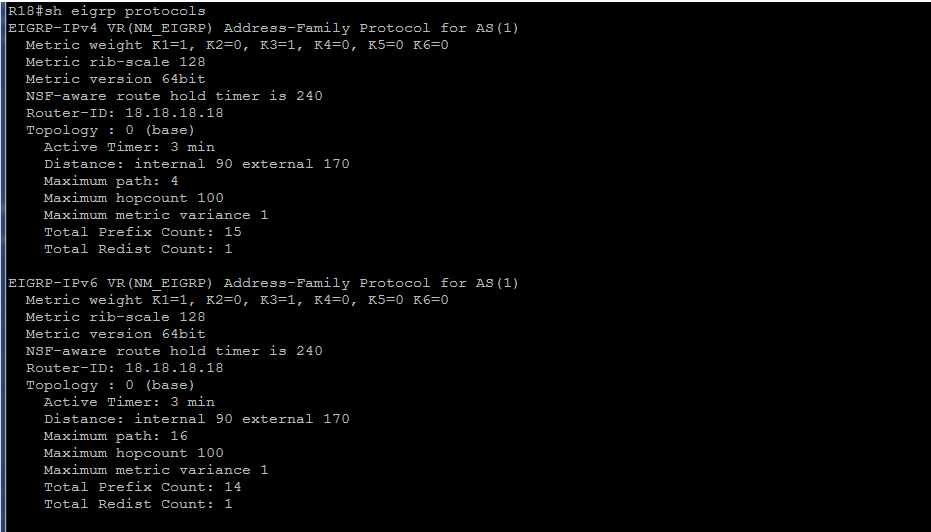

Файлы с полной конфигурацией маршрутизаторов находятся в папке [configs](configs/) в файлах **_RRR-int.txt_**. Первые символы в названии файлов соответствуют именам сетевых устройств.

Продолжила настройку динамического протокола EIGRP на маршрутизаторах R16, R17 и R32. Так как настройки на этих роутерах практичеки одинаковые, приведу пример настройки для маршрутизатора R16.

**Маршрутизатор R16:**

----------------------------------------------------------------
    
    conf t
    !
    router eigrp NM_EIGRP
     address-family ipv4 autonomous-system 1
      eigrp router-id 16.16.16.16
      af-interface default
       shutdown
       exit
    !
      network 10.2.0.2 0.0.0.1
      network 10.2.0.8 0.0.0.1
      network 10.2.0.10 0.0.0.1
      network 10.2.0.12 0.0.0.1  
      network 192.168.2.16 0.0.0.0
    !
      af-interface Loopback 0
       no shutdown
       passive-interface
       exit
      af-interface ethernet 0/0
       no shutdown
       exit
      af-interface ethernet 0/1
       no shutdown
       exit
      af-interface ethernet 0/2
       no shutdown
       exit
      af-interface ethernet 0/3
       no shutdown
       exit
      exit
    !

    conf t
    router eigrp NM_EIGRP
     address-family ipv6 autonomous-system 1
      eigrp router-id 16.16.16.16
      af-interface default
       shutdown
       exit
    !
      af-interface Loopback 0
       no shutdown
       passive-interface
       exit
      af-interface ethernet 0/0
       no shutdown
       exit
      af-interface ethernet 0/1
       no shutdown
       exit
      af-interface ethernet 0/2
       no shutdown
       exit
     af-interface ethernet 0/3
       no shutdown
       exit
      exit
    exit
    !

    conf t
    !
    router eigrp NM_EIGRP
     address-family ipv4 autonomous-system 1
     topology base
      no auto-summary
      exit
     exit
    exit
    exit
    !
   
----------------------------------------------------------------

В связи с тем, что было принято решение терминировать сети пользователей на коммутаторах с использованием функций L3, приведу пример настройки коммутатора с данными функциями.

*Примечание: В связи с тем, что на эмуляторе не работает L3 для Port-channel, я перенесла настройку на interface vlan 1. 
На Port-channel 1 оставила настройку L2 в режиме access vlan1 (настройки по-умолчанию для порта коммутатора), интерфейсы входящие в группу (Etherchannel 1) повторяют настройку Po1.
IPv4 и IPv6 адреса с интерфейса Port-channel 1 перенесла на интерфейс Vlan1.*

**Коммутатор SW9:**

----------------------------------------------------------------
    
    conf t
    !
    router eigrp NM_EIGRP
     address-family ipv4 autonomous-system 1
      eigrp router-id 9.9.9.9
      af-interface default
       shutdown
       exit
      topology base
       no auto-summary
       exit
      network 192.168.2.9 0.0.0.1
      network 10.2.0.4 0.0.0.1
      network 10.2.0.8 0.0.0.1
      network 10.2.0.14 0.0.0.1
      network 100.2.0.0 0.0.0.255
      exit
    !

      af-interface Loopback 0
       no shutdown
       passive-interface
       exit
      af-interface Vlan11
       no shutdown
       ! Интерфейс отправила в состояние passive, так как интерфейс смотрит в сторону пользовательской сети.
       passive-interface
       exit
      af-interface ethernet 0/3
       no shutdown
       exit
      af-interface ethernet 1/0
       no shutdown
       exit
      af-interface Vlan1
       no shutdown
       exit
      exit
     exit
    exit 
    !

    conf t
    !
    router eigrp NM_EIGRP
     address-family ipv6 autonomous-system 1
      eigrp router-id 9.9.9.9
      af-interface default
       shutdown
       exit
      exit
    !
      af-interface Loopback 0
       no shutdown
       passive-interface
       exit
      af-interface Vlan11
       no shutdown
       passive-interface
       exit
      af-interface ethernet 0/3
       no shutdown
       exit
      af-interface ethernet 1/0
       no shutdown
       exit
      af-interface Vlan1
       no shutdown
       exit
      exit
     exit
    exit
    !
    

----------------------------------------------------------------

**_Провела некоторые проверки._**

После настройки всех устройств пришло время посмотреть, работает ли наш динамический протокол.

1. С помощью команд **_sh ip eigrp neighbors_** и **_sh ipv6 eigrp neighbors_**, запущенной поочередно на всех маршрутизаторах и коммутаторах, посмотрим соседство по протоколу EIGRP.

*_Маршрутизатор R18_* 

*_Маршрутизатор R17_* 

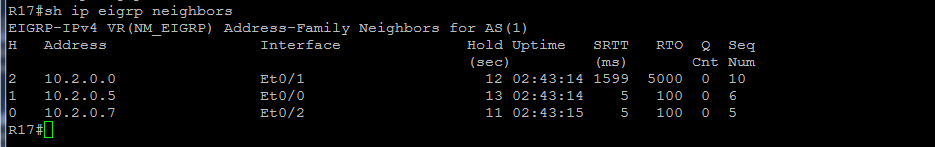

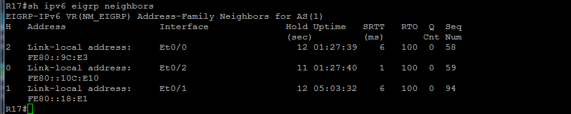

*_Маршрутизатор R16_* 

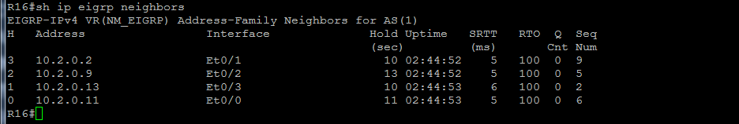

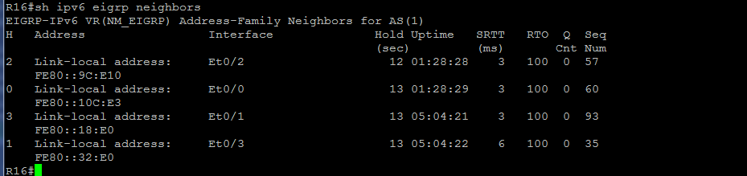

*_Маршрутизатор R32_* 

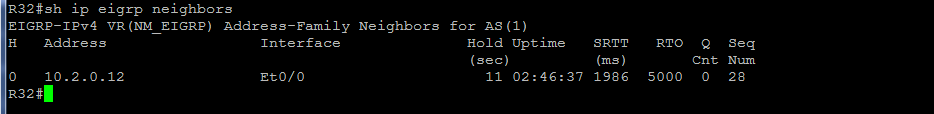

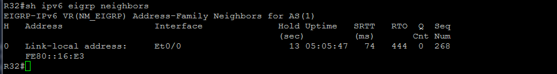

*_Коммутатор SW9_* 

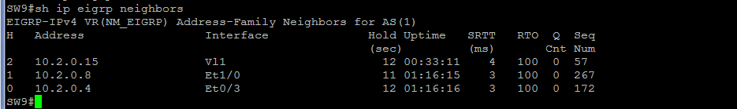

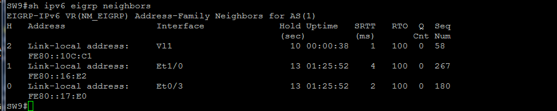
*_Коммутатор SW10_* 

Подвожу итог на данном этапе: у всех устройств появились соседи (общежитие какое-то).

2. Теперь пришло время посмотреть появилось ли что-нибудь на маршрутизаторе R18. Ввела команду **__sh ip eigrp topology all-links__** для IPv4 (рис.4) и **__sh ipv6 eigrp topology all-links__** для IPv6 (рис.5).

Рисунок 4.

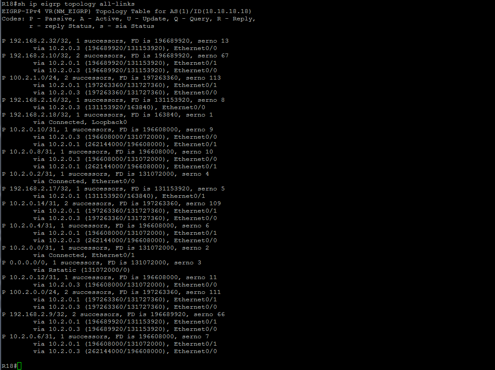

Рисунок 5.

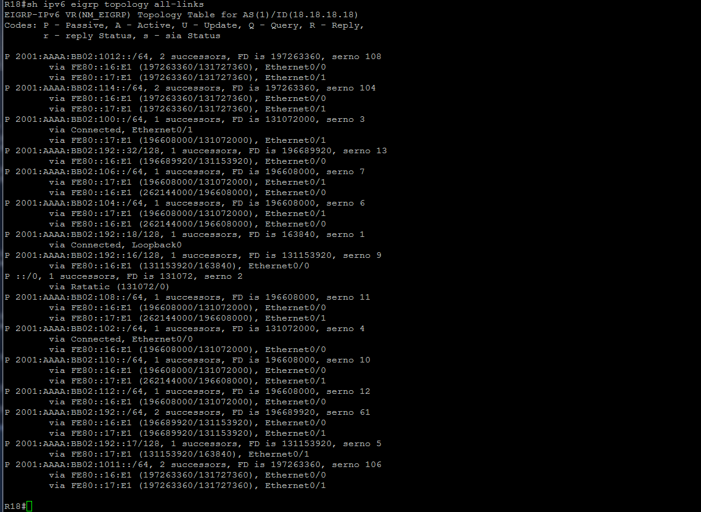

Маршрутов стало когаздо больше. Прибыли все маршруты переданные другими устройствами.

3. Наличие маршрутов полученных по протоколу IEGRP так же можно проверить с помощью основных команд **_sh ip route_** и **_sh ipv6 route_**. Для проверки работы динамического протокола выбрала несколько устройств. Отображение таблиц маршрутизации с протоколами IPv4 и IPv6 показано на рисунках ниже.

Рисунок 6. Маршрутизатор R18.

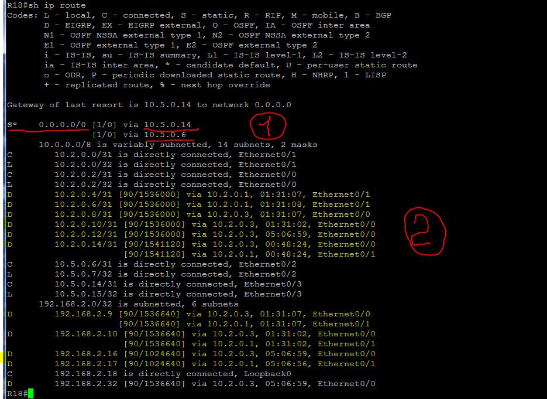

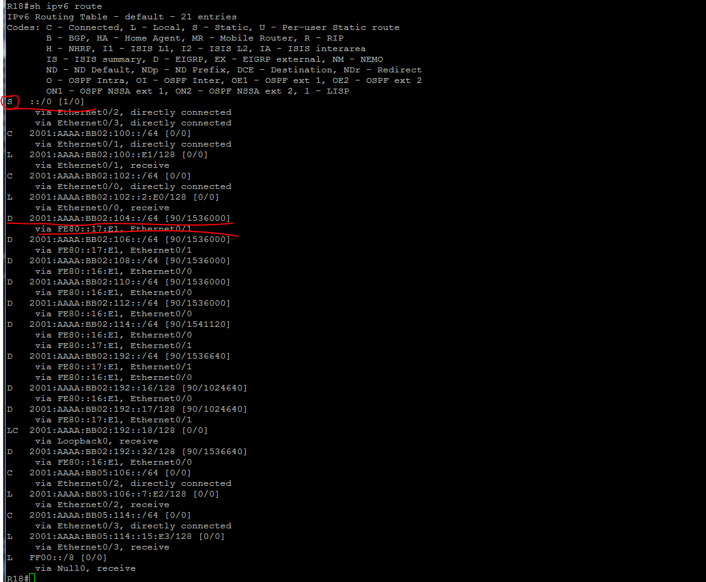

Из вывода вижу, что по протоколу EIGRP получены маршруты от других устройств - это код D (на рисунках метка 2). Прописан статикой маршрут по умолчанию (на рисунках метка 1) и этот маршлут лучне через 10.5.0.14. Видна стоимость маршрутов, видно через какие интерфейсы прилетели маршруты.

Рисунок 7. Маршрутизатор R17.

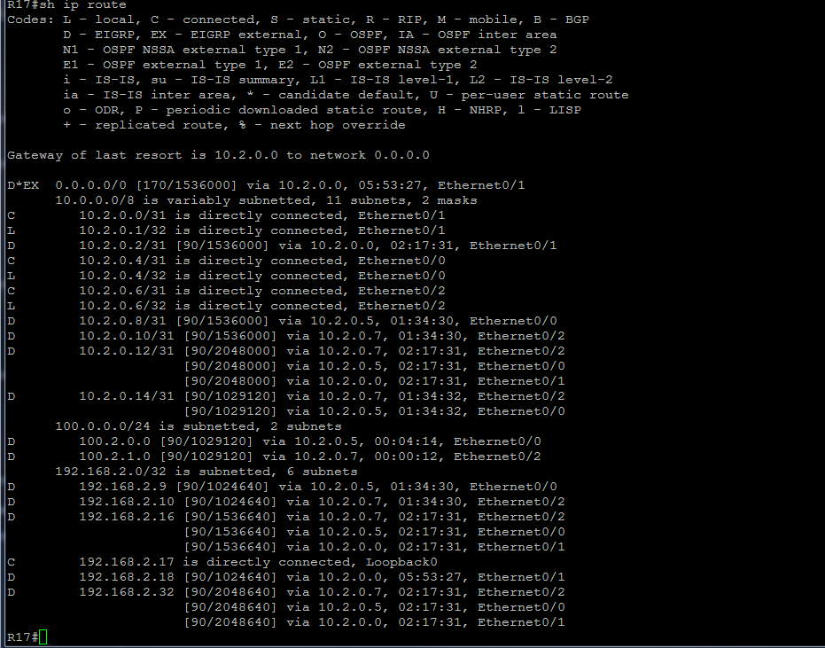

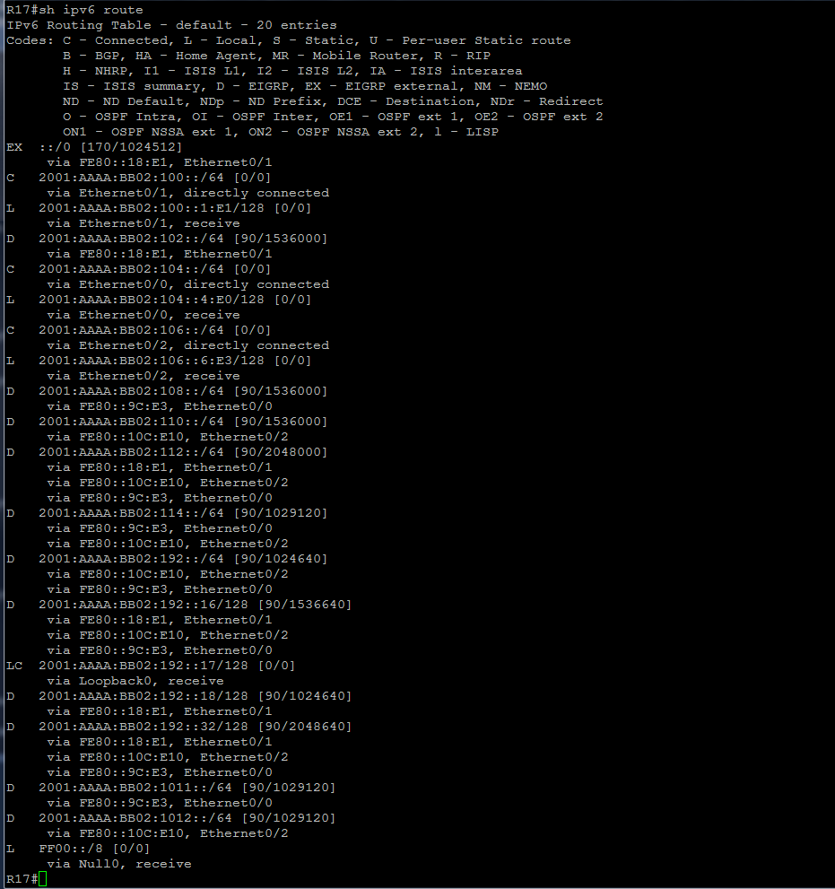

На рис.7 первой строчкой вижу, что на R17 прилетел маршрут по умолчанию из внешней системы (код D\*EX для IPv4 и код EX для IPv6) ретранслируемый нам маршрутизатором R18.

Для наглядности и, в дальнейшем для сравнения, приложила вывод с маршрутизатора R32.

Рисунок 8. Маршрутизатор R32.

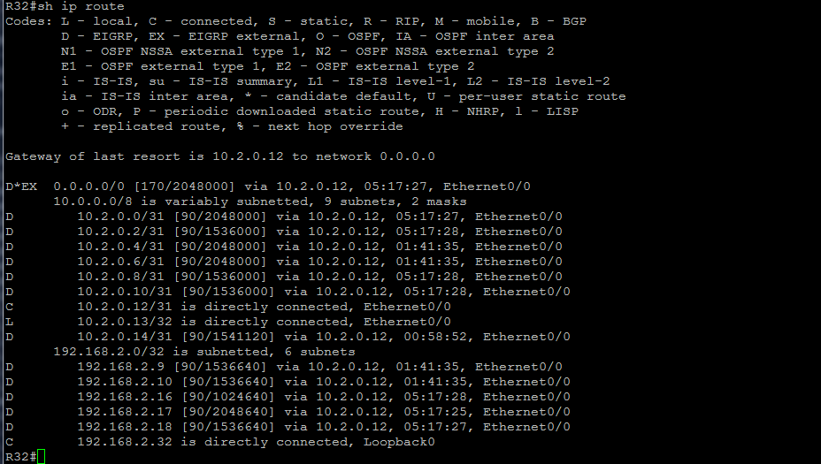

Так же интересно посмотреть что происходит на коммутаторах. 

Рисунок 9. Коммутатор SW9.

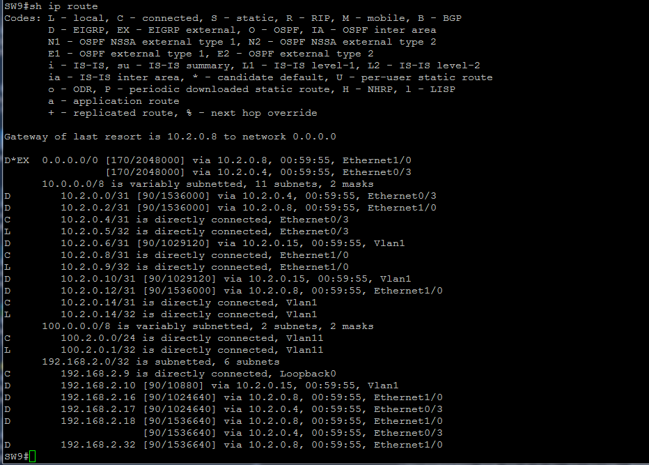

На выводе есть маршрут через interface vlan 1.

#### b. Настройка суммаризации на маршрутизаторах R16 и R17.

По условиям лабораторной работы на роутерах R16 и R17 необходимо настроить суммаризацию маршрутов, для того, что бы таблицы маршрутизации были короче, да и совершенно не обязательно всем маршрутизаторам знать где находится отдельный компьютер, главное знать где находится сеть в которую он входит.

Пример настройки суммаризации см.ниже.

**Маршрутизатор R16:**

----------------------------------------------------------------
    
    conf t
    !
    router eigrp NM_EIGRP
     address-family ipv4 autonomous-system 1
      af-interface ethernet 0/2
       summary-address 192.168.2.0 255.255.255.0
       summary-address 172.16.2.0 255.255.255.0
       summary-address 100.2.0.0 255.255.254.0
       summary-address 10.2.0.0 255.255.255.0
       exit
      exit
     exit
    exit
    !

    conf t
    !
    router eigrp NM_EIGRP
     address-family ipv6 autonomous-system 1
      af-interface ethernet 0/3
       summary-address 2001:AAAA:BB02::/48
       exit
      exit
     exit
    exit
    !
  
----------------------------------------------------------------

Теперь посмотрю что происходит на R18 и R32 после настройки суммирования мршрутов.

Рисунок 10.

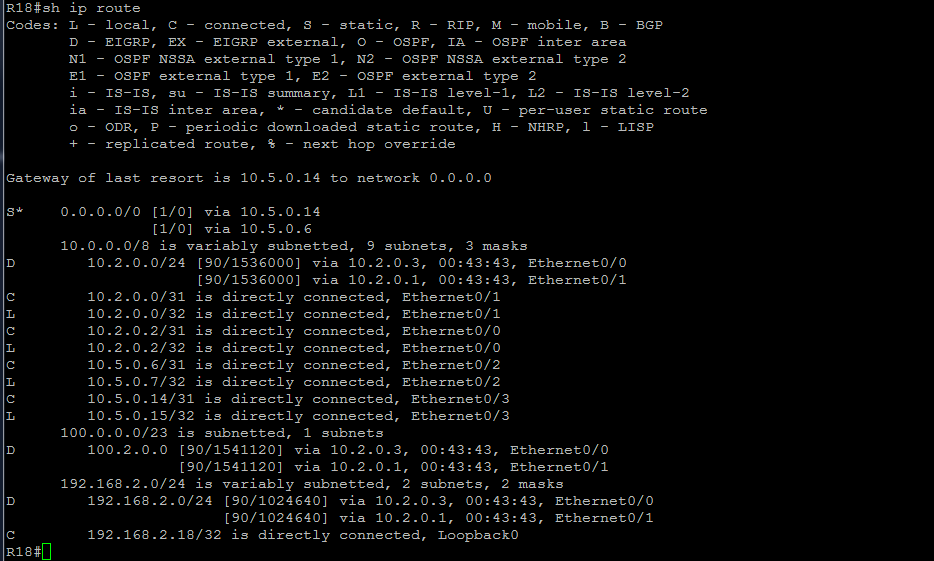

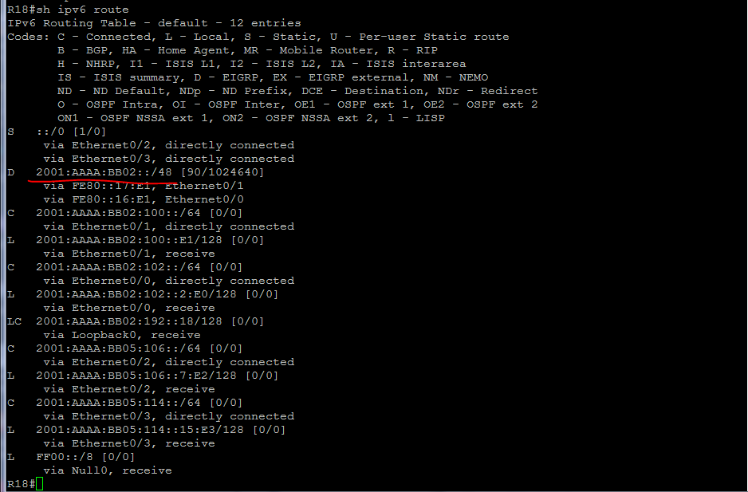

Рисунок 11.

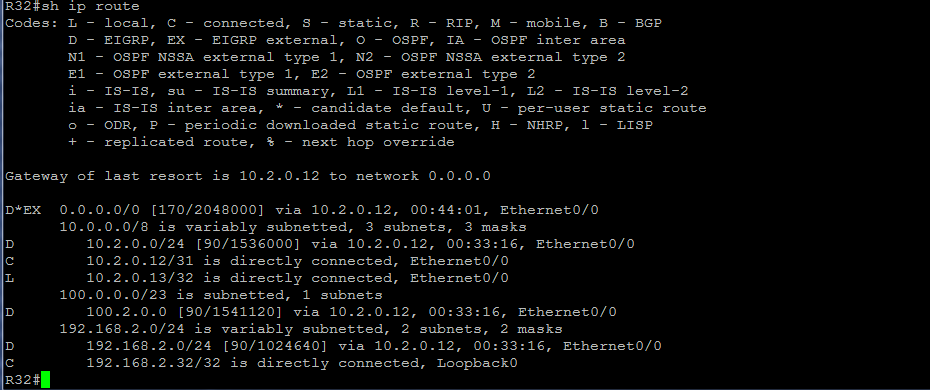

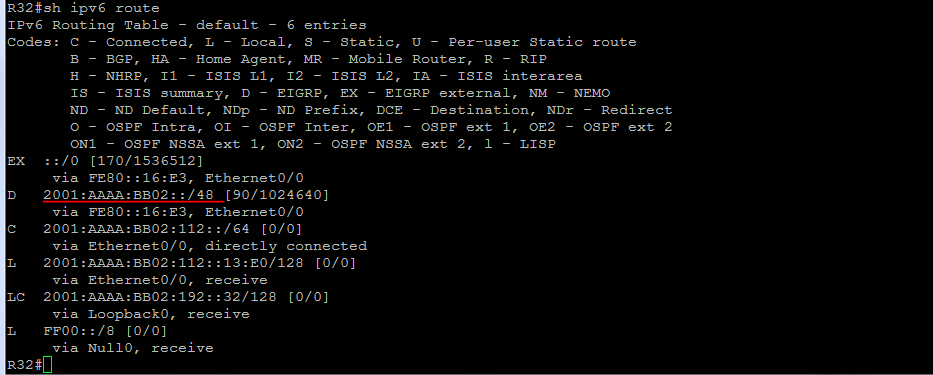

В данном примере видно, что в таблица маршрутизации на устройствах стала гораздо меньше. Все маршруты прилетают с префиксами.

#### c. Настройка фильтра на маршрутизаторе R32

Остался последний момент в выполнении данной работы. Необходимо настроить фильтрацию на R32, так, что бы на R32 приходил только маршрут по умолчанию. Для этого создала prefix-list и distribute-list.

**Маршрутизатор R32:**

----------------------------------------------------------------
    
    conf t
    !
    ip prefix-list FL_R32_IPV4 seq 10 permit 0.0.0.0/0
    ip prefix-list FL_R32_IPV4 seq 20 deny 0.0.0.0/0 le 32
    !
    ipv6 prefix-list FL_R32_IPV6 seq 10 permit ::/0 le 0
    ipv6 prefix-list FL_R32_IPV6 seq 200 deny ::/0 le 128
    !
    exit

    conf t
    !
    router eigrp NM_EIGRP
     address-family ipv4 unicast autonomous-system 1
      topology base
       distribute-list prefix FL_R32_IPV4 in
      exit
     exit
     address-family ipv6 unicast autonomous-system 1
      topology base
       distribute-list prefix-list FL_R32_IPV6 in
      exit
     exit
    exit
    exit

----------------------------------------------------------------

И что бы не быть голословной приводу вывод команды **__sh ip route__** запущенной на R32.

Рисунок 12.

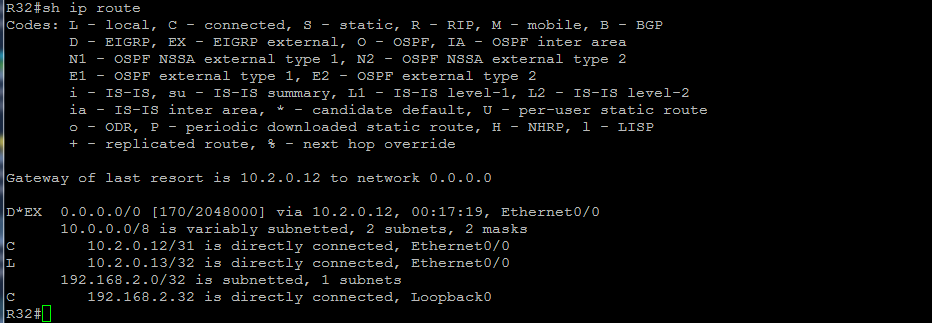

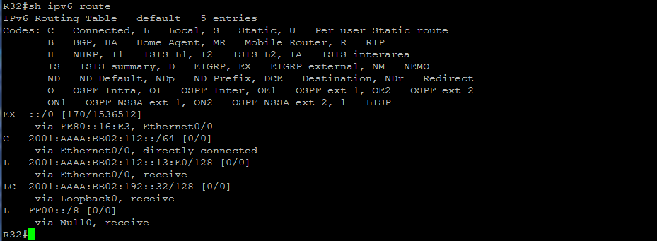

Вижу, что фильтрация работает.

#### **_IV. Итоговая схема._**

На рис.10 размещены используемые сети, IPv4 и IPv6 адреса маршрутизаторов.

Рисунок 10.

