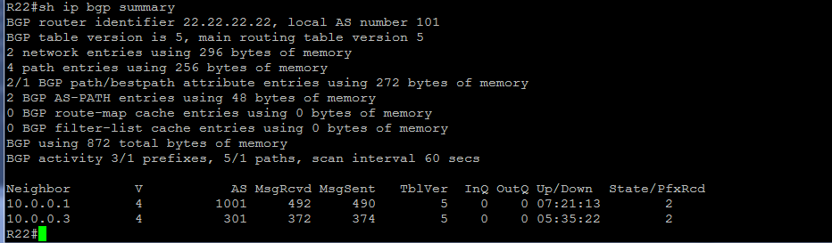

##  **BGP. Основы.**

### Цель:
Цель: Настроить BGP между автономными системами. Организовать доступность между офисами Москва и С.-Петербург
    
### Требования:

В этой самостоятельной работе необходимо:

1. Настроить eBGP между офисом Москва и двумя провайдерами - Киторн и Ламас.
2. Настроить eBGP между провайдерами Киторн и Ламас.
3. Настроить eBGP между Ламас и Триада.
4. Настроить eBGP между офисом С.-Петербург и провайдером Триада.
5. Организовать IP доступность между офисами Москва и С.-Петербург.
6. План работы и изменения зафиксированы в документации.

### Шаги выполнения:
1. [Документирование адресного пространства для лабораторного стенда.](README.md#I-&#1076;&#1086;&#1082;&#1091;&#1084;&#1077;&#1085;&#1090;&#1080;&#1088;&#1086;&#1074;&#1072;&#1085;&#1080;&#1077;&#45;&#1072;&#1076;&#1088;&#1077;&#1089;&#1085;&#1086;&#1075;&#1086;&#45;&#1087;&#1088;&#1086;&#1089;&#1090;&#1088;&#1072;&#1085;&#1089;&#1090;&#1074;&#1072;&#45;&#1076;&#1083;&#1103;&#45;&#1083;&#1072;&#1073;&#1086;&#1088;&#1072;&#1090;&#1086;&#1088;&#1085;&#1086;&#1075;&#1086;&#45;&#1089;&#1090;&#1077;&#1085;&#1076;&#1072;)

    a. [Таблица выделенных подсетей.](README.md#a-&#1090;&#1072;&#1073;&#1083;&#1080;&#1094;&#1072;&#45;&#1074;&#1099;&#1076;&#1077;&#1083;&#1077;&#1085;&#1085;&#1099;&#1093;&#45;&#1087;&#1086;&#1076;&#1089;&#1077;&#1090;&#1077;&#1081;)
    
    b. [Таблица IP адресов.](README.md#b-&#1090;&#1072;&#1073;&#1083;&#1080;&#1094;&#1072;&#45;&#105;&#112;&#45;&#1072;&#1076;&#1088;&#1077;&#1089;&#1086;&#1074;)
    
       
2. [Настройка сетевого оборудования.](README.md#II-&#1085;&#1072;&#1089;&#1090;&#1088;&#1086;&#1081;&#1082;&#1072;&#45;&#1089;&#1077;&#1090;&#1077;&#1074;&#1086;&#1075;&#1086;&#45;&#1086;&#1073;&#1086;&#1088;&#1091;&#1076;&#1086;&#1074;&#1072;&#1085;&#1080;&#1103;)

    a. [Распределение автономных систем.](README.md#a-&#1088;&#1072;&#1089;&#1087;&#1088;&#1077;&#1076;&#1077;&#1083;&#1077;&#1085;&#1080;&#1077;&#45;&#1072;&#1074;&#1090;&#1086;&#1085;&#1086;&#1084;&#1085;&#1099;&#1093;&#45;&#1089;&#1080;&#1089;&#1090;&#1077;&#1084;)

    b. [Настройка на маршрутизаторах протокола eBGP.](README.md#b-&#1085;&#1072;&#1089;&#1090;&#1088;&#1086;&#1081;&#1082;&#1072;&#45;&#1085;&#1072;&#45;&#1084;&#1072;&#1088;&#1096;&#1088;&#1091;&#1090;&#1080;&#1079;&#1072;&#1090;&#1086;&#1088;&#1072;&#1093;&#45;&#1087;&#1088;&#1086;&#1090;&#1086;&#1082;&#1086;&#1083;&#1072;&#45;&#101;&#98;&#103;&#112;)
    
    c. [Организация IP доступности между офисами Москва и Санкт Петербург.](README.md#c-&#1086;&#1088;&#1075;&#1072;&#1085;&#1080;&#1079;&#1072;&#1094;&#1080;&#1103;&#45;&#105;&#112;&#45;&#1076;&#1086;&#1089;&#1090;&#1091;&#1087;&#1085;&#1086;&#1089;&#1090;&#1080;&#45;&#1084;&#1077;&#1078;&#1076;&#1091;&#45;&#1086;&#1092;&#1080;&#1089;&#1072;&#1084;&#1080;&#45;&#1084;&#1086;&#1089;&#1082;&#1074;&#1072;&#45;&#1080;&#45;&#1089;&#1072;&#1085;&#1082;&#1090;&#45;&#1087;&#1077;&#1090;&#1077;&#1088;&#1073;&#1091;&#1088;&#1075;)
    
   
4. [Итоговая схема.](README.md#IV-&#1080;&#1090;&#1086;&#1075;&#1086;&#1074;&#1072;&#1103;&#45;&#1089;&#1093;&#1077;&#1084;&#1072;)

### Ход выполнения:
    Для выполнения лабораторной работы использовался эмулятор EVE-NG, терминальный клиент PuTTY..

#### **_I. Документирование адресного пространства для лабораторного стенда._**

   *_Используемые сети:_*

10.0.0.0/8 - используется для линков Point-to-Point.

192.168.0.0/16 - используется для Loopback's.

172.16.0.0/16 - управление коммутаторами.

100.0.0.0/8 - пользовательские сети.

2001:AAAA::/48 - сеть выделенная провайдером. На площадке используются сети с префиксом /64. Для адреса в последнем хекстете будет использоваться, если это возможно, цифра из названия устройства.

FE80::/10 - сеть для адресов link-local. Для адреса в последнем хекстете будет использоваться, если это возможно, цифра из названия устройства и номер порта.
    
#### a. Таблица выделенных подсетей.

    Таблица 1.
    |----------------|-------|-------------------|-----------------|---------------------------|------------------------|--------------------------|
    |  Расположение  |  AS   |      IPv4 сеть    |Родительская сеть|        IPv6 сеть          |  Родительская сеть     |      Описание            |
    |----------------|-------|-------------------|-----------------|---------------------------|------------------------|--------------------------|
    | Киторн         | 101   | 10.0.0.0/31       |  10.0.0.0/23    | 2001:AAAA:BB00:100::/64   | 2001:AAAA:BB00::/48    | R22e0/0 - R14e0/2        |
    |                | 101   | 10.0.0.2/31       |  10.0.0.0/23    | 2001:AAAA:BB00:102::/64   | 2001:AAAA:BB00::/48    | R22e0/1 - R21e0/1        |
    |                | 101   | 10.0.0.4/31       |  10.0.0.0/23    | 2001:AAAA:BB00:104::/64   | 2001:AAAA:BB00::/48    | R22e0/2 - R23e0/0        |
    |                | 101   | 192.168.0.0/24    |                 | 2001:AAAA:BB00:192::/64   | 2001:AAAA:BB00::/48    | Loopback's               |
    |----------------|-------|-------------------|-----------------|---------------------------|------------------------|--------------------------|
    | Ламас          | 301   | 10.6.0.0/31       |  10.6.0.0/23    | 2001:AAAA:BB06:100::/64   | 2001:AAAA:BB06::/48    | R21e0/0 - R15e0/2        |
    |                | 301   | 10.6.0.2/31       |  10.6.0.0/23    | 2001:AAAA:BB06:102::/64   | 2001:AAAA:BB06::/48    | R21e0/2 - R24e0/0        |
    |                | 301   | 192.168.6.0/24    |                 | 2001:AAAA:BB06:192::/64   | 2001:AAAA:BB06::/48    | Loopback's               |
    |----------------|-------|-------------------|-----------------|---------------------------|------------------------|--------------------------|
    | Триада         | 520   | 10.5.0.0/31       |  10.5.0.0/23    | 2001:AAAA:BB05:100::/64   | 2001:AAAA:BB05::/48    | R23e0/2 - R24e0/2        |
    |                | 520   | 10.5.0.2/31       |  10.5.0.0/23    | 2001:AAAA:BB05:102::/64   | 2001:AAAA:BB05::/48    | R23e0/1 - R25e0/0        |
    |                | 520   | 10.5.0.4/31       |  10.5.0.0/23    | 2001:AAAA:BB05:104::/64   | 2001:AAAA:BB05::/48    | R24e0/1 - R26e0/0        |
    |                | 520   | 10.5.0.6/31       |  10.5.0.0/23    | 2001:AAAA:BB05:106::/64   | 2001:AAAA:BB05::/48    | R24e0/3 - R18e0/2        |
    |                | 520   | 10.5.0.8/31       |  10.5.0.0/23    | 2001:AAAA:BB05:108::/64   | 2001:AAAA:BB05::/48    | R25e0/2 - R26e0/2        |
    |                | 520   | 10.5.0.14/31      |  10.5.0.0/23    | 2001:AAAA:BB05:114::/64   | 2001:AAAA:BB05::/48    | R26e0/3 - R18e0/3        |
    |                | 520   | 192.168.5.0/24    |                 | 2001:AAAA:BB05:192::/64   | 2001:AAAA:BB05::/48    | Loopback's               |
    |----------------|-------|-------------------|-----------------|---------------------------|------------------------|--------------------------|
    | Москва         | 1001  | 192.168.1.0/24    |                 | 2001:AAAA:BB01:192::/64   | 2001:AAAA:BB01::/48    | Loopback's               |
    |                | 1001  | 100.1.0.0/24      |  100.1.0.0/21   | 2001:AAAA:BB01:1001::/64  | 2001:AAAA:BB01::/48    | Пользователи Vlan11      |
    |                | 1001  | 100.1.1.0/24      |  100.1.0.0/21   | 2001:AAAA:BB01:1002::/64  | 2001:AAAA:BB01::/48    | Пользователи Vlan12      |
    |----------------|-------|-------------------|-----------------|---------------------------|------------------------|--------------------------|
    | С.-Петербург   | 2042  | 192.168.2.0/24    |                 | 2001:AAAA:BB02:192::/64   | 2001:AAAA:BB02::/48    | Loopback's               |
    |                | 2042  | 100.2.0.0/24      |  100.2.0.0/21   | 2001:AAAA:BB02:1011::/64  | 2001:AAAA:BB02::/48    | Пользователи Vlan11      |
    |                | 2042  | 100.2.1.0/24      |  100.2.0.0/21   | 2001:AAAA:BB02:1012::/64  | 2001:AAAA:BB02::/48    | Пользователи Vlan12      |
    |----------------|-------|-------------------|-----------------|---------------------------|------------------------|--------------------------|
    

#### b. Таблица IP адресов.

    Таблица 2.
    |--------------|------------|------------|----------------|-----------------|-------------------------------|---------------------------|----------------------|
    | Расположение | Устройство |  Порт      |   IPv4 адрес   | Родит. сеть     |          IPv6 адрес           |  Родительская сеть        |      Описание        |
    |--------------|------------|------------|----------------|-----------------|-------------------------------|---------------------------|----------------------|
    | С.-Петербург | R18        | Lo0        | 192.168.2.18   | 192.168.2.0/32  | 2001:AAAA:BB02:192::18/128    | 2001:AAAA:BB02:192::/64   | Loopback R18         |
    |              |            | e0/2       | 10.5.0.7       | 10.5.0.6/31     | 2001:AAAA:BB05:106::7:E2/64   | 2001:AAAA:BB05:106::/64   |                      |
    |              |            |            |                |                 | FE80::18:E2                   | FE80::/10                 |                      |
    |              |            | e0/3       | 10.5.0.15      | 10.5.0.14/31    | 2001:AAAA:BB05:114::15:E3/64  | 2001:AAAA:BB05:114::/64   |                      |
    |              |            |            |                |                 | FE80::18:E3                   | FE80::/10                 |                      |
    |              |            | e0/1       | 10.2.0.0       | 10.2.0.0/31     | 2001:AAAA:BB02:100::E1/64     | 2001:AAAA:BB02:100::/64   |                      |
    |              |            |            |                |                 | FE80::18:E1                   | FE80::/10                 |                      |
    |              |            | e0/0       | 10.2.0.2       | 10.2.0.2/31     | 2001:AAAA:BB02:102::2:E0/64   | 2001:AAAA:BB02:102::/64   |                      |
    |              |            |            |                |                 | FE80::18:E0                   | FE80::/10                 |                      |
    |--------------|------------|------------|----------------|-----------------|-------------------------------|---------------------------|----------------------|
    | Москва       | R14        | Lo0        | 192.168.1.14   | 192.168.1.0/32  | 2001:AAAA:BB01:192::14/128    | 2001:AAAA:BB01:192::/64   | Loopback R14         |
    |              |            | e0/2       | 10.0.0.1       | 10.0.0.0/31     | 2001:AAAA:BB00:100::1:E2/64   | 2001:AAAA:BB00:100::/64   |                      |
    |              |            |            |                |                 | FE80::14:E2                   | FE80::/10                 |                      |
    |              |            | e0/3       | 10.1.0.0       | 10.1.0.0/31     | 2001:AAAA:BB01:100::E3/64     | 2001:AAAA:BB01:100::/64   |                      |
    |              |            |            |                |                 | FE80::14:E3                   | FE80::/10                 |                      |
    |              |            | e0/0       | 10.1.0.2       | 10.1.0.2/31     | 2001:AAAA:BB01:102::2:E0/64   | 2001:AAAA:BB01:102::/64   |                      |
    |              |            |            |                |                 | FE80::14:E0                   | FE80::/10                 |                      |
    |              |            | e0/1       | 10.1.0.4       | 10.1.0.4/31     | 2001:AAAA:BB01:104::4:E1/64   | 2001:AAAA:BB01:104::/64   |                      |
    |              |            |            |                |                 | FE80::14:E1                   | FE80::/10                 |                      |
    |              |------------|------------|----------------|-----------------|-------------------------------|---------------------------|----------------------|
    |              | R15        | Lo0        | 192.168.1.15   | 192.168.1.0/32  | 2001:AAAA:BB01:192::15/128    | 2001:AAAA:BB01:192::/64   | Loopback R15         |
    |              |            | e0/2       | 10.6.0.1       | 10.6.0.0/31     | 2001:AAAA:BB06:100::1:E2/64   | 2001:AAAA:BB06:100::/64   |                      |
    |              |            |            |                |                 | FE80::15:E2                   | FE80::/10                 |                      |
    |              |            | e0/1       | 10.1.0.6       | 10.1.0.6/31     | 2001:AAAA:BB01:106::6:E1/64   | 2001:AAAA:BB01:106::/64   |                      |
    |              |            |            |                |                 | FE80::15:E1                   | FE80::/10                 |                      |
    |              |            | e0/0       | 10.1.0.8       | 10.1.0.8/31     | 2001:AAAA:BB01:108::8:E0/64   | 2001:AAAA:BB01:108::/64   |                      |
    |              |            |            |                |                 | FE80::15:E0                   | FE80::/10                 |                      |
    |              |            | e0/3       | 10.1.0.10      | 10.1.0.10/31    | 2001:AAAA:BB01:110::10:E3/64  | 2001:AAAA:BB01:110::/64   |                      |
    |              |            |            |                |                 | FE80::15:E3                   | FE80::/10                 |                      |
    |--------------|------------|------------|----------------|-----------------|-------------------------------|---------------------------|----------------------|
    | Ламас        | R21        | Lo0        | 192.168.6.21   | 192.168.6.0/32  | 2001:AAAA:BB06:192::21/128    | 2001:AAAA:BB06:192::/64   | Loopback R21         |
    |              |            | e0/1       | 10.0.0.3       | 10.0.0.2/31     | 2001:AAAA:BB00:102::3:E1/64   | 2001:AAAA:BB00:102::/64   |                      |
    |              |            |            |                |                 | FE80::21:E1                   | FE80::/10                 |                      |
    |              |            | e0/0       | 10.6.0.0       | 10.6.0.0/31     | 2001:AAAA:BB06:100::E0/64     | 2001:AAAA:BB06:100::/64   |                      |
    |              |            |            |                |                 | FE80::21:E0                   | FE80::/10                 |                      |
    |              |            | e0/2       | 10.6.0.2       | 10.6.0.2/31     | 2001:AAAA:BB06:102::2:E2/64   | 2001:AAAA:BB06:102::/64   |                      |
    |              |            |            |                |                 | FE80::21:E2                   | FE80::/10                 |                      |
    |--------------|------------|------------|----------------|-----------------|-------------------------------|---------------------------|----------------------|
    | Киторн       | R22        | Lo0        | 192.168.0.22   | 192.168.0.0/32  | 2001:AAAA:BB00:192::22/128    | 2001:AAAA:BB00:192::/64   | Loopback R22         |
    |              |            | e0/0       | 10.0.0.0       | 10.0.0.0/31     | 2001:AAAA:BB00:100::E0/64     | 2001:AAAA:BB00:100::/64   |                      |
    |              |            |            |                |                 | FE80::22:E0                   | FE80::/10                 |                      |
    |              |            | e0/1       | 10.0.0.2       | 10.0.0.2/31     | 2001:AAAA:BB00:102::2:E1/64   | 2001:AAAA:BB00:102::/64   |                      |
    |              |            |            |                |                 | FE80::22:E1                   | FE80::/10                 |                      |
    |              |            | e0/2       | 10.0.0.4       | 10.0.0.4/31     | 2001:AAAA:BB00:104::4:E2/64   | 2001:AAAA:BB00:104::/64   |                      |
    |              |            |            |                |                 | FE80::22:E2                   | FE80::/10                 |                      |
    |--------------|------------|------------|----------------|-----------------|-------------------------------|---------------------------|----------------------|
    | Триада       | R23        | Lo0        | 192.168.5.23   | 192.168.5.0/32  | 2001:AAAA:BB05:192::23/128    | 2001:AAAA:BB05:192::/64   | Loopback R23         |
    |              |            | e0/0       | 10.0.0.5       | 10.0.0.4/31     | 2001:AAAA:BB00:104::5:E0/64   | 2001:AAAA:BB00:104::/64   |                      |
    |              |            |            |                |                 | FE80::23:E0                   | FE80::/10                 |                      |
    |              |            | e0/2       | 10.5.0.0       | 10.5.0.0/31     | 2001:AAAA:BB05:100::E2/64     | 2001:AAAA:BB05:100::/64   |                      |
    |              |            |            |                |                 | FE80::23:E2                   | FE80::/10                 |                      |
    |              |            | e0/1       | 10.5.0.2       | 10.5.0.2/31     | 2001:AAAA:BB05:102::2:E1/64   | 2001:AAAA:BB05:102::/64   |                      |
    |              |            |            |                |                 | FE80::23:E1                   | FE80::/10                 |                      |
    |              |------------|------------|----------------|-----------------|-------------------------------|---------------------------|----------------------|
    |              | R24        | Lo0        | 192.168.5.24   | 192.168.5.0/32  | 2001:AAAA:BB05:192::24/128    | 2001:AAAA:BB05:192::/64   | Loopback R24         |
    |              |            | e0/0       | 10.6.0.3       | 10.6.0.2/31     | 2001:AAAA:BB06:102::3:E0/64   | 2001:AAAA:BB06:102::/64   |                      |
    |              |            |            |                |                 | FE80::24:E0                   | FE80::/10                 |                      |
    |              |            | e0/2       | 10.5.0.1       | 10.5.0.0/31     | 2001:AAAA:BB05:100::1:E2/64   | 2001:AAAA:BB05:100::/64   |                      |
    |              |            |            |                |                 | FE80::24:E2                   | FE80::/10                 |                      |
    |              |            | e0/1       | 10.5.0.4       | 10.5.0.4/31     | 2001:AAAA:BB05:104::4:E1/64   | 2001:AAAA:BB05:104::/64   |                      |
    |              |            |            |                |                 | FE80::24:E1                   | FE80::/10                 |                      |
    |              |            | e0/3       | 10.5.0.6       | 10.5.0.6/31     | 2001:AAAA:BB05:106::6:E3/64   | 2001:AAAA:BB05:106::/64   |                      |
    |              |            |            |                |                 | FE80::24:E3                   | FE80::/10                 |                      |
    |              |------------|------------|----------------|-----------------|-------------------------------|---------------------------|----------------------|
    |              | R26        | Lo0        | 192.168.5.26   | 192.168.5.0/32  | 2001:AAAA:BB05:192::26/128    | 2001:AAAA:BB05:192::/64   | Loopback R26         |
    |              |            | e0/0       | 10.5.0.5       | 10.5.0.4/31     | 2001:AAAA:BB05:104::5:E0/64   | 2001:AAAA:BB05:104::/64   |                      |
    |              |            |            |                |                 | FE80::26:E0                   | FE80::/10                 |                      |
    |              |            | e0/3       | 10.5.0.14      | 10.5.0.14/31    | 2001:AAAA:BB05:114::14:E3/64  | 2001:AAAA:BB05:114::/64   |                      |
    |              |            |            |                |                 | FE80::26:E3                   | FE80::/10                 |                      |
    |              |            | e0/1       | 10.5.0.16      | 10.5.0.16/31    | 2001:AAAA:BB05:116::16:E1/64  | 2001:AAAA:BB05:116::/64   |                      |
    |              |            |            |                |                 | FE80::26:E1                   | FE80::/10                 |                      |
    |              |            | e0/2       | 10.5.0.9       | 10.5.0.8/31     | 2001:AAAA:BB05:108::9:E2/64   | 2001:AAAA:BB05:108::/64   |                      |
    |              |            |            |                |                 | FE80::26:E2                   | FE80::/10                 |                      |
    |              |------------|------------|----------------|-----------------|-------------------------------|---------------------------|----------------------|
    |              | R25        | Lo0        | 192.168.5.25   | 192.168.5.0/32  | 2001:AAAA:BB05:192::25/128    | 2001:AAAA:BB05:192::/64   | Loopback R25         |
    |              |            | e0/0       | 10.5.0.3       | 10.5.0.2/31     | 2001:AAAA:BB05:102::3:E0/64   | 2001:AAAA:BB05:102::/64   |                      |
    |              |            |            |                |                 | FE80::25:E0                   | FE80::/10                 |                      |
    |              |            | e0/2       | 10.5.0.8       | 10.5.0.8/31     | 2001:AAAA:BB05:108::8:E2/64   | 2001:AAAA:BB05:108::/64   |                      |
    |              |            |            |                |                 | FE80::25:E2                   | FE80::/10                 |                      |
    |              |            | e0/3       | 10.5.0.10      | 10.5.0.10/31    | 2001:AAAA:BB05:110::10:E3/64  | 2001:AAAA:BB05:110::/64   |                      |
    |              |            |            |                |                 | FE80::25:E3                   | FE80::/10                 |                      |
    |              |            | e0/1       | 10.5.0.12      | 10.5.0.12/31    | 2001:AAAA:BB05:112::12:E1/64  | 2001:AAAA:BB05:112::/64   |                      |
    |              |            |            |                |                 | FE80::25:E1                   | FE80::/10                 |                      |
    |--------------|------------|------------|----------------|-----------------|-------------------------------|---------------------------|----------------------|
    

#### **_II. Настройка сетевого оборудования._**

*_BGP (Border Gateway Protocol)_* — это основной протокол динамической маршрутизации, который используется в Интернете.

Маршрутизаторы, использующие протокол BGP, обмениваются информацией о доступности сетей. Вместе с информацией о сетях передаются различные атрибуты этих сетей, с помощью которых BGP выбирает лучший маршрут и настраиваются политики маршрутизации. 

*_Основные характеристики протокола:_*

BGP это path-vector протокол с такими общими характеристиками:

- Использует TCP для передачи данных, это обеспечивает надежную доставку обновлений протокола (порт 179)
- Отправляет обновления только после изменений в сети (нет периодических обновлений)
- Периодически отправляет keepalive-сообщения для проверки TCP-соединения
- Метрика протокола называется path vector или атрибуты (attributes) 

*_eBGP (внешний протокол маршрутизации (exterior gateway protocol))_* – протокол, который используется для передачи информации о маршрутах между автономными системами. 

*_Автономная система (autonomous system, AS)_* — набор маршрутизаторов, имеющих единые правила маршрутизации, управляемых одной технической администрацией и работающих на одном из протоколов IGP (для внутренней маршрутизации AS может использовать и несколько IGP).

#### a. Распределение автономных систем.

- Киторн - AS101;
- Ламас - AS301;
- Триада - AS520;
- Москва - AS1001;
- Санкт Петербург - AS2042.

Для наглядности, перенесла распределение AS на рис.1.

Рисунок 1.

#### b. Настройка на маршрутизаторах протокола eBGP.

В данном разделе настроила на роутерах протокол динамической маршрутизации еBGP с использованием функции семейства адресов (address family, AF) для унификации процесса настройки при реализации как IPv4, так и IPv6. Ниже привела команды для настройки маршрутизаторов.

1. Подняла протокол eBGP на роутере R22 (Киторн), указала ID маршрутизатора в протоколе BGP, указала соседей, активировала в address-family IPV4 и IPv6.

**Маршрутизатор R22:**

---------------------------------------------------------------

    conf t
    !
    router bgp 101
     bgp router-id 22.22.22.22
     neighbor 10.0.0.1 remote-as 1001
     neighbor 10.0.0.3 remote-as 301
     neighbor 2001:AAAA:BB00:100::1:E2 remote-as 1001
     neighbor 2001:AAAA:BB00:102::3:E1 remote-as 301
     address-family ipv4
      neighbor 10.0.0.1 activate
      neighbor 10.0.0.3 activate
      exit
     address-family ipv6
      neighbor 2001:AAAA:BB00:100::1:E2 activate
      neighbor 2001:AAAA:BB00:102::3:E1 activate
      exit
     exit
    exit
        
--------------------------------------------------------------

После настройки маршрутизатора R22 ввела команду **__sh ip bgp summary__** (вывод на рис.2). На рисунке вижу, что взаимодействие с соседями (пиринг) 10.0.0.1 и 10.0.0.3 по протоколу BGP, находится в состоянии ожидания (параметр State/PfxRcd в состоянии Idle). Как только я настрою соседей и произойдет соединение, значение IDLE заменится на количество принятых префиксов.

Рисунок 2.

Так же на рисунке видно кто является соседями маршрутизатора R22 по протоколу BGP, в каких AS находятся соседи, сколько сообщений было отправлено соседям и сколько от них получено (эта информация может пригодиться про поиске неисправностей).
Следующим шагом нужно поднять протокол BGP на соседних маршрутизаторах.

2. Настроила eBGP на роутерах офиса Москва. Так как настройки практически одинаковые приведу пример настройки маршрутизатора R14. Файлы с полной конфигурацией маршрутизаторов находятся в папке [configs](configs/) в файлах **_RRR-int.txt_**. Первые символы в названии файлов соответствуют именам сетевых устройств.

**Маршрутизатор R14:**

---------------------------------------------------------------

    conf t
    !
    ! Подняла протокол BGP, указала соседей, активировалв в address-family
    router bgp 1001
     bgp router-id 14.14.14.14
     neighbor 10.0.0.0 remote-as 101
     neighbor 2001:AAAA:BB00:100::E0 remote-as 101
     address-family ipv4
      neighbor 10.0.0.0 activate
      exit
     address-family ipv6
      neighbor 2001:AAAA:BB00:100::E0 activate
      exit
     exit
    exit
    !
    
--------------------------------------------------------------

Теперь посмотрю, появились ли какие-либо изменения после ввода команды **__sh ip bgp summary__** на R14  и R22 (рис.3).

Рисунок 3.

На рисунке 3 вижу, что маршрутизаторы увидели друг друга, сообщения между ними передаются без потерь.

3. Настроила eBGP на роутере офиса Ламас.

**Маршрутизатор R21:**

---------------------------------------------------------------

    conf t
    !
    router bgp 301
     bgp router-id 21.21.21.21
      neighbor 10.0.0.2 remote-as 101
      neighbor 10.6.0.1 remote-as 1001
      neighbor 10.6.0.3 remote-as 520
      neighbor 2001:AAAA:BB00:102::2:E1 remote-as 101
      neighbor 2001:AAAA:BB06:100::1:E2 remote-as 1001
      neighbor 2001:AAAA:BB06:102::3:E0 remote-as 520
     address-family ipv4
      neighbor 10.0.0.2 activate
      neighbor 10.6.0.1 activate
      neighbor 10.6.0.3 activate
      exit
     address-family ipv6
     neighbor 2001:AAAA:BB00:102::2:E1 activate
     neighbor 2001:AAAA:BB06:100::1:E2 activate
     neighbor 2001:AAAA:BB06:102::3:E0 activate
     exit
    exit
   exit
    
--------------------------------------------------------------

Посмотрю вывод команды **__sh ip bgp summary__** на R21 (рис.4).

Рисунок 4.

В данном выводе вижу, что R21 пытается открыть сессию с R24, но так как R24 не запущен или не исправлен кабель между этими маршрутизаторами - отображается состояние Active.

Аналогично настрою протокол eBGP на остальных маршрутизаторах, согласно условию лабораторной работы.

#### c. Организация IP доступности между офисами Москва и Санкт Петербург.

По условиям лабораторной работы я должна организовать IP доступность между офисами Москва и С.-Петербург. Для этого, на пограничных маршрутизаторах необходимо объявить сети, которые должны быть доступны.
Настройки на маршрутизаторах R14 и R15 идентичны, по этому располагаю пример настройки одного на роутере R14.

**Маршрутизатор R14:**

----------------------------------------------------------------
    
    conf t
    !
    router bgp 1001
     address-family ipv4
      ! Объявила пользовательские сети для протокола IPv4:
      network 100.1.0.0 mask 255.255.255.0
      network 100.1.1.0 mask 255.255.255.0
      exit
     address-family ipv6
      ! Объявила пользовательские сети для протокола IPv6:
      network 2001:AAAA:BB01:1001::/64
      network 2001:AAAA:BB01:1002::/64
      exit
     exit
    exit
    !
    
----------------------------------------------------------------

После того, как я объявила на пограничных маршрутизаторах необходимые сети, посмотрю, что происходит на R22 и R21 (рис.5):

Рисунок 5.

Из вывода команды **__sh ip bgp summary__** вижу, что на каждом маршрутизаторе появилось по два префикса - это мои объявленные сети. Проверить можно с помощью команды **__sh ip bgp__**. Вывод команды на рисунке 6.

Рисунок 6.

Здесь я вижу объявленные мной сети, вижу с каких интерфейсов моршрутизаторы их получают, а так же вижу путь (через какие AS прилетели маршруты). 
Теперь проверю наличие этих сетей на маршрутизаторе Санкт Петербурга R18. Результат проверки на рисунке 7.

Рисунок 7.

Так же проверю сети прилетевшие по IPv6 (рис.8)

Рисунок 8.

Для анонсирования необходимых сетей на граничном маршрутизаторе R18 в Санкт Петербурге воспользуюсь перераспределением (redistribute) сетей из протокола EIGRP в протокол BGP.
Для этого использую команду **__redistribute__**, а так же, создала route-map и prefix-list. Настройка маршрутизатора приведена ниже.

**Маршрутизатор R18:**

----------------------------------------------------------------
    
    conf t
    !
    ip prefix-list LOCAL_OFFICE_NET seq 5 permit 100.2.0.0/23 le 24
    ip prefix-list LOCAL_OFFICE_NET seq 10 deny 0.0.0.0/0 ge 1
    !
    ipv6 prefix-list LOCAL_OFFICE_NET_IPV6 seq 10 permit 2001:AAAA:BB02::/48
    ipv6 prefix-list LOCAL_OFFICE_NET_IPV6 seq 30 deny ::/0
    !
    route-map FROM_EIGRP permit 10
     match ip address prefix-list LOCAL_OFFICE_NET
    !
    route-map FROM_EIGRP_RPV6 permit 10 
     match ip address prefix-list LOCAL_OFFICE_NET_IPV6
    !
    router bgp 2042
     address-family ipv4
      redistribute eigrp 1 route-map FROM_EIGRP
     address-family ipv6
      redistribute eigrp 1 route-map FROM_EIGRP_RPV6
      exit
     exit
    exit
    !
    
----------------------------------------------------------------

Для проверки наличия маршрутов на R14 в офисе Москва ввела команду **__sh ip bgp__** (для IPv4) и **_sh bgp ipv6 unicast_** (рис.9).

Рисунок 9.

Тут я вижу, что необходимые сети присутствуют.

Осталось провести проверки IP доступности между офисами Москва и Санкт Петербург.

Для наглядности, выписала IP адреса компьютеров:

**__Москва__**

*Компьютер VPC1:*

----------------------------------------------------------------
    
    IPv4 адрес: 100.1.0.4       
    маска: 255.255.255.0
    шлюз: 100.1.0.1
    
    IPv6 адрес: 2001:aaaa:bb01:1011:2050:79ff:fe66:6801/64
    
----------------------------------------------------------------

*Компьютер VPC7:*

----------------------------------------------------------------
    
    IPv4 адрес: 100.1.1.7       
    маска: 255.255.255.0
    шлюз: 100.1.1.1
    
    IPv6 адрес: 2001:aaaa:bb01:1012:2050:79ff:fe66:6807/64
        
----------------------------------------------------------------

**__Санкт Петербург__**

*Компьютер VPC8:*

----------------------------------------------------------------
    
    IPv4 адрес: 100.2.0.8       
    маска: 255.255.255.0
    шлюз: 100.2.0.1
    
    IPv6 адрес: 2001:aaaa:bb02:1011:2050:79ff:fe66:6808/64
    
----------------------------------------------------------------

*Компьютер VPC:*

----------------------------------------------------------------
    
    IPv4 адрес: 100.2.1.5   
    маска: 255.255.255.0
    шлюз: 100.2.1.1
    
    IPv6 адрес: 2001:aaaa:bb02:1012:2050:79ff:fe66:680b/64
    
----------------------------------------------------------------

Для проверки запустила команду **_ping_** на конечных устройствах, находящихся в данных офисах. Так как команда ping позволяет выполнить отправку управляющего сообщения типа Echo Request адресуемому узлу и получает от него ответ, можно запускать проверку из одного офиса. Выбрала офис Санкт Петербурга.

ping с VPC (Санкт Петербург) на VPC1 и VPC7 (Москва) рисунок 10.

Рисунок 10.

ping с VPC8 (Санкт Петербург) на VPC1 и VPC7 (Москва) рисунок 10.

Рисунок 11.

IP доступности между офисами Москва и Санкт Петербург в наличии.

#### **_IV. Итоговая схема._**

На рис.12 размещены используемые сети, IPv4 и IPv6 адреса маршрутизаторов.

Рисунок 12.

