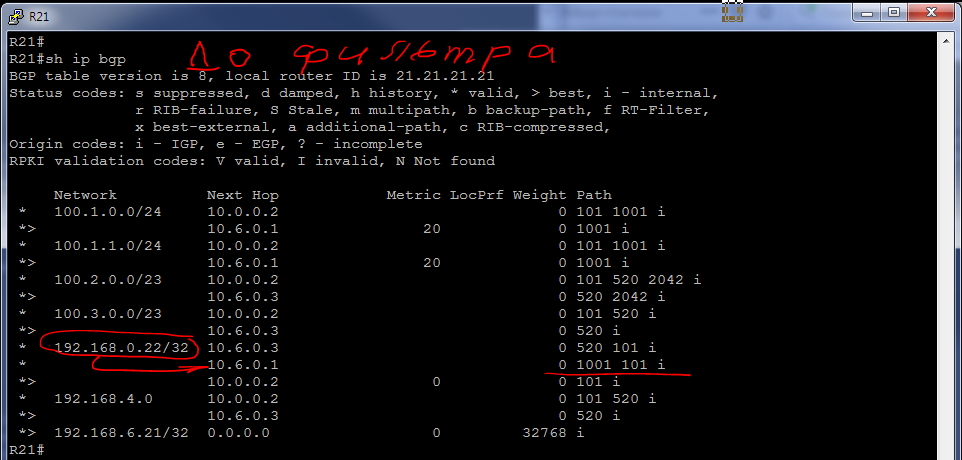
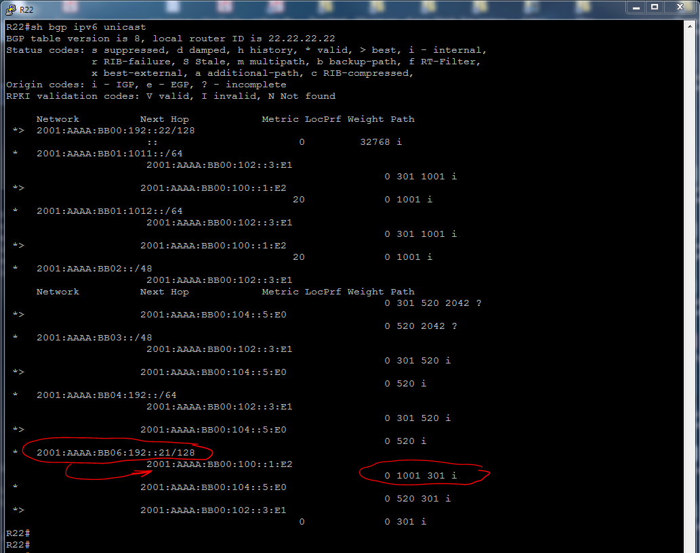
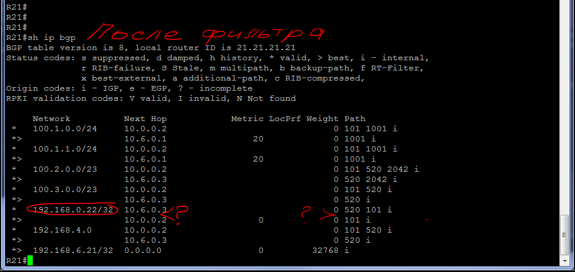
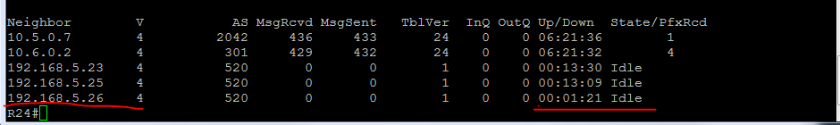
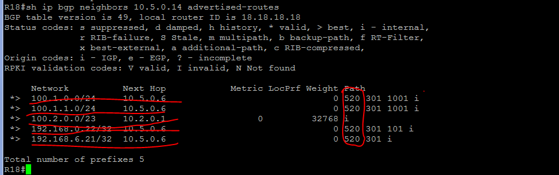
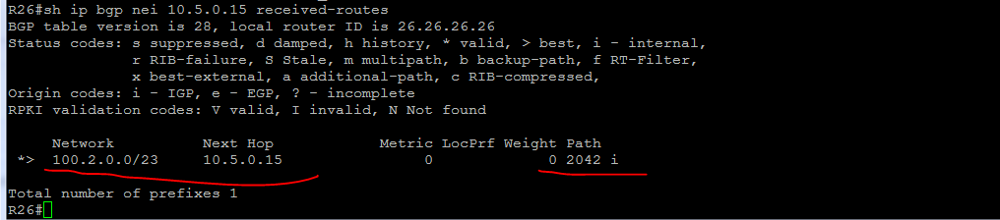

##  **BGP. Управление анонсами (фильтрация).**

### Цель:
Цель: Настроить фильтрацию для офиса Москва. Настроить фильтрацию для офиса Санкт Петербург.
    
### Требования:

В этой самостоятельной работе необходимо:

1. Настроить фильтрацию в офисе Москва так, чтобы не появилось транзитного трафика(As-path).
2. Настроить фильтрацию в офисе Санкт Петербург так, чтобы не появилось транзитного трафика(Prefix-list).
3. Настроить провайдера Киторн так, чтобы в офис Москва отдавался только маршрут по-умолчанию.
4. Настроить провайдера Ламас так, чтобы в офис Москва отдавался только маршрут по-умолчанию и префикс офиса Санкт Петербург.
5. Все сети в лабораторной работе должны иметь IP связность.
6. План работы и изменения зафиксированы в документации.

### Шаги выполнения:
1. [Документирование адресного пространства для лабораторного стенда.](README.md#I-&#1076;&#1086;&#1082;&#1091;&#1084;&#1077;&#1085;&#1090;&#1080;&#1088;&#1086;&#1074;&#1072;&#1085;&#1080;&#1077;&#45;&#1072;&#1076;&#1088;&#1077;&#1089;&#1085;&#1086;&#1075;&#1086;&#45;&#1087;&#1088;&#1086;&#1089;&#1090;&#1088;&#1072;&#1085;&#1089;&#1090;&#1074;&#1072;&#45;&#1076;&#1083;&#1103;&#45;&#1083;&#1072;&#1073;&#1086;&#1088;&#1072;&#1090;&#1086;&#1088;&#1085;&#1086;&#1075;&#1086;&#45;&#1089;&#1090;&#1077;&#1085;&#1076;&#1072;)

    a. [Таблица выделенных подсетей.](README.md#a-&#1090;&#1072;&#1073;&#1083;&#1080;&#1094;&#1072;&#45;&#1074;&#1099;&#1076;&#1077;&#1083;&#1077;&#1085;&#1085;&#1099;&#1093;&#45;&#1087;&#1086;&#1076;&#1089;&#1077;&#1090;&#1077;&#1081;)
    
    b. [Таблица IP адресов.](README.md#b-&#1090;&#1072;&#1073;&#1083;&#1080;&#1094;&#1072;&#45;&#105;&#112;&#45;&#1072;&#1076;&#1088;&#1077;&#1089;&#1086;&#1074;)
    
       
2. [Настройка сетевого оборудования.](README.md#II-&#1085;&#1072;&#1089;&#1090;&#1088;&#1086;&#1081;&#1082;&#1072;&#45;&#1089;&#1077;&#1090;&#1077;&#1074;&#1086;&#1075;&#1086;&#45;&#1086;&#1073;&#1086;&#1088;&#1091;&#1076;&#1086;&#1074;&#1072;&#1085;&#1080;&#1103;)

    a. [Распределение автономных систем.](README.md#a-&#1088;&#1072;&#1089;&#1087;&#1088;&#1077;&#1076;&#1077;&#1083;&#1077;&#1085;&#1080;&#1077;&#45;&#1072;&#1074;&#1090;&#1086;&#1085;&#1086;&#1084;&#1085;&#1099;&#1093;&#45;&#1089;&#1080;&#1089;&#1090;&#1077;&#1084;)

    b. [Настройка фильтрации для офисов Москва и Санкт Петербург.](README.md#b-&#1085;&#1072;&#1089;&#1090;&#1088;&#1086;&#1081;&#1082;&#1072;&#45;&#1092;&#1080;&#1083;&#1100;&#1090;&#1088;&#1072;&#1094;&#1080;&#1080;&#45;&#1076;&#1083;&#1103;&#45;&#1086;&#1092;&#1080;&#1089;&#1086;&#1074;&#45;&#1084;&#1086;&#1089;&#1082;&#1074;&#1072;&#45;&#1080;&#45;&#1089;&#1072;&#1085;&#1082;&#1090;&#45;&#1087;&#1077;&#1090;&#1077;&#1088;&#1073;&#1091;&#1088;&#1075;)
    
    c. [Проверка IP связности между офисами.](README.md#c-&#1087;&#1088;&#1086;&#1074;&#1077;&#1088;&#1082;&#1072;&#45;&#105;&#112;&#45;&#1089;&#1074;&#1103;&#1079;&#1085;&#1086;&#1089;&#1090;&#1080;&#45;&#1084;&#1077;&#1078;&#1076;&#1091;&#45;&#1086;&#1092;&#1080;&#1089;&#1072;&#1084;&#1080;)
    
   
4. [Итоговая схема.](README.md#IV-&#1080;&#1090;&#1086;&#1075;&#1086;&#1074;&#1072;&#1103;&#45;&#1089;&#1093;&#1077;&#1084;&#1072;)

### Ход выполнения:
    Для выполнения лабораторной работы использовался эмулятор EVE-NG, терминальный клиент PuTTY..

#### **_I. Документирование адресного пространства для лабораторного стенда._**

   *_Используемые сети:_*

10.0.0.0/8 - используется для линков Point-to-Point.

192.168.0.0/16 - используется для Loopback's.

172.16.0.0/16 - управление коммутаторами.

100.0.0.0/8 - пользовательские сети.

2001:AAAA::/48 - сеть выделенная провайдером. На площадке используются сети с префиксом /64. Для адреса в последнем хекстете будет использоваться, если это возможно, цифра из названия устройства.

FE80::/10 - сеть для адресов link-local. Для адреса в последнем хекстете будет использоваться, если это возможно, цифра из названия устройства и номер порта.
    
#### a. Таблица выделенных подсетей.

    Таблица 1.
    |----------------|-------|-------------------|-----------------|---------------------------|------------------------|--------------------------|
    |  Расположение  |  AS   |      IPv4 сеть    |Родительская сеть|        IPv6 сеть          |  Родительская сеть     |      Описание            |
    |----------------|-------|-------------------|-----------------|---------------------------|------------------------|--------------------------|
    | Ламас          | 302   | 10.6.0.0/31       |  10.6.0.0/23    | 2001:AAAA:BB06:100::/64   | 2001:AAAA:BB06::/48    | R21e0/0 - R15e0/2        |
    |                | 302   | 10.6.0.2/31       |  10.6.0.0/23    | 2001:AAAA:BB06:102::/64   | 2001:AAAA:BB06::/48    | R21e0/2 - R24e0/0        |
    |                | 302   | 192.168.6.0/24    |                 | 2001:AAAA:BB06:192::/64   | 2001:AAAA:BB06::/48    | Loopback's               |
    |----------------|-------|-------------------|-----------------|---------------------------|------------------------|--------------------------|
    | Триада         | 520   | 10.5.0.0/31       |  10.5.0.0/23    | 2001:AAAA:BB05:100::/64   | 2001:AAAA:BB05::/48    | R23e0/2 - R24e0/2        |
    |                | 520   | 10.5.0.2/31       |  10.5.0.0/23    | 2001:AAAA:BB05:102::/64   | 2001:AAAA:BB05::/48    | R23e0/1 - R25e0/0        |
    |                | 520   | 10.5.0.4/31       |  10.5.0.0/23    | 2001:AAAA:BB05:104::/64   | 2001:AAAA:BB05::/48    | R24e0/1 - R26e0/0        |
    |                | 520   | 10.5.0.6/31       |  10.5.0.0/23    | 2001:AAAA:BB05:106::/64   | 2001:AAAA:BB05::/48    | R24e0/3 - R18e0/2        |
    |                | 520   | 10.5.0.8/31       |  10.5.0.0/23    | 2001:AAAA:BB05:108::/64   | 2001:AAAA:BB05::/48    | R25e0/2 - R26e0/2        |
    |                | 520   | 10.5.0.10/31      |  10.5.0.0/23    | 2001:AAAA:BB05:110::/64   | 2001:AAAA:BB05::/48    | R25e0/3 - R28e0/1        |
    |                | 520   | 10.5.0.12/31      |  10.5.0.0/23    | 2001:AAAA:BB05:112::/64   | 2001:AAAA:BB05::/48    | R25e0/1 - R27e0/0        |
    |                | 520   | 10.5.0.14/31      |  10.5.0.0/23    | 2001:AAAA:BB05:114::/64   | 2001:AAAA:BB05::/48    | R26e0/3 - R18e0/3        |
    |                | 520   | 10.5.0.16/31      |  10.5.0.0/23    | 2001:AAAA:BB05:116::/64   | 2001:AAAA:BB05::/48    | R26e0/1 - R28e0/0        |
    |                | 520   | 192.168.5.0/24    |                 | 2001:AAAA:BB05:192::/64   | 2001:AAAA:BB05::/48    | Loopback's               |
    |----------------|-------|-------------------|-----------------|---------------------------|------------------------|--------------------------|
    | Москва         | 1001  | 10.1.0.0/31       |  10.1.0.0/23    | 2001:AAAA:BB01:100::/64   | 2001:AAAA:BB01::/48    | R14e0/3 - R19e0/0        |
    |                | 1001  | 10.1.0.2/31       |  10.1.0.0/23    | 2001:AAAA:BB01:102::/64   | 2001:AAAA:BB01::/48    | R14e0/0 - R12e0/2        |
    |                | 1001  | 10.1.0.4/31       |  10.1.0.0/23    | 2001:AAAA:BB01:104::/64   | 2001:AAAA:BB01::/48    | R14e0/1 - R13e0/3        |
    |                | 1001  | 10.1.0.6/31       |  10.1.0.0/23    | 2001:AAAA:BB01:106::/64   | 2001:AAAA:BB01::/48    | R15e0/1 - R12e0/3        |
    |                | 1001  | 10.1.0.8/31       |  10.1.0.0/23    | 2001:AAAA:BB01:108::/64   | 2001:AAAA:BB01::/48    | R15e0/0 - R13e0/2        |
    |                | 1001  | 10.1.0.10/31      |  10.1.0.0/23    | 2001:AAAA:BB01:110::/64   | 2001:AAAA:BB01::/48    | R15e0/3 - R20e0/0        |
    |                | 1001  | 10.1.0.12/31      |  10.1.0.0/23    | 2001:AAAA:BB01:112::/64   | 2001:AAAA:BB01::/48    | R12e0/1 - R13e0/1        |
    |                | 1001  | 192.168.1.0/24    |                 | 2001:AAAA:BB01:192::/64   | 2001:AAAA:BB01::/48    | Loopback's               |
    |                | 1001  | 172.16.1.0/24     |                 | 2001:AAAA:BB01:172::/64   | 2001:AAAA:BB01::/48    | Коммтаторы Vlan10        |
    |                | 1001  | 100.1.0.0/24      |  100.1.0.0/21   | 2001:AAAA:BB01:1001::/64  | 2001:AAAA:BB01::/48    | Пользователи Vlan11      |
    |                | 1001  | 100.1.1.0/24      |  100.1.0.0/21   | 2001:AAAA:BB01:1002::/64  | 2001:AAAA:BB01::/48    | Пользователи Vlan12      |
    |----------------|-------|-------------------|-----------------|---------------------------|------------------------|--------------------------|
    | С.-Петербург   | 2042  | 10.2.0.0/31       |  10.2.0.0/23    | 2001:AAAA:BB02:100::/64   | 2001:AAAA:BB02::/48    | R18e0/1 - R17e0/1        |
    |                | 2042  | 10.2.0.2/31       |  10.2.0.0/23    | 2001:AAAA:BB02:102::/64   | 2001:AAAA:BB02::/48    | R18e0/0 - R16e0/1        |
    |                | 2042  | 10.2.0.4/31       |  10.2.0.0/23    | 2001:AAAA:BB02:104::/64   | 2001:AAAA:BB02::/48    | R17e0/0 - SW9e0/3        |
    |                | 2042  | 10.2.0.6/31       |  10.2.0.0/23    | 2001:AAAA:BB02:106::/64   | 2001:AAAA:BB02::/48    | R17e0/2 - SW10e1/0       |
    |                | 2042  | 10.2.0.8/31       |  10.2.0.0/23    | 2001:AAAA:BB02:108::/64   | 2001:AAAA:BB02::/48    | R16e0/2 - SW9e1/0        |
    |                | 2042  | 10.2.0.10/31      |  10.2.0.0/23    | 2001:AAAA:BB02:110::/64   | 2001:AAAA:BB02::/48    | R16e0/0 - SW10e0/3       |
    |                | 2042  | 10.2.0.12/31      |  10.2.0.0/23    | 2001:AAAA:BB02:112::/64   | 2001:AAAA:BB02::/48    | R16e0/3 - R32e0/0        |
    |                | 2042  | 10.2.0.14/31      |  10.2.0.0/23    | 2001:AAAA:BB02:114::/64   | 2001:AAAA:BB02::/48    | SW9Po1 - SW9Po1 (e0/0-1) |
    |                | 2042  | 192.168.2.0/24    |                 | 2001:AAAA:BB02:192::/64   | 2001:AAAA:BB02::/48    | Loopback's               |
    |                | 2042  | 172.16.2.0/24     |                 | 2001:AAAA:BB02:172::/64   | 2001:AAAA:BB02::/48    | Коммтаторы Vlan10        |
    |                | 2042  | 100.2.0.0/24      |  100.2.0.0/21   | 2001:AAAA:BB02:1011::/64  | 2001:AAAA:BB02::/48    | Пользователи Vlan11      |
    |                | 2042  | 100.2.1.0/24      |  100.2.0.0/21   | 2001:AAAA:BB02:1012::/64  | 2001:AAAA:BB02::/48    | Пользователи Vlan12      |
    |----------------|-------|-------------------|-----------------|---------------------------|------------------------|--------------------------|
    

#### b. Таблица IP адресов.

    Таблица 2.
    |--------------|------------|------------|----------------|-----------------|-------------------------------|---------------------------|----------------------|
    | Расположение | Устройство |  Порт      |   IPv4 адрес   | Родит. сеть     |          IPv6 адрес           |  Родительская сеть        |      Описание        |
    |--------------|------------|------------|----------------|-----------------|-------------------------------|---------------------------|----------------------|
    | С.-Петербург | R18        | Lo0        | 192.168.2.18   | 192.168.2.0/32  | 2001:AAAA:BB02:192::18/128    | 2001:AAAA:BB02:192::/64   | Loopback R18         |
    |              |            | e0/2       | 10.5.0.7       | 10.5.0.6/31     | 2001:AAAA:BB05:106::7:E2/64   | 2001:AAAA:BB05:106::/64   |                      |
    |              |            |            |                |                 | FE80::18:E2                   | FE80::/10                 |                      |
    |              |            | e0/3       | 10.5.0.15      | 10.5.0.14/31    | 2001:AAAA:BB05:114::15:E3/64  | 2001:AAAA:BB05:114::/64   |                      |
    |              |            |            |                |                 | FE80::18:E3                   | FE80::/10                 |                      |
    |              |            | e0/1       | 10.2.0.0       | 10.2.0.0/31     | 2001:AAAA:BB02:100::E1/64     | 2001:AAAA:BB02:100::/64   |                      |
    |              |            |            |                |                 | FE80::18:E1                   | FE80::/10                 |                      |
    |              |            | e0/0       | 10.2.0.2       | 10.2.0.2/31     | 2001:AAAA:BB02:102::2:E0/64   | 2001:AAAA:BB02:102::/64   |                      |
    |              |            |            |                |                 | FE80::18:E0                   | FE80::/10                 |                      |
    |--------------|------------|------------|----------------|-----------------|-------------------------------|---------------------------|----------------------|
    | Москва       | R14        | Lo0        | 192.168.1.14   | 192.168.1.0/32  | 2001:AAAA:BB01:192::14/128    | 2001:AAAA:BB01:192::/64   | Loopback R14         |
    |              |            | e0/2       | 10.0.0.1       | 10.0.0.0/31     | 2001:AAAA:BB00:100::1:E2/64   | 2001:AAAA:BB00:100::/64   |                      |
    |              |            |            |                |                 | FE80::14:E2                   | FE80::/10                 |                      |
    |              |            | e0/3       | 10.1.0.0       | 10.1.0.0/31     | 2001:AAAA:BB01:100::E3/64     | 2001:AAAA:BB01:100::/64   |                      |
    |              |            |            |                |                 | FE80::14:E3                   | FE80::/10                 |                      |
    |              |            | e0/0       | 10.1.0.2       | 10.1.0.2/31     | 2001:AAAA:BB01:102::2:E0/64   | 2001:AAAA:BB01:102::/64   |                      |
    |              |            |            |                |                 | FE80::14:E0                   | FE80::/10                 |                      |
    |              |            | e0/1       | 10.1.0.4       | 10.1.0.4/31     | 2001:AAAA:BB01:104::4:E1/64   | 2001:AAAA:BB01:104::/64   |                      |
    |              |            |            |                |                 | FE80::14:E1                   | FE80::/10                 |                      |
    |              |------------|------------|----------------|-----------------|-------------------------------|---------------------------|----------------------|
    |              | R15        | Lo0        | 192.168.1.15   | 192.168.1.0/32  | 2001:AAAA:BB01:192::15/128    | 2001:AAAA:BB01:192::/64   | Loopback R15         |
    |              |            | e0/2       | 10.6.0.1       | 10.6.0.0/31     | 2001:AAAA:BB06:100::1:E2/64   | 2001:AAAA:BB06:100::/64   |                      |
    |              |            |            |                |                 | FE80::15:E2                   | FE80::/10                 |                      |
    |              |            | e0/1       | 10.1.0.6       | 10.1.0.6/31     | 2001:AAAA:BB01:106::6:E1/64   | 2001:AAAA:BB01:106::/64   |                      |
    |              |            |            |                |                 | FE80::15:E1                   | FE80::/10                 |                      |
    |              |            | e0/0       | 10.1.0.8       | 10.1.0.8/31     | 2001:AAAA:BB01:108::8:E0/64   | 2001:AAAA:BB01:108::/64   |                      |
    |              |            |            |                |                 | FE80::15:E0                   | FE80::/10                 |                      |
    |              |            | e0/3       | 10.1.0.10      | 10.1.0.10/31    | 2001:AAAA:BB01:110::10:E3/64  | 2001:AAAA:BB01:110::/64   |                      |
    |              |            |            |                |                 | FE80::15:E3                   | FE80::/10                 |                      |
    |--------------|------------|------------|----------------|-----------------|-------------------------------|---------------------------|----------------------|
    | Ламас        | R21        | Lo0        | 192.168.6.21   | 192.168.6.0/32  | 2001:AAAA:BB06:192::21/128    | 2001:AAAA:BB06:192::/64   | Loopback R21         |
    |              |            | e0/1       | 10.0.0.3       | 10.0.0.2/31     | 2001:AAAA:BB00:102::3:E1/64   | 2001:AAAA:BB00:102::/64   |                      |
    |              |            |            |                |                 | FE80::21:E1                   | FE80::/10                 |                      |
    |              |            | e0/0       | 10.6.0.0       | 10.6.0.0/31     | 2001:AAAA:BB06:100::E0/64     | 2001:AAAA:BB06:100::/64   |                      |
    |              |            |            |                |                 | FE80::21:E0                   | FE80::/10                 |                      |
    |              |            | e0/2       | 10.6.0.2       | 10.6.0.2/31     | 2001:AAAA:BB06:102::2:E2/64   | 2001:AAAA:BB06:102::/64   |                      |
    |              |            |            |                |                 | FE80::21:E2                   | FE80::/10                 |                      |
    |--------------|------------|------------|----------------|-----------------|-------------------------------|---------------------------|----------------------|
    | Триада       | R23        | Lo0        | 192.168.5.23   | 192.168.5.0/32  | 2001:AAAA:BB05:192::23/128    | 2001:AAAA:BB05:192::/64   | Loopback R23         |
    |              |            | e0/0       | 10.0.0.5       | 10.0.0.4/31     | 2001:AAAA:BB00:104::5:E0/64   | 2001:AAAA:BB00:104::/64   |                      |
    |              |            |            |                |                 | FE80::23:E0                   | FE80::/10                 |                      |
    |              |            | e0/2       | 10.5.0.0       | 10.5.0.0/31     | 2001:AAAA:BB05:100::E2/64     | 2001:AAAA:BB05:100::/64   |                      |
    |              |            |            |                |                 | FE80::23:E2                   | FE80::/10                 |                      |
    |              |            | e0/1       | 10.5.0.2       | 10.5.0.2/31     | 2001:AAAA:BB05:102::2:E1/64   | 2001:AAAA:BB05:102::/64   |                      |
    |              |            |            |                |                 | FE80::23:E1                   | FE80::/10                 |                      |
    |              |------------|------------|----------------|-----------------|-------------------------------|---------------------------|----------------------|
    |              | R24        | Lo0        | 192.168.5.24   | 192.168.5.0/32  | 2001:AAAA:BB05:192::24/128    | 2001:AAAA:BB05:192::/64   | Loopback R24         |
    |              |            | e0/0       | 10.6.0.3       | 10.6.0.2/31     | 2001:AAAA:BB06:102::3:E0/64   | 2001:AAAA:BB06:102::/64   |                      |
    |              |            |            |                |                 | FE80::24:E0                   | FE80::/10                 |                      |
    |              |            | e0/2       | 10.5.0.1       | 10.5.0.0/31     | 2001:AAAA:BB05:100::1:E2/64   | 2001:AAAA:BB05:100::/64   |                      |
    |              |            |            |                |                 | FE80::24:E2                   | FE80::/10                 |                      |
    |              |            | e0/1       | 10.5.0.4       | 10.5.0.4/31     | 2001:AAAA:BB05:104::4:E1/64   | 2001:AAAA:BB05:104::/64   |                      |
    |              |            |            |                |                 | FE80::24:E1                   | FE80::/10                 |                      |
    |              |            | e0/3       | 10.5.0.6       | 10.5.0.6/31     | 2001:AAAA:BB05:106::6:E3/64   | 2001:AAAA:BB05:106::/64   |                      |
    |              |            |            |                |                 | FE80::24:E3                   | FE80::/10                 |                      |
    |              |------------|------------|----------------|-----------------|-------------------------------|---------------------------|----------------------|
    |              | R26        | Lo0        | 192.168.5.26   | 192.168.5.0/32  | 2001:AAAA:BB05:192::26/128    | 2001:AAAA:BB05:192::/64   | Loopback R26         |
    |              |            | e0/0       | 10.5.0.5       | 10.5.0.4/31     | 2001:AAAA:BB05:104::5:E0/64   | 2001:AAAA:BB05:104::/64   |                      |
    |              |            |            |                |                 | FE80::26:E0                   | FE80::/10                 |                      |
    |              |            | e0/3       | 10.5.0.14      | 10.5.0.14/31    | 2001:AAAA:BB05:114::14:E3/64  | 2001:AAAA:BB05:114::/64   |                      |
    |              |            |            |                |                 | FE80::26:E3                   | FE80::/10                 |                      |
    |              |            | e0/1       | 10.5.0.16      | 10.5.0.16/31    | 2001:AAAA:BB05:116::16:E1/64  | 2001:AAAA:BB05:116::/64   |                      |
    |              |            |            |                |                 | FE80::26:E1                   | FE80::/10                 |                      |
    |              |            | e0/2       | 10.5.0.9       | 10.5.0.8/31     | 2001:AAAA:BB05:108::9:E2/64   | 2001:AAAA:BB05:108::/64   |                      |
    |              |            |            |                |                 | FE80::26:E2                   | FE80::/10                 |                      |
    |              |------------|------------|----------------|-----------------|-------------------------------|---------------------------|----------------------|
    |              | R25        | Lo0        | 192.168.5.25   | 192.168.5.0/32  | 2001:AAAA:BB05:192::25/128    | 2001:AAAA:BB05:192::/64   | Loopback R25         |
    |              |            | e0/0       | 10.5.0.3       | 10.5.0.2/31     | 2001:AAAA:BB05:102::3:E0/64   | 2001:AAAA:BB05:102::/64   |                      |
    |              |            |            |                |                 | FE80::25:E0                   | FE80::/10                 |                      |
    |              |            | e0/2       | 10.5.0.8       | 10.5.0.8/31     | 2001:AAAA:BB05:108::8:E2/64   | 2001:AAAA:BB05:108::/64   |                      |
    |              |            |            |                |                 | FE80::25:E2                   | FE80::/10                 |                      |
    |              |            | e0/3       | 10.5.0.10      | 10.5.0.10/31    | 2001:AAAA:BB05:110::10:E3/64  | 2001:AAAA:BB05:110::/64   |                      |
    |              |            |            |                |                 | FE80::25:E3                   | FE80::/10                 |                      |
    |              |            | e0/1       | 10.5.0.12      | 10.5.0.12/31    | 2001:AAAA:BB05:112::12:E1/64  | 2001:AAAA:BB05:112::/64   |                      |
    |              |            |            |                |                 | FE80::25:E1                   | FE80::/10                 |                      |
    |--------------|------------|------------|----------------|-----------------|-------------------------------|---------------------------|----------------------|
    

#### **_II. Настройка сетевого оборудования._**

*_IBGP (англ. Internal BGP)_* - является одной из форм протокола BGP для обмена информацией о маршрутах внутри AS. Использование IBGP является гораздо более гибким, и обеспечивает более эффективные пути для управления обменом информацией как внутри AS, так и вовне, предоставляя возможность согласовывать обмен информацией о путях к данной AS с внешними neighbors. Например, с помощью IBGP можно управлять точкой выхода из AS.

*_Автономная система (autonomous system, AS)_* — набор маршрутизаторов, имеющих единые правила маршрутизации, управляемых одной технической администрацией и работающих на одном из протоколов IGP (для внутренней маршрутизации AS может использовать и несколько IGP).

#### a. Распределение автономных систем.

- Киторн - AS101;
- Ламас - AS301;
- Триада - AS520;
- Москва - AS1001;
- Санкт Петербург - AS2042.

#### b. Настройка фильтрации для офисов Москва и Санкт Петербург.

Файлы с полной конфигурацией маршрутизаторов находятся в папке [configs](configs/) в файлах **_RRR-int.txt_**. Первые символы в названии файлов соответствуют именам сетевых устройств.

В данном разделе настроила на роутерах настройка фильтрацию для офисов Москва и Санкт Петербург как для IPv4, так и IPv6. Ниже привела команды для настройки маршрутизаторов.

1. Для того, что бы избежать ситуации, когда клиент может стать транзитной AS из-за того, что он анонсирует сети провайдеров друг другу, необходимо фильтровать трафик таким образом, чтобы провайдерам анонсировались только сети клиента. В этом случае правилом может быть: анонсировать только сети с пустым значением AS path (локальные сети клиента).
 
До применения фильтра, проверила какие префиксы прилетают на маршрутизатор R21 (Ламас) - команда **_sh ip bgp_** для IPv4, и маршрутизатор R22 (Киторн) - команда **_show bgp ipv6 unicast_** для IPv6). Вывод на рисунках 1 и 2.

Рисунок 1.

Рисунок 2.

Настрою фильтры на граничных марщрутизаторах R14 и R15 офиса Москва. Так как настройки идентичны, привела пример для маршрутизатора R15.

**Маршрутизатор R15:**

---------------------------------------------------------------

    conf t
    !
    ! Создала фильтр, в котором разрешила анансировать только сети офиса Москва, остальные запретила. 
    ip as-path access-list 1 permit ^$
    ip as-path access-list 1 deny .*
    !
    ! Применила фильтр в отношении соседа Ламас.
    router bgp 1001
     neighbor 10.6.0.0 filter-list 1 out
     exit
    exit
--------------------------------------------------------------

После настройки фильтров на маршрутизаторах R14 и R15, повторила ввод команд **_sh ip bgp_** для IPv4 и **_show bgp ipv6 unicast_** для IPv6 (вывод на рис.3 и 4).
Рисунок 3.

Рисунок 4.

На рисунках вижу, что сквозного маршрута через австономную систему 1001 нет.

2. Настроика фильтрации в офисе Санкт Петербург так, чтобы не появилось транзитного трафика (Prefix-list).

До настройки фильтра, был поставлен научный эксперимент, в котором участвовали роутеры R23-R26 (Триада) и R18 (Санкт Петербург).
Задача эксперимента: получить транзитный трафик на роутере офиса Санкт Петербург.
Для этого были выключены раутеры R23 и R25, а так же порт E0/0 на R26 введен в состояние "shutdown". Посмотрим, что происходит на маршрутизаторах:

Маршрутизатор R24 - потерял соседей по автономной системе (рисунок 1-э).

Рисунок 1-э.

Маршрутизатор R18, как порядочный сосед, передает роутеру R26, кроме своих префиксов и все префиксы, которые он, по секрету, узнал от "друга" слева из AS 520, а именно роутера R24 (рисунок 2-э).

Рисунок 2-э.

Что же делает этот неблагодарный роутер 26? А он не принимает префиксы пришедшие из автономной системы 520, так как считает, что про свою автономную систему он знает все (рис.3-э).

Рисунок 3-э.

В ходе эксперимента не удалось создать транзитный трафик.

Но во избежание транзитного трафика, который может появиться если офис Санкт Петербург решит выбрать себе еще провайдера, из другой автономной системы, настроила фильтры на маршрутизаторе R18 с помощью Prefix-list.

**Маршрутизатор R18:**

---------------------------------------------------------------

    conf t
    !
    router bgp 520
     bgp router-id 24.24.24.24
     neighbor 192.168.5.23 remote-as 520
     neighbor 192.168.5.23 update-source Loopback 0
     neighbor 192.168.5.25 remote-as 520
     neighbor 192.168.5.25 update-source Loopback 0
     neighbor 192.168.5.26 remote-as 520
     neighbor 192.168.5.26 update-source Loopback 0
     neighbor 2001:AAAA:BB05:192::23 remote-as 520
     neighbor 2001:AAAA:BB05:192::23 update-source Loopback 0
     neighbor 2001:AAAA:BB05:192::25 remote-as 520
     neighbor 2001:AAAA:BB05:192::25 update-source Loopback 0
     neighbor 2001:AAAA:BB05:192::26 remote-as 520
     neighbor 2001:AAAA:BB05:192::26 update-source Loopback 0 
     address-family ipv4
      neighbor 192.168.5.23 activate
      neighbor 192.168.5.25 activate
      neighbor 192.168.5.26 activate
      neighbor 192.168.5.23 next-hop-self
      neighbor 192.168.5.25 next-hop-self
      neighbor 192.168.5.26 next-hop-self
      exit
     address-family ipv6
      neighbor 2001:AAAA:BB05:192::23 activate
      neighbor 2001:AAAA:BB05:192::25 activate
      neighbor 2001:AAAA:BB05:192::26 activate
      neighbor 2001:AAAA:BB05:192::23 next-hop-self
      neighbor 2001:AAAA:BB05:192::25 next-hop-self
      neighbor 2001:AAAA:BB05:192::26 next-hop-self
      exit
     exit
    exit  

--------------------------------------------------------------

Теперь снова введу команды **_sh ip bgp summary_** для IPv4 и **_show bgp ipv6 unicast summary_** для IPv6 на маршрутизаторе R24 (рис.2) и посмотрю результаты вывода.

Рисунок 2.

А в результате вывода вижу, что маршрутизатор R24 считает своим "соседом" маршрутизатор R25 (192.168.5.25), хотя физическими линками они не связаны.
Аналогичная картина наблюдается и на остальных маршрутизаторах в зоне Триада.

3. Настроила оборудование в офисе Москва так, чтобы приоритетным провайдером стал Ламас. Для того, что бы убедиться действительно ли трафик из моей системы разворачивается в нужном направлении, временно прописала на R15 в протоколе OSPF команду **_default-information originate metric 20_**, которая перераспределяет любой маршрут по умолчанию найденный в таблице маршрутизации (статический или полученный по другому протоколу маршрутизации). По умолчанию метрика маршрута будет 1, а тип маршрута — E2.

После этого запустила **_trace 100.2.1.5 -P 1_** c компьютера VPC1 (100.1.0.4) на компьютер VPC (100.2.1.5) и увидела, что трафик идет через провайдера Киторн (рис.3).

Рисунок 3.

Теперь верну настройки на R15 в исходное состояние и настрою маршрутизатор R14.

**Маршрутизатор R14:**

---------------------------------------------------------------

    conf t
    !
    router ospf 10
     default-information originate metric 20
     exit
    ipv6 router ospf 10
     default-information originate metric 20
     exit

--------------------------------------------------------------

Проверю куда теперь направляется трафик (рис.4).

Рисунок 4.

Трафик, как и сказано в условии лабораторной работы, направляется через провайдера Ламас.

4. Настроила маршрутизатор R18 в офисе Санкт Петербург так, чтобы трафик распределялся по двум линкам одновременно, помощью команды **_maximum-paths \<n>_** указав количество разрешенных маршрутов.

**Маршрутизатор R18:**

---------------------------------------------------------------

    conf t
    !
    router bgp 2042
     address-family ipv4
      maximum-paths 2
      exit
     address-family ipv6
      maximum-paths 2
      exit
     exit
    exit
    
--------------------------------------------------------------

Для проверки ввела команды **_sh ip bgp summary_** для IPv4 и **_sh bgp ipv6 unicast_** для IPv6 на R2 (рис.4).

Рисунок 4.

Вижу, что маршруты к объявленным сетям прилетают по двум линкам одновременно.

5. Все сети в лабораторной работе должны иметь IP связность.

#### c. Организация IP связности между офисами.

По условиям лабораторной работы я должна организовать IP доступность между офисами Москва и С.-Петербург. Для этого, на пограничных маршрутизаторах необходимо объявить сети, которые должны быть доступны.
Настройки на маршрутизаторах R14 и R15 идентичны, по этому располагаю пример настройки одного на роутере R14.

**Маршрутизатор R14:**

----------------------------------------------------------------
    
    conf t
    !
    router bgp 1001
     address-family ipv4
      ! Объявила пользовательские сети для протокола IPv4:
      network 100.1.0.0 mask 255.255.255.0
      network 100.1.1.0 mask 255.255.255.0
      exit
     address-family ipv6
      ! Объявила пользовательские сети для протокола IPv6:
      network 2001:AAAA:BB01:1001::/64
      network 2001:AAAA:BB01:1002::/64
      exit
     exit
    exit
    !
    
----------------------------------------------------------------

После того, как я объявила на пограничных маршрутизаторах необходимые сети, посмотрю, что происходит на R22 и R21 (рис.5):

Рисунок 5.

Из вывода команды **_sh ip bgp summary_** вижу, что на каждом маршрутизаторе появилось по два префикса - это мои объявленные сети. Проверить можно с помощью команды **_sh ip bgp_**. Вывод команды на рисунке 6.

Рисунок 6.

Здесь я вижу объявленные мной сети, вижу с каких интерфейсов моршрутизаторы их получают, а так же вижу путь (через какие AS прилетели маршруты). 
Теперь проверю наличие этих сетей на маршрутизаторе Санкт Петербурга R18. Результат проверки на рисунке 7.

Рисунок 7.

Так же проверю сети прилетевшие по IPv6 (рис.8)

Рисунок 8.

Для анонсирования необходимых сетей на граничном маршрутизаторе R18 в Санкт Петербурге воспользуюсь перераспределением (redistribute) сетей из протокола EIGRP в протокол BGP.
Для этого использую команду **_redistribute_**, а так же, создала route-map и prefix-list. Настройка маршрутизатора приведена ниже.

**Маршрутизатор R18:**

----------------------------------------------------------------
    
    conf t
    !
    ip prefix-list LOCAL_OFFICE_NET seq 5 permit 100.2.0.0/23 le 24
    ip prefix-list LOCAL_OFFICE_NET seq 10 deny 0.0.0.0/0 ge 1
    !
    ipv6 prefix-list LOCAL_OFFICE_NET_IPV6 seq 10 permit 2001:AAAA:BB02::/48
    ipv6 prefix-list LOCAL_OFFICE_NET_IPV6 seq 30 deny ::/0
    !
    route-map FROM_EIGRP permit 10
     match ip address prefix-list LOCAL_OFFICE_NET
    !
    route-map FROM_EIGRP_RPV6 permit 10 
     match ip address prefix-list LOCAL_OFFICE_NET_IPV6
    !
    router bgp 2042
     address-family ipv4
      redistribute eigrp 1 route-map FROM_EIGRP
     address-family ipv6
      redistribute eigrp 1 route-map FROM_EIGRP_RPV6
      exit
     exit
    exit
    !
    
----------------------------------------------------------------

Для проверки наличия маршрутов на R14 в офисе Москва ввела команду **_sh ip bgp_** (для IPv4) и **_sh bgp ipv6 unicast_** (рис.9).

Рисунок 9.

Тут я вижу, что необходимые сети присутствуют.

Осталось провести проверки IP доступности между офисами Москва и Санкт Петербург.

Для наглядности, выписала IP адреса компьютеров:

**__Москва__**

*Компьютер VPC1:*

----------------------------------------------------------------
    
    IPv4 адрес: 100.1.0.4       
    маска: 255.255.255.0
    шлюз: 100.1.0.1
    
    IPv6 адрес: 2001:aaaa:bb01:1011:2050:79ff:fe66:6801/64
    
----------------------------------------------------------------

*Компьютер VPC7:*

----------------------------------------------------------------
    
    IPv4 адрес: 100.1.1.7       
    маска: 255.255.255.0
    шлюз: 100.1.1.1
    
    IPv6 адрес: 2001:aaaa:bb01:1012:2050:79ff:fe66:6807/64
        
----------------------------------------------------------------

**__Санкт Петербург__**

*Компьютер VPC8:*

----------------------------------------------------------------
    
    IPv4 адрес: 100.2.0.8       
    маска: 255.255.255.0
    шлюз: 100.2.0.1
    
    IPv6 адрес: 2001:aaaa:bb02:1011:2050:79ff:fe66:6808/64
    
----------------------------------------------------------------

*Компьютер VPC:*

----------------------------------------------------------------
    
    IPv4 адрес: 100.2.1.5   
    маска: 255.255.255.0
    шлюз: 100.2.1.1
    
    IPv6 адрес: 2001:aaaa:bb02:1012:2050:79ff:fe66:680b/64
    
----------------------------------------------------------------

Для проверки запустила команду **_ping_** на конечных устройствах, находящихся в данных офисах. Так как команда ping позволяет выполнить отправку управляющего сообщения типа Echo Request адресуемому узлу и получает от него ответ, можно запускать проверку из одного офиса. Выбрала офис Санкт Петербурга.

ping с VPC (Санкт Петербург) на VPC1 и VPC7 (Москва) рисунок 10.

Рисунок 10.

ping с VPC8 (Санкт Петербург) на VPC1 и VPC7 (Москва) рисунок 10.

Рисунок 11.

IP доступности между офисами Москва и Санкт Петербург в наличии.

#### **_IV. Итоговая схема._**

На рис.12 размещены используемые сети, IPv4 и IPv6 адреса маршрутизаторов.

Рисунок 12.

