##  **Основные протоколы сети интернет - DNS, NTP.**
##  **Различия в технологии NAT.**

### Цель:
Цель: Настроить DHCP в офисе Москва. Настроить синхронизацию времени в офисе Москва. Настроить NAT в офисах Москва, Санкт Перетбруг и Чокурдах.
    
### Требования:

В этой самостоятельной работе необходимо:

1. Настроить NAT(PAT) на R14 и R15. Трансляция должна осуществляться в адрес автономной системы AS1001.
2. Настроить NAT(PAT) на R18. Трансляция должна осуществляться в пул из 5 адресов автономной системы AS2042.
3. Настроить статический NAT для R20.
4. Настроить NAT так, чтобы R19 был доступен с любого узла для удаленного управления.
5. Настроить статический NAT(PAT) для офиса Чокурдах.
6. Настроить DHCP сервер в офисе Москва на маршрутизаторах R12 и R13. VPC1 и VPC7 должны получать сетевые настройки по DHCP.
7. Настроить NTP сервер на R12 и R13. Все устройства в офисе Москва должны синхронизировать время с R12 и R13.
8. Все офисы в лабораторной работе должны иметь IP связность.
9. План работы и изменения зафиксировать в документации.

### Шаги выполнения:
1. [Документирование адресного пространства для лабораторного стенда.](README.md#I-&#1076;&#1086;&#1082;&#1091;&#1084;&#1077;&#1085;&#1090;&#1080;&#1088;&#1086;&#1074;&#1072;&#1085;&#1080;&#1077;&#45;&#1072;&#1076;&#1088;&#1077;&#1089;&#1085;&#1086;&#1075;&#1086;&#45;&#1087;&#1088;&#1086;&#1089;&#1090;&#1088;&#1072;&#1085;&#1089;&#1090;&#1074;&#1072;&#45;&#1076;&#1083;&#1103;&#45;&#1083;&#1072;&#1073;&#1086;&#1088;&#1072;&#1090;&#1086;&#1088;&#1085;&#1086;&#1075;&#1086;&#45;&#1089;&#1090;&#1077;&#1085;&#1076;&#1072;)

    a. [Таблица выделенных подсетей.](README.md#a-&#1090;&#1072;&#1073;&#1083;&#1080;&#1094;&#1072;&#45;&#1074;&#1099;&#1076;&#1077;&#1083;&#1077;&#1085;&#1085;&#1099;&#1093;&#45;&#1087;&#1086;&#1076;&#1089;&#1077;&#1090;&#1077;&#1081;)
    
    b. [Таблица IP адресов.](README.md#b-&#1090;&#1072;&#1073;&#1083;&#1080;&#1094;&#1072;&#45;&#105;&#112;&#45;&#1072;&#1076;&#1088;&#1077;&#1089;&#1086;&#1074;)
    
       
2. [Настройка сетевого оборудования.](README.md#II-&#1085;&#1072;&#1089;&#1090;&#1088;&#1086;&#1081;&#1082;&#1072;&#45;&#1089;&#1077;&#1090;&#1077;&#1074;&#1086;&#1075;&#1086;&#45;&#1086;&#1073;&#1086;&#1088;&#1091;&#1076;&#1086;&#1074;&#1072;&#1085;&#1080;&#1103;)

    a. [Распределение автономных систем.](README.md#a-&#1088;&#1072;&#1089;&#1087;&#1088;&#1077;&#1076;&#1077;&#1083;&#1077;&#1085;&#1080;&#1077;&#45;&#1072;&#1074;&#1090;&#1086;&#1085;&#1086;&#1084;&#1085;&#1099;&#1093;&#45;&#1089;&#1080;&#1089;&#1090;&#1077;&#1084;)

    b. [Настройка NAT(PAT) на маршрутизаторах R14 и R15 в офисе Москва.](README.md#b-&#1085;&#1072;&#1089;&#1090;&#1088;&#1086;&#1081;&#1082;&#1072;&#45;&#110;&#97;&#116;&#112;&#97;&#116;&#45;&#1085;&#1072;&#45;&#1084;&#1072;&#1088;&#1096;&#1088;&#1091;&#1090;&#1080;&#1079;&#1072;&#1090;&#1086;&#1088;&#1072;&#1093;&#45;&#114;&#49;&#52;&#45;&#1080;&#45;&#114;&#49;&#53;&#45;&#1074;&#45;&#1086;&#1092;&#1080;&#1089;&#1077;&#45;&#1084;&#1086;&#1089;&#1082;&#1074;&#1072;)
    
    c. [Настройка статического NAT для R20 (офис Москва).](README.md#c-&#1085;&#1072;&#1089;&#1090;&#1088;&#1086;&#1081;&#1082;&#1072;&#45;&#1089;&#1090;&#1072;&#1090;&#1080;&#1095;&#1077;&#1089;&#1082;&#1086;&#1075;&#1086;&#45;&#110;&#97;&#116;&#45;&#1076;&#1083;&#1103;&#45;&#114;&#50;&#48;&#45;&#1086;&#1092;&#1080;&#1089;&#45;&#1084;&#1086;&#1089;&#1082;&#1074;&#1072;)
    
    d. [Настройка NAT для маршрутизатора R19 (офис Москва).](README.md#d-&#1085;&#1072;&#1089;&#1090;&#1088;&#1086;&#1081;&#1082;&#1072;&#45;&#110;&#97;&#116;&#45;&#1076;&#1083;&#1103;&#45;&#1084;&#1072;&#1088;&#1096;&#1088;&#1091;&#1090;&#1080;&#1079;&#1072;&#1090;&#1086;&#1088;&#1072;&#45;&#114;&#49;&#57;&#45;&#1086;&#1092;&#1080;&#1089;&#45;&#1084;&#1086;&#1089;&#1082;&#1074;&#1072;)
    
    e. [Настройка DHCP сервера в офисе Москва на маршрутизаторах R12 и R13.](README.md#e-&#1085;&#1072;&#1089;&#1090;&#1088;&#1086;&#1081;&#1082;&#1072;&#45;&#100;&#104;&#99;&#112;&#45;&#1089;&#1077;&#1088;&#1074;&#1077;&#1088;&#1072;&#45;&#1074;&#45;&#1086;&#1092;&#1080;&#1089;&#1077;&#45;&#1084;&#1086;&#1089;&#1082;&#1074;&#1072;&#45;&#1085;&#1072;&#45;&#1084;&#1072;&#1088;&#1096;&#1088;&#1091;&#1090;&#1080;&#1079;&#1072;&#1090;&#1086;&#1088;&#1072;&#1093;&#45;&#114;&#49;&#50;&#45;&#1080;&#45;&#114;&#49;&#51;)
    
    f. [Настройка NAT(PAT) на маршрутизаторе R18 в офисе Санкт Петербург.](README.md#f-&#1085;&#1072;&#1089;&#1090;&#1088;&#1086;&#1081;&#1082;&#1072;&#45;&#110;&#97;&#116;&#112;&#97;&#116;&#45;&#1085;&#1072;&#45;&#1084;&#1072;&#1088;&#1096;&#1088;&#1091;&#1090;&#1080;&#1079;&#1072;&#1090;&#1086;&#1088;&#1077;&#45;&#82;&#49;&#56;&#45;&#1074;&#45;&#1086;&#1092;&#1080;&#1089;&#1077;&#45;&#1089;&#1072;&#1085;&#1082;&#1090;&#45;&#1087;&#1077;&#1090;&#1077;&#1088;&#1073;&#1091;&#1088;&#1075;)
    
    g. [Настройка статического NAT(PAT) для офиса Чокурдах.](README.md#g-&#1085;&#1072;&#1089;&#1090;&#1088;&#1086;&#1081;&#1082;&#1072;&#45;&#1089;&#1090;&#1072;&#1090;&#1080;&#1095;&#1077;&#1089;&#1082;&#1086;&#1075;&#1086;&#45;&#110;&#97;&#116;&#112;&#97;&#116;&#45;&#1076;&#1083;&#1103;&#45;&#1086;&#1092;&#1080;&#1089;&#1072;&#45;&#1095;&#1086;&#1082;&#1091;&#1088;&#1076;&#1072;&#1093;)
    
    h. [Настройка NTP сервера на маршрутизаторах R12 и R13 в офисе Москва.](README.md#h-&#1085;&#1072;&#1089;&#1090;&#1088;&#1086;&#1081;&#1082;&#1072;&#45;&#110;&#116;&#112;&#45;&#1089;&#1077;&#1088;&#1074;&#1077;&#1088;&#1072;&#45;&#1085;&#1072;&#45;&#1084;&#1072;&#1088;&#1096;&#1088;&#1091;&#1090;&#1080;&#1079;&#1072;&#1090;&#1086;&#1088;&#1072;&#1093;&#45;&#114;&#49;&#50;&#45;&#1080;&#45;&#114;&#49;&#51;&#45;&#1074;&#45;&#1086;&#1092;&#1080;&#1089;&#1077;&#45;&#1084;&#1086;&#1089;&#1082;&#1074;&#1072;)
    
     
3. [Итоговая схема.](README.md#III-&#1080;&#1090;&#1086;&#1075;&#1086;&#1074;&#1072;&#1103;&#45;&#1089;&#1093;&#1077;&#1084;&#1072;)

### Ход выполнения:
    Для выполнения лабораторной работы использовался эмулятор EVE-NG, терминальный клиент PuTTY..

#### **_I. Документирование адресного пространства для лабораторного стенда._**

   *_Используемые сети:_*

10.0.0.0/8 - используется для линков Point-to-Point.

192.168.0.0/16 - используется для Loopback's.

172.16.0.0/16 - управление коммутаторами.

100.0.0.0/8 - пользовательские сети.

2001:AAAA::/48 - сеть выделенная провайдером. На площадке используются сети с префиксом /64. Для адреса в последнем хекстете будет использоваться, если это возможно, цифра из названия устройства.

FE80::/10 - сеть для адресов link-local. Для адреса в последнем хекстете будет использоваться, если это возможно, цифра из названия устройства и номер порта.
    
#### a. Таблица выделенных подсетей.

    Таблица 1.
    |----------------|-------|-------------------|-----------------|---------------------------|------------------------|--------------------------|
    |  Расположение  |  AS   |      IPv4 сеть    |Родительская сеть|        IPv6 сеть          |  Родительская сеть     |      Описание            |
    |----------------|-------|-------------------|-----------------|---------------------------|------------------------|--------------------------|
    | Ламас          | 302   | 10.6.0.0/31       |  10.6.0.0/23    | 2001:AAAA:BB06:100::/64   | 2001:AAAA:BB06::/48    | R21e0/0 - R15e0/2        |
    |                | 302   | 10.6.0.2/31       |  10.6.0.0/23    | 2001:AAAA:BB06:102::/64   | 2001:AAAA:BB06::/48    | R21e0/2 - R24e0/0        |
    |                | 302   | 192.168.6.0/24    |                 | 2001:AAAA:BB06:192::/64   | 2001:AAAA:BB06::/48    | Loopback's               |
    |----------------|-------|-------------------|-----------------|---------------------------|------------------------|--------------------------|
    | Триада         | 520   | 10.5.0.0/31       |  10.5.0.0/23    | 2001:AAAA:BB05:100::/64   | 2001:AAAA:BB05::/48    | R23e0/2 - R24e0/2        |
    |                | 520   | 10.5.0.2/31       |  10.5.0.0/23    | 2001:AAAA:BB05:102::/64   | 2001:AAAA:BB05::/48    | R23e0/1 - R25e0/0        |
    |                | 520   | 10.5.0.4/31       |  10.5.0.0/23    | 2001:AAAA:BB05:104::/64   | 2001:AAAA:BB05::/48    | R24e0/1 - R26e0/0        |
    |                | 520   | 10.5.0.6/31       |  10.5.0.0/23    | 2001:AAAA:BB05:106::/64   | 2001:AAAA:BB05::/48    | R24e0/3 - R18e0/2        |
    |                | 520   | 10.5.0.8/31       |  10.5.0.0/23    | 2001:AAAA:BB05:108::/64   | 2001:AAAA:BB05::/48    | R25e0/2 - R26e0/2        |
    |                | 520   | 10.5.0.10/31      |  10.5.0.0/23    | 2001:AAAA:BB05:110::/64   | 2001:AAAA:BB05::/48    | R25e0/3 - R28e0/1        |
    |                | 520   | 10.5.0.12/31      |  10.5.0.0/23    | 2001:AAAA:BB05:112::/64   | 2001:AAAA:BB05::/48    | R25e0/1 - R27e0/0        |
    |                | 520   | 10.5.0.14/31      |  10.5.0.0/23    | 2001:AAAA:BB05:114::/64   | 2001:AAAA:BB05::/48    | R26e0/3 - R18e0/3        |
    |                | 520   | 10.5.0.16/31      |  10.5.0.0/23    | 2001:AAAA:BB05:116::/64   | 2001:AAAA:BB05::/48    | R26e0/1 - R28e0/0        |
    |                | 520   | 192.168.5.0/24    |                 | 2001:AAAA:BB05:192::/64   | 2001:AAAA:BB05::/48    | Loopback's               |
    |----------------|-------|-------------------|-----------------|---------------------------|------------------------|--------------------------|
    | Москва         | 1001  | 10.1.0.0/31       |  10.1.0.0/23    | 2001:AAAA:BB01:100::/64   | 2001:AAAA:BB01::/48    | R14e0/3 - R19e0/0        |
    |                | 1001  | 10.1.0.2/31       |  10.1.0.0/23    | 2001:AAAA:BB01:102::/64   | 2001:AAAA:BB01::/48    | R14e0/0 - R12e0/2        |
    |                | 1001  | 10.1.0.4/31       |  10.1.0.0/23    | 2001:AAAA:BB01:104::/64   | 2001:AAAA:BB01::/48    | R14e0/1 - R13e0/3        |
    |                | 1001  | 10.1.0.6/31       |  10.1.0.0/23    | 2001:AAAA:BB01:106::/64   | 2001:AAAA:BB01::/48    | R15e0/1 - R12e0/3        |
    |                | 1001  | 10.1.0.8/31       |  10.1.0.0/23    | 2001:AAAA:BB01:108::/64   | 2001:AAAA:BB01::/48    | R15e0/0 - R13e0/2        |
    |                | 1001  | 10.1.0.10/31      |  10.1.0.0/23    | 2001:AAAA:BB01:110::/64   | 2001:AAAA:BB01::/48    | R15e0/3 - R20e0/0        |
    |                | 1001  | 10.1.0.12/31      |  10.1.0.0/23    | 2001:AAAA:BB01:112::/64   | 2001:AAAA:BB01::/48    | R12e0/1 - R13e0/1        |
    |                | 1001  | 192.168.1.0/24    |                 | 2001:AAAA:BB01:192::/64   | 2001:AAAA:BB01::/48    | Loopback's               |
    |                | 1001  | 172.16.1.0/24     |                 | 2001:AAAA:BB01:172::/64   | 2001:AAAA:BB01::/48    | Коммтаторы Vlan10        |
    |                | 1001  | 100.1.0.0/24      |  100.1.0.0/21   | 2001:AAAA:BB01:1001::/64  | 2001:AAAA:BB01::/48    | Пользователи Vlan11      |
    |                | 1001  | 100.1.1.0/24      |  100.1.0.0/21   | 2001:AAAA:BB01:1002::/64  | 2001:AAAA:BB01::/48    | Пользователи Vlan12      |
    |                | 1001  | 10.1.14.0/30      |  10.1.14.0/24   |                           |                        | R14e0/2                  |
    |                | 1001  | 10.1.15.0/30      |  10.1.15.0/24   |                           |                        | R15e0/2                  |
    |                | 1001  | 10.1.115.0/30     |  10.1.115.0/24  |                           |                        | R15e0/2                  |
    |----------------|-------|-------------------|-----------------|---------------------------|------------------------|--------------------------|
    | С.-Петербург   | 2042  | 10.2.0.0/31       |  10.2.0.0/23    | 2001:AAAA:BB02:100::/64   | 2001:AAAA:BB02::/48    | R18e0/1 - R17e0/1        |
    |                | 2042  | 10.2.0.2/31       |  10.2.0.0/23    | 2001:AAAA:BB02:102::/64   | 2001:AAAA:BB02::/48    | R18e0/0 - R16e0/1        |
    |                | 2042  | 10.2.0.4/31       |  10.2.0.0/23    | 2001:AAAA:BB02:104::/64   | 2001:AAAA:BB02::/48    | R17e0/0 - SW9e0/3        |
    |                | 2042  | 10.2.0.6/31       |  10.2.0.0/23    | 2001:AAAA:BB02:106::/64   | 2001:AAAA:BB02::/48    | R17e0/2 - SW10e1/0       |
    |                | 2042  | 10.2.0.8/31       |  10.2.0.0/23    | 2001:AAAA:BB02:108::/64   | 2001:AAAA:BB02::/48    | R16e0/2 - SW9e1/0        |
    |                | 2042  | 10.2.0.10/31      |  10.2.0.0/23    | 2001:AAAA:BB02:110::/64   | 2001:AAAA:BB02::/48    | R16e0/0 - SW10e0/3       |
    |                | 2042  | 10.2.0.12/31      |  10.2.0.0/23    | 2001:AAAA:BB02:112::/64   | 2001:AAAA:BB02::/48    | R16e0/3 - R32e0/0        |
    |                | 2042  | 10.2.0.14/31      |  10.2.0.0/23    | 2001:AAAA:BB02:114::/64   | 2001:AAAA:BB02::/48    | SW9Po1 - SW9Po1 (e0/0-1) |
    |                | 2042  | 192.168.2.0/24    |                 | 2001:AAAA:BB02:192::/64   | 2001:AAAA:BB02::/48    | Loopback's               |
    |                | 2042  | 172.16.2.0/24     |                 | 2001:AAAA:BB02:172::/64   | 2001:AAAA:BB02::/48    | Коммтаторы Vlan10        |
    |                | 2042  | 100.2.0.0/24      |  100.2.0.0/21   | 2001:AAAA:BB02:1011::/64  | 2001:AAAA:BB02::/48    | Пользователи Vlan11      |
    |                | 2042  | 100.2.1.0/24      |  100.2.0.0/21   | 2001:AAAA:BB02:1012::/64  | 2001:AAAA:BB02::/48    | Пользователи Vlan12      |
    |                | 2042  | 10.2.18.0/29      |  100.2.0.0/21   |                           |                        | NAT                      |
    |----------------|-------|-------------------|-----------------|---------------------------|------------------------|--------------------------|
    | Чокурдах       |       | 192.168.3.0/24    |                 | 2001:AAAA:BB03:192::/64   | 2001:AAAA:BB03::/48    | Loopback's               |
    |                |       | 172.16.3.0/24     |                 | 2001:AAAA:BB03:172::/64   | 2001:AAAA:BB03::/48    | Коммтаторы Vlan10        |
    |                |       | 100.3.0.0/24      |  100.3.0.0/21   | 2001:AAAA:BB03:1021::/64  | 2001:AAAA:BB03::/48    | Пользователи Vlan11      |
    |                |       | 100.3.1.0/24      |  100.3.0.0/21   | 2001:AAAA:BB03:1022::/64  | 2001:AAAA:BB03::/48    | Пользователи Vlan12      |
    |                |       | 10.3.28.0/29      |  100.3.0.0/21   |                           |                        | NAT                      |
    |----------------|-------|-------------------|-----------------|---------------------------|------------------------|--------------------------|
    | Лабытнанги     |       | 192.168.4.0/24    |                 | 2001:AAAA:BB04:192::/64   | 2001:AAAA:BB04::/48    | Loopback's               |
    |----------------|-------|-------------------|-----------------|---------------------------|------------------------|--------------------------|
    | Киторн         | 101   | 10.0.0.0/31       |  10.0.0.0/23    | 2001:AAAA:BB00:100::/64   | 2001:AAAA:BB00::/48    | R22e0/0 - R14e0/2        |
    |                | 101   | 10.0.0.2/31       |  10.0.0.0/23    | 2001:AAAA:BB00:102::/64   | 2001:AAAA:BB00::/48    | R22e0/1 - R21e0/1        |
    |                | 101   | 10.0.0.4/31       |  10.0.0.0/23    | 2001:AAAA:BB00:104::/64   | 2001:AAAA:BB00::/48    | R22e0/2 - R23e0/0        |
    |                | 101   | 192.168.0.0/24    |                 | 2001:AAAA:BB00:192::/64   | 2001:AAAA:BB00::/48    | Loopback's               |
    |----------------|-------|-------------------|-----------------|---------------------------|------------------------|--------------------------|
    

#### b. Таблица IP адресов.

    Таблица 2.
    |--------------|------------|------------|----------------|-----------------|-------------------------------|---------------------------|----------------------|
    | Расположение | Устройство |  Порт      |   IPv4 адрес   | Родит. сеть     |          IPv6 адрес           |  Родительская сеть        |      Описание        |
    |--------------|------------|------------|----------------|-----------------|-------------------------------|---------------------------|----------------------|
    | Киторн       | R22        | Lo0        | 192.168.0.22   | 192.168.0.0/32  | 2001:AAAA:BB00:192::22/128    | 2001:AAAA:BB00:192::/64   | Loopback R22         |
    |              |            | e0/0       | 10.0.0.0       | 10.0.0.0/31     | 2001:AAAA:BB00:100::E0/64     | 2001:AAAA:BB00:100::/64   |                      |
    |              |            |            |                |                 | FE80::22:E0                   | FE80::/10                 |                      |
    |              |            | e0/1       | 10.0.0.2       | 10.0.0.2/31     | 2001:AAAA:BB00:102::2:E1/64   | 2001:AAAA:BB00:102::/64   |                      |
    |              |            |            |                |                 | FE80::22:E1                   | FE80::/10                 |                      |
    |              |            | e0/2       | 10.0.0.4       | 10.0.0.4/31     | 2001:AAAA:BB00:104::4:E2/64   | 2001:AAAA:BB00:104::/64   |                      |
    |              |            |            |                |                 | FE80::22:E2                   | FE80::/10                 |                      |
    |--------------|------------|------------|----------------|-----------------|-------------------------------|---------------------------|----------------------|
    | Москва       | R14        | Lo0        | 192.168.1.14   | 192.168.1.0/32  | 2001:AAAA:BB01:192::14/128    | 2001:AAAA:BB01:192::/64   | Loopback R14         |
    |              |            | e0/2       | 10.0.0.1       | 10.0.0.0/31     | 2001:AAAA:BB00:100::1:E2/64   | 2001:AAAA:BB00:100::/64   |                      |
    |              |            |            |                |                 | FE80::14:E2                   | FE80::/10                 |                      |
    |              |            | e0/2       | 10.1.14.1      | 10.1.14.0/30    |                               |                           | NAT                  |
    |              |            | e0/3       | 10.1.0.0       | 10.1.0.0/31     | 2001:AAAA:BB01:100::E3/64     | 2001:AAAA:BB01:100::/64   |                      |
    |              |            |            |                |                 | FE80::14:E3                   | FE80::/10                 |                      |
    |              |            | e0/0       | 10.1.0.2       | 10.1.0.2/31     | 2001:AAAA:BB01:102::2:E0/64   | 2001:AAAA:BB01:102::/64   |                      |
    |              |            |            |                |                 | FE80::14:E0                   | FE80::/10                 |                      |
    |              |            | e0/1       | 10.1.0.4       | 10.1.0.4/31     | 2001:AAAA:BB01:104::4:E1/64   | 2001:AAAA:BB01:104::/64   |                      |
    |              |            |            |                |                 | FE80::14:E1                   | FE80::/10                 |                      |
    |              |------------|------------|----------------|-----------------|-------------------------------|---------------------------|----------------------|
    |              | R15        | Lo0        | 192.168.1.15   | 192.168.1.0/32  | 2001:AAAA:BB01:192::15/128    | 2001:AAAA:BB01:192::/64   | Loopback R15         |
    |              |            | e0/2       | 10.6.0.1       | 10.6.0.0/31     | 2001:AAAA:BB06:100::1:E2/64   | 2001:AAAA:BB06:100::/64   |                      |
    |              |            |            |                |                 | FE80::15:E2                   | FE80::/10                 |                      |
    |              |            | e0/2       | 10.1.15.1      | 10.1.15.0/30    |                               |                           | NAT                  |
    |              |            | e0/2       | 10.1.115.1     | 10.1.115.0/30   |                               |                           | static NAT для R20   |   
    |              |            | e0/1       | 10.1.0.6       | 10.1.0.6/31     | 2001:AAAA:BB01:106::6:E1/64   | 2001:AAAA:BB01:106::/64   |                      |
    |              |            |            |                |                 | FE80::15:E1                   | FE80::/10                 |                      |
    |              |            | e0/0       | 10.1.0.8       | 10.1.0.8/31     | 2001:AAAA:BB01:108::8:E0/64   | 2001:AAAA:BB01:108::/64   |                      |
    |              |            |            |                |                 | FE80::15:E0                   | FE80::/10                 |                      |
    |              |            | e0/3       | 10.1.0.10      | 10.1.0.10/31    | 2001:AAAA:BB01:110::10:E3/64  | 2001:AAAA:BB01:110::/64   |                      |
    |              |            |            |                |                 | FE80::15:E3                   | FE80::/10                 |                      |
    |              |------------|------------|----------------|-----------------|-------------------------------|---------------------------|----------------------|
    |              | R19        | Lo0        | 192.168.1.19   | 192.168.1.0/32  | 2001:AAAA:BB01:192::19/128    | 2001:AAAA:BB01:192::/64   | Loopback R19         |
    |              |            | e0/0       | 10.1.0.1       | 10.1.0.0/31     | 2001:AAAA:BB01:100::1:E0/64   | 2001:AAAA:BB01:100::/64   |                      |
    |              |            |            |                |                 | FE80::19:E0                   | FE80::/10                 |                      |
    |              |------------|------------|----------------|-----------------|-------------------------------|---------------------------|----------------------|
    |              | R12        | Lo0        | 192.168.1.12   | 192.168.1.0/32  | 2001:AAAA:BB01:192::12/128    | 2001:AAAA:BB01:192::/64   | Loopback R12         |
    |              |            | e0/2       | 10.1.0.3       | 10.1.0.2/31     | 2001:AAAA:BB01:102::3:E2/64   | 2001:AAAA:BB01:102::/64   |                      |
    |              |            |            |                |                 | FE80::12:E2                   | FE80::/10                 |                      |
    |              |            | e0/3       | 10.1.0.7       | 10.1.0.6/31     | 2001:AAAA:BB01:106::7:E3/64   | 2001:AAAA:BB01:106::/64   |                      |
    |              |            |            |                |                 | FE80::12:E3                   | FE80::/10                 |                      |
    |              |            | e0/1       | 10.1.0.12      | 10.1.0.12/31    | 2001:AAAA:BB01:112::12:E1/64  | 2001:AAAA:BB01:112::/64   |                      |
    |              |            |            |                |                 | FE80::12:E1                   | FE80::/10                 |                      |
    |              |            | e0/0       | N/A            | N/A             | N/A                           |                           |                      |
    |              |            | e0/0.10    | 172.16.1.2     | 172.16.1.0/24   | 2001:AAAA:BB01:172::2/64      | 2001:AAAA:BB01:172::/64   | Коммутаторы Vlan10   |
    |              |            |            | 172.16.1.1     | 172.16.1.0/24   | 2001:AAAA:BB01:172::1/64      | 2001:AAAA:BB01:172::/64   | Виртуальный IP       |
    |              |            | e0/0.11    | 100.1.0.2      | 100.1.0.0/24    | 2001:AAAA:BB01:1011::2/64     | 2001:AAAA:BB01:1011::/64  | Пользователи Vlan11  |
    |              |            |            | 100.1.0.1      | 100.1.0.0/24    | 2001:AAAA:BB01:1011::1/64     | 2001:AAAA:BB01:1011::/64  | Виртуальный IP       |
    |              |            | e0/0.12    | 100.1.1.2      | 100.1.1.0/24    | 2001:AAAA:BB01:1012::2/64     | 2001:AAAA:BB01:1012::/64  | Пользователи Vlan12  |
    |              |            |            | 100.1.1.1      | 100.1.1.0/24    | 2001:AAAA:BB01:1012::1/64     | 2001:AAAA:BB01:1012::/64  | Виртуальный IP       |
    |              |------------|------------|----------------|-----------------|-------------------------------|---------------------------|----------------------|
    |              | R13        | Lo0        | 192.168.1.13   | 192.168.1.0/32  | 2001:AAAA:BB01:192::13/128    | 2001:AAAA:BB01:192::/64   | Loopback R13         |
    |              |            | e0/1       | 10.1.0.13      | 10.1.0.12/31    | 2001:AAAA:BB01:112::13:E1/64  | 2001:AAAA:BB01:112::/64   |                      |
    |              |            |            |                |                 | FE80::13:E1                   | FE80::/10                 |                      |
    |              |            | e0/3       | 10.1.0.5       | 10.1.0.4/31     | 2001:AAAA:BB01:104::5:E3/64   | 2001:AAAA:BB01:104::/64   |                      |
    |              |            |            |                |                 | FE80::13:E3                   | FE80::/10                 |                      |
    |              |            | e0/2       | 10.1.0.9       | 10.1.0.8/31     | 2001:AAAA:BB01:108::9:E2/64   | 2001:AAAA:BB01:108::/64   |                      |
    |              |            |            |                |                 | FE80::13:E2                   | FE80::/10                 |                      |
    |              |            | e0/0       | N/A            | N/A             | N/A                           |                           |                      |
    |              |            | e0/0.10    | 172.16.1.3     | 172.16.1.0/24   | 2001:AAAA:BB01:172::3/64      | 2001:AAAA:BB01:172::/64   | Коммутаторы Vlan10   |
    |              |            |            | 172.16.1.1     | 172.16.1.0/24   | 2001:AAAA:BB01:172::1/64      | 2001:AAAA:BB01:172::/64   | Виртуальный IP       |
    |              |            | e0/0.11    | 100.1.0.3      | 100.1.0.0/24    | 2001:AAAA:BB01:1011::3/64     | 2001:AAAA:BB01:1011::/64  | Пользователи Vlan11  |
    |              |            |            | 100.1.0.1      | 100.1.0.0/24    | 2001:AAAA:BB01:1011::1/64     | 2001:AAAA:BB01:1011::/64  | Виртуальный IP       |
    |              |            | e0/0.12    | 100.1.1.3      | 100.1.1.0/24    | 2001:AAAA:BB01:1012::3/64     | 2001:AAAA:BB01:1012::/64  | Пользователи Vlan12  |
    |              |            |            | 100.1.1.1      | 100.1.1.0/24    | 2001:AAAA:BB01:1012::1/64     | 2001:AAAA:BB01:1012::/64  | Виртуальный IP       |
    |              |------------|------------|----------------|-----------------|-------------------------------|---------------------------|----------------------|
    |              | R20        | Lo0        | 192.168.1.20   | 192.168.1.0/32  | 2001:AAAA:BB01:192::20/128    | 2001:AAAA:BB01:192::/64   | Loopback R19         |
    |              |            | e0/0       | 10.1.0.11      | 10.1.0.10/31    | 2001:AAAA:BB01:110::11:E0/64  | 2001:AAAA:BB01:110::/64   |                      |
    |              |            |            |                |                 | FE80::20:E0                   | FE80::/10                 |                      |
    |              |------------|------------|----------------|-----------------|-------------------------------|---------------------------|----------------------|
    |              | SW4        | Int Vlan10 | 172.16.1.14    | 172.16.1.0/24   | 2001:AAAA:BB01:172::4c/64     | 2001:AAAA:BB01:172::/64   |                      |
    |              |            |            |                |                 | FE80::c4:10                   | FE80::/10                 |                      |
    |              |------------|------------|----------------|-----------------|-------------------------------|---------------------------|----------------------|    
    |              | SW5        | Int Vlan10 | 172.16.1.15    | 172.16.1.0/24   | 2001:AAAA:BB01:172::5c/64     | 2001:AAAA:BB01:172::/64   |                      |
    |              |            |            |                |                 | FE80::c5:10                   | FE80::/10                 |                      |
    |              |------------|------------|----------------|-----------------|-------------------------------|---------------------------|----------------------| 
    |              | SW3        | Int Vlan10 | 172.16.1.13    | 172.16.1.0/24   | 2001:AAAA:BB01:172::3c/64     | 2001:AAAA:BB01:172::/64   |                      |
    |              |            |            |                |                 | FE80::c3:10                   | FE80::/10                 |                      |
    |              |------------|------------|----------------|-----------------|-------------------------------|---------------------------|----------------------| 
    |              | SW2        | Int Vlan10 | 172.16.1.12    | 172.16.1.0/24   | 2001:AAAA:BB01:172::2c/64     | 2001:AAAA:BB01:172::/64   |                      |
    |              |            |            |                |                 | FE80::c2:10                   | FE80::/10                 |                      |
    |              |------------|------------|----------------|-----------------|-------------------------------|---------------------------|----------------------| 
    |              | VPC1       |            | DHCP           | 100.1.0.0/24    | autoconfig                    | 2001:AAAA:BB01:1011::/64  |                      |
    |              | VPC7       |            | DHCP           | 100.1.1.0/24    | autoconfig                    | 2001:AAAA:BB01:1012::/64  |                      |
    |--------------|------------|------------|----------------|-----------------|-------------------------------|---------------------------|----------------------|
    | С.-Петербург | R18        | Lo0        | 192.168.2.18   | 192.168.2.0/32  | 2001:AAAA:BB02:192::18/128    | 2001:AAAA:BB02:192::/64   | Loopback R18         |
    |              |            | e0/2       | 10.5.0.7       | 10.5.0.6/31     | 2001:AAAA:BB05:106::7:E2/64   | 2001:AAAA:BB05:106::/64   |                      |
    |              |            |            |                |                 | FE80::18:E2                   | FE80::/10                 |                      |
    |              |            | e0/3       | 10.5.0.15      | 10.5.0.14/31    | 2001:AAAA:BB05:114::15:E3/64  | 2001:AAAA:BB05:114::/64   |                      |
    |              |            |            |                |                 | FE80::18:E3                   | FE80::/10                 |                      |
    |              |            | e0/1       | 10.2.0.0       | 10.2.0.0/31     | 2001:AAAA:BB02:100::E1/64     | 2001:AAAA:BB02:100::/64   |                      |
    |              |            |            |                |                 | FE80::18:E1                   | FE80::/10                 |                      |
    |              |            | e0/0       | 10.2.0.2       | 10.2.0.2/31     | 2001:AAAA:BB02:102::2:E0/64   | 2001:AAAA:BB02:102::/64   |                      |
    |              |            |            |                |                 | FE80::18:E0                   | FE80::/10                 |                      |
    |              |            |            | 10.2.18.1 -    |                 |                               |                           |                      |
    |              |            |            |      10.2.18.5 |                 |                               |                           | NAT                  |
    |              |------------|------------|----------------|-----------------|-------------------------------|---------------------------|----------------------|
    |              | R17        | Lo0        | 192.168.2.17   | 192.168.2.0/32  | 2001:AAAA:BB02:192::17/128    | 2001:AAAA:BB02:192::/64   | Loopback R17         |
    |              |            | e0/1       | 10.2.0.1       | 10.2.0.0/31     | 2001:AAAA:BB02:100::1:E1/64   | 2001:AAAA:BB02:100::/64   |                      |
    |              |            |            |                |                 | FE80::17:E1                   | FE80::/10                 |                      |
    |              |            | e0/0       | 10.2.0.4       | 10.2.0.4/31     | 2001:AAAA:BB02:104::4:E0/64   | 2001:AAAA:BB02:104::/64   |                      |
    |              |            |            |                |                 | FE80::17:E0                   | FE80::/10                 |                      |
    |              |            | e0/2       | 10.2.0.6       | 10.2.0.6/31     | 2001:AAAA:BB02:106::6:E3/64   | 2001:AAAA:BB02:106::/64   |                      |
    |              |            |            |                |                 | FE80::17:E2                   | FE80::/10                 |                      |
    |              |------------|------------|----------------|-----------------|-------------------------------|---------------------------|----------------------|
    |              | R16        | Lo0        | 192.168.2.16   | 192.168.2.0/32  | 2001:AAAA:BB02:192::16/128    | 2001:AAAA:BB02:192::/64   | Loopback R16         |
    |              |            | e0/1       | 10.2.0.3       | 10.2.0.2/31     | 2001:AAAA:BB02:102::3:E0/64   | 2001:AAAA:BB02:102::/64   |                      |
    |              |            |            |                |                 | FE80::16:E1                   | FE80::/10                 |                      |
    |              |            | e0/2       | 10.2.0.8       | 10.2.0.8/31     | 2001:AAAA:BB02:108::8:E2/64   | 2001:AAAA:BB02:108::/64   |                      |
    |              |            |            |                |                 | FE80::16:E2                   | FE80::/10                 |                      |
    |              |            | e0/0       | 10.2.0.10      | 10.2.0.10/31    | 2001:AAAA:BB02:110::10:E0/64  | 2001:AAAA:BB02:110::/64   |                      |
    |              |            |            |                |                 | FE80::17:E0                   | FE80::/10                 |                      |
    |              |            | e0/3       | 10.2.0.12      | 10.2.0.12/31    | 2001:AAAA:BB02:112::12:E3/64  | 2001:AAAA:BB02:112::/64   |                      |
    |              |            |            |                |                 | FE80::16:E3                   | FE80::/10                 |                      |
    |              |------------|------------|----------------|-----------------|-------------------------------|---------------------------|----------------------|
    |              | R32        | Lo0        | 192.168.2.32   | 192.168.2.0/32  | 2001:AAAA:BB02:192::32/128    | 2001:AAAA:BB02:192::/64   | Loopback R32         |
    |              |            | e0/0       | 10.2.0.13      | 10.2.0.12/31    | 2001:AAAA:BB02:112::13:E0/64  | 2001:AAAA:BB02:112::/64   |                      |
    |              |            |            |                |                 | FE80::32:E0                   | FE80::/10                 |                      |
    |              |------------|------------|----------------|-----------------|-------------------------------|---------------------------|----------------------|
    |              | SW9        | Lo0        | 192.168.2.9    | 192.168.2.0/32  | 2001:AAAA:BB02:192::9c/64     | 2001:AAAA:BB02:192::/64   | Loopback SW9         |
    |              |            | e0/3       | 10.2.0.5       | 10.2.0.4/31     | 2001:AAAA:BB02:104::5:E3/64   | 2001:AAAA:BB02:104::/64   |                      |
    |              |            |            |                |                 | FE80::9c:E3                   | FE80::/10                 |                      |
    |              |            | e1/0       | 10.2.0.9       | 10.2.0.8/31     | 2001:AAAA:BB02:108::9:E10/64  | 2001:AAAA:BB02:108::/64   |                      |
    |              |            |            |                |                 | FE80::9c:E10                  | FE80::/10                 |                      |
    |              |            | Po1(e0/0-1)| 10.2.0.14      | 10.2.0.14/31    | 2001:AAAA:BB02:114::14:c1/64  | 2001:AAAA:BB02:114::/64   |                      |
    |              |            |            |                |                 | FE80::9c:c1                   | FE80::/10                 |                      |
    |              |            | Int Vlan11 | 100.2.0.1      | 100.2.0.0/24    | 2001:AAAA:BB02:1011::1/64     | 2001:AAAA:BB02:1011::/64  |                      |
    |              |            | e0/2       | N/A            | N/A             | N/A                           | N/A                       |                      |
    |              |------------|------------|----------------|-----------------|-------------------------------|---------------------------|----------------------|
    |              | SW10       | Lo0        | 192.168.2.10   | 192.168.2.0/32  | 2001:AAAA:BB02:192::10c/64    | 2001:AAAA:BB02:172::/64   | Loopback SW10        |
    |              |            | Po1(e0/0-1)| 10.2.0.15      | 10.2.0.14/31    | 2001:AAAA:BB02:114::15:c1/64  | 2001:AAAA:BB02:114::/64   |                      |
    |              |            |            |                |                 | FE80::10c:c1                  | FE80::/10                 |                      |
    |              |            | e1/0       | 10.2.0.7       | 10.2.0.6/31     | 2001:AAAA:BB02:106::7:E10/64  | 2001:AAAA:BB02:106::/64   |                      |
    |              |            |            |                |                 | FE80::10c:E10                 | FE80::/10                 |                      |
    |              |            | e0/3       | 10.2.0.11      | 10.2.0.10/31    | 2001:AAAA:BB02:110::11:E3/64  | 2001:AAAA:BB02:110::/64   |                      |
    |              |            |            |                |                 | FE80::10c:E3                  | FE80::/10                 |                      |
    |              |            | Int Vlan12 | 100.2.1.1      | 100.2.1.0/24    | 2001:AAAA:BB01:1012::1/64     | 2001:AAAA:BB01:1012::/64  |                      |
    |              |            | e0/2       | N/A            | N/A             | N/A                           | N/A                       |                      |
    |              |------------|------------|----------------|-----------------|-------------------------------|---------------------------|----------------------|
    |              | VPC8       |            | 100.2.0.8      | 100.2.0.0/24    | autoconfig                    | 2001:AAAA:BB02:1011::/64  |                      |
    |              | VPC        |            | 100.2.1.5      | 100.2.1.0/24    | autoconfig                    | 2001:AAAA:BB02:1012::/64  |                      |
    |--------------|------------|------------|----------------|-----------------|-------------------------------|---------------------------|----------------------|
    | Чокурдах     | R28        | Lo0        | 192.168.3.28   | 192.168.3.0/32  | 2001:AAAA:BB03:192::28/128    | 2001:AAAA:BB03:192::/64   | Loopback R28         |
    |              |            | e0/0       | 10.5.0.17      | 10.5.0.16/31    | 2001:AAAA:BB05:116::17:E0/64  | 2001:AAAA:BB05:116::/64   |                      |
    |              |            |            |                |                 | FE80::28:E0                   | FE80::/10                 |                      |
    |              |            | e0/1       | 10.5.0.11      | 10.5.0.10/31    | 2001:AAAA:BB05:110::11:E1/64  | 2001:AAAA:BB05:110::/64   |                      |
    |              |            |            |                |                 | FE80::28:E1                   | FE80::/10                 |                      |
    |              |            | e0/2       | N/A            | N/A             | N/A                           |                           |                      |
    |              |            | e0/2.10    | 172.16.3.1     | 172.16.3.0/24   | 2001:AAAA:BB03:172::1/64      | 2001:AAAA:BB03:172::/64   | Коммутаторы Vlan10   |
    |              |            |            |                |                 | FE80::28:E210                 | FE80::/10                 |                      |
    |              |            | e0/2.11    | 100.3.0.1      | 100.3.0.0/24    | 2001:AAAA:BB03:1011::1/64     | 2001:AAAA:BB03:1011::/64  | Пользователи Vlan11  |
    |              |            |            |                |                 | FE80::28:E211                 | FE80::/10                 |                      |
    |              |            | e0/2.12    | 100.3.1.1      | 100.3.1.0/24    | 2001:AAAA:BB03:1012::1/64     | 2001:AAAA:BB03:1012::/64  | Пользователи Vlan12  |
    |              |            |            |                |                 | FE80::28:E212                 | FE80::/10                 |                      |
    |              |            |            | 10.3.28.1      | 10.3.28.0/29    |                               |                           | static NAT для R28   |
    |              |            |            | 10.3.28.2      | 10.3.28.0/29    |                               |                           | static NAT для R28   |
    |              |------------|------------|----------------|-----------------|-------------------------------|---------------------------|----------------------|
    |              | SW29       | Int Vlan10 | 172.16.3.29    | 172.16.3.0/24   | 2001:AAAA:BB03:172::29с/64    | 2001:AAAA:BB03:172::/64   |                      |
    |              |            |            |                |                 | FE80::с29:10                  | FE80::/10                 |                      |
    |              |------------|------------|----------------|-----------------|-------------------------------|---------------------------|----------------------|
    |              | VPC30      |            | DHCP           | 100.3.0.0/24    | autoconfig                    | 2001:AAAA:BB03:1011::/64  |                      |
    |              | VPC31      |            | DHCP           | 100.3.1.0/24    | autoconfig                    | 2001:AAAA:BB03:1012::/64  |                      |
    |--------------|------------|------------|----------------|-----------------|-------------------------------|---------------------------|----------------------|
    | Лабытнанги   | R27        | Lo0        | 192.168.4.27   | 192.168.4.0/32  | 2001:AAAA:BB04:192::27/128    | 2001:AAAA:BB04:192::/64   | Loopback R27         |
    |              |            | e0/0       | 10.5.0.13      | 10.5.0.12/31    | 2001:AAAA:BB05:112::13:E0/64  | 2001:AAAA:BB05:112::/64   |                      |
    |              |            |            |                |                 | FE80::27:E0                   | FE80::/10                 |                      |
    |--------------|------------|------------|----------------|-----------------|-------------------------------|---------------------------|----------------------|
    | Триада       | R23        | Lo0        | 192.168.5.23   | 192.168.5.0/32  | 2001:AAAA:BB05:192::23/128    | 2001:AAAA:BB05:192::/64   | Loopback R23         |
    |              |            | e0/0       | 10.0.0.5       | 10.0.0.4/31     | 2001:AAAA:BB00:104::5:E0/64   | 2001:AAAA:BB00:104::/64   |                      |
    |              |            |            |                |                 | FE80::23:E0                   | FE80::/10                 |                      |
    |              |            | e0/2       | 10.5.0.0       | 10.5.0.0/31     | 2001:AAAA:BB05:100::E2/64     | 2001:AAAA:BB05:100::/64   |                      |
    |              |            |            |                |                 | FE80::23:E2                   | FE80::/10                 |                      |
    |              |            | e0/1       | 10.5.0.2       | 10.5.0.2/31     | 2001:AAAA:BB05:102::2:E1/64   | 2001:AAAA:BB05:102::/64   |                      |
    |              |            |            |                |                 | FE80::23:E1                   | FE80::/10                 |                      |
    |              |------------|------------|----------------|-----------------|-------------------------------|---------------------------|----------------------|
    |              | R24        | Lo0        | 192.168.5.24   | 192.168.5.0/32  | 2001:AAAA:BB05:192::24/128    | 2001:AAAA:BB05:192::/64   | Loopback R24         |
    |              |            | e0/0       | 10.6.0.3       | 10.6.0.2/31     | 2001:AAAA:BB06:102::3:E0/64   | 2001:AAAA:BB06:102::/64   |                      |
    |              |            |            |                |                 | FE80::24:E0                   | FE80::/10                 |                      |
    |              |            | e0/2       | 10.5.0.1       | 10.5.0.0/31     | 2001:AAAA:BB05:100::1:E2/64   | 2001:AAAA:BB05:100::/64   |                      |
    |              |            |            |                |                 | FE80::24:E2                   | FE80::/10                 |                      |
    |              |            | e0/1       | 10.5.0.4       | 10.5.0.4/31     | 2001:AAAA:BB05:104::4:E1/64   | 2001:AAAA:BB05:104::/64   |                      |
    |              |            |            |                |                 | FE80::24:E1                   | FE80::/10                 |                      |
    |              |            | e0/3       | 10.5.0.6       | 10.5.0.6/31     | 2001:AAAA:BB05:106::6:E3/64   | 2001:AAAA:BB05:106::/64   |                      |
    |              |            |            |                |                 | FE80::24:E3                   | FE80::/10                 |                      |
    |              |------------|------------|----------------|-----------------|-------------------------------|---------------------------|----------------------|
    |              | R26        | Lo0        | 192.168.5.26   | 192.168.5.0/32  | 2001:AAAA:BB05:192::26/128    | 2001:AAAA:BB05:192::/64   | Loopback R26         |
    |              |            | e0/0       | 10.5.0.5       | 10.5.0.4/31     | 2001:AAAA:BB05:104::5:E0/64   | 2001:AAAA:BB05:104::/64   |                      |
    |              |            |            |                |                 | FE80::26:E0                   | FE80::/10                 |                      |
    |              |            | e0/3       | 10.5.0.14      | 10.5.0.14/31    | 2001:AAAA:BB05:114::14:E3/64  | 2001:AAAA:BB05:114::/64   |                      |
    |              |            |            |                |                 | FE80::26:E3                   | FE80::/10                 |                      |
    |              |            | e0/1       | 10.5.0.16      | 10.5.0.16/31    | 2001:AAAA:BB05:116::16:E1/64  | 2001:AAAA:BB05:116::/64   |                      |
    |              |            |            |                |                 | FE80::26:E1                   | FE80::/10                 |                      |
    |              |            | e0/2       | 10.5.0.9       | 10.5.0.8/31     | 2001:AAAA:BB05:108::9:E2/64   | 2001:AAAA:BB05:108::/64   |                      |
    |              |            |            |                |                 | FE80::26:E2                   | FE80::/10                 |                      |
    |              |------------|------------|----------------|-----------------|-------------------------------|---------------------------|----------------------|
    |              | R25        | Lo0        | 192.168.5.25   | 192.168.5.0/32  | 2001:AAAA:BB05:192::25/128    | 2001:AAAA:BB05:192::/64   | Loopback R25         |
    |              |            | e0/0       | 10.5.0.3       | 10.5.0.2/31     | 2001:AAAA:BB05:102::3:E0/64   | 2001:AAAA:BB05:102::/64   |                      |
    |              |            |            |                |                 | FE80::25:E0                   | FE80::/10                 |                      |
    |              |            | e0/2       | 10.5.0.8       | 10.5.0.8/31     | 2001:AAAA:BB05:108::8:E2/64   | 2001:AAAA:BB05:108::/64   |                      |
    |              |            |            |                |                 | FE80::25:E2                   | FE80::/10                 |                      |
    |              |            | e0/3       | 10.5.0.10      | 10.5.0.10/31    | 2001:AAAA:BB05:110::10:E3/64  | 2001:AAAA:BB05:110::/64   |                      |
    |              |            |            |                |                 | FE80::25:E3                   | FE80::/10                 |                      |
    |              |            | e0/1       | 10.5.0.12      | 10.5.0.12/31    | 2001:AAAA:BB05:112::12:E1/64  | 2001:AAAA:BB05:112::/64   |                      |
    |              |            |            |                |                 | FE80::25:E1                   | FE80::/10                 |                      |
    |--------------|------------|------------|----------------|-----------------|-------------------------------|---------------------------|----------------------|
    | Ламас        | R21        | Lo0        | 192.168.6.21   | 192.168.6.0/32  | 2001:AAAA:BB06:192::21/128    | 2001:AAAA:BB06:192::/64   | Loopback R21         |
    |              |            | e0/1       | 10.0.0.3       | 10.0.0.2/31     | 2001:AAAA:BB00:102::3:E1/64   | 2001:AAAA:BB00:102::/64   |                      |
    |              |            |            |                |                 | FE80::21:E1                   | FE80::/10                 |                      |
    |              |            | e0/0       | 10.6.0.0       | 10.6.0.0/31     | 2001:AAAA:BB06:100::E0/64     | 2001:AAAA:BB06:100::/64   |                      |
    |              |            |            |                |                 | FE80::21:E0                   | FE80::/10                 |                      |
    |              |            | e0/2       | 10.6.0.2       | 10.6.0.2/31     | 2001:AAAA:BB06:102::2:E2/64   | 2001:AAAA:BB06:102::/64   |                      |
    |              |            |            |                |                 | FE80::21:E2                   | FE80::/10                 |                      |
    |--------------|------------|------------|----------------|-----------------|-------------------------------|---------------------------|----------------------|

#### **_II. Настройка сетевого оборудования._**

*_NTP (англ. Network Time Protocol)_* - является протоколом для синхронизации времени. По умолчанию, работает по UDP-порту 123. NTP-серверы работают в иерархической сети, каждый уровень иерархии называется ярусом (stratum). Ярус 0 представлен эталонными часами. За эталон берется сигнал GPS (Global Positioning System) или службы ACTS (Automated Computer Time Service). На нулевом ярусе NTP-серверы не работают.

NTP-серверы яруса 1 получают данные о времени от эталонных часов. NTP-серверы яруса 2 синхронизируются с серверами яруса 1. Всего может быть до 15 ярусов.

*_DNS (англ. Domain Name System «система доменных имён»)_* — компьютерная распределённая система для получения информации о доменах. Чаще всего используется для получения IP-адреса по имени хоста, получения информации о маршрутизации почты и/или обслуживающих узлах для протоколов в домене. Чаще всего используется для получения IP-адреса по имени хоста (компьютера или устройства), получения информации о маршрутизации почты и/или обслуживающих узлах для протоколов в домене (SRV-запись).

*_NAT (Network Address Translation, трансляция сетевых адресов)_* — это функция для изменения IP-адреса во время передачи пакетов Ethernet через маршрутизатор. Чаще всего используется для подключения устройств в локальной сети к сети Интернет, но может использовать и для других целей.

Файлы с полной конфигурацией маршрутизаторов находятся в папке [configs](configs/) в файлах **_RRR-int.txt_**. Первые символы в названии файлов соответствуют именам сетевых устройств.

#### **_a. Распределение автономных систем._**

- Киторн - AS101;
- Ламас - AS301;
- Триада - AS520;
- Москва - AS1001;
- Санкт Петербург - AS2042.

#### **_b. Настройка NAT(PAT) на маршрутизаторах R14 и R15 в офисе Москва._**

По условию трансляция должна осуществляться в адрес автономной системы AS1001. Для этого выделила две сети. Маршрутизатор R14 - 10.1.14.0/30, Маршрутизатор R15 - 10.1.15.0/30. Ниже привела команды для настройки маршрутизаторов. Настройки для R14 и R15 идентичны.

**Маршрутизатор R15:**

---------------------------------------------------------------

    conf t
    !
    # Прописала ip-адрес на интерфейсе e0/2
    int Ethernet0/2
     ip address 10.1.15.1 255.255.255.252 secondary
     exit
    !
    # Подняла NAT с выделением для трансляции в один адрес.
    ip nat pool NAT-MOSKVA 10.1.15.1 10.1.15.1 netmask 255.255.255.252
    !
    # Разрешила использовать один и тот же адрес разными клиентами (использует разные порты для трансляции)
    ip nat inside source list 1 pool NAT-MOSKVA overload
    !
    # В access-list определила, какие клиентские адреса могут работать через NAT. 
    access-list 1 permit 100.1.0.0 0.0.7.255
    exit

    conf t
    !
    # Настроила  интерфейсы как внутренние (inside), так и наружные (outside) относительно NAT.
    int Ethernet0/2
     ip nat outside
     exit
    int range Ethernet0/0-1
     ip nat inside
     exit

    router bgp 1001
     address-family ipv4
      # Объявила миру сеть выделенную под NAT. 
      network 10.1.15.0 mask 255.255.255.252
      # С помощью route-map отфильтровала connected адреса, которые буду транслировать.
      redistribute connected route-map CONNECT_TO_BGP
      exit
     exit
    # Создала route-map
    route-map CONNECT_TO_BGP permit 10
     match ip address prefix-list CONNECT_TO_BGP_PL
     exit
    ! 
    # Создала prefix-list
    ip prefix-list CONNECT_TO_BGP_PL seq 5 permit 10.1.15.0/30
    ip prefix-list CONNECT_TO_BGP_PL seq 10 deny 0.0.0.0/0
    exit
        
    conf t
    !
    # Так как я свои сети прячу за NAT, необходимо убрать трансляцию пользовательских сетей за пределы AS по BGP.
    router bgp 1001
     address-family ipv4
      no network 100.1.0.0 mask 255.255.255.0
      no network 100.1.1.0 mask 255.255.255.0
      exit
     exit
    exit
    
    Для того, что бы пакеты однозначно возращались через тот NAT, через который был звпрос, буду использовать prefix-list запрещающий передачу информации внутреннему соседу о наличии сетей используемых для NAT.
    conf t
    !
    router bgp 1001
     address-family ipv4
      neighbor 192.168.1.14 prefix-list NOT_NAT_15AND115 out
      exit
     exit
    !
    ip prefix-list NOT_NAT_15AND115 seq 10 deny 10.1.15.0/30
    ip prefix-list NOT_NAT_15AND115 seq 20 deny 10.1.115.0/30
    ip prefix-list NOT_NAT_15AND115 seq 99 permit 0.0.0.0/0
   
--------------------------------------------------------------

После настройки, необходимо проверить работу NAT. Использую команды **_sh ip nat translations_**, **_sh ip nat statistics_** и команду **_sh ip nat translations verbose_** для получения расширенной информации(рис.1).

Рисунок 1.

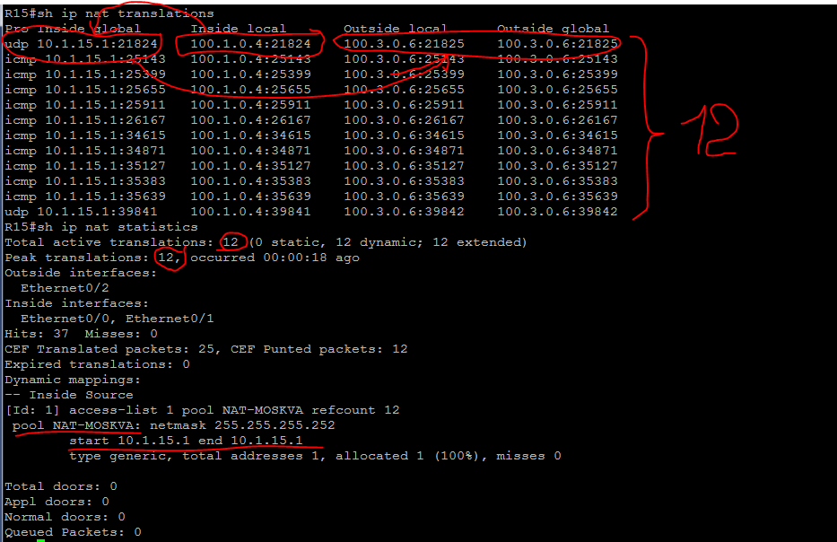

Из вывода команды *_sh ip nat translations_* вижу, что IP-адрес компьютера 100.1.0.4 транслировался в 10.1.15.1, причем, каждый запрос со своим портом. Команда *_sh ip nat statistics_* дает информацию о количестве и типе активных переводов, параметрах конфигурации NAT, количестве адресов в пуле и количестве выделенных адресов.

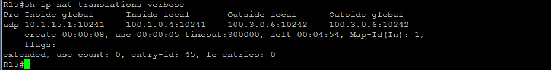

#### **_c. Настройка статического NAT для R20 (офис Москва)._**

Для настройки статического NAT маршрутизатора R20, возвращаемся к настройкам на роутере R15. Необходимо настроить интерфейс e0/3 как внутренние (inside) относительно NAT.

**Маршрутизатор R15:**

---------------------------------------------------------------

    conf t
    !
    # Подняла статический NAT с выделением для трансляции одного адреса.
    ip nat inside source static 10.1.0.11 10.1.15.2
    !
    # Настроила  интерфейс e0/3 как внутренний (inside) относительно NAT.
    int Ethernet0/3
     ip nat inside
     exit
    exit 
    !
    
--------------------------------------------------------------

Проверю теперь работу NAT на маршрутизаторе R15 (рис.2)

Рисунок 2.

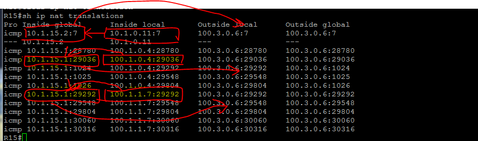

На рисунке 2 вижу, что пользовательские сети транслируются в адрес 10.1.15.1, а адрес маршрутизатора R20 транслируется в 10.1.15.2.

#### **_d. Настройка NAT для маршрутизатора R19 (офис Москва)._**

Настроила NAT так, что бы маршрутизатор R19 был доступен для управления с любого узла. Выделила сеть 10.1.115.0/30. Для этого необходимо настроить перенаправление портов. Настройки делаются на маршрутизаторах R14 и R15. 

**Маршрутизатор R15:**

---------------------------------------------------------------

    conf t
    !
    # Прописала ip-адрес на интерфейсе e0/2
    int Ethernet0/2
     ip address 10.1.115.1 255.255.255.252 secondary
     exit
    !
    # Подняла статический NAT с  трансляцией одного внешнего адреса с портом 2323 в один внутренний с портом 23.
    ip nat inside source static tcp 192.168.1.19 23 10.1.115.1 2323
    !
    # Для того, что бы мир увидел сеть  10.1.115.0/30 добавила ее в prefix-list CONNECT_TO_BGP_PL
    ip prefix-list CONNECT_TO_BGP_PL seq 6 permit 10.1.115.0/30
    # Объявила об этой сети.
    router bgp 1001
     address-family ipv4
      network 10.1.115.0 mask 255.255.255.252
      exit
     exit
    ! 
    # Добавила запись prefix-list запрещающий передачу информации соседу о наличии сетей используемых для NAT.
    ip prefix-list NOT_NAT_15AND115 seq 20 deny 10.1.115.0/30
    exit
    
--------------------------------------------------------------

**Маршрутизатор R14:**

---------------------------------------------------------------

    conf t
    !
    # Прописала ip-адрес на интерфейсе e0/2
    int Ethernet0/2
     ip address 10.1.114.1 255.255.255.252 secondary
     exit
    !
    # Подняла статический NAT с выделением для трансляции одного адреса.
    ip nat inside source static tcp 192.168.1.19 23 10.1.114.1 2323
    !
    # Настроила  интерфейс e0/3 как внутренние (inside) относительно NAT.
    int Ethernet0/2
     ip address 10.1.114.1 255.255.255.252 secondary
     exit
    !
    # Настроила  интерфейс e0/3 как внутренние (inside) относительно NAT.
    int Ethernet0/3
     ip nat inside
     exit
    !
    # Для того, что бы мир увидел сеть  10.1.114.0/30 добавила ее в prefix-list CONNECT_TO_BGP_PL
    ip prefix-list CONNECT_TO_BGP_PL seq 6 permit 10.1.114.0/30
    # Объявила об этой сети.
    router bgp 1001
     address-family ipv4
      network 10.1.114.0 mask 255.255.255.252
      exit
     exit
    !
    # Добавила запись prefix-list запрещающий передачу информации соседу о наличии сетей используемых для NAT.
    ip prefix-list NOT_NAT_14AND114 seq 20 deny 10.1.114.0/30
    exit
    
--------------------------------------------------------------

Теперь, если по какой-то причене R15 будет недоступен, трансляция пойдет через Nat настроенный на R14, но подключаться нужно будет с ip-адресом 10.1.114.1 по порту 2323. 

*_Для того, чтобы подключаться по любому из двух адресов в любое время, необходимо в офисе Москва убрать приоритет в BGP на R15._*

Попробую подключиться к маршрутизатору R19 в офисе Москва с компьютера VPС31 офиса Чокурдах (подключение по протоколу telnet на ip-адрес 10.1.115.1 по порту 2323).  

Рисунок 3.

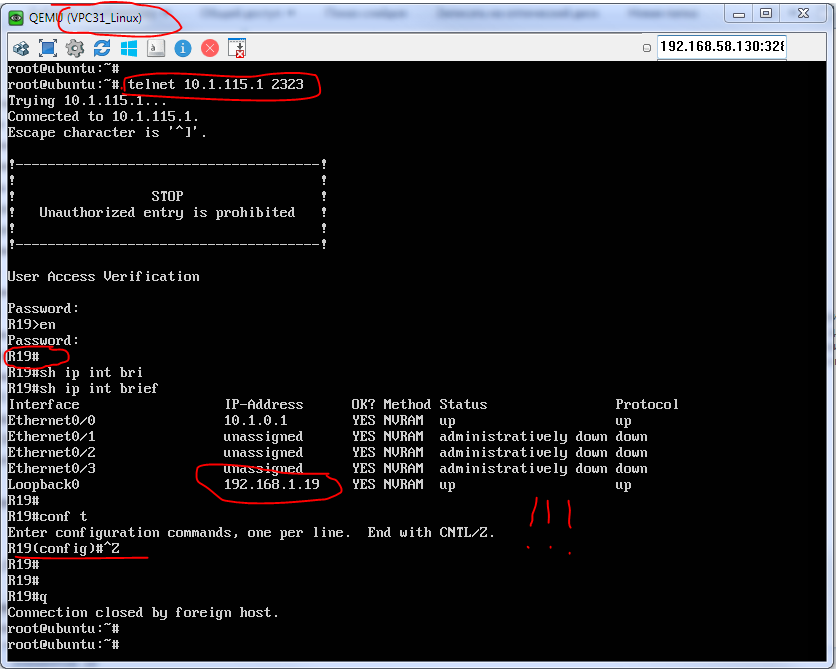

Как видно из рис.3 подключение к маршрутизатору R19 есть.

#### **_e. Настройка DHCP сервера в офисе Москва на маршрутизаторах R12 и R13._**

В этом разделе настроила DHCP сервер на маршрутизаторах R12 и R13. Для того, что бы не было конфликта ip-адресов разделила сети на два пула. Настройка маршрутизаторов приведена ниже.

**Маршрутизатор R12:**

---------------------------------------------------------------

    conf t
    !
    ip dhcp excluded-address 100.1.0.1 100.1.0.5
    ip dhcp excluded-address 100.1.0.128 100.1.0.255
    ip dhcp excluded-address 100.1.1.1 100.1.1.5
    ip dhcp excluded-address 100.1.1.128 100.1.1.255

    !
    ip dhcp pool USERS_NET_1_0
     network 100.1.0.0 255.255.255.0
     default-router 100.1.0.1
     domain-name twelve.lab.com
     lease 2 12 30
    !
    ip dhcp pool USERS_NET_1_1
     network 100.1.1.0 255.255.255.0
     default-router 100.1.1.1
     domain-name twelve.lab.com
     lease 0 0 10
     exit
    exit 

--------------------------------------------------------------

**Маршрутизатор R13:**

---------------------------------------------------------------

    conf t
    !
    ip dhcp excluded-address 100.1.0.1 100.1.0.127
    ip dhcp excluded-address 100.1.1.1 100.1.1.127

    !
    ip dhcp pool USERS_NET_1_0
     network 100.1.0.0 255.255.255.0
     default-router 100.1.0.1
     domain-name twelve.lab.com
     lease 2 12 30
    !
    ip dhcp pool USERS_NET_1_1
     network 100.1.1.0 255.255.255.0
     default-router 100.1.1.1
     domain-name twelve.lab.com
     lease 0 0 10
     exit
    exit 

--------------------------------------------------------------

Так как компьютеры при запросе IP-адреса отправляют широковещательный запрос, то в ответ оба сервера выдали IP-адреса. Но, в моем случае, R12 оказался "сообразительнее и быстрее", и по-этому компьютеры получили IP-адреса из его пула.

Рисунок 4.

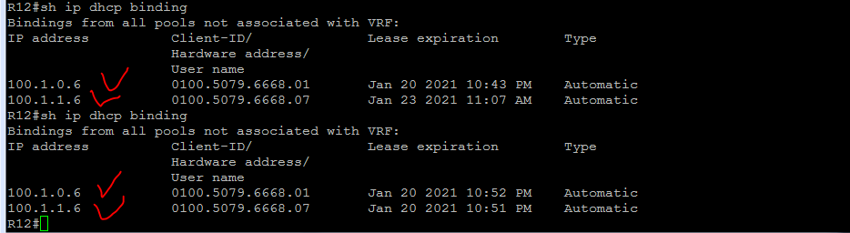

Рисунок 5.

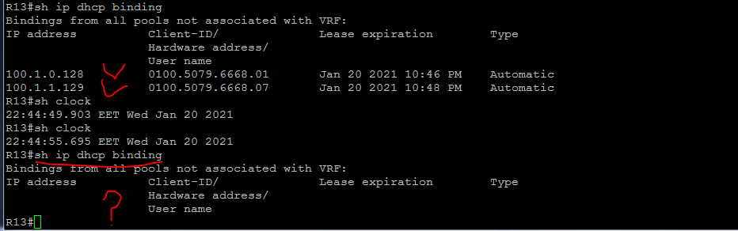

По истечении времени прописанного на сервере, и так как от компьютеров не было запросов на подтверждение ip-адресов выданных R13, он благополучно освободил ранее выданные адреса. Это видно на рисунке 5.

#### **_f. Настройка NAT(PAT) на маршрутизаторе R18 в офисе Санкт Петербург._**

По условию лабораторной работы, в офисе Санкт Петербург необходимо настроить NAT с диапазоном для трансляции из 5 ip-адресов. Выделила сеть 10.2.18.0/29. Настроила NAT на маршрутизаторе R18.

**Маршрутизатор R18:**

---------------------------------------------------------------

    conf t
    !
    ip route 10.2.18.0 255.255.255.248 null 0
    !
    ip nat pool NAT-SPETERBURG 10.2.18.1 10.2.18.5 netmask 255.255.255.248
    !
    ip nat inside source list 1 pool NAT-SPETERBURG overload
    !
    access-list 1 permit 100.2.0.0 0.0.7.255
    exit

    conf t
    !
    int range e0/2-3
     ip nat outside
     exit
    int range e0/0-1
     ip nat inside
     exit
    !
    router bgp 2042
     address-family ipv4
      redistribute static
      exit
     exit
    exit

    # Удалила из prefix-list OUT_TRAFIC_IPV4 пользовательские сети и добавила сеть для NAT.
    !
    ip prefix-list OUT_TRAFIC_IPV4 seq 5 permit 10.2.18.0/29
    exit
    !
    
--------------------------------------------------------------

Для проверки связности с внешним миром и для того, что бы убедиться в работоспособности NAT, запустила команду **_ping_** на ip-адреса компьютеров офиса Чокурдах (рис.6).

Рисунок 6.

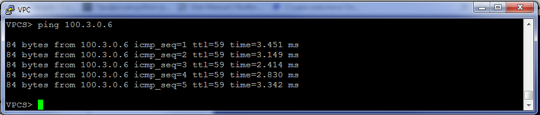

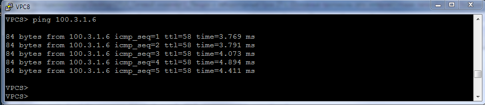

После этого, на маршрутизаторе R18 ввела команду **_sh ip nat translations_**. Вывод команды на рисунке 7.

Рисунок 7.

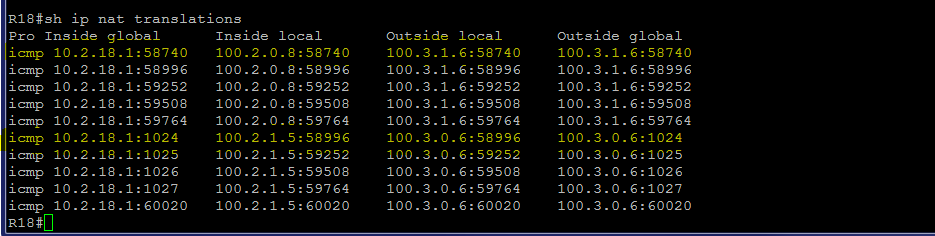

Как видно из вывода NAT работает.

#### **_g. Настройка статического NAT(PAT) для офиса Чокурдах._**

В этом разделе я настроила статический NAT на маршрутизаторе R28. Для настройки NAT выделила сеть 10.3.28.0/29. Команды настройки приведены ниже.

**Маршрутизатор R28:**

---------------------------------------------------------------

    conf t
    !
    ip nat inside source static 100.3.0.6 10.3.28.1
    ip nat inside source static 100.3.1.6 10.3.28.2
    exit

    conf t
    !
    int range e0/0-1
     ip nat outside
     exit
    int e0/2.11
     ip nat inside
     exit
    int e0/2.12
     ip nat inside
     exit

--------------------------------------------------------------

Так как между роутером R28 и R25-R26 отсутствует динамическая маршрутизация, прописала на R25 и R26 статические маршруты.

**Маршрутизатор R25:**

---------------------------------------------------------------

    conf t
    !
    # Прописала статический маршрут для сети 10.3.28.0 на интерфейс 10.5.0.17
    ip route 10.3.28.0 255.255.255.252 10.5.0.17
    # объявила сеть в BGP
    router bgp 2042
     address-family ipv4
     network 10.3.28.0 mask 255.255.255.252
     exit
    exit 
    !

--------------------------------------------------------------

**Маршрутизатор R26:**

---------------------------------------------------------------

    conf t
    !
    ip route 10.3.28.0 255.255.255.252 10.5.0.11
    !
    router bgp 2042
     address-family ipv4
     network 10.3.28.0 mask 255.255.255.252
     exit
    exit 
    !

--------------------------------------------------------------

Осталось провести некоторые эксперименты.

Для начала запустила команду **_ping_** на VPC30 и VPC31 (рис.8)

Рисунок 8.

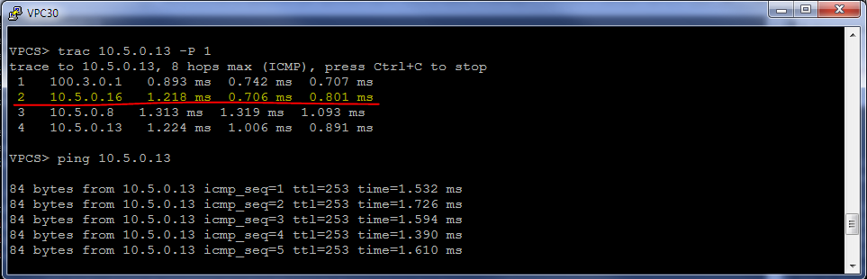
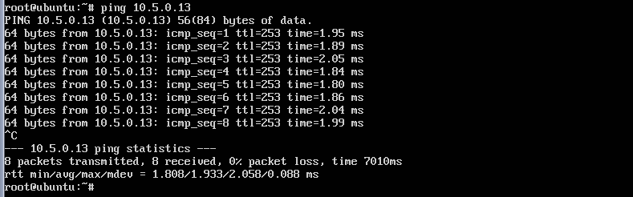

После этого проверила трансляцию адресов (рис.9)

Рисунок 9.

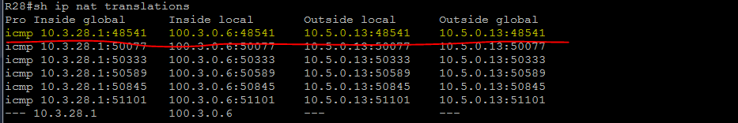
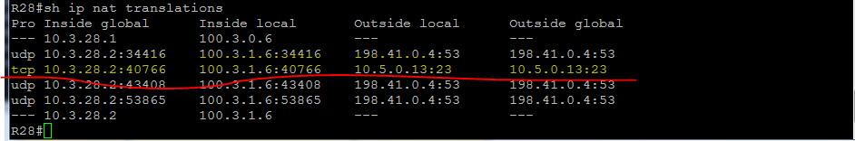

Трансляция присутствует.

Далее отключила интерфейс e0/1 на маршрутизаторе R26 и запустила трассировку на 10.5.0.13 (рис.10). Вижу, что маршрут изменился, но связность осталась.

Рисунок 10.

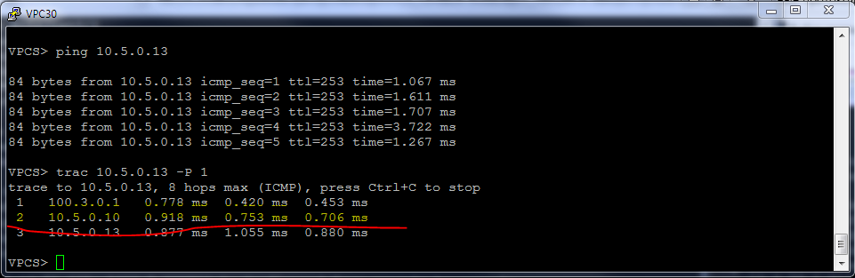

Эту же операцию сделала на маршрутизаторе R25 с интерфейсом e0/3. Для поиска маршрута понадобилось какое-то время, но все же связь восстановилась.

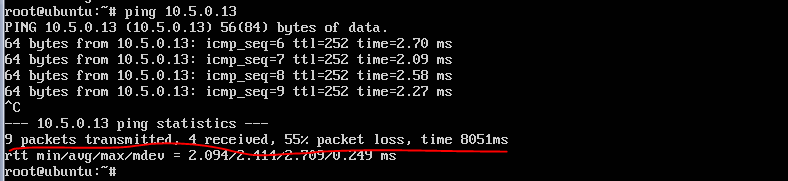

Осталась еще одна проверка - это зайти на маршрутизатор R19 офиса Москва для управления.

Рисунок 11.

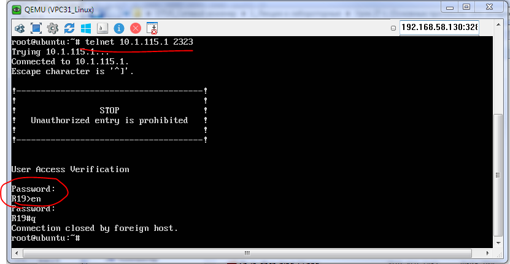

Как видно из рисунка 11 доступ на R19 есь.

#### **_h. Настройка NTP сервера на маршрутизаторах R12 и R13 в офисе Москва._**

По условию, все устройства в офисе Москва должны синхронизировать время с маршрутизаторами R12 и R13. В жизни, центральные NTP-серверы организаций, берут время с некоторых публичных NTP, в нашем случае выхода в глобальную сеть нет, по этому я присвоила указанным маршрутизаторам роль мастера. Так как настройки идентичны, приведу пример настройки маршрутизатора R12.

**Маршрутизатор R12:**

---------------------------------------------------------------

    conf t
    !
    # Настроила маршрутизатор в роли сервера (мастера) и указала параметр точности. Параметр находится в диапазоне от 0 до 15.
    # 0 - атомные часы.
    # 15 - самая маленькая точность (не надежно).
    !
    ntp master 2
    exit
    !

--------------------------------------------------------------

Для настройки синхронизации оборудования в офисе Москва буду использовать статический метод. Приведу вариант настройки двух устройств, например, маршрутизатора R14 и коммутатора SW4.

**Маршрутизатор R14:**

---------------------------------------------------------------

    conf t
    !
    # В режиме глабальной конфигурации указала IP-адреса NTP-серверов.
    ntp server 192.168.1.12
    ntp server 192.168.1.13
    !
    # Для того, что бы после перезагрузки хардварное (железное) время сходилось быстрее, запустила команду, позволяющую синхронизировать это время:
    ntp update-calendar
    exit
    !

--------------------------------------------------------------

В связи с тем, что маршрутизация на коммутаторах не настроена и, LoopBack роутеров R12 и R13 с этих коммутаторов не доступны, настроила синхронизацию со шлюза по умолчанию. 

Так как между R12 и R13 настроен протокол VRRP, то при падении одного роутера, шлюз по умолчанию 172.16.1.1 (адрес является виртуальным), плавно переедет на второй роутер. Это дает нам возможность не прописывать физические адреса роутеров - 172.16.1.2 и 172.16.1.3.

**Коммутатор SW4:**

---------------------------------------------------------------

    conf t
    !
    ntp server 172.16.1.1
    ntp update-calendar
    exit
    !
    wr

--------------------------------------------------------------

Для проверки работы NTP запустила на устройствах две команды **_sh ntp status_** и **_sh ntp associations_** (рис.12).

Рисунок 12.

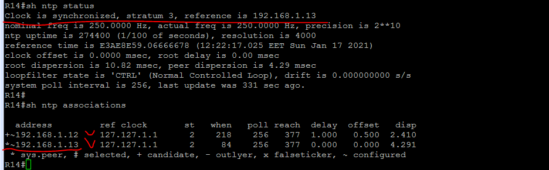

Из результата вывода команды **_sh ntp status_**, запущенной на маршрутизаторе R14 вижу, что он синхронизируется с маршрутизатором 192.168.1.13, а сам теперь стал сервером NTP с точностью 3. Результат вывода команды **_sh ntp associations_** говорит о том, что для синхронизации настроено два серврера, но приоритетнее 192.168.1.13.

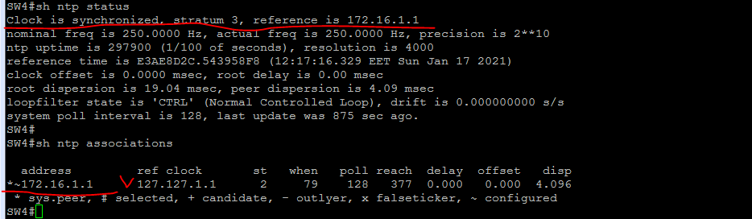

Из результата вывода команды **_sh ntp status_**, запущенной на коммутаторе SW4 вижу, что он так же стал сервером NTP с точностью 3. Результат вывода команды **_sh ntp associations_** говорит о том, что для синхронизации настроен один сервер 172.16.1.1.

#### **_III. Итоговая схема._**

На рис.13 размещены используемые сети, IPv4 и IPv6 адреса маршрутизаторов.

Рисунок 13.

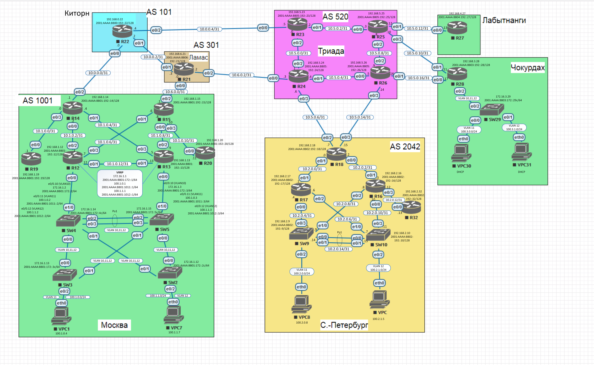
